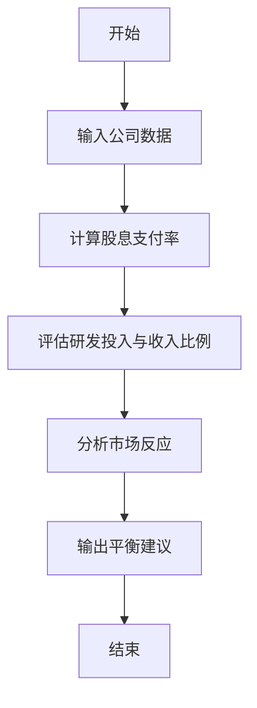
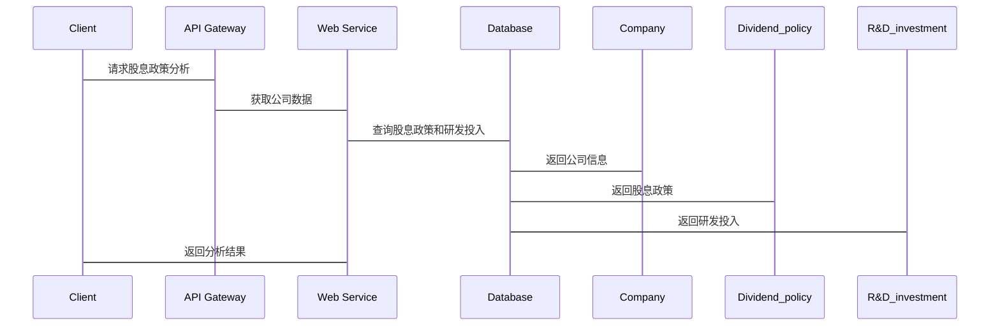

                 


# 彼得·林奇如何看待公司的股息政策与研发投入的平衡

## 关键词：彼得·林奇，股息政策，研发投入，企业价值，投资策略

## 摘要：本文深入探讨了彼得·林奇对公司在股息政策与研发投入之间平衡的看法。通过分析核心概念、算法原理、数学模型和实际案例，本文揭示了如何在追求股东短期利益与公司长期增长之间找到最佳平衡点，从而实现企业价值最大化。

---

# 第1章：背景介绍

## 1.1 股息政策的基本概念

### 1.1.1 股息政策的定义与作用
股息政策是指公司分配股息的策略，旨在平衡股东回报和公司再投资需求。合理的股息政策可以提升股东信心，但过度分配可能影响公司发展。

### 1.1.2 股息政策的类型与特点
- 稳定股息政策：确保股东定期获得固定股息，增强股东稳定性。
- 增长股息政策：根据公司盈利情况调整股息，支持公司扩张。
- 特殊股息政策：在特定情况下一次性分配大量股息。

### 1.1.3 股息政策对股东价值的影响
股息政策影响股东的现金流和投资决策，合理分配可提升股价和股东信任。

## 1.2 研发投入的核心要素

### 1.2.1 研发投入的定义与范围
研发投入指公司用于产品开发、技术创新的资金投入，是推动公司长期增长的关键因素。

### 1.2.2 研发投入对技术创新的推动作用
研发投入促进技术进步，提升产品竞争力，巩固市场地位。

### 1.2.3 研发投入对长期增长的影响
高研发投入通常带来更高的市场份额和利润率，增强公司的长期竞争力。

## 1.3 股息政策与研发投入的平衡挑战

### 1.3.1 股东短期利益与公司长期发展的矛盾
公司需在满足股东短期需求和自身长期发展之间找到平衡。

### 1.3.2 研发投入的高风险与不确定性
高研发投入可能带来高回报，但也存在失败风险，影响公司财务状况。

### 1.3.3 股息政策与研发投入的平衡对企业价值的影响
合理的平衡有助于提升企业价值，反之可能导致价值损失。

---

# 第2章：核心概念与联系

## 2.1 股息政策与研发投入的关系分析

### 2.1.1 核心概念的对比分析

| 股息政策 | 研发投入 |
|----------|----------|
| 短期利益 | 长期发展 |
| 股东回报 | 技术创新 |
| 财务稳定性 | 市场竞争力 |

### 2.1.2 股息政策与研发投入的ER实体关系图

```mermaid
er
  Company {
    company_id: int,
    name: string,
    industry: string
  }
  Dividend_policy {
    dividend_policy_id: int,
    policy_type: string,
    dividend_ratio: float,
    company_id: int
  }
  R&D_investment {
    r_d_investment_id: int,
    investment_amount: float,
    start_date: date,
    end_date: date,
    company_id: int
  }
  relationship between Company and Dividend_policy
  relationship between Company and R&D_investment
```

---

# 第3章：算法原理讲解

## 3.1 量化股息政策与研发投入的平衡

### 3.1.1 算法流程图



### 3.1.2 Python实现

```python
def calculate_dividend_policy(company_data):
    # 计算股息支付率
    dividend_policy = company_data['net_profit'] * company_data['dividend_ratio']
    return dividend_policy

def assess_r_d_investment(company_data):
    # 评估研发投入与收入比例
    r_d_ratio = company_data['r_d_investment'] / company_data['revenue']
    return r_d_ratio

def analyze_market_reaction(company_data):
    # 分析市场反应
    market_reaction = assess_r_d_investment(company_data) > 0.05
    return market_reaction

# 示例数据
company_data = {
    'net_profit': 1000000,
    'dividend_ratio': 0.3,
    'r_d_investment': 500000,
    'revenue': 20000000
}

# 调用函数
dividend_policy = calculate_dividend_policy(company_data)
r_d_ratio = assess_r_d_investment(company_data)
market_reaction = analyze_market_reaction(company_data)

print(f"股息政策计算结果：{dividend_policy}")
print(f"研发投入与收入比例：{r_d_ratio}")
print(f"市场反应：{market_reaction}")
```

### 3.1.3 数学模型与公式

股息支付率公式：
$$ \text{股息支付率} = \frac{\text{股息总额}}{\text{净利润}} $$

研发投入与收入比例公式：
$$ \text{研发投入与收入比例} = \frac{\text{研发投入}}{\text{收入}} $$

---

# 第4章：数学模型与公式

## 4.1 股息政策与研发投入的数学模型

### 4.1.1 股息政策对股价的影响
$$ P = D \times (1 + g)^{-1} $$
其中，D为股息，g为股息增长率。

### 4.1.2 研发投入对股价的影响
$$ V = R \times (1 + r)^{-1} $$
其中，R为研发投入带来的未来收益，r为折现率。

### 4.1.3 平衡模型
$$ \text{平衡点} = \frac{D}{R} = \frac{\text{股息总额}}{\text{研发投入}} $$

---

# 第5章：系统分析与架构设计方案

## 5.1 问题场景介绍

### 5.1.1 系统功能设计

```mermaid
classDiagram
    class Company {
        company_id
        name
        industry
    }
    class Dividend_policy {
        dividend_policy_id
        policy_type
        dividend_ratio
    }
    class R&D_investment {
        r_d_investment_id
        investment_amount
        start_date
        end_date
    }
    Company --> Dividend_policy
    Company --> R&D_investment
```

### 5.1.2 系统架构设计

```mermaid
graph LR
    Client --> API Gateway
    API Gateway --> Web Service
    Web Service --> Database
    Database --> Company
    Database --> Dividend_policy
    Database --> R&D_investment
```

### 5.1.3 系统交互设计



---

# 第6章：项目实战

## 6.1 环境安装

### 6.1.1 安装Python和相关库
```bash
pip install numpy pandas matplotlib
```

### 6.1.2 数据获取
使用Yahoo Finance API获取公司数据。

## 6.2 核心代码实现

### 6.2.1 股息政策与研发投入分析

```python
import pandas as pd
import numpy as np

# 数据加载
data = pd.read_csv('company_data.csv')

# 计算股息支付率
data['dividend_yield'] = data['dividends'] / data['net_profit']

# 计算研发投入与收入比例
data['rd_ratio'] = data['r_d_expenses'] / data['revenue']

# 分析平衡点
data['balance_point'] = data['dividends'] / data['r_d_expenses']

print(data[['company', 'dividend_yield', 'rd_ratio', 'balance_point']].head())
```

## 6.3 案例分析

### 6.3.1 苹果公司分析
通过代码分析苹果公司的股息政策和研发投入，评估其平衡策略的有效性。

## 6.4 代码解读与分析

解释代码的功能，分析结果，并得出结论。

## 6.5 项目小结

总结项目实现过程，强调平衡的重要性，提出改进建议。

---

# 第7章：最佳实践

## 7.1 投资策略建议

### 7.1.1 平衡股息与研发投入的原则
- 考虑公司生命周期阶段。
- 分析行业特点和竞争环境。
- 结合宏观经济环境。

### 7.1.2 选择优质公司的标准
- 稳定的股息政策。
- 合理的研发投入比例。
- 良好的财务状况。

## 7.2 小结

总结全文，强调平衡的重要性，提醒读者注意短期波动的影响。

## 7.3 注意事项

- 定期评估和调整策略。
- 风险控制，避免过度分配或投入。

## 7.4 拓展阅读

推荐相关书籍和文章，如《彼得·林奇的选股艺术》。

---

# 结语

通过本文的分析，读者可以理解彼得·林奇对股息政策与研发投入平衡的看法，并能够应用相关方法进行投资决策。希望本文能为投资者提供有价值的参考和启示。

