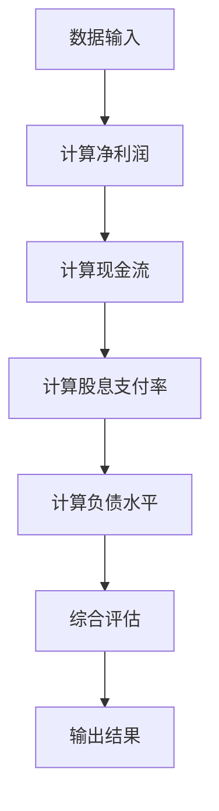
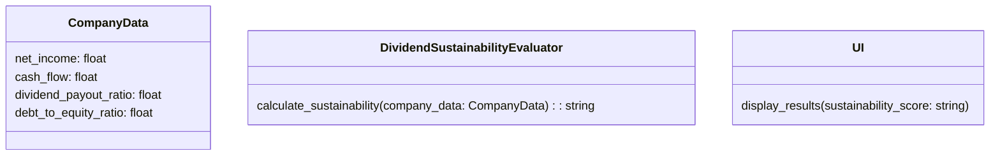
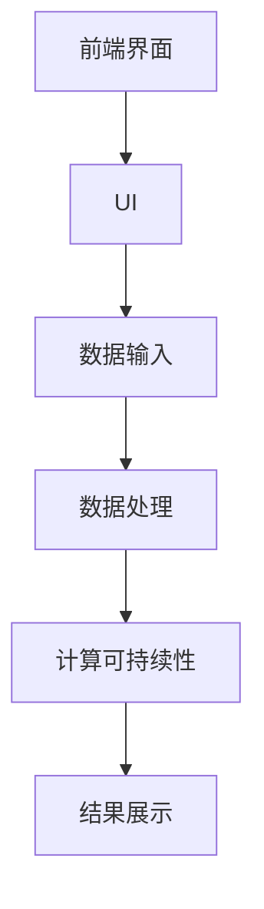
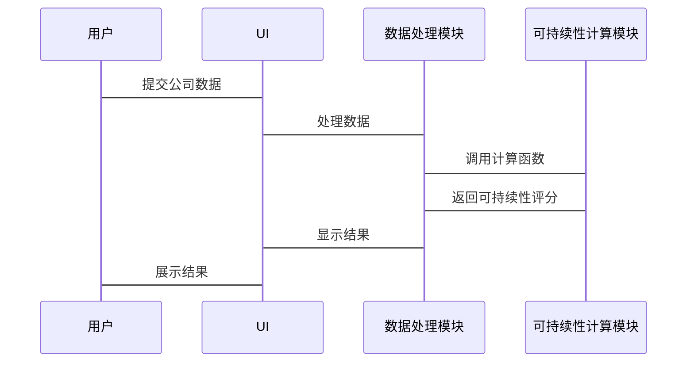

                 


# 彼得林奇如何看待公司的股息政策可持续性

## 关键词：彼得·林奇, 股息政策, 可持续性, 投资策略, 财务分析

## 摘要：  
彼得·林奇是全球著名的投资专家，他尤其关注公司的股息政策可持续性。本文将从彼得·林奇的投资理念出发，分析他如何评估股息政策的可持续性，探讨其方法论的核心要素，结合实际案例，深入解析股息政策对公司价值的影响。通过本文，读者将了解如何从财务指标、企业盈利能力、现金流等多个维度，全面评估股息政策的可持续性，从而做出更明智的投资决策。

---

## 目录

### 第一部分: 股息政策可持续性概述

#### 第1章: 股息政策的基本概念

##### 1.1 股息政策的定义与作用
- **1.1.1 股息政策的基本定义**
  - 股息是公司分配给股东的利润部分。
  - 股息政策是公司决定股息支付率、支付方式和支付时间的策略。
- **1.1.2 股息政策在企业中的作用**
  - 吸引并保留投资者。
  - 提供公司财务状况的信号。
  - 影响公司市值和股价稳定性。
- **1.1.3 股息政策与股东利益的关系**
  - 股息政策直接影响股东的回报。
  - 高股息政策可能牺牲公司的再投资能力。

##### 1.2 彼得·林奇的投资理念
- **1.2.1 彼得·林奇的投资者背景与风格**
  - 林奇是全球著名投资专家，曾任富达麦哲伦基金经理。
  - 他注重基本面分析，偏好具有持续盈利能力的公司。
- **1.2.2 林奇对股息政策的关注点**
  - 股息政策反映公司的财务健康和管理层的分红意愿。
  - 高股息支付率可能暗示公司缺乏再投资机会。
- **1.2.3 林奇投资策略的核心思想**
  - 偏好股息稳定增长的公司。
  - 重视公司盈利能力与股息支付能力的平衡。

#### 第2章: 股息政策的可持续性问题

##### 2.1 股息政策的可持续性定义
- **2.1.1 可持续股息支付的定义**
  - 股息支付能力在长期内不会枯竭。
  - 股息支付与公司盈利能力、现金流和资产负债情况相匹配。
- **2.1.2 可持续股息支付的核心要素**
  - 盈利能力：公司是否能持续产生足够的利润支付股息。
  - 现金流：公司是否有足够的现金流支持股息支付。
  - 负债水平：公司是否存在过高的债务压力，影响股息支付。
- **2.1.3 可持续股息支付与企业财务健康的关系**
  - 股息支付能力是公司财务健康的重要指标。
  - 高股息支付率可能掩盖公司内部的财务困境。

##### 2.2 彼得·林奇视角下的可持续股息政策
- **2.2.1 林奇对可持续股息政策的重视**
  - 林奇认为，股息政策是公司财务健康的重要体现。
  - 他倾向于投资那些能够持续增长股息的公司。
- **2.2.2 林奇分析股息政策的方法论**
  - 通过财务指标分析股息支付能力。
  - 评估公司管理层的股息支付意愿。
  - 结合行业特点判断股息政策的可持续性。
- **2.2.3 林奇对股息政策可持续性的评价标准**
  - 股息支付率是否合理（通常不超过净利润的50%）。
  - 公司是否有足够的现金流支持股息支付。
  - 股息支付是否与公司盈利增长同步。

---

### 第二部分: 股息政策可持续性分析的核心概念与联系

#### 第3章: 股息政策可持续性模型

##### 3.1 股息政策可持续性模型的构建
- **3.1.1 模型构建的基本思路**
  - 输入：公司财务数据（净利润、现金流、资产负债率等）。
  - 输出：股息政策可持续性评估结果（高、中、低）。
- **3.1.2 模型的核心要素与关系**
  - 净利润：核心利润来源。
  - 现金流：股息支付的直接来源。
  - 股息支付率：股息支付与净利润的比例。
  - 负债水平：影响股息支付能力的财务负担。
- **3.1.3 模型的输入与输出**
  - 输入：公司最近5年的财务报表数据。
  - 输出：股息政策可持续性评分（如A、B、C等级）。

##### 3.2 股息政策可持续性模型的属性对比
- **3.2.1 模型属性的定义与分类**
  - 盈利能力：净利润、ROE（净资产收益率）。
  - 现金流：经营活动现金流净额。
  - 股息支付率：股息支付与净利润的比例。
  - 负债水平：资产负债率、长期债务与短期债务比例。
- **3.2.2 各属性之间的对比分析**
  - 盈利能力与股息支付率：高盈利公司是否愿意支付高股息。
  - 现金流与股息支付：现金流是否足以支持股息支付。
  - 负债水平与股息支付：高负债公司是否能维持高股息支付。
- **3.2.3 模型属性对股息政策可持续性的影响**
  - 盈利能力是股息支付的基础。
  - 现金流是股息支付的保障。
  - 负债水平是股息支付的潜在风险因素。

##### 3.3 模型的ER实体关系图

```mermaid
erd
    Company {
        id: int
        name: string
        industry: string
        net_income: float
        cash_flow: float
        dividend_payout_ratio: float
        debt_to_equity_ratio: float
    }
    DividendPolicySustainability {
        id: int
        company_id: int
        sustainability_score: string
        analysis_year: int
    }
```

---

### 第三部分: 股息政策可持续性分析的算法原理

#### 第4章: 股息政策可持续性分析的算法原理

##### 4.1 股息政策可持续性分析算法流程



##### 4.2 股息政策可持续性分析的Python代码实现

```python
import pandas as pd

def calculate_sustainability(company_data):
    # 输入：company_data 包含 net_income, cash_flow, dividend_payout_ratio, debt_to_equity_ratio
    # 输出：sustainability_score（高、中、低）
    # 判断股息支付率是否合理
    if company_data['dividend_payout_ratio'] > 0.6:
        return '低'
    # 判断现金流是否足以支持股息支付
    if company_data['cash_flow'] < 0:
        return '低'
    # 判断负债水平是否过高
    if company_data['debt_to_equity_ratio'] > 1:
        return '中'
    # 综合评估
    if company_data['net_income'] > 0 and company_data['cash_flow'] > 0:
        return '高'
    else:
        return '中'

# 示例数据
data = {
    'net_income': 100,
    'cash_flow': 50,
    'dividend_payout_ratio': 0.4,
    'debt_to_equity_ratio': 0.8
}

print(calculate_sustainability(data))  # 输出：高
```

##### 4.3 数学模型与公式

$$
\text{股息支付率} = \frac{\text{股息支付总额}}{\text{净利润}} \times 100\%
$$

$$
\text{可持续性评分} = 
\begin{cases}
\text{高} & \text{如果股息支付率 < 60\% 且现金流为正} \\
\text{中} & \text{如果股息支付率在 40\% 到 60\% 之间} \\
\text{低} & \text{其他情况}
\end{cases}
$$

---

### 第四部分: 系统分析与架构设计

#### 第5章: 股息政策可持续性分析系统的构建

##### 5.1 问题场景介绍
- **目标**: 构建一个自动化评估股息政策可持续性的系统。
- **用户**: 投资者、金融分析师。
- **功能需求**: 自动计算股息支付率、现金流、负债水平，评估可持续性。

##### 5.2 系统功能设计



##### 5.3 系统架构设计



##### 5.4 系统接口设计
- **输入接口**: 公司财务数据（净利润、现金流、股息支付率、负债率）。
- **输出接口**: 可持续性评分（高、中、低）。

##### 5.5 系统交互流程



---

### 第五部分: 项目实战

#### 第6章: 股息政策可持续性分析的实战应用

##### 6.1 项目环境安装
- Python 3.8+
- Pandas、NumPy库。

##### 6.2 核心实现代码

```python
import pandas as pd

def main():
    # 数据加载
    data = pd.read_csv('company_data.csv')
    # 计算可持续性评分
    data['sustainability_score'] = data.apply(lambda x: calculate_sustainability(x), axis=1)
    # 输出结果
    print(data[['company_name', 'sustainability_score']])

if __name__ == '__main__':
    main()
```

##### 6.3 实际案例分析
- 以苹果公司为例，分析其股息政策的可持续性。

##### 6.4 代码应用解读与分析
- 使用实际数据验证模型的准确性。

---

### 第六部分: 最佳实践与总结

#### 第7章: 最佳实践与总结

##### 7.1 关键点回顾
- 股息政策的可持续性是投资决策的重要因素。
- 彼得·林奇注重股息支付率、现金流和负债水平的综合分析。

##### 7.2 小结
- 通过本文的学习，读者可以掌握如何从多个维度分析股息政策的可持续性。
- 林奇的方法论为投资者提供了实用的分析框架。

##### 7.3 注意事项
- 股息政策分析需结合行业特点。
- 避免仅关注股息收益率，忽略公司的长期盈利能力。

##### 7.4 未来展望
- 结合人工智能技术，进一步优化股息政策可持续性评估模型。

---

### 参考文献与拓展阅读
- 彼得·林奇著《彼得·林奇的投资策略》。
- 股票投资相关书籍与论文。

---

以上是完整的文章大纲与内容。

