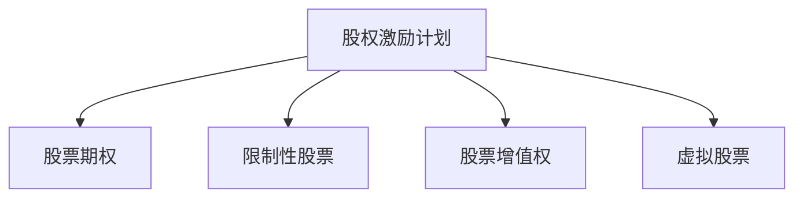

                 

# 彼得林奇如何看待公司的股权激励计划有效性

## 关键词：彼得·林奇、股权激励计划、公司治理、投资理念、有效性评估

## 摘要：本文从彼得·林奇的投资者视角出发，系统分析股权激励计划的有效性。通过背景介绍、核心概念、分析框架、案例分析、设计原则和实际操作的多维度探讨，揭示股权激励计划在提升公司业绩、促进管理层与股东利益 alignment 以及推动企业长期发展的关键作用。结合彼得·林奇的投资理念，提出有效性评估的维度与指标，并通过具体案例验证其理论，为实践者提供有价值的指导。

---

# 第一部分: 股权激励计划的背景与重要性

## 第1章: 股权激励计划的背景介绍

### 1.1 股权激励计划的起源与发展

#### 1.1.1 股权激励计划的定义与核心概念
股权激励计划是一种通过给予公司员工或高管一定数量的公司股权或期权，以激励其为公司创造更大价值的长期激励机制。其核心在于将员工的个人利益与公司整体利益绑定，激发员工的主人翁意识和创造力。

#### 1.1.2 股权激励计划的起源与演变
股权激励计划起源于20世纪60年代的美国，随着公司治理结构的不断完善和股东权益保护意识的增强，股权激励计划逐渐成为现代企业吸引和留住优秀人才的重要工具。其演变经历了从简单的股票分配到复杂的期权、限制性股票等多样化的激励形式。

#### 1.1.3 股权激励计划在现代企业中的重要性
在现代企业中，股权激励计划不仅是公司治理的重要组成部分，也是提升企业竞争力的关键因素。通过股权激励，企业能够吸引和保留核心人才，激发员工的积极性和创造性，同时促进管理层与股东利益的 alignment，实现企业长期稳健发展。

### 1.2 彼得·林奇与股权激励计划的关系

#### 1.2.1 彼得·林奇的个人背景与投资理念
彼得·林奇是美国著名投资家，被誉为“奥马哈的巫师”。他以价值投资为核心理念，注重企业的基本面分析和长期发展潜力。林奇认为，一个优秀的投资机会不仅取决于企业的财务状况，还取决于其管理团队的激励机制和治理结构。

#### 1.2.2 彼得·林奇对股权激励计划的关注点
林奇在其投资生涯中，非常关注企业的股权激励计划。他认为，一个合理的股权激励计划能够有效激励管理层，使其行为与股东利益保持一致，从而推动企业长期价值的增长。同时，他也会警惕那些过于激进或不合理的激励计划，因为这可能引发管理层短期行为，损害股东利益。

#### 1.2.3 股权激励计划在彼得·林奇投资体系中的地位
在林奇的投资体系中，股权激励计划被视为评估企业治理和管理层动机的重要指标。他认为，一个设计合理的股权激励计划不仅能够吸引和留住优秀人才，还能够增强管理层的长期责任感，从而为企业创造更大的价值。

### 1.3 本书的核心问题与研究目标

#### 1.3.1 核心问题的提出
股权激励计划的有效性是一个复杂的系统工程，涉及公司治理、激励机制、管理层行为等多个方面。本文的核心问题是：如何从彼得·林奇的投资者视角出发，系统分析股权激励计划的有效性，并提出实践中的优化建议？

#### 1.3.2 研究目标与框架
本文旨在探讨股权激励计划在企业中的实际应用效果，分析其在提升公司业绩、促进管理层与股东利益 alignment 以及推动企业长期发展中的作用。同时，结合彼得·林奇的投资理念，提出股权激励计划的有效性评估标准和优化建议。

#### 1.3.3 本书的结构安排
全文将从股权激励计划的背景、核心概念、分析框架、案例分析、设计原则、实际操作等多个维度展开，结合理论分析和实践案例，全面探讨股权激励计划的有效性。

---

## 第2章: 股权激励计划的核心概念

### 2.1 股权激励计划的定义与分类

#### 2.1.1 股权激励计划的定义
股权激励计划是一种通过给予员工或高管公司股权或期权，以激励其为公司创造更大价值的长期激励机制。其核心在于将员工的个人利益与公司整体利益绑定，激发员工的主人翁意识和创造力。

#### 2.1.2 股权激励计划的分类
股权激励计划主要分为以下几类：
1. **股票期权（Stock Options）**：给予员工在特定时间内以特定价格购买公司股票的权利。
2. **限制性股票（Restricted Stock）**：公司直接给予员工一定数量的股票，但通常设有 vesting period（禁售期）。
3. **股票增值权（Stock Appreciation Rights）**：员工在特定条件下获得公司股价上涨部分的收益。
4. **虚拟股票（ phantom stock）**：一种模拟股票形式的激励工具，通常与公司股价挂钩，但不实际持有股票。

#### 2.1.3 股权激励计划的核心要素
股权激励计划的核心要素包括：
- **激励对象**：通常包括公司高管、核心员工和技术骨干。
- **激励形式**：股票期权、限制性股票等。
- **激励条件**：包括时间限制、业绩目标等。
- **激励期限**：通常为3-5年，以长期激励为主。

### 2.2 股权激励计划的关键属性与特征

#### 2.2.1 激励性与约束性
股权激励计划的激励性体现在其能够激发员工的创造力和积极性，而其约束性则体现在员工的行为受到一定的限制，例如 vesting period（禁售期）和业绩目标的约束。

#### 2.2.2 时间性与长期性
股权激励计划通常具有较长的时间跨度，旨在通过长期激励员工，使其关注企业的长期发展。

#### 2.2.3 行权条件与业绩挂钩
股权激励计划的行权条件通常与公司的业绩挂钩，例如净利润增长率、股价涨幅等，从而确保激励效果与公司绩效密切相关。

### 2.3 股权激励计划的核心要素对比分析

#### 2.3.1 不同激励工具的对比表格
以下是一个不同激励工具的对比表格：

| 激励工具       | 定义与特点                          | 优点                               | 缺点                               |
|----------------|------------------------------------|------------------------------------|------------------------------------|
| 股票期权       | 允许员工以特定价格购买公司股票     | 激励员工关注公司股价上涨           | 行权风险较高，员工可能关注短期股价 |
| 限制性股票     | 公司直接给予员工一定数量的股票     | 员工与公司利益高度 alignment       | 限制性强，员工流动性可能较低       |
| 股票增值权     | 员工获得股价上涨部分的收益         | 风险较低，员工关注长期股价增长     | 激励效果相对有限                   |
| 虚拟股票       | 一种模拟股票形式的激励工具         | 灵活性高，不涉及实际股票           | 可能缺乏实际的激励效果             |

#### 2.3.2 股权激励计划与其他激励方式的实体关系图

---

## 第3章: 彼得·林奇的股权激励计划分析框架

### 3.1 彼得·林奇的投资理念与股权激励计划的关联

#### 3.1.1 投资者视角下的股权激励计划
从投资者角度来看，股权激励计划的有效性取决于其是否能够真正激励管理层，使其行为与股东利益保持一致。彼得·林奇认为，一个优秀的股权激励计划应该能够将管理层的个人利益与公司长期发展紧密结合。

#### 3.1.2 股权激励计划与公司治理的关系
股权激励计划不仅是公司治理的重要组成部分，也是提升企业治理水平的关键因素。通过股权激励，企业能够吸引和留住优秀人才，促进管理层与股东利益的 alignment，从而实现企业长期稳健发展。

### 3.2 股权激励计划的有效性评估框架

#### 3.2.1 有效性评估的维度与指标
股权激励计划的有效性可以从以下几个维度进行评估：
1. **激励效果**：员工是否真正被激励，能否为企业创造更大的价值。
2. **alignment**：员工的激励行为是否与公司长期发展目标一致。
3. **成本效益**：激励计划的投入是否能够带来相应的收益。
4. **合规性**：激励计划是否符合相关法律法规和公司治理要求。

#### 3.2.2 彼得·林奇的评估标准与方法
彼得·林奇在评估股权激励计划时，通常会关注以下几个方面：
1. **激励对象的选择**：激励对象是否为公司核心员工或高管。
2. **激励形式的选择**：激励形式是否与公司发展阶段和战略目标相匹配。
3. **激励条件的设定**：激励条件是否与公司业绩挂钩，能否真正激励员工。
4. **激励计划的执行效果**：激励计划是否真正提升了公司业绩和员工积极性。

### 3.3 股权激励计划的数学模型与公式

#### 3.3.1 股权激励计划的数学模型
以下是一个简单的股权激励计划数学模型：

$$
\text{激励效果} = \text{激励力度} \times \text{激励条件实现程度}
$$

其中：
- 激励力度：包括激励工具的类型、激励数量、激励价格等。
- 激励条件实现程度：包括业绩目标的实现程度、股价涨幅等。

#### 3.3.2 股权激励计划的有效性评估公式
$$
\text{有效性评估} = \frac{\text{激励效果}}{\text{激励成本}}
$$

其中：
- 激励效果：激励计划带来的公司业绩提升和员工积极性增强。
- 激励成本：包括股权激励计划的直接成本和间接成本。

---

## 第4章: 股权激励计划的案例分析

### 4.1 成功案例：苹果公司的股权激励计划
苹果公司的股权激励计划是股权激励计划的成功典范。通过给予员工股票期权，苹果不仅吸引了和保留了大量优秀人才，还激发了员工的创造力和积极性，为公司创造了巨大的价值。

### 4.2 失败案例：某互联网公司的股权激励计划
某互联网公司由于激励条件设计不合理，导致股权激励计划效果不佳。员工对公司短期股价的波动过于关注，忽视了公司长期发展的战略布局。

---

## 第5章: 股权激励计划的设计原则

### 5.1 设计原则

#### 5.1.1 目标设定
股权激励计划的目标应明确，通常包括吸引和保留核心人才、激励员工积极性、促进公司长期发展等。

#### 5.1.2 激励对象选择
激励对象的选择应基于员工的岗位重要性、贡献度和潜力等因素。

#### 5.1.3 授予时机
股权激励计划的授予时机应与公司发展阶段和战略目标相匹配。

#### 5.1.4 行权条件设定
行权条件应与公司业绩挂钩，确保激励效果与公司绩效密切相关。

#### 5.1.5 退出机制
股权激励计划应设计合理的退出机制，避免员工因短期利益而离职。

#### 5.1.6 合规性
股权激励计划的设计和实施应符合相关法律法规和公司治理要求。

---

## 第6章: 股权激励计划的实际操作

### 6.1 实际操作指南

#### 6.1.1 方案设计
股权激励计划的方案设计应包括激励工具的选择、激励对象的选择、激励数量的确定、激励条件的设定等。

#### 6.1.2 实施步骤
股权激励计划的实施步骤包括方案制定、审批、授予、行权等。

#### 6.1.3 沟通与培训
公司应通过有效的沟通和培训，确保员工充分理解股权激励计划的目的和意义。

#### 6.1.4 监督与评估
公司应定期监督和评估股权激励计划的实施效果，及时调整和完善激励计划。

---

## 第7章: 股权激励计划的法律与税务问题

### 7.1 股权激励计划的法律合规性

#### 7.1.1 法律法规
股权激励计划的设计和实施必须符合相关法律法规，例如《公司法》、《证券法》等。

#### 7.1.2 税务问题
股权激励计划的税务处理是企业和员工都需关注的问题，通常包括个人所得税和企业所得税的处理。

---

## 第8章: 股权激励计划的未来趋势

### 8.1 股权激励计划的未来发展方向

#### 8.1.1 ESG投资的兴起
随着ESG投资的兴起，股权激励计划的设计将更加注重环境、社会和治理因素。

#### 8.1.2 技术驱动的个性化激励
人工智能和大数据技术的发展将推动股权激励计划的个性化设计，使其更加精准和有效。

#### 8.1.3 全球化视角下的股权激励计划
随着全球经济的全球化，股权激励计划的设计将更加注重跨国公司的特殊需求。

---

## 第9章: 总结与展望

### 9.1 本书的核心内容总结

#### 9.1.1 核心观点回顾
股权激励计划的有效性取决于其设计的科学性和实施的合规性。彼得·林奇从投资者视角出发，提出了股权激励计划的有效性评估标准和优化建议。

#### 9.1.2 实践中的注意事项
企业在设计和实施股权激励计划时，应注重激励对象的选择、激励条件的设定和激励计划的合规性。

### 9.2 未来研究方向

#### 9.2.1 新型激励工具的探索
随着技术的发展，股权激励计划将不断创新，出现更多新型激励工具。

#### 9.2.2 全球化背景下的股权激励计划
全球化背景下，股权激励计划的设计将更加注重跨国公司的特殊需求。

---

通过以上章节的详细分析，我们从彼得·林奇的投资者视角出发，系统探讨了股权激励计划的有效性，并提出了实践中的优化建议。希望本文能够为企业的股权激励计划设计和实施提供有价值的参考和指导。

