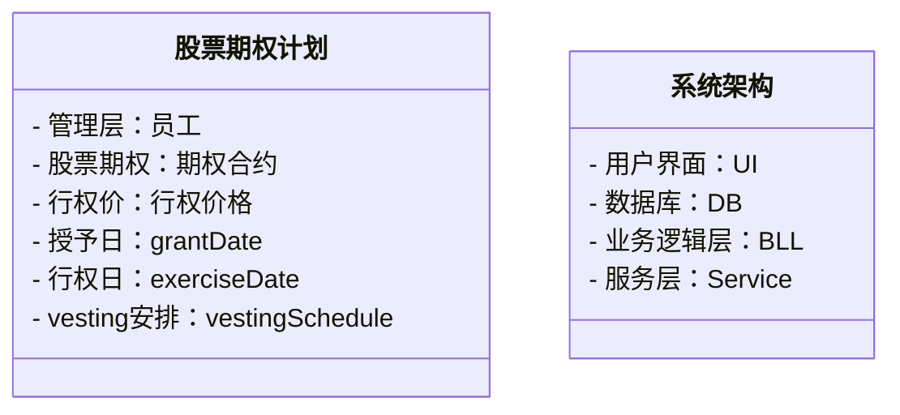
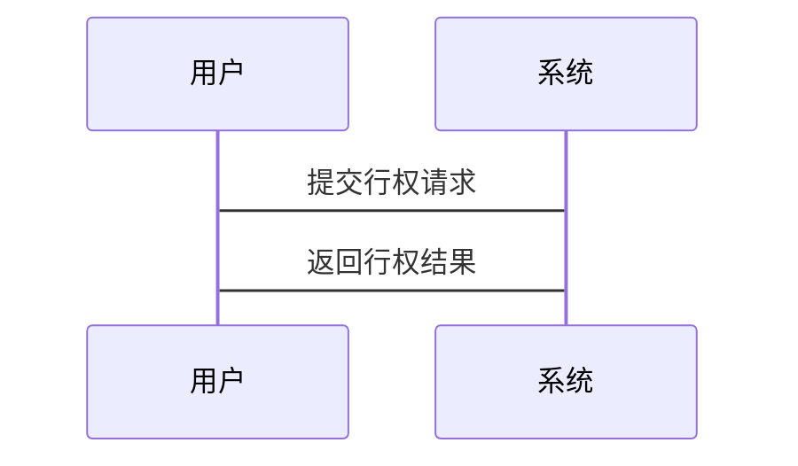

                 

<think>
好的，现在我要以《彼得林奇如何看待公司的股票期权计划》为标题，撰写一篇结构紧凑、逻辑清晰的技术博客文章。我将按照用户提供的目录大纲结构，逐步展开每个部分的内容。

### 一、文章标题
# 彼得林奇如何看待公司的股票期权计划

### 二、关键词
股票期权计划、彼得林奇、公司治理、激励机制、期权定价、Black-Scholes模型、蒙特卡洛模拟

### 三、摘要
这篇文章将探讨彼得·林奇对股票期权计划的看法。首先，我们将介绍股票期权的基本概念及其在公司治理中的作用。接着，分析股票期权的核心概念与定价模型，探讨期权在激励管理层方面的优势与挑战。最后，我们将通过实际案例分析，结合数学模型和算法原理，深入解读股票期权计划的实施策略及其对公司价值的影响。

---

### 四、正文部分

#### 第一部分: 股票期权计划的背景与基本概念

##### 第1章: 股票期权计划的概述

###### 1.1 股票期权的基本概念

####### 1.1.1 期权的基本定义
期权是一种金融衍生品，赋予持有者在特定时间内以预定价格买入或卖出标的资产的权利，而非义务。股票期权的标的资产是公司的股票，买方有权在到期日或之前以行权价购买或出售股票。

####### 1.1.2 股票期权的分类
股票期权主要分为看涨期权和看跌期权。看涨期权赋予持有者以行权价买入股票的权利，而看跌期权则赋予以行权价卖出股票的权利。此外，期权还可以根据执行价格与当前股价的关系分为实值、平值和虚值期权。

####### 1.1.3 股票期权的市场与应用场景
股票期权广泛应用于风险管理、投机交易和公司激励计划。在公司治理中，股票期权常用于激励管理层，确保其利益与公司股价紧密相连。

###### 1.2 公司治理与激励机制

####### 1.2.1 公司治理的基本概念
公司治理是确保公司有效运作和股东利益得到保护的过程。良好的公司治理结构有助于提升公司价值，降低代理成本。

####### 1.2.2 激励机制在公司治理中的作用
激励机制通过将管理层的薪酬与公司绩效挂钩，确保管理层的行为与股东利益一致。股票期权是常见的激励工具之一。

####### 1.2.3 股票期权作为激励工具的优势
股票期权能够将管理层的长期利益与公司股价的波动直接挂钩，激励管理层追求公司长期价值的增长。

###### 1.3 股票期权计划的起源与发展

####### 1.3.1 股票期权的历史背景
股票期权的历史可以追溯到古希腊时期，但现代期权市场的形成主要得益于20世纪70年代Black-Scholes模型的提出。

####### 1.3.2 现代公司治理中的期权计划
20世纪80年代以来，股票期权逐渐成为公司治理的重要工具，尤其是在美国硅谷等高科技公司中广泛应用。

####### 1.3.3 股票期权计划的全球发展趋势
随着全球资本市场的成熟，股票期权计划在全球范围内得到推广，成为跨国公司激励管理层的重要手段。

###### 1.4 本章小结
本章介绍了股票期权的基本概念、分类及其在公司治理中的作用。股票期权作为激励工具，能够有效激发管理层的积极性，促进公司价值的增长。

---

#### 第二部分: 股票期权计划的核心概念与联系

##### 第2章: 股票期权的核心概念与联系

###### 2.1 股票期权的类型

####### 2.1.1 看涨期权与看跌期权
看涨期权赋予持有者以行权价买入股票的权利，而看跌期权则赋予以行权价卖出股票的权利。两者在风险和收益的承担上有显著差异。

####### 2.1.2 实值期权、平值期权与虚值期权
实值期权是指当前股价高于行权价的看涨期权或低于行权价的看跌期权。平值期权是指当前股价等于行权价的期权。虚值期权则是指当前股价低于行权价的看涨期权或高于行权价的看跌期权。

####### 2.1.3 有期期权与 Bermudan 期权
有期期权是指只能在特定时间行权的期权，而Bermudan期权可以在特定时间段内选择行权或不行权。

###### 2.2 股票期权的定价模型

####### 2.2.1 Black-Scholes 模型的原理
Black-Scholes模型是股票期权定价的基准模型，假设标的资产价格服从几何布朗运动，且无套利机会。

####### 2.2.2 期权定价的数学模型与公式
Black-Scholes模型的公式为：
$$
C = S_0 \Phi(d_1) - K e^{-rT} \Phi(d_2)
$$
其中，$d_1 = \frac{\ln(S_0/K) + (r + \sigma^2/2)T}{\sigma \sqrt{T}}$，$d_2 = d_1 - \sigma \sqrt{T}$。

####### 2.2.3 期权定价的敏感性分析
期权价格对标的资产价格、波动率、行权价、时间和利率等因素高度敏感。通过敏感性分析，可以更好地理解期权价格的变化规律。

###### 2.3 股票期权的市场风险与波动率

####### 2.3.1 市场风险的定义与度量
市场风险是由于市场价格波动导致的投资损失风险。期权的市场风险可以通过波动率和Delta（Δ）来衡量。

####### 2.3.2 波动率对期权价格的影响
波动率是影响期权价格的重要因素。波动率越高，期权的价格通常越高，因为标的资产价格的波动为期权持有人提供了更大的收益可能性。

####### 2.3.3 期权定价中的波动率假设
Black-Scholes模型假设波动率是恒定的，但现实中波动率会随时间变化。因此，实际应用中需要考虑波动率的估计和模型调整。

###### 2.4 股票期权与公司治理的关系

####### 2.4.1 期权计划在公司治理中的作用
股票期权计划通过将管理层的收益与公司股价挂钩，激励管理层追求公司长期价值的增长，降低短期行为的风险。

####### 2.4.2 期权计划与公司股价的关系
期权计划能够提高公司股价的稳定性，因为管理层倾向于通过提升公司业绩来增加期权的价值。

####### 2.4.3 期权计划与管理层激励的平衡
过度依赖期权激励可能导致管理层过度冒险，影响公司稳健发展。因此，需要在激励强度和风险控制之间找到平衡点。

###### 2.5 本章小结
本章分析了股票期权的类型、定价模型及其在公司治理中的应用。期权计划作为激励工具，能够有效提升公司价值，但也需要关注其潜在风险。

---

#### 第三部分: 股票期权计划的算法原理与数学模型

##### 第3章: 股票期权定价的算法原理

###### 3.1 Black-Scholes 模型的数学推导

####### 3.1.1 Black-Scholes 方程的建立
Black-Scholes模型基于无套利定价原理，假设市场中存在无风险利率和标的资产价格的随机波动。

####### 3.1.2 方程的求解与解析解
通过偏微分方程求解，得到Black-Scholes公式的解析解，用于计算期权的理论价格。

####### 3.1.3 模型的假设与限制
Black-Scholes模型假设标的资产价格服从几何布朗运动，且波动率和无风险利率为常数。这些假设在现实中可能存在偏差。

###### 3.2 期权定价的蒙特卡洛模拟

####### 3.2.1 蒙特卡洛模拟的基本原理
蒙特卡洛模拟通过生成大量标的资产价格的随机路径，计算期权的期望值，从而估计期权的价格。

####### 3.2.2 股票价格随机游走模型
股票价格的随机游走模型假设价格变化遵循几何布朗运动，是蒙特卡洛模拟的基础。

####### 3.2.3 期权价格的模拟计算
通过模拟大量股票价格路径，计算每条路径下的期权 payoff，取期望值作为期权价格估计。

###### 3.3 期权定价的数值方法

####### 3.3.1 有限差分法的原理
有限差分法通过离散化偏微分方程，利用网格方法求解期权价格。这种方法适用于 American 期权等路径依赖型期权。

####### 3.3.2 格点法的实现步骤
格点法通过构建网格，计算每一点的期权价格，逐步逼近解析解。这种方法适用于欧式期权和 American 期权。

####### 3.3.3 数值方法的优缺点比较
有限差分法和格点法各有优缺点，有限差分法计算效率高，但实现复杂；格点法实现简单，但计算效率较低。

###### 3.4 本章小结
本章详细讲解了Black-Scholes模型的数学推导及其应用，介绍了蒙特卡洛模拟和数值方法在期权定价中的应用。这些方法为实际中的期权定价提供了理论基础和实践指导。

---

#### 第四部分: 股票期权计划的系统分析与架构设计

##### 第4章: 股票期权计划的系统分析与架构设计

###### 4.1 问题场景介绍
为了更好地实施股票期权计划，公司需要构建一个期权管理系统，用于期权授予、行权、 vesting安排和绩效评估。

###### 4.2 系统功能设计

####### 4.2.1 领域模型 Mermaid 类图


###### 4.3 系统架构设计 Mermaid 架构图
```mermaid
container 股票期权管理系统 {
    组件1: 用户界面 (UI)
    组件2: 业务逻辑层 (BLL)
    组件3: 数据库 (DB)
}
```

###### 4.4 系统接口设计
系统需要提供以下接口：
- 授予期权：记录期权授予信息。
- 行权期权：处理期权行权请求。
- 查询期权状态：提供期权持有者的行权信息查询。

###### 4.5 系统交互 Mermaid 序列图


###### 4.6 本章小结
本章通过系统分析与架构设计，展示了如何构建一个高效的股票期权管理系统。系统设计考虑了用户界面、业务逻辑和数据库的交互，确保期权计划的顺利实施。

---

#### 第五部分: 股票期权计划的项目实战

##### 第5章: 股票期权计划的项目实战

###### 5.1 环境安装
为了实现股票期权管理系统，首先需要安装以下工具：
- Python编程语言
- 数据库（MySQL或PostgreSQL）
- 开发框架（Django或Flask）

###### 5.2 系统核心实现源代码
以下是一个简单的期权管理系统框架代码：

```python
from datetime import datetime
import pandas as pd

class StockOptionPlan:
    def __init__(self, grant_date, exercise_price, stock_price):
        self.grant_date = grant_date
        self.exercise_price = exercise_price
        self.stock_price = stock_price

    def calculate_value(self, current_date, volatility, risk_free_rate):
        # 使用Black-Scholes模型计算期权价值
        pass

# 示例数据
grant_date = datetime.now()
exercise_price = 50
stock_price = 45
plan = StockOptionPlan(grant_date, exercise_price, stock_price)
plan.calculate_value(datetime.now(), 0.3, 0.05)
```

###### 5.3 代码应用解读与分析
上述代码定义了一个简单的股票期权计划类，初始化了授予日期、行权价和当前股价，并提供了一个计算期权价值的方法。实际应用中，需要结合具体的业务逻辑和数据存储需求进行扩展。

###### 5.4 实际案例分析
以微软公司为例，假设微软向其高管授予股票期权，行权价为100美元，授予日期为2023年1月1日。当前股价为120美元，波动率为20%，无风险利率为5%。使用Black-Scholes模型计算期权价值：
$$
C = S_0 \Phi(d_1) - K e^{-rT} \Phi(d_2)
$$
其中，$d_1 = \frac{\ln(120/100) + (0.05 + 0.2^2/2)*1}{0.2 \sqrt{1}} = 0.5567
$$
$$
d_2 = 0.5567 - 0.2 \times 1 = 0.3567
$$
假设$\Phi(d_1) = 0.7107$，$\Phi(d_2) = 0.6376$，则期权价值为：
$$
C = 120 \times 0.7107 - 100 \times e^{-0.05} \times 0.6376 \approx 85.28 - 59.99 \approx 25.29
$$

###### 5.5 本章小结
本章通过实际案例分析，展示了如何在实际业务中应用股票期权计划。通过Black-Scholes模型计算期权价值，帮助企业更好地进行激励计划的设计和评估。

---

#### 第六部分: 股票期权计划的总结与展望

##### 第6章: 股票期权计划的总结与展望

###### 6.1 最佳实践 tips
- 合理设计期权计划，确保激励效果与公司价值增长相匹配。
- 定期评估期权计划的实施效果，及时调整行权价和 vesting安排。
- 注意市场波动和利率变化对期权价值的影响，做好风险管理工作。

###### 6.2 小结
通过本文的分析，我们深入探讨了彼得·林奇对股票期权计划的看法，详细讲解了期权的基本概念、定价模型及其在公司治理中的应用。

###### 6.3 注意事项
- 期权计划的设计需要综合考虑公司战略、管理层结构和市场环境。
- 注意期权计划的实施风险，如过度激励导致的短期行为和财务风险。

###### 6.4 拓展阅读
- 《期权、期货和其他衍生产品》——John C. Hull
- 《彼得林奇的成功投资策略》——彼得·林奇

###### 6.5 本章小结
本章总结了股票期权计划的核心观点，并提出了实际应用中的注意事项和拓展阅读建议，帮助读者进一步深入学习。

---

### 五、总结
通过以上章节的详细讲解，我们全面探讨了彼得·林奇对股票期权计划的看法，从基本概念到数学模型，再到实际应用，为读者提供了系统的知识体系。希望这篇文章能够帮助读者更好地理解和应用股票期权计划，提升公司治理和激励机制的有效性。

