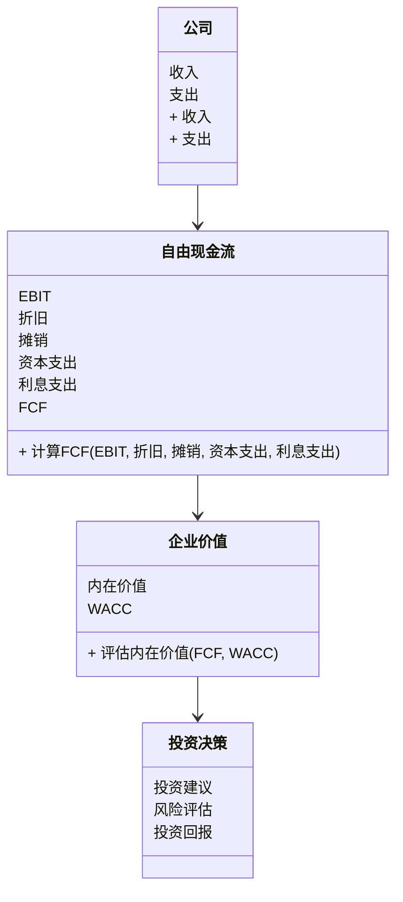

                 


# 彼得林奇如何看待公司的自由现金流

## 关键词：自由现金流、彼得·林奇、投资策略、企业估值、财务分析

## 摘要：  
彼得·林奇作为投资界的传奇人物，他的成功离不开对自由现金流的深刻理解和有效应用。自由现金流是衡量企业财务健康和投资价值的重要指标，而彼得·林奇通过分析自由现金流，识别出具有持续竞争优势和良好财务状况的企业。本文将从自由现金流的核心概念、计算方法、与企业价值的关系、彼得·林奇的投资策略以及实际应用等方面，系统地分析彼得·林奇如何看待公司的自由现金流。

---

## 第一部分：自由现金流的核心概念与投资策略

### 第1章：自由现金流的基本概念

#### 1.1 自由现金流的定义与特征
- **自由现金流（Free Cash Flow，FCF）**是指企业在扣除所有必要的支出（如运营成本、资本支出）后，剩余的可用于偿还债务、支付股息或进行再投资的资金。
- **特征**：
  - 反映企业的真实盈利能力。
  - 体现企业的财务灵活性。
  - 是评估企业内在价值的重要指标。

#### 1.2 彼得·林奇的投资理念
- **彼得·林奇的背景**：美国著名基金经理，富达麦哲伦基金的传奇经理人，以长期优异的投资业绩闻名。
- **投资哲学**：寻找具有持续竞争优势、管理层优秀、财务健康的企业。
- **对自由现金流的重视**：彼得·林奇认为，自由现金流是衡量企业财务健康和投资价值的核心指标。

---

### 第2章：自由现金流的计算与分析

#### 2.1 自由现金流的计算公式
- **基本公式**：
  $$ \text{FCF} = \text{EBIT} + \text{折旧} + \text{摊销} - \text{资本支出} - \text{利息支出} $$
- **计算步骤**：
  1. 计算企业的息税前利润（EBIT）。
  2. 加上折旧和摊销。
  3. 减去资本支出和利息支出。

#### 2.2 自由现金流的分析方法
- **趋势分析**：观察企业自由现金流的变化趋势，判断企业的财务健康状况。
- **同行业比较**：将企业的自由现金流与行业平均水平进行对比，识别行业内的优劣企业。
- **增长性分析**：评估企业的自由现金流是否具有持续增长的潜力。

---

### 第3章：自由现金流与企业价值评估

#### 3.1 自由现金流在企业估值中的作用
- **企业内在价值**：自由现金流是企业内在价值的核心驱动因素。
- **自由现金流贴现模型（DCF）**：通过将未来自由现金流贴现，计算企业的内在价值。
- **WACC计算**：加权平均资本成本（WACC）是DCF模型中常用的贴现率，公式如下：
  $$ \text{WACC} = \left( \frac{D}{D+E} \times r_d \right) + \left( \frac{E}{D+E} \times r_e \right) $$

#### 3.2 彼得·林奇的企业价值评估方法
- **寻找高自由现金流的企业**：彼得·林奇倾向于投资那些能够产生稳定且持续增长的自由现金流的企业。
- **识别现金流的可持续性**：通过分析企业的经营模式、行业地位和财务状况，判断自由现金流的可持续性。
- **现金流与股价的关系**：彼得·林奇认为，自由现金流的增长是股价长期上涨的推动力。

---

## 第二部分：系统分析与实战应用

### 第4章：自由现金流的系统分析与架构设计

#### 4.1 自由现金流的系统分析
- **系统功能设计**：构建一个自由现金流分析系统，包括数据采集、计算、可视化和报告生成四个模块。
- **领域模型（Mermaid 类图）**：


#### 4.2 自由现金流的系统架构设计
- **系统架构**：采用分层架构，包括数据层、计算层、展示层和用户层。
- **系统架构图（Mermaid）**：


---

### 第5章：项目实战

#### 5.1 环境安装与数据准备
- **工具安装**：安装Python、Pandas、Matplotlib等工具。
- **数据准备**：获取目标企业的财务数据，包括收入、支出、折旧、摊销、资本支出和利息支出。

#### 5.2 核心代码实现
```python
import pandas as pd
import matplotlib.pyplot as plt

# 数据准备
data = {
    '收入': [100, 120, 130, 140],
    '支出': [80, 90, 100, 110],
    '折旧': [10, 15, 20, 25],
    '摊销': [5, 10, 15, 20],
    '资本支出': [50, 60, 70, 80],
    '利息支出': [10, 12, 15, 18]
}

df = pd.DataFrame(data)

# 计算自由现金流
df['FCF'] = df['收入'] - df['支出'] + df['折旧'] + df['摊销'] - df['资本支出'] - df['利息支出']

# 可视化
plt.figure(figsize=(10, 6))
plt.plot(df['FCF'], marker='o', linestyle='-', label='Free Cash Flow')
plt.title('自由现金流变化趋势')
plt.xlabel('年份')
plt.ylabel('现金流')
plt.legend()
plt.show()
```

#### 5.3 案例分析：以苹果公司为例
- **数据来源**：苹果公司过去五年的财务数据。
- **计算与分析**：通过公式计算苹果公司的自由现金流，并分析其变化趋势。
- **结论**：苹果公司近年来的自由现金流持续增长，体现了其强大的盈利能力。

---

### 第6章：最佳实践与注意事项

#### 6.1 投资策略 tips
- **关注企业的自由现金流**：优先选择那些能够产生稳定且持续增长的自由现金流的企业。
- **结合其他指标分析**：虽然自由现金流很重要，但还需要结合其他财务指标（如ROE、毛利率）进行综合分析。

#### 6.2 小结
- 彼得·林奇的成功离不开对自由现金流的深刻理解。
- 自由现金流是评估企业价值的重要指标，也是投资决策的关键依据。

#### 6.3 注意事项
- **数据的准确性**：确保财务数据的准确性和完整性。
- **模型的适用性**：根据企业的实际情况调整自由现金流计算模型。
- **市场环境的影响**：关注宏观经济环境和行业趋势对自由现金流的影响。

---

## 结语  
彼得·林奇通过自由现金流分析，找到了许多优质的投资标的。对于投资者来说，理解和掌握自由现金流的分析方法，是实现长期稳健投资收益的重要途径。希望本文能够帮助读者更好地理解自由现金流的重要性，并将其应用到实际投资中。

