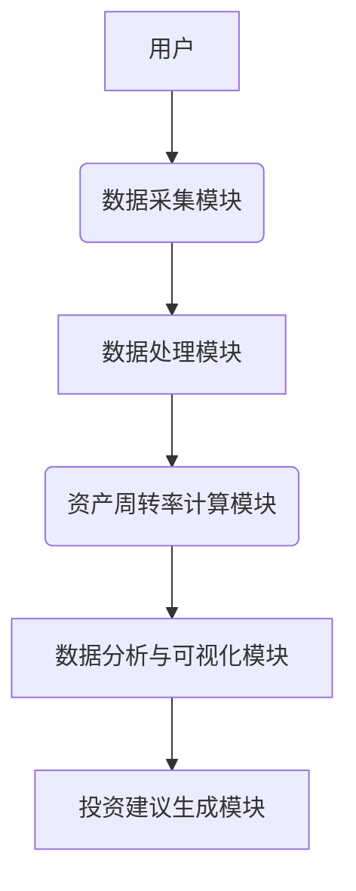

                 


# 彼得林奇如何看待公司的资产周转率

> 关键词：资产周转率，彼得·林奇，投资分析，财务指标，企业经营

> 摘要：本文将从彼得·林奇的投资理念出发，分析他如何看待公司的资产周转率。通过详细阐述资产周转率的定义、计算方法、行业差异以及其在投资决策中的重要性，结合彼得·林奇的经典投资案例，深入探讨如何通过资产周转率来评估公司的经营效率和投资价值。

---

## 第一部分：资产周转率与投资分析基础

### 第1章：资产周转率的定义与重要性

#### 1.1 资产周转率的定义
资产周转率是衡量企业资产使用效率的重要财务指标，反映了企业在一定时期内利用资产创造营业收入的能力。其计算公式为：
$$资产周转率 = \frac{营业收入}{平均资产总额}$$

资产周转率的高低直接关系到企业的盈利能力和运营效率。高资产周转率意味着企业能够更高效地利用资产创造收入，而低资产周转率则可能表明企业存在资产闲置或管理效率低下的问题。

#### 1.2 资产周转率的重要性
资产周转率在投资分析中具有重要意义，以下是其核心作用：
1. **衡量企业运营效率**：资产周转率越高，说明企业资产的使用效率越高。
2. **评估企业盈利能力**：资产周转率与企业的净利润率密切相关，高资产周转率通常意味着更高的盈利能力。
3. **行业比较的依据**：不同行业对资产周转率的要求差异较大，例如制造业和零售业通常需要较高的资产周转率，而公用事业和房地产行业则可能资产周转率较低。

---

### 第2章：彼得·林奇的投资方法论

#### 2.1 彼得·林奇的投资理念
彼得·林奇是全球著名的价值投资者，其投资理念的核心在于寻找那些能够持续增长且估值合理的企业。他强调，投资成功的前提是深入了解企业的基本面，并选择具有竞争优势的企业。

#### 2.2 资产周转率在彼得·林奇选股中的地位
彼得·林奇认为，资产周转率是衡量企业经营效率的重要指标，是其选股过程中不可或缺的一部分。他认为，高资产周转率的企业通常具有更强的盈利能力和成长潜力。

##### 2.2.1 彼得·林奇对资产周转率的筛选标准
1. **行业标准比较**：彼得·林奇会将企业的资产周转率与其所在行业的平均水平进行比较，以判断其是否具有竞争优势。
2. **历史趋势分析**：他会关注企业的资产周转率是否呈现持续增长的趋势，以此判断企业的经营效率是否在不断提升。
3. **资产周转率与企业规模的关系**：他注意到，资产周转率与企业规模之间存在一定的关系，中小企业通常具有更高的资产周转率。

---

### 第3章：资产周转率的计算与分析

#### 3.1 资产周转率的计算方法
资产周转率的计算需要结合企业的财务报表数据，特别是营业收入和资产总额。以下是具体步骤：
1. **获取数据**：从企业的财务报表中获取营业收入和资产总额。
2. **计算平均资产总额**：为了消除季节性波动的影响，通常采用平均资产总额进行计算。
3. **计算资产周转率**：将营业收入除以平均资产总额，得到资产周转率。

##### 3.2 彼得·林奇对资产周转率的分析方法
彼得·林奇在分析资产周转率时，通常会结合以下因素：
1. **行业特性**：不同行业的资产周转率存在显著差异，例如零售业通常高于制造业。
2. **企业规模**：小型企业的资产周转率通常高于大型企业。
3. **历史趋势**：资产周转率的变化趋势更能反映企业的经营效率。

---

## 第二部分：系统分析与架构设计

### 第4章：系统分析与架构设计方案

#### 4.1 系统目标与功能需求
为了帮助投资者更好地分析资产周转率，我们设计了一个基于彼得·林奇投资理念的资产周转率分析系统，其主要目标包括：
1. 提供资产周转率的计算功能。
2. 支持行业标准比较和历史趋势分析。
3. 自动生成投资建议。

#### 4.2 系统架构设计
以下是系统的整体架构设计：


#### 4.3 系统实现
以下是系统的核心实现代码：
```python
import pandas as pd

def calculate_asset_turnover(revenue, average_assets):
    return revenue / average_assets

# 示例数据
revenue = [100, 200, 300]
assets = [50, 100, 150]
years = [2020, 2021, 2022]

# 计算平均资产
average_assets = [(assets[i] + assets[i+1])/2 for i in range(len(assets)-1)]
average_assets.append(assets[-1])  # 最后一年的资产取当年值

# 计算资产周转率
asset_turnover = []
for i in range(len(years)):
    at = calculate_asset_turnover(revenue[i], average_assets[i])
    asset_turnover.append(at)

print("资产周转率：", asset_turnover)
```

---

## 第三部分：项目实战

### 第5章：项目实战——基于彼得·林奇方法的资产周转率分析

#### 5.1 项目背景与目标
本项目旨在通过分析企业的资产周转率，帮助投资者识别具有高成长潜力的企业。我们将以某制造企业为例，展示如何基于彼得·林奇的选股标准进行分析。

#### 5.2 系统功能设计
1. 数据采集模块：获取企业的财务数据。
2. 资产周转率计算模块：计算企业的资产周转率。
3. 数据分析与可视化模块：对比行业标准，分析资产周转率的变化趋势。

#### 5.3 项目实现
以下是基于Python的资产周转率分析代码：
```python
import pandas as pd
import matplotlib.pyplot as plt

# 示例数据
data = {
    'year': [2019, 2020, 2021, 2022],
    'revenue': [500, 600, 700, 800],
    'assets': [250, 300, 350, 400]
}

df = pd.DataFrame(data)

# 计算平均资产
df['average_assets'] = (df['assets'].shift(1) + df['assets']) / 2
df['asset_turnover'] = df['revenue'] / df['average_assets']

print(df)

# 可视化
plt.figure(figsize=(10, 6))
plt.plot(df['year'], df['asset_turnover'], 'b-', marker='o')
plt.title('Asset Turnover Rate Analysis')
plt.xlabel('Year')
plt.ylabel('Asset Turnover Rate')
plt.grid(True)
plt.show()
```

---

## 第四部分：小结与建议

### 第6章：小结与建议
通过本文的分析，我们可以得出以下结论：
1. 资产周转率是衡量企业经营效率的重要指标。
2. 彼得·林奇通过分析资产周转率，成功筛选出具有高成长潜力的企业。
3. 投资者可以通过系统化的分析方法，结合资产周转率和其他财务指标，做出更科学的投资决策。

---

## 第五部分：最佳实践 tips

### 6.1 最佳实践 tips
1. **持续学习**：保持对市场动态和企业基本面的关注。
2. **多元化投资**：避免将所有资金投入到单一行业或企业。
3. **长期持有**：耐心持有优质企业股票，避免频繁交易。

---

## 第六部分：总结

### 6.2 总结
通过本文的分析，我们深入探讨了彼得·林奇如何看待公司资产周转率，并结合实际案例和系统设计，为投资者提供了科学的投资分析方法。希望本文能够为读者在投资决策中提供有价值的参考和启发。

---

以上是《彼得林奇如何看待公司的资产周转率》的技术博客文章目录大纲和部分具体内容。

