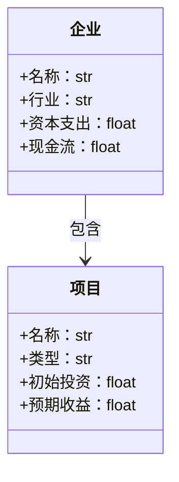
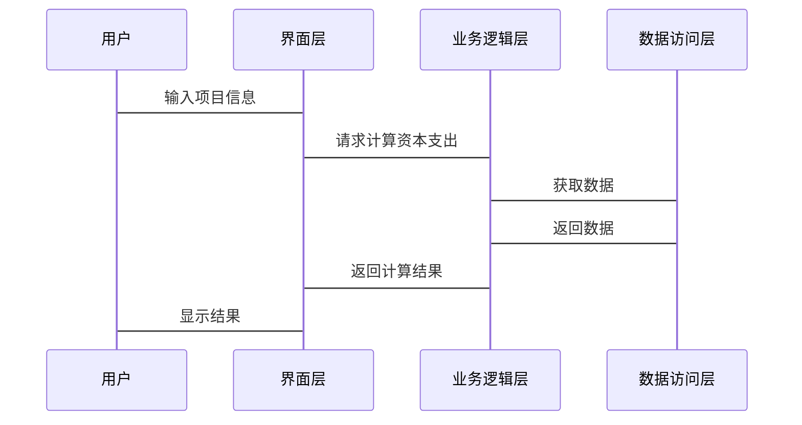

                 


# 彼得林奇如何看待公司的资本支出

## 关键词：资本支出、彼得·林奇、投资决策、企业价值、财务分析

## 摘要：资本支出是企业在设备、设施和研发等长期资产上的投资，对企业的增长和价值评估至关重要。本文分析了资本支出的定义、评估方法、与企业价值的关系，并结合彼得·林奇的投资理念，探讨如何通过资本支出的质量和效率来评估企业的投资决策和长期发展潜力。

---

## 第1章：资本支出的基本概念

### 1.1 资本支出的定义与分类

#### 1.1.1 资本支出的定义
资本支出是指企业在购买或改进长期资产（如设备、建筑物、研发项目等）上的支出。这些支出旨在增加企业的生产能力或提升效率，通常具有较高的价值和较长的使用期限。

#### 1.1.2 资本支出的分类
资本支出可以分为以下几类：
- **生产性资本支出**：用于直接生产过程的资产，如机器和设备。
- **非生产性资本支出**：用于支持生产但不直接参与生产的资产，如办公大楼。
- **研发资本支出**：用于新产品或技术开发的支出。
- **其他资本支出**：如土地购买等。

#### 1.1.3 资本支出与企业价值的关系
资本支出直接影响企业的生产能力、成本结构和未来现金流。合理的资本支出可以提升企业竞争力，增加未来收益，从而提升企业价值。

---

### 1.2 资本支出的重要性

#### 1.2.1 资本支出对企业增长的影响
资本支出是企业扩张和升级的基石。通过投资于新技术和设备，企业可以提高生产效率，降低成本，进而提升市场竞争力。

#### 1.2.2 资本支出与企业盈利能力的关系
资本支出的合理性直接影响企业的盈利能力。过度投资可能导致资金浪费，而不足的投资则可能限制企业的发展。

#### 1.2.3 资本支出在投资决策中的作用
投资者通常通过分析资本支出的效率来评估企业的投资决策。高效的资本支出能够带来更高的回报，而低效的支出可能导致资源浪费。

---

### 1.3 资本支出的边界与外延

#### 1.3.1 资本支出的边界
资本支出的边界在于其长期性和高价值性。短期支出或低价值的支出通常不被视为资本支出。

#### 1.3.2 资本支出的外延
资本支出的外延包括与之相关的融资活动和风险管理。企业通常通过贷款或发行债券来筹集资本支出资金，这会影响企业的财务杠杆和风险敞口。

#### 1.3.3 资本支出与其他财务指标的联系
资本支出与企业的现金流、净利润、资产回报率等指标密切相关。这些指标共同构成了企业财务健康状况的评估体系。

---

### 1.4 资本支出的核心要素组成

#### 1.4.1 资本支出的构成要素
资本支出的构成要素包括：
- 购买或建造资产的支出
- 研发支出
- 维护和升级支出

#### 1.4.2 资本支出的计算公式
资本支出的计算公式如下：
$$\text{资本支出} = \text{折旧} + \text{资本化支出}$$

其中，资本化支出是指直接用于购买或建造长期资产的支出，而折旧是这些资产在使用过程中逐步分摊的成本。

#### 1.4.3 资本支出的评估标准
评估资本支出的合理性通常基于以下几个标准：
- 投资回收期
- 净现值（NPV）
- 内部收益率（IRR）

---

## 第2章：资本支出的原理与特性

### 2.1 资本支出的原理

#### 2.1.1 资本支出的基本原理
资本支出的目的是通过投资于长期资产来增加未来的现金流。企业需要在当前的支出和未来的收益之间找到平衡点。

#### 2.1.2 资本支出的决策依据
资本支出的决策通常基于以下因素：
- 项目的预期收益
- 资金的时间价值
- 项目的可行性和风险

#### 2.1.3 资本支出的经济效应
资本支出的经济效应体现在以下几个方面：
- 提高生产效率
- 降低成本
- 增强市场竞争力

---

### 2.2 资本支出的特性对比

#### 2.2.1 不同类型资本支出的特征对比
以下是不同类型资本支出的对比：

| 类型                | 投资目的       | 例子                     |
|---------------------|---------------|--------------------------|
| 生产性资本支出      | 提高生产能力   | 购买新设备               |
| 非生产性资本支出    | 支持生产活动   | 建造办公大楼             |
| 研发资本支出        | 开发新产品     | 投资于新技术研发         |
| 其他资本支出        | 其他长期资产   | 购买土地                 |

#### 2.2.2 资本支出与运营支出的差异
资本支出与运营支出的主要区别在于：
- **资本支出**：用于长期资产的购买或改进，计入资产负债表。
- **运营支出**：用于日常运营，如工资、租金，计入损益表。

#### 2.2.3 资本支出的周期性分析
资本支出通常具有周期性，受经济波动影响较大。在经济繁荣时期，资本支出增加；在衰退时期，资本支出减少。

---

### 2.3 资本支出的ER实体关系图

```mermaid
er
  企业
  投资项目
  资金支出
  项目负责人
  资金来源
  项目审批流程
```

---

## 第3章：资本支出的评估方法

### 3.1 资本支出的合理性评估

#### 3.1.1 净现值（NPV）计算
净现值是未来现金流的现值减去初始投资。如果NPV为正，项目值得投资。

净现值公式：
$$NPV = \sum_{t=0}^{n} \frac{CF_t}{(1 + r)^t}$$

其中，$CF_t$ 是第t年的现金流，$r$ 是折现率。

#### 3.1.2 内部收益率（IRR）分析
内部收益率是使净现值为零的折现率。

内部收益率公式：
$$IRR = r \text{ 使得 } NPV = 0$$

#### 3.1.3 投资回收期（Payback Period）计算
投资回收期是回收初始投资所需的时间。通常，回收期越短，项目的吸引力越大。

---

### 3.2 资本支出的数学模型

#### 3.2.1 净现值计算示例
假设某项目初始投资为100万元，未来三年的现金流分别为40万元、50万元和60万元，折现率为10%。

计算NPV：
$$NPV = \frac{40}{1.1} + \frac{50}{1.1^2} + \frac{60}{1.1^3} - 100 \approx 40.00 + 39.68 + 40.52 - 100 = -20.80 \text{万元}$$

由于NPV为负，该项目不值得投资。

#### 3.2.2 内部收益率计算示例
假设某项目现金流如下：
- 初始投资：-100万元
- 第一年：40万元
- 第二年：50万元
- 第三年：60万元

使用试算法计算IRR：
- 假设r=15%，NPV≈-100 + 40/(1.15) + 50/(1.15)^2 + 60/(1.15)^3 ≈ -100 + 34.78 + 37.25 + 38.62 ≈ -100 + 110.65 ≈ 10.65 > 0
- 假设r=16%，NPV≈-100 + 34.78 + 37.25 + 38.62 ≈ -100 + 110.65 ≈ 10.65 - 1.32 ≈ 9.33 > 0
- 继续调整r，直到NPV接近0，假设最终IRR≈17%

---

### 3.3 资本支出的算法实现

#### 3.3.1 净现值算法实现
```python
def npv(cash_flows, discount_rate):
    return sum(cf / (1 + discount_rate) ** t for t, cf in enumerate(cash_flows))

cash_flows = [-100, 40, 50, 60]
discount_rate = 0.1
print("NPV:", npv(cash_flows, discount_rate))
```

#### 3.3.2 内部收益率算法实现
```python
import numpy as np

def irr(cash_flows):
    return np.irr(cash_flows)

cash_flows = [-100, 40, 50, 60]
print("IRR:", irr(cash_flows))
```

---

## 第4章：资本支出的系统分析与架构设计

### 4.1 问题场景介绍

#### 4.1.1 项目介绍
假设我们正在为一家制造企业设计一个资本支出分析系统，旨在帮助管理层评估和管理资本支出。

#### 4.1.2 项目目标
- 自动化资本支出分析
- 提供决策支持
- 优化资本预算

---

### 4.2 系统功能设计

#### 4.2.1 领域模型设计


#### 4.2.2 系统架构设计


#### 4.2.3 系统接口设计
- 用户输入：项目信息
- 系统输出：NPV、IRR、回收期

#### 4.2.4 系统交互流程


---

## 第5章：资本支出的项目实战

### 5.1 环境安装

#### 5.1.1 安装Python
```bash
pip install numpy
pip install pandas
pip install matplotlib
```

#### 5.1.2 安装数据分析库
```bash
pip install scikit-learn
pip install seaborn
```

---

### 5.2 核心实现源代码

#### 5.2.1 净现值计算
```python
import numpy as np

def calculate_npv(cash_flows, discount_rate):
    return np.npv(discount_rate, *cash_flows)

cash_flows = [-100, 40, 50, 60]
discount_rate = 0.1
print("NPV:", calculate_npv(cash_flows, discount_rate))
```

#### 5.2.2 内部收益率计算
```python
def calculate_irr(cash_flows):
    return np.irr(cash_flows)

print("IRR:", calculate_irr(cash_flows))
```

---

### 5.3 代码应用解读与分析

#### 5.3.1 净现值计算结果分析
假设计算得到的NPV为正，说明项目可行；若NPV为负，则项目不可行。

#### 5.3.2 内部收益率计算结果分析
较高的IRR表明项目具有较高的盈利能力。

---

### 5.4 实际案例分析与详细讲解

#### 5.4.1 案例背景
某制造企业计划购买新设备，初始投资为100万元，预期未来三年的现金流分别为40万元、50万元和60万元，折现率为10%。

#### 5.4.2 计算与分析
- NPV≈-20.80万元（不可行）
- IRR≈17%

由于NPV为负，该项目不值得投资。

---

### 5.5 项目小结

#### 5.5.1 项目总结
通过计算得出，该项目的NPV为负，因此不值得投资。

#### 5.5.2 经验与教训
在进行资本支出分析时，需综合考虑多个指标，而不仅仅依赖单一指标。

---

## 第6章：资本支出的总结与展望

### 6.1 最佳实践 tips

#### 6.1.1 投资决策
- 综合考虑NPV、IRR等多种指标
- 结合企业实际情况制定资本支出计划

#### 6.1.2 风险管理
- 评估项目的可行性和风险
- 制定风险管理策略

#### 6.1.3 持续优化
- 定期评估资本支出的效果
- 根据市场变化调整资本支出策略

---

### 6.2 小结

资本支出是企业增长的关键驱动力。通过合理的资本支出分析，企业可以优化资源配置，提升盈利能力。彼得·林奇强调资本支出的质量和效率，投资者应关注企业的资本支出是否能够带来长期的收益。

---

### 6.3 注意事项

- 资本支出分析需结合企业实际
- 风险因素不可忽视
- 定期评估和调整资本支出策略

---

### 6.4 拓展阅读

- 《彼得·林奇的投资哲学》
- 《资本预算与投资决策》
- 《财务分析与投资管理》

---

## 附录：资本支出分析工具推荐

### 附录1：常用工具

- **Excel**：内置NPV和IRR函数。
- **Python**：使用numpy和pandas进行数据分析。
- **R**：用于高级数据分析和建模。

### 附录2：工具安装与使用

#### 安装Python工具
```bash
pip install numpy pandas matplotlib
```

#### 使用Excel进行资本支出分析
- 输入数据
- 使用公式计算NPV和IRR
- 绘制现金流图

---

## 结语

资本支出是企业投资决策中的核心内容。通过本文的分析，读者可以深入了解资本支出的评估方法和系统设计，结合彼得·林奇的投资理念，提升资本支出分析的能力，为企业的长期发展提供有力支持。

