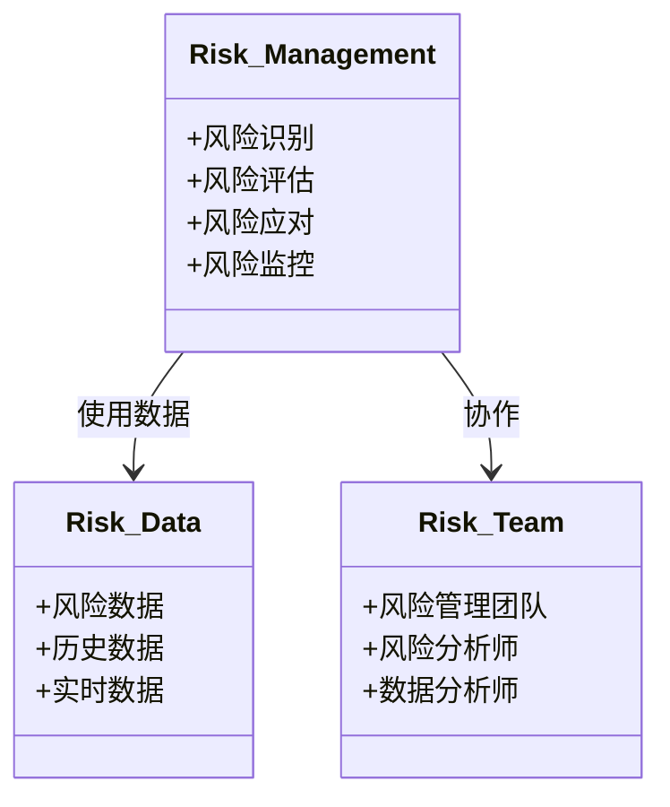
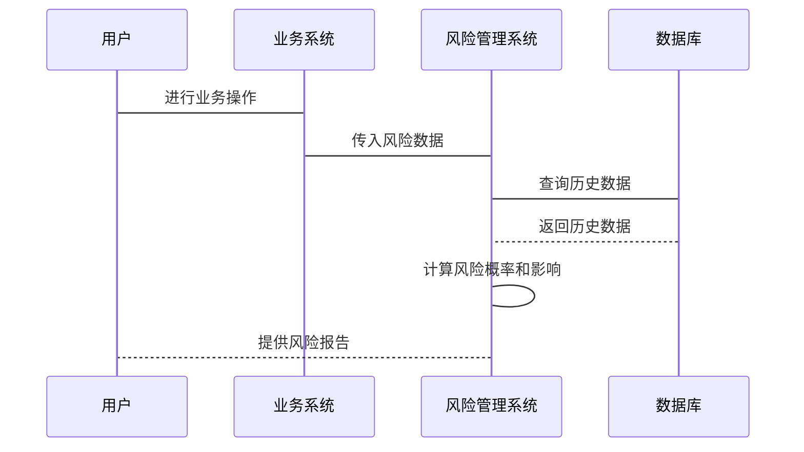

                 


# 彼得·林奇如何看待公司的风险管理文化

## 关键词：风险管理文化，彼得·林奇，公司治理，风险管理，投资理念

## 摘要：  
本文深入探讨了彼得·林奇对风险管理文化的独特见解，分析了风险管理文化在公司治理中的核心作用，并结合实际案例，详细阐述了如何通过战略、组织、文化和流程四个维度构建有效的风险管理体系。文章从背景介绍、核心概念、算法原理、系统分析到项目实战，层层递进，为读者提供全面而深入的指导。

---

# 第一部分: 风险管理文化的核心概念与背景

## 第1章: 风险管理文化概述

### 1.1 风险管理的基本概念

#### 1.1.1 风险的定义与分类

风险是指在特定条件下，某一事件发生的可能性及其可能带来的损失或收益。在公司治理中，风险主要关注潜在的损失或负面后果。根据来源和性质，风险可以分为：

- **市场风险**：由于市场波动导致的损失。
- **信用风险**：由于债务人或交易对手违约导致的损失。
- **操作风险**：由于内部流程或人为错误导致的损失。
- **流动性风险**：无法及时变现资产的风险。
- **声誉风险**：由于负面事件导致公司声誉受损的风险。

#### 1.1.2 风险管理的基本原则

- **全面性**：覆盖所有业务和职能部门。
- **独立性**：风险管理团队应独立于业务部门。
- **及时性**：风险识别和应对应及时。
- **成本效益原则**：投入与收益的平衡。

#### 1.1.3 风险管理在公司治理中的作用

风险管理是公司治理的核心部分，它帮助公司识别潜在风险，制定应对策略，确保公司稳健运营。有效的风险管理能够增强投资者信心，降低公司破产风险，并提升公司的长期竞争力。

### 1.2 公司风险管理文化的重要性

#### 1.2.1 风险管理文化的定义

风险管理文化是指公司内部关于风险的认知、态度和处理方式的总和。它包括公司对风险的容忍度、处理风险的方式以及员工在风险管理中的角色和责任。

#### 1.2.2 风险管理文化的核心要素

- **价值观**：公司对风险的态度和价值观。
- **行为规范**：员工在日常工作中处理风险的具体行为。
- **信仰体系**：公司对风险管理的长期承诺和信仰。

#### 1.2.3 风险管理文化与公司绩效的关系

风险管理文化直接影响公司的绩效。良好的风险管理文化能够降低公司的风险敞口，提高公司的抗风险能力，从而增强公司的整体绩效。

### 1.3 彼得·林奇与风险管理文化的关联

#### 1.3.1 彼得·林奇的投资理念

彼得·林奇是美国著名投资经理人，以其在波士顿基金和麦哲伦基金的卓越表现闻名。他的投资理念强调长期投资、价值投资以及深入的基本面分析。他认为，成功的投资不仅取决于市场分析，还取决于对所投资公司的深入了解。

#### 1.3.2 彼得·林奇对风险管理的重视

林奇在其职业生涯中多次强调风险管理的重要性。他认为，风险管理不仅是投资组合的重要组成部分，更是保护投资者利益的关键。他在管理麦哲伦基金时，始终坚持分散投资，避免过度集中在单一行业或资产上，以降低风险。

#### 1.3.3 彼得·林奇风险管理思想的现代意义

尽管林奇的投资风格主要集中在20世纪80年代和90年代，他的风险管理思想在今天依然具有重要意义。特别是在当前复杂多变的市场环境中，林奇的分散投资和风险控制策略为现代投资者提供了宝贵的借鉴。

### 1.4 本章小结

本章从风险管理的基本概念出发，探讨了风险管理文化在公司治理中的重要性，并结合彼得·林奇的投资理念，分析了他如何将风险管理融入其投资策略中。这为后续章节的深入分析奠定了基础。

---

# 第二部分: 风险管理文化的系统分析

## 第2章: 风险管理的核心维度

### 2.1 风险管理的战略维度

#### 2.1.1 风险管理的战略目标

风险管理的战略目标包括：

- 降低公司风险敞口。
- 保障公司资产安全。
- 提升公司抗风险能力。
- 支持公司长期战略目标的实现。

#### 2.1.2 风险管理的战略规划

战略规划应包括：

- 风险识别与评估。
- 风险应对策略制定。
- 风险管理资源分配。
- 风险管理绩效评估。

#### 2.1.3 风险管理的战略执行

战略执行需要：

- 明确责任分工。
- 制定详细的操作流程。
- 确保资源到位。
- 定期评估执行效果。

### 2.2 风险管理的组织维度

#### 2.2.1 风险管理组织的结构

- **风险管理委员会**：负责制定风险管理政策和监督执行。
- **风险管理团队**：负责具体的风险管理工作。
- **业务部门**：负责识别和报告潜在风险。

#### 2.2.2 风险管理团队的职责

- **风险识别**：识别公司面临的主要风险。
- **风险评估**：评估风险的可能性和影响程度。
- **风险应对**：制定并执行风险应对策略。
- **风险监控**：持续监控风险状况并及时调整应对措施。

#### 2.2.3 风险管理组织的协调机制

- **定期会议**：风险管理团队与业务部门定期召开会议，讨论风险相关问题。
- **信息共享**：建立信息共享机制，确保各方及时了解风险信息。
- **协调合作**：通过跨部门合作，共同应对风险。

### 2.3 风险管理的文化维度

#### 2.3.1 风险管理文化的形成机制

风险管理文化的形成需要：

- **领导层的重视**：管理层需要将风险管理作为公司文化的一部分。
- **员工培训**：通过培训提升员工的风险管理意识。
- **激励机制**：建立激励机制，鼓励员工积极参与风险管理。

#### 2.3.2 风险管理文化的传播方式

- **内部沟通**：通过内部会议、邮件等方式传播风险管理理念。
- **案例分享**：通过分享成功或失败的案例，增强员工的风险管理意识。
- **文化融入**：将风险管理文化融入公司的日常运营中。

#### 2.3.3 风险管理文化的评估指标

- **员工态度**：员工对风险管理的态度。
- **风险事件数量**：公司发生的风险事件数量。
- **风险管理效果**：风险管理措施的实际效果。

### 2.4 风险管理的流程维度

#### 2.4.1 风险管理流程

- **风险识别**：通过分析公司内外部环境，识别潜在风险。
- **风险评估**：评估风险的可能性和影响程度。
- **风险应对**：制定应对策略，包括风险规避、减轻、转移和接受。
- **风险监控**：持续监控风险状况，及时调整应对措施。

#### 2.4.2 风险识别的流程步骤

1. **识别风险来源**：分析公司内外部环境，识别潜在风险。
2. **确定风险类型**：根据风险来源，确定具体风险类型。
3. **评估风险影响**：分析风险对公司的潜在影响。
4. **记录风险信息**：将风险信息记录下来，便于后续处理。

#### 2.4.3 风险应对的流程

1. **制定应对策略**：根据风险的性质和影响程度，制定相应的应对策略。
2. **分配责任**：明确应对策略的责任人。
3. **执行应对措施**：按照计划执行应对措施。
4. **监控应对效果**：持续监控应对措施的效果，及时调整。

---

## 2.5 核心概念对比表

| 维度     | 定义与特点                     | 关键要素                     |
|----------|-------------------------------|-----------------------------|
| 战略     | 长期目标与规划                 | 目标设定、资源分配           |
| 组织     | 结构与团队                     | 职责分配、沟通机制           |
| 文化     | 价值观与行为规范               | 信仰、习惯、价值观           |
| 流程     | 标准化操作步骤                 | 识别、评估、应对             |

---

## 2.6 本章小结

本章从战略、组织、文化和流程四个维度，详细分析了风险管理的核心维度。通过对比分析，明确了各维度之间的关系和相互作用，为后续章节的具体实施提供了理论基础。

---

## 第3章: 风险管理的算法原理

### 3.1 风险评估的算法流程

#### 3.1.1 风险识别的算法步骤

1. **数据收集**：收集公司内外部环境的数据，包括市场数据、财务数据等。
2. **风险识别**：通过数据分析，识别潜在风险。
3. **风险分类**：根据风险的性质和影响程度，将风险分类。
4. **风险记录**：将识别出的风险记录下来，便于后续处理。

#### 3.1.2 风险概率计算的数学模型

风险概率计算公式：

$$ P = \frac{\text{历史发生次数}}{\text{总样本数}} $$

其中，P表示风险发生的概率，历史发生次数为该风险在过去发生过的次数，总样本数为总的观察次数。

#### 3.1.3 风险影响评估的指标体系

风险影响评估指标包括：

- **财务影响**：风险对公司财务状况的影响程度。
- **声誉影响**：风险对公司声誉的影响程度。
- **法律影响**：风险可能带来的法律后果。
- **运营影响**：风险对公司日常运营的影响。

### 3.2 风险管理的数学模型

#### 3.2.1 风险概率计算公式

$$ P = \frac{\text{历史发生次数}}{\text{总样本数}} $$

#### 3.2.2 风险影响评估公式

$$ I = \sum_{i=1}^{n} w_i \times r_i $$

其中，I表示风险影响的综合指数，w_i表示第i个影响因素的权重，r_i表示第i个影响因素的风险影响程度。

---

## 3.3 项目实战

### 3.3.1 环境安装

为了实现风险管理系统的具体功能，首先需要安装以下环境：

- **Python**：用于数据分析和算法实现。
- **Pandas**：用于数据处理和分析。
- **Matplotlib**：用于数据可视化。

### 3.3.2 核心代码实现

以下是风险管理系统的核心代码示例：

```python
import pandas as pd
import numpy as np

# 数据加载
data = pd.read_csv('risk_data.csv')

# 风险识别
def identify_risks(data):
    risks = []
    for index, row in data.iterrows():
        # 根据某些条件识别风险
        if row['probability'] > 0.5 and row['impact'] > 0.5:
            risks.append(row['risk'])
    return risks

# 风险评估
def assess_risk(risk):
    # 假设风险影响和概率已计算
    impact = 0.7
    probability = 0.6
    score = impact * probability
    return score

# 风险应对
def manage_risk(risk_score):
    if risk_score > 0.8:
        return '规避'
    elif risk_score > 0.6:
        return '减轻'
    elif risk_score > 0.4:
        return '转移'
    else:
        return '接受'

# 主程序
risks = identify_risks(data)
assessed_risks = [assess_risk(r) for r in risks]
managements = [manage_risk(score) for score in assessed_risks]

print(managements)
```

---

## 3.4 本章小结

本章通过算法和数学模型，详细阐述了风险管理的核心步骤和方法。通过具体的代码实现，帮助读者更好地理解风险管理的实现过程。

---

## 第四部分: 系统分析与架构设计

## 第4章: 风险管理系统架构设计

### 4.1 问题场景介绍

在当前复杂的市场环境中，公司面临的风险种类繁多，包括市场风险、信用风险、操作风险等。如何有效识别、评估和应对这些风险，是公司风险管理的核心问题。

### 4.2 系统功能设计

#### 4.2.1 领域模型（mermaid 类图）



#### 4.2.2 系统架构设计（mermaid 架构图）


#### 4.2.3 接口设计

- **输入接口**：接收业务系统传入的风险数据。
- **输出接口**：向用户提供风险报告和应对建议。
- **内部接口**：风险管理系统的内部模块之间交互。

#### 4.2.4 交互设计（mermaid 序列图）



---

## 4.3 本章小结

本章通过系统架构设计，明确了风险管理系统的功能模块和交互流程，为后续的系统实现提供了清晰的指导。

---

## 第五部分: 项目实战与总结

## 第5章: 项目实战

### 5.1 环境安装

为了实现风险管理系统的具体功能，首先需要安装以下环境：

- **Python**：用于数据分析和算法实现。
- **Pandas**：用于数据处理和分析。
- **Matplotlib**：用于数据可视化。

### 5.2 核心代码实现

以下是风险管理系统的核心代码示例：

```python
import pandas as pd
import numpy as np

# 数据加载
data = pd.read_csv('risk_data.csv')

# 风险识别
def identify_risks(data):
    risks = []
    for index, row in data.iterrows():
        # 根据某些条件识别风险
        if row['probability'] > 0.5 and row['impact'] > 0.5:
            risks.append(row['risk'])
    return risks

# 风险评估
def assess_risk(risk):
    # 假设风险影响和概率已计算
    impact = 0.7
    probability = 0.6
    score = impact * probability
    return score

# 风险应对
def manage_risk(risk_score):
    if risk_score > 0.8:
        return '规避'
    elif risk_score > 0.6:
        return '减轻'
    elif risk_score > 0.4:
        return '转移'
    else:
        return '接受'

# 主程序
risks = identify_risks(data)
assessed_risks = [assess_risk(r) for r in risks]
managements = [manage_risk(score) for score in assessed_risks]

print(managements)
```

### 5.3 案例分析

假设我们有一个公司，面临市场波动风险。通过上述代码，我们可以识别出市场波动风险，并根据其概率和影响程度，制定相应的应对策略。例如，如果市场波动风险的概率为0.8，影响程度为0.7，那么综合评分为0.56，属于中高风险，应采取“减轻”策略。

### 5.4 项目小结

通过本章的项目实战，读者可以将理论知识应用到实际操作中，掌握风险管理系统的具体实现方法。

---

## 第六部分: 总结与展望

## 第6章: 总结与展望

### 6.1 总结

本文从彼得·林奇的风险管理理念出发，详细探讨了公司风险管理文化的核心维度和实现方法。通过理论分析和项目实战，帮助读者全面理解风险管理文化的构建和应用。

### 6.2 展望

未来，随着科技的发展，风险管理将更加依赖于数据分析和人工智能技术。通过引入机器学习算法，可以更精准地识别和评估风险，进一步提升风险管理的效果。

---

## 关键词回顾：风险管理文化，彼得·林奇，公司治理，风险管理，投资理念

---

## 结语

风险管理文化是公司治理中的核心部分，它不仅关系到公司的稳健运营，还直接影响公司的长期绩效。通过彼得·林奇的风险管理思想，我们可以更好地理解如何在实际中构建有效的风险管理文化。希望本文能为读者提供有价值的见解和指导。

---

