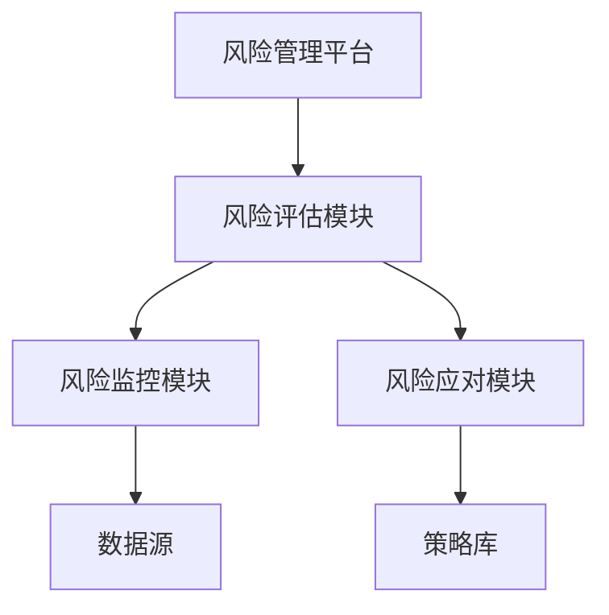
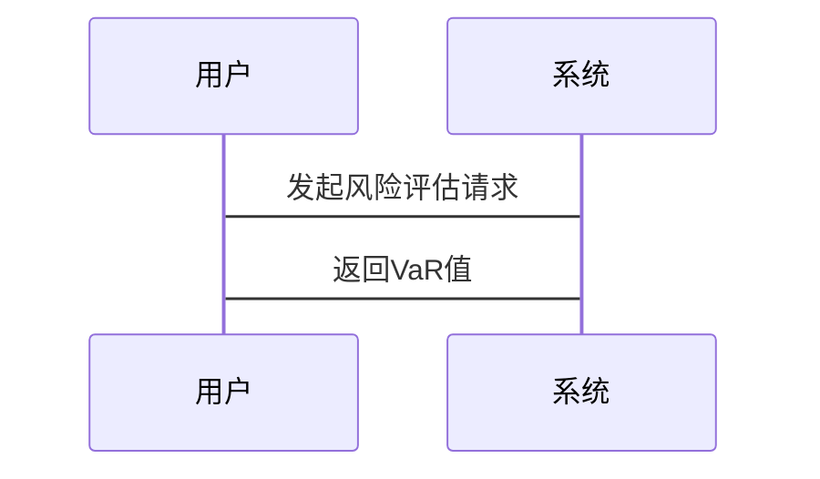

                 


```markdown
# 彼得林奇如何看待公司的风险管理文化演变

## 关键词：
风险管理，彼得林奇，VaR模型，CVaR模型，风险管理文化，投资策略

## 摘要：
本文深入探讨了风险管理在公司管理中的重要性，结合彼得林奇的投资理念，分析了风险管理文化如何随着企业的发展而演变。文章从风险管理的基本概念出发，详细介绍了VaR和CVaR等核心模型，并通过实际案例展示了这些模型在企业风险管理中的应用。此外，文章还分析了彼得林奇的风险管理策略，为企业构建风险管理文化提供了宝贵的见解和实践指导。

---

## 第一章：风险管理与投资决策的背景

### 1.1 风险管理的基本定义与重要性
风险管理是指通过识别、评估和应对各种潜在风险，以降低不利影响、抓住机会的过程。在企业运营中，风险管理是确保稳定性和可持续发展的关键。

#### 1.1.1 风险的来源与分类
- **市场风险**：如价格波动、利率变化等。
- **信用风险**：如客户违约风险。
- **操作风险**：如流程错误或员工失误。
- **流动性风险**：如无法及时变现资产的风险。

#### 1.1.2 风险管理的重要性
- 保障企业资产安全。
- 提高决策的科学性。
- 增强投资者信心。
- 促进企业长期发展。

### 1.2 彼得林奇与风险管理文化
彼得林奇是全球著名投资家，他的成功离不开对风险管理的高度重视。

#### 1.2.1 彼得林奇的背景
彼得林奇以长期投资和价值投资著称，尤其擅长管理风险。

#### 1.2.2 风险管理文化的重要性
彼得林奇认为，良好的风险管理文化是企业稳健发展的基石。

### 1.3 风险管理文化演变的背景
随着经济环境的变化，风险管理文化也在不断演变。

#### 1.3.1 经济环境的变化
全球化和金融化的加剧，使得风险管理更加复杂。

#### 1.3.2 企业治理的变革
现代企业治理强调风险管理的重要性。

---

## 第二章：风险管理的核心概念与模型

### 2.1 风险管理的核心概念
风险管理涉及多个方面，核心概念包括风险识别、评估、应对和监控。

#### 2.1.1 风险识别与评估
- **风险识别**：识别可能的风险来源。
- **风险评估**：量化风险的影响和可能性。

#### 2.1.2 风险应对策略
- **风险规避**：通过调整策略避免风险。
- **风险降低**：采取措施减少风险影响。
- **风险转移**：将风险转移到其他方。
- **风险接受**：在可接受范围内承担风险。

### 2.2 风险管理模型对比

#### 2.2.1 VaR模型
VaR（Value at Risk）是衡量市场风险的重要指标，计算在给定置信水平下的最大损失。

##### VaR模型计算步骤
1. **数据收集**：收集历史价格数据。
2. **选择分布**：假设资产价格服从某种分布。
3. **计算VaR**：使用公式：$$ VaR = \mu + z \cdot \sigma $$
   - $\mu$：均值
   - $z$：标准正态分布的分位数
   - $\sigma$：标准差

##### VaR模型的优缺点
- **优点**：简单易懂，计算速度快。
- **缺点**：假设资产价格服从正态分布，可能不准确。

#### 2.2.2 CVaR模型
CVaR（Conditional Value at Risk）是VaR的补充，衡量在VaR水平下的平均损失。

##### CVaR模型计算步骤
1. **计算VaR**：如前所述。
2. **计算CVaR**：在VaR水平下，计算平均损失。

##### CVaR模型的优缺点
- **优点**：考虑了尾部风险，更全面。
- **缺点**：计算复杂，需要大量数据。

### 2.3 风险管理模型的优缺点对比

| 模型 | 优点 | 缺点 |
|------|------|------|
| VaR | 简单，计算快 | 假设正态分布，尾部风险不足 |
| CVaR | 考虑尾部风险 | 计算复杂，需大量数据 |

---

## 第三章：彼得林奇的风险管理理论

### 3.1 彼得林奇的投资理念
彼得林奇强调长期投资和风险控制。

#### 3.1.1 长期投资的重要性
长期投资可以平滑短期波动，降低风险。

#### 3.1.2 风险控制在投资中的作用
彼得林奇认为，合理的风险控制是投资成功的关键。

#### 3.1.3 风险与收益的平衡
高收益意味着高风险，合理平衡两者至关重要。

### 3.2 彼得林奇的风险管理策略
彼得林奇采用多种策略来管理风险。

#### 3.2.1 风险分散化策略
通过投资多样化资产来分散风险。

#### 3.2.2 风险评估与监控
定期评估投资组合，及时调整。

#### 3.2.3 风险应对措施
制定明确的止损策略，避免重大损失。

### 3.3 彼得林奇风险管理文化的实践案例
彼得林奇通过实际案例展示了风险管理文化的重要性。

#### 3.3.1 风险管理文化在投资决策中的应用
例如，彼得林奇在投资某公司时，首先评估其风险管理能力。

#### 3.3.2 风险管理文化对企业治理的影响
良好的风险管理文化有助于提升企业治理水平。

#### 3.3.3 风险管理文化的长期效果
长期坚持风险管理文化，可以确保企业稳健发展。

---

## 第四章：风险管理的数学模型与算法

### 4.1 风险管理的数学模型
风险管理涉及多种数学模型，如VaR和CVaR。

#### 4.1.1 VaR模型的数学公式
$$ VaR = \mu + z \cdot \sigma $$

#### 4.1.2 CVaR模型的数学公式
$$ CVaR = \frac{1}{(1-\alpha)} \int_{\alpha}^{1} VaR \, d\alpha $$

### 4.2 风险管理算法的实现
使用Python代码实现VaR和CVaR模型。

#### 4.2.1 环境安装
安装必要的Python库，如`scipy`和`numpy`。

#### 4.2.2 核心代码实现
```python
import numpy as np
from scipy.stats import norm

def calculate VaR(data, confidence_level=0.95):
    mu = np.mean(data)
    sigma = np.std(data)
    z = norm.ppf(confidence_level)
    VaR = mu + z * sigma
    return VaR

data = [1, 2, 3, 4, 5]
VaR = calculate VaR(data)
print(VaR)
```

#### 4.2.3 代码解读与分析
- `calculate VaR`函数计算VaR值。
- 使用`norm.ppf`函数获取分位数。

### 4.3 算法优缺点分析
- **VaR模型**：简单但假设正态分布。
- **CVaR模型**：全面但计算复杂。

---

## 第五章：系统分析与架构设计

### 5.1 系统功能设计
设计一个风险管理系统的功能模块。

#### 5.1.1 风险评估模块
用于评估潜在风险。

#### 5.1.2 风险监控模块
实时监控风险指标。

#### 5.1.3 风险应对模块
制定应对策略。

### 5.2 系统架构设计
使用mermaid架构图展示系统架构。



### 5.3 系统接口设计
定义系统接口，如REST API。

#### 5.3.1 接口设计
- `/api/v1/risk/assess`：风险评估接口。

### 5.4 系统交互流程图
使用mermaid序列图展示交互流程。



---

## 第六章：项目实战

### 6.1 环境安装
安装Python和相关库。

### 6.2 核心代码实现
实现风险管理系统的核心功能。

#### 6.2.1 环境安装
```bash
pip install numpy scipy
```

#### 6.2.2 核心代码
```python
import numpy as np
from scipy.stats import norm

def calculate VaR(data, confidence_level=0.95):
    mu = np.mean(data)
    sigma = np.std(data)
    z = norm.ppf(confidence_level)
    VaR = mu + z * sigma
    return VaR

data = [1, 2, 3, 4, 5]
VaR = calculate VaR(data)
print(f"VaR值为：{VaR}")
```

#### 6.2.3 代码解读
解释代码的功能和实现细节。

### 6.3 案例分析
分析一个实际案例，如股票投资中的风险管理。

### 6.4 项目总结
总结项目的实施过程和收获。

---

## 第七章：最佳实践与小结

### 7.1 小结
总结风险管理的重要性及彼得林奇的见解。

### 7.2 注意事项
- 定期评估和调整风险管理策略。
- 结合实际业务需求选择合适的模型。

### 7.3 拓展阅读
推荐进一步阅读风险管理相关的书籍和文献。

---

## 结语
风险管理是企业稳健发展的基石，彼得林奇的成功证明了其重要性。通过本文的分析，读者可以更好地理解和应用风险管理理论，在实际工作中提升企业抗风险能力。
```

