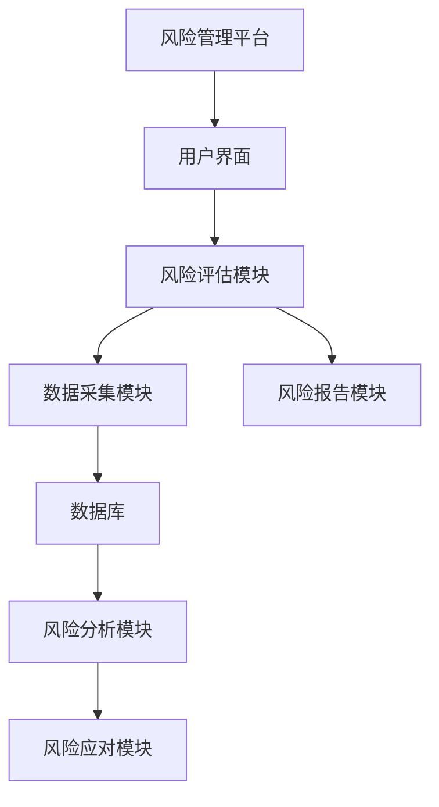
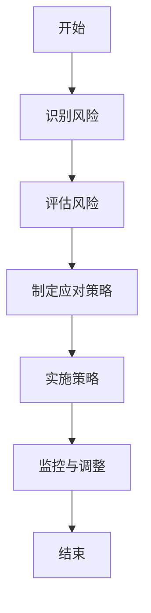

                 


# 彼得林奇如何看待公司的风险管理策略

---

## 关键词：
风险管理，彼得·林奇，投资策略，风险管理框架，风险评估，风险管理模型

---

## 摘要：
本文将深入探讨彼得·林奇的公司风险管理策略，结合他的投资理念和风险管理方法，分析如何在现代企业中实施有效的风险管理策略。通过详细讲解风险管理的核心概念、系统设计、算法原理和实战案例，本文旨在为读者提供一套完整且实用的风险管理解决方案。

---

## 目录大纲：

### 第一部分：风险管理的核心概念

#### 第1章：风险管理的定义与目标

##### 1.1 风险管理的定义
- 风险的定义
- 风险管理的定义
- 风险管理的目标

##### 1.2 风险管理的方法
- 定性分析法
- 定量分析法
- 综合分析法

#### 第2章：彼得·林奇的风险管理哲学

##### 2.1 投资理念的核心要素
- 长期投资的重要性
- 价值投资的内涵
- 风险控制的必要性

##### 2.2 风险管理的关键原则
- 分散投资策略
- 估值分析的重要性
- 风险与回报的平衡

### 第二部分：风险管理的系统架构

#### 第3章：风险管理系统的构建

##### 3.1 系统设计
- 需求分析
- 系统功能设计
- 系统架构设计

##### 3.2 系统架构图
- 组件划分
- 数据流设计
- 模块交互

#### 第4章：风险管理的实施步骤

##### 4.1 实施准备
- 确定风险管理目标
- 制定风险管理计划
- 组建风险管理团队

##### 4.2 风险识别与分析
- 风险识别方法
- 风险分析工具
- 风险优先级排序

### 第三部分：风险管理的算法与模型

#### 第5章：风险管理的数学模型

##### 5.1 风险价值（VaR）模型
- VaR的定义
- VaR的计算公式
- VaR的算法流程

##### 5.2 风险评估的数学公式
- 风险概率计算
- 风险影响评估
- 综合风险指数

#### 第6章：风险管理的算法实现

##### 6.1 算法流程图
- 风险识别流程
- 风险评估流程
- 风险应对流程

##### 6.2 算法实现代码
- 风险评估函数
- 风险优先级排序
- 风险报告生成

### 第四部分：风险管理的实战案例

#### 第7章：彼得·林奇的风险管理实践

##### 7.1 案例一：XYZ公司的风险管理策略
- 案例背景
- 风险识别与评估
- 风险应对措施

##### 7.2 案例二：ABC公司的风险管理实践
- 案例背景
- 风险管理过程
- 成果与经验总结

#### 第8章：风险管理的项目实战

##### 8.1 环境安装与配置
- 风险管理系统的安装
- 数据库的配置
- 系统的初始化

##### 8.2 系统核心实现
- 风险评估模块
- 风险报告生成
- 风险监控界面

### 第五部分：总结与展望

#### 第9章：总结与未来展望

##### 9.1 全文总结
- 核心概念回顾
- 系统设计总结
- 实战案例分析

##### 9.2 未来展望
- 风险管理技术的发展趋势
- 人工智能在风险管理中的应用
- 风险管理的未来挑战

---

## 正文部分：

### 第一部分：风险管理的核心概念

#### 第1章：风险管理的定义与目标

##### 1.1 风险管理的定义

风险管理是通过识别、评估和应对各种潜在风险，以降低其对组织目标的影响的过程。它旨在通过系统的分析和策略制定，帮助组织在复杂多变的环境中保持稳定和可持续发展。

##### 1.2 风险管理的方法

- **定性分析法**：通过定性分析，评估风险的性质和影响，如风险的严重性和可能性。
- **定量分析法**：通过数据和模型，计算风险的具体数值，如风险价值（VaR）。
- **综合分析法**：结合定性和定量分析，得出全面的风险评估结果。

#### 第2章：彼得·林奇的风险管理哲学

##### 2.1 投资理念的核心要素

彼得·林奇以其独特的投资理念闻名，他强调长期投资、价值投资和风险控制。他认为，成功的投资不仅在于选择优质的公司，还在于有效管理投资组合中的风险。

##### 2.2 风险管理的关键原则

- **分散投资策略**：通过将资金分配到不同的资产类别和行业中，降低单一投资的风险。
- **估值分析的重要性**：在投资前，对公司的财务状况和市场价值进行深入分析，确保投资的安全性。
- **风险与回报的平衡**：在追求高回报的同时，注重风险的控制，避免过度冒险。

### 第二部分：风险管理的系统架构

#### 第3章：风险管理系统的构建

##### 3.1 系统设计

- **需求分析**：明确风险管理的目标和范围，确定系统的功能需求。
- **系统功能设计**：设计风险管理系统的功能模块，如风险识别、评估和应对。
- **系统架构设计**：采用分层架构，确保系统的模块化和可扩展性。

##### 3.2 系统架构图

以下是一个典型的风险管理系统架构图：



#### 第4章：风险管理的实施步骤

##### 4.1 实施准备

- **确定风险管理目标**：明确风险管理的范围和目标。
- **制定风险管理计划**：制定详细的风险管理计划，包括时间表和资源分配。
- **组建风险管理团队**：组建专业的风险管理团队，确保实施过程的专业性和有效性。

##### 4.2 风险识别与分析

- **风险识别方法**：通过头脑风暴、问卷调查等方法，识别潜在风险。
- **风险分析工具**：使用风险矩阵、情景分析等工具，评估风险的影响和概率。
- **风险优先级排序**：根据风险的严重性和可能性，对风险进行优先级排序。

### 第三部分：风险管理的算法与模型

#### 第5章：风险管理的数学模型

##### 5.1 风险价值（VaR）模型

风险价值（VaR）是衡量投资组合风险的重要指标，其计算公式为：

$$ VaR = \mu + z \cdot \sigma $$

其中：
- $\mu$ 是投资组合的平均回报率
- $z$ 是标准正态分布的分位数
- $\sigma$ 是投资组合的收益率标准差

##### 5.2 风险评估的数学公式

风险概率计算：

$$ P(r) = \sum_{i=1}^{n} p_i \cdot I(r_i \geq r) $$

其中：
- $p_i$ 是风险 $i$ 的概率
- $I(r_i \geq r)$ 是指示函数，当 $r_i \geq r$ 时为1，否则为0

#### 第6章：风险管理的算法实现

##### 6.1 算法流程图

以下是一个风险管理算法的流程图：



##### 6.2 算法实现代码

以下是一个简单的风险评估函数：

```python
def risk_assessment(returns, confidence_level=0.95):
    import numpy as np
    mu = np.mean(returns)
    sigma = np.std(returns)
    z = norm.ppf(confidence_level)
    VaR = mu + z * sigma
    return VaR
```

### 第四部分：风险管理的实战案例

#### 第7章：彼得·林奇的风险管理实践

##### 7.1 案例一：XYZ公司的风险管理策略

XYZ公司是一家制造业公司，通过实施风险管理策略，成功降低了原材料价格波动带来的风险。他们通过建立风险评估模型，识别了主要风险，并制定了相应的应对措施。

##### 7.2 案例二：ABC公司的风险管理实践

ABC公司是一家科技公司，通过引入风险管理系统，显著提高了风险应对能力。他们通过实时监控和数据分析，及时发现并应对潜在风险。

#### 第8章：风险管理的项目实战

##### 8.1 环境安装与配置

风险管理系统的安装和配置是实施风险管理的重要步骤，包括硬件和软件的安装、数据库的配置等。

##### 8.2 系统核心实现

风险管理系统的实现包括风险评估模块、风险报告模块和风险监控模块，通过这些模块的协同工作，实现全面的风险管理。

### 第五部分：总结与展望

#### 第9章：总结与未来展望

##### 9.1 全文总结

本文深入探讨了彼得·林奇的公司风险管理策略，结合他的投资理念和风险管理方法，分析了如何在现代企业中实施有效的风险管理策略。

##### 9.2 未来展望

随着信息技术的发展和人工智能的广泛应用，风险管理将更加智能化和自动化。未来，风险管理技术将更加成熟，为企业提供更加精准和高效的解决方案。

---

以上是《彼得林奇如何看待公司的风险管理策略》的完整目录大纲和部分内容。通过系统的分析和实际案例的剖析，读者可以全面了解风险管理的核心概念、系统设计和实战应用。希望本文能为读者在风险管理领域提供有价值的参考和指导。

