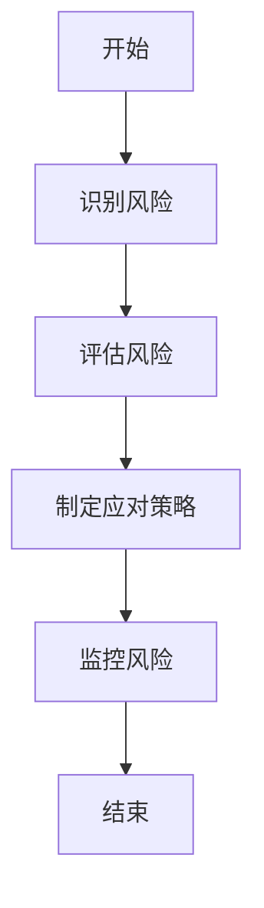
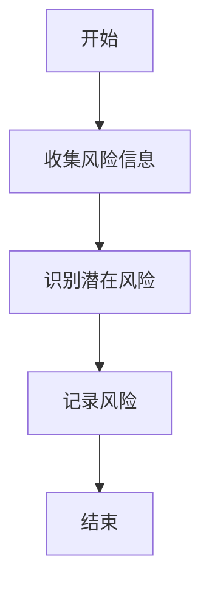
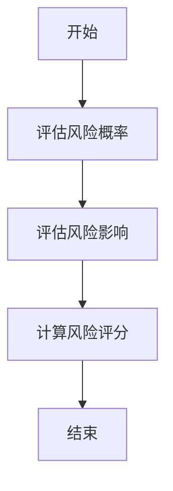
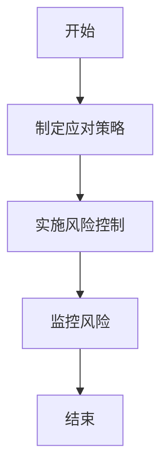
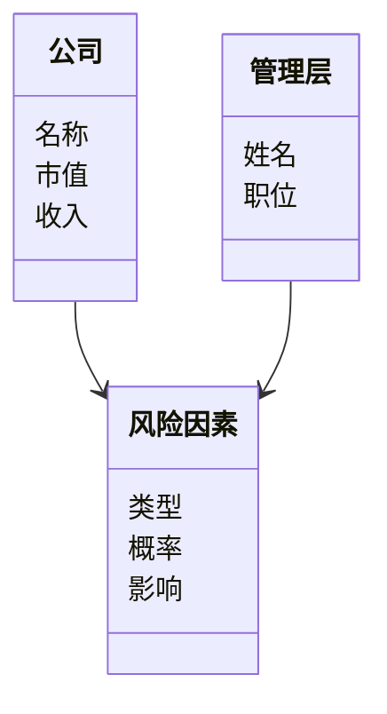
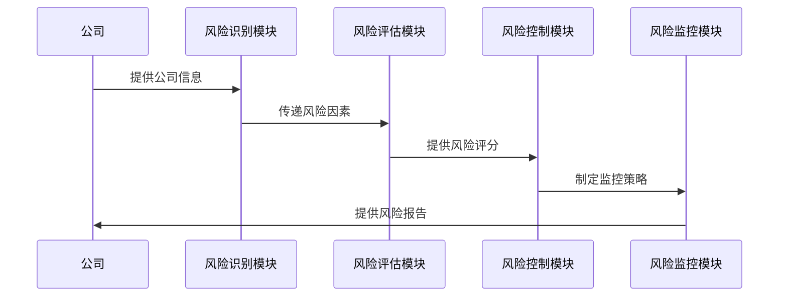

                 


# 彼得林奇如何看待公司的风险管理能力

## 关键词：风险管理，彼得林奇，公司价值，投资理念，风险评估

## 摘要：  
本文从彼得林奇的投资理念出发，深入分析他如何看待公司的风险管理能力。通过背景介绍、核心概念、算法原理、系统架构设计和项目实战等部分，详细阐述风险管理的重要性、核心原理以及如何通过技术手段提升公司的风险管理能力。本文结合理论与实践，为读者提供一个全面的理解风险管理的视角。

---

## 第一章：风险管理的核心概念

### 1.1 风险管理的定义与重要性

#### 1.1.1 风险管理的定义  
风险管理是指识别、评估和应对可能影响公司目标的不确定性。它是公司治理的重要组成部分，旨在通过降低风险发生的概率或减少风险的影响，确保公司稳健发展。

#### 1.1.2 风险管理的重要性  
风险管理对于公司价值至关重要。它不仅能减少潜在损失，还能增强投资者信心，提升公司整体竞争力。在彼得林奇看来，一个公司是否能够长期稳健发展，很大程度上取决于其风险管理能力。

#### 1.1.3 风险管理与公司价值的关系  
风险管理能力直接影响公司的财务健康和市场表现。有效的风险管理能够降低公司因突发事件导致的损失，同时优化资源配置，提升公司整体价值。

---

### 1.2 彼得林奇的投资理念

#### 1.2.1 彼得林奇的背景介绍  
彼得·林奇是美国著名的投资专家，以其在富达投资集团管理麦哲伦基金的经历而闻名。他以深入研究公司基本面和长期投资著称，尤其关注公司的风险管理能力。

#### 1.2.2 彼得林奇的投资哲学  
彼得林奇认为，投资不仅是对市场的理解，更是对公司管理能力的判断。他强调，一个公司能否长期稳定发展，取决于其是否能够有效识别和应对潜在风险。

#### 1.2.3 彼得林奇如何看待公司的风险管理能力  
在彼得林奇看来，风险管理能力是衡量公司管理团队能力的重要标准。他通过分析公司的财务报表、管理团队的决策能力和市场应对策略，评估公司的风险管理能力。

---

### 1.3 风险管理的核心要素

#### 1.3.1 风险的来源与分类  
风险的来源多种多样，包括市场风险、信用风险、操作风险和流动性风险等。不同类型的风崄需要采取不同的管理策略。

#### 1.3.2 风险评估的关键指标  
常见的风险评估指标包括波动率、VaR（在险价值）、信用评级等。这些指标能够帮助公司量化风险，制定有效的风险管理策略。

#### 1.3.3 风险管理的边界与外延  
风险管理的边界在于公司自身的控制范围，而外延则包括与公司相关的外部环境和市场因素。彼得林奇强调，公司需要在可控范围内优化风险管理，同时关注外部环境的变化。

---

## 第二章：风险管理的核心概念与联系

### 2.1 风险管理的核心原理

#### 2.1.1 风险管理的基本原理  
风险管理的基本原理包括风险识别、风险评估、风险应对和风险监控。这些步骤相互关联，构成了完整的风险管理流程。

#### 2.1.2 风险管理的数学模型  
风险管理可以通过概率论和统计学方法进行建模。例如，可以使用蒙特卡罗模拟来评估不同风险场景下的公司表现。

#### 2.1.3 风险管理的算法原理  
风险管理算法包括风险评分模型、决策树算法和贝叶斯网络等。这些算法能够帮助公司量化风险，制定科学的决策。

---

### 2.2 风险管理的核心概念对比

#### 2.2.1 定量分析与定性分析的对比  
定量分析基于数据和模型，而定性分析则依赖于经验和判断。两者各有优缺点，通常需要结合使用。

#### 2.2.2 风险评估与风险控制的对比  
风险评估旨在识别和量化风险，而风险控制则是通过制定策略来应对风险。两者相辅相成，共同构成了风险管理的完整流程。

#### 2.2.3 风险管理与公司治理的对比  
风险管理是公司治理的重要组成部分，但两者关注的范围有所不同。公司治理更广泛，而风险管理则是公司治理的具体实践之一。

---

### 2.3 风险管理的实体关系图

#### 2.3.1 ER实体关系图架构  
```mermaid
er
    entity 公司 {
        key 名称
        属性 市值, 收入, 利润
    }
    entity 风险 {
        key 类型
        属性 概率, 影响
    }
    entity 管理层 {
        key 姓名
        属性 职位, 经验
    }
    公司 -[拥有]-> 风险
    管理层 -[管理]-> 风险
```

#### 2.3.2 风险管理的流程图  


#### 2.3.3 风险管理的系统架构图  


---

## 第三章：风险管理的算法原理

### 3.1 风险评估的数学模型

#### 3.1.1 风险评分的计算公式  
$$ \text{风险评分} = \sum_{i=1}^{n} w_i \times r_i $$  
其中，$w_i$ 是第 $i$ 个风险因素的权重，$r_i$ 是第 $i$ 个风险因素的评分。

#### 3.1.2 风险概率的计算公式  
$$ P(r) = \sum_{i=1}^{m} P(r|s_i) \times P(s_i) $$  
其中，$P(r|s_i)$ 是在第 $i$ 种情景下的风险概率，$P(s_i)$ 是第 $i$ 种情景发生的概率。

#### 3.1.3 风险影响的计算公式  
$$ I(r) = \sum_{j=1}^{k} P(r_j) \times L(r_j) $$  
其中，$P(r_j)$ 是第 $j$ 个风险事件发生的概率，$L(r_j)$ 是第 $j$ 个风险事件的影响损失。

---

### 3.2 风险管理的算法流程

#### 3.2.1 风险识别的算法流程  


#### 3.2.2 风险评估的算法流程  


#### 3.2.3 风险控制的算法流程  


---

### 3.3 风险管理的Python实现

#### 3.3.1 风险评估的Python代码实现  
```python
import numpy as np
import pandas as pd

# 示例数据：公司A和公司B的风险因素
companies = ['A', 'B']
risks = ['市场风险', '信用风险', '操作风险']
weights = [0.4, 0.3, 0.3]

# 计算风险评分
def calculate_risk_score(company, risks, weights):
    risk_scores = pd.DataFrame({
        '风险因素': risks,
        '权重': weights
    })
    return risk_scores['权重'].sum()

for company in companies:
    score = calculate_risk_score(company, risks, weights)
    print(f"{company}的风险评分为：{score}")
```

#### 3.3.2 风险管理的算法优化  
通过引入机器学习算法，如随机森林或XGBoost，可以进一步优化风险评估的准确性。

#### 3.3.3 风险监控的代码实现  
```python
import pandas as pd
import matplotlib.pyplot as plt

# 示例数据：风险监控数据
data = {'时间': ['2023-01', '2023-02', '2023-03', '2023-04'],
        '风险评分': [75, 80, 78, 85]}
df = pd.DataFrame(data)

# 绘制风险评分趋势图
plt.plot(df['时间'], df['风险评分'])
plt.title('风险评分趋势图')
plt.xlabel('时间')
plt.ylabel('风险评分')
plt.show()
```

---

## 第四章：系统架构设计与项目实战

### 4.1 系统架构设计

#### 4.1.1 项目介绍  
本项目旨在通过构建一个风险管理信息系统，帮助公司实时监控和评估风险，制定有效的应对策略。

#### 4.1.2 系统功能设计  


#### 4.1.3 系统架构设计  


#### 4.1.4 系统交互设计  


---

### 4.2 项目实战

#### 4.2.1 环境安装  
安装Python和必要的库，如numpy、pandas、matplotlib等。

#### 4.2.2 核心代码实现  
```python
import numpy as np
import pandas as pd

# 示例数据：公司风险数据
data = {'公司': ['A', 'B', 'C'],
        '市场风险': [0.2, 0.3, 0.1],
        '信用风险': [0.1, 0.2, 0.4],
        '操作风险': [0.3, 0.1, 0.2]}
df = pd.DataFrame(data)

# 计算综合风险评分
def calculate_total_risk(company_data):
    return company_data.mean()

for company in df['公司']:
    risk_score = calculate_total_risk(df[company])
    print(f"{company}的综合风险评分为：{risk_score}")
```

#### 4.2.3 案例分析  
以某公司为例，分析其风险因素，计算风险评分，并制定应对策略。

#### 4.2.4 项目小结  
通过项目实战，我们可以看到风险管理系统的实际应用价值，以及如何通过技术手段提升公司的风险管理能力。

---

## 第五章：总结与展望

### 5.1 总结  
本文从彼得林奇的投资理念出发，深入分析了公司风险管理能力的重要性，并通过理论与实践相结合的方式，展示了如何通过技术手段提升公司的风险管理能力。

### 5.2 最佳实践 tips  
- 定期评估公司风险，及时调整风险管理策略。
- 引入先进的技术工具，如机器学习和大数据分析，优化风险管理流程。
- 加强公司管理层的风险管理意识，提升整体风险管理能力。

### 5.3 小结  
风险管理是公司稳健发展的基石。通过彼得林奇的视角，我们可以更好地理解风险管理的重要性，并通过技术手段实现更高效的管理。

### 5.4 注意事项  
- 风险管理需要结合公司实际情况，避免一刀切。
- 风险管理是一个动态过程，需要持续关注和优化。
- 风险管理需要团队合作，各部门应协同工作。

### 5.5 拓展阅读  
- 彼得林奇的《投资之道》
- 风险管理的经典著作《风险管理与决策》
- 大数据分析与风险管理的相关文献

---

通过本文的分析，我们可以看到，风险管理不仅是公司治理的重要部分，也是公司长期稳定发展的关键。彼得林奇的投资理念为我们提供了独特的视角，结合技术手段，我们可以更有效地提升公司的风险管理能力。希望本文能为读者提供有价值的 insights，帮助他们在实际工作中更好地应对风险挑战。

