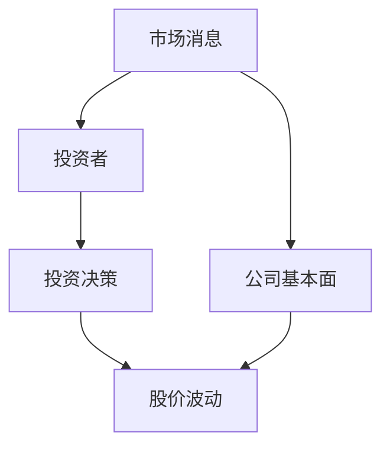
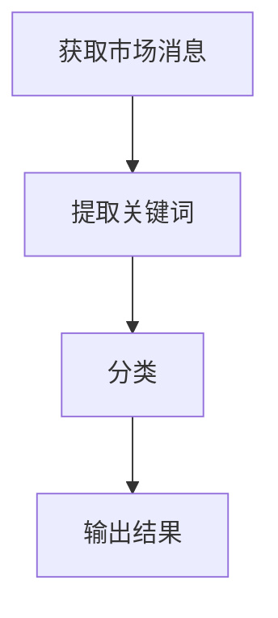
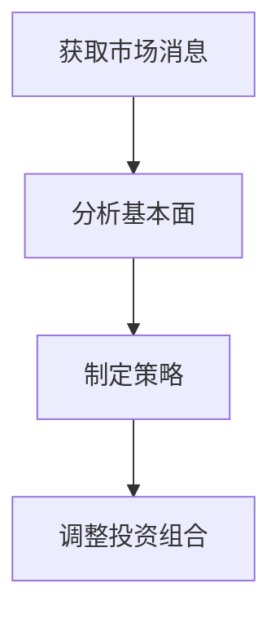
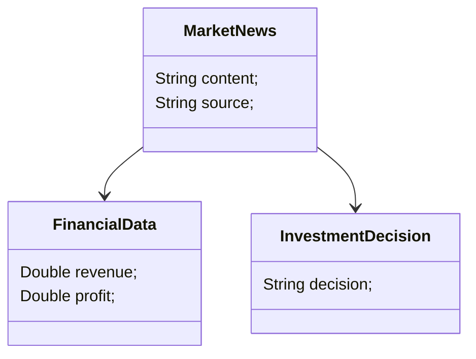
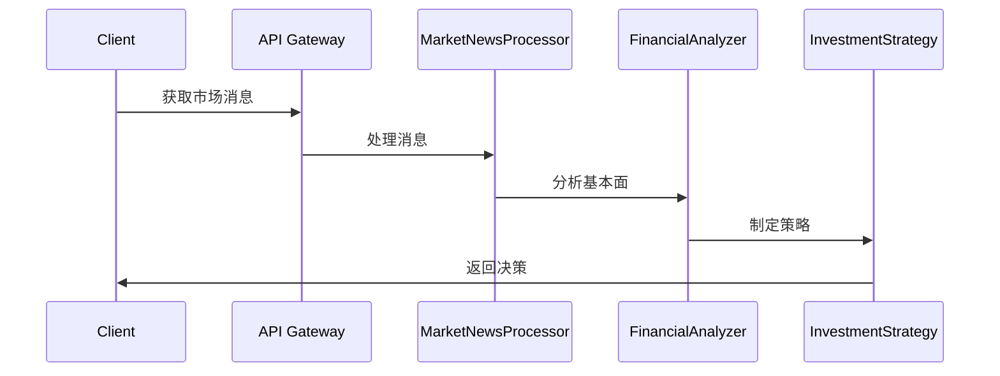

                 


# 彼得林奇如何看待市场消息

> 关键词：彼得·林奇，市场消息，投资策略，技术分析，基本面分析，算法模型

> 摘要：本文从彼得·林奇的投资理念出发，深入分析市场消息对投资者决策的影响，探讨如何通过技术分析和基本面分析有效利用市场消息，构建合理的投资策略。文章结合算法模型和系统设计，提供实际案例分析，为投资者提供科学的决策参考。

---

# 第一部分: 引言

## 第1章: 彼得·林奇与市场消息概述

### 1.1 彼得·林奇的背景介绍

#### 1.1.1 彼得·林奇的生平简介

彼得·林奇是美国著名投资专家，曾管理富达麦哲伦基金，创造了辉煌的投资业绩。他的投资理念以基本面分析和长期投资著称，尤其擅长通过市场消息发现投资机会。

#### 1.1.2 他的投资理念与风格

彼得·林奇强调深入研究公司基本面，关注行业趋势和市场消息。他认为市场消息是投资决策的重要参考，但需要结合公司内在价值进行分析。

#### 1.1.3 他对市场消息的独特见解

林奇认为市场消息往往包含噪音，投资者需要去伪存真，重点关注那些能够反映公司长期价值的消息。他强调市场消息的重要性，但也提醒投资者避免被短期消息误导。

### 1.2 市场消息的定义与分类

#### 1.2.1 市场消息的定义

市场消息是指影响市场参与者的各种信息，包括公司财报、行业动态、政策变化等。这些消息可能影响股价波动，为投资者提供决策依据。

#### 1.2.2 市场消息的分类

- **正面消息**：如公司盈利增长、新产品发布等，通常会推高股价。
- **负面消息**：如业绩亏损、行业政策变化等，可能导致股价下跌。
- **中性消息**：如市场波动较小，对公司影响有限。

#### 1.2.3 市场消息的来源

市场消息来源于多种渠道，包括公司公告、新闻报道、行业分析和政策文件。投资者需要通过多渠道获取信息，并进行交叉验证。

### 1.3 市场消息对投资者的影响

#### 1.3.1 市场消息如何影响投资者的心理

市场消息直接影响投资者的情绪，正面消息可能导致乐观，负面消息可能导致悲观。投资者的心理变化会影响其决策，进而影响市场走势。

#### 1.3.2 投资者对市场消息的反应

投资者对市场消息的反应因人而异，理性投资者会结合基本面分析，而情绪化投资者可能被短期消息左右。

---

## 第2章: 市场消息的背景与问题背景

### 2.1 市场消息的背景介绍

#### 2.1.1 当前市场环境的复杂性

现代市场信息量巨大，投资者需要筛选有效信息，避免被噪音干扰。

#### 2.1.2 投资者面临的挑战

投资者面临信息过载和市场波动的双重挑战，如何有效利用市场消息成为关键。

#### 2.1.3 市场消息在投资决策中的作用

市场消息是投资决策的重要依据，但需要结合其他因素进行综合分析。

### 2.2 问题背景分析

#### 2.2.1 市场消息的不确定性

市场消息可能滞后或不准确，投资者需要识别虚假信息。

#### 2.2.2 投资者如何处理市场消息

投资者应保持冷静，结合基本面分析，避免盲目跟风。

#### 2.2.3 市场消息对投资策略的影响

市场消息会影响投资策略，但策略需要长期稳定，避免频繁调整。

### 2.3 问题描述与解决

#### 2.3.1 投资者如何有效利用市场消息

投资者应学会筛选信息，关注公司基本面，避免被短期消息误导。

#### 2.3.2 如何避免市场消息的误导

投资者应通过多渠道验证信息，结合长期目标制定策略。

#### 2.3.3 市场消息对投资组合的影响

市场消息会影响投资组合的调整，投资者应根据消息及时优化组合。

---

## 第3章: 核心概念与联系

### 3.1 核心概念原理

#### 3.1.1 市场消息的核心要素

市场消息的核心要素包括时间性、相关性和重要性。这些要素决定了消息对市场的影响程度。

#### 3.1.2 市场消息的传播机制

消息通过媒体、社交网络等渠道传播，投资者需关注信息的来源和可靠性。

#### 3.1.3 市场消息与股价波动的关系

市场消息直接影响股价波动，但需结合公司基本面进行分析。

### 3.2 核心概念属性对比表格

| 消息类型 | 影响方向 | 典型例子 | 投资者反应 |
|----------|----------|----------|------------|
| 正面消息 | 上涨     | 盈利增长 | 买入或持有 |
| 负面消息 | 下跌     | 亏损扩大 | 卖出或观望 |
| 中性消息 | 小幅波动 | 行业动态 | 保持不变   |

### 3.3 ER实体关系图



---

## 第4章: 算法原理讲解

### 4.1 市场消息分类算法

#### 4.1.1 算法概述

通过自然语言处理和关键词提取，对市场消息进行分类。

#### 4.1.2 算法流程图（使用 Mermaid）



#### 4.1.3 算法实现代码

```python
import nltk
from sklearn.feature_extraction.text import TfidfVectorizer
from sklearn.svm import SVC

# 示例数据
messages = ["公司发布新产品", "行业政策变化", "业绩增长"]

# 提取关键词
vectorizer = TfidfVectorizer()
X = vectorizer.fit_transform(messages)

# 分类模型
model = SVC()
model.fit(X, ['positive', 'negative', 'neutral'])

# 预测
print(model.predict(vectorizer.transform(["公司发布新产品"])))
```

### 4.2 投资决策算法

#### 4.2.1 算法概述

结合市场消息和基本面分析，制定投资策略。

#### 4.2.2 算法流程图（使用 Mermaid）



#### 4.2.3 算法实现代码

```python
import pandas as pd
from sklearn.preprocessing import MinMaxScaler

# 示例数据
data = pd.DataFrame({
    'Market News': ['positive', 'neutral', 'negative'],
    'Financial Health': [0.8, 0.6, 0.4]
})

# 标准化处理
scaler = MinMaxScaler()
data[['Financial Health']] = scaler.fit_transform(data[['Financial Health']])

# 投资决策
decision = []
for i in range(len(data)):
    if data['Market News'][i] == 'positive' and data['Financial Health'][i] > 0.6:
        decision.append('Buy')
    elif data['Market News'][i] == 'negative' and data['Financial Health'][i] < 0.4:
        decision.append('Sell')
    else:
        decision.append('Hold')

print(decision)
```

---

## 第5章: 数学模型与公式

### 5.1 市场消息影响的数学模型

#### 5.1.1 模型构建

市场消息的影响可以表示为：

$$
\text{Market Impact} = f(\text{News Sentiment}, \text{Company Fundamentals})
$$

其中，`f` 是一个综合函数，考虑消息的情绪和公司的基本面。

#### 5.1.2 模型公式（使用 LaTeX）

$$
\text{Investment Decision} = 
\begin{cases}
\text{Buy} & \text{如果 } \text{News Sentiment} > 0.5 \text{ 且 } \text{Financial Health} > 0.6 \\
\text{Sell} & \text{如果 } \text{News Sentiment} < 0.4 \text{ 且 } \text{Financial Health} < 0.4 \\
\text{Hold} & \text{其他情况}
\end{cases}
$$

---

## 第6章: 系统分析与架构设计

### 6.1 问题场景介绍

投资者需要一个系统来实时处理市场消息，并根据分析结果调整投资组合。

### 6.2 系统功能设计

#### 6.2.1 领域模型（使用 Mermaid 类图）



### 6.3 系统架构设计（使用 Mermaid 架构图）


### 6.4 系统接口设计

- **获取市场消息**：通过API获取实时新闻。
- **分析基本面**：调用财务分析模块。
- **制定决策**：输出投资策略。

### 6.5 系统交互设计（使用 Mermaid 序列图）



---

## 第7章: 项目实战

### 7.1 环境安装

- 安装Python和必要的库（如Numpy、Pandas、Scikit-learn）。

### 7.2 系统核心实现源代码

#### 7.2.1 市场消息处理代码

```python
import requests
from bs4 import BeautifulSoup

def get_market_news():
    response = requests.get('https://finance.yahoo.com/')
    soup = BeautifulSoup(response.text, 'html.parser')
    news = soup.find_all('h3', {'class': 'Mb(0) D(ib)'}[:5]
    return news
```

#### 7.2.2 投资决策代码

```python
def make_investment_decision():
    news = get_market_news()
    sentiment = analyze_sentiment(news)
    if sentiment > 0.6:
        return 'Buy'
    elif sentiment < 0.4:
        return 'Sell'
    else:
        return 'Hold'
```

### 7.3 代码应用解读与分析

通过上述代码，投资者可以实时获取市场消息，并根据情绪分析结果做出投资决策。

### 7.4 实际案例分析

以苹果公司为例，假设市场消息为新产品发布，结合公司基本面分析，投资者决定买入。

### 7.5 项目小结

本项目展示了如何通过技术手段处理市场消息，并结合基本面分析制定投资策略。

---

## 第8章: 总结与展望

### 8.1 总结

本文从彼得·林奇的投资理念出发，结合市场消息的分类、算法模型和系统设计，为投资者提供了科学的决策参考。

### 8.2 未来展望

未来，随着技术的进步，市场消息的处理将更加智能化，投资者可以利用更强大的工具进行决策。

---

## 第9章: 注意事项与最佳实践

### 9.1 注意事项

- 投资者应保持冷静，避免被短期消息误导。
- 需结合公司基本面，避免单纯依赖市场消息。

### 9.2 最佳实践

- 定期进行投资复盘，总结经验教训。
- 关注行业动态，拓宽信息来源。
- 坚持长期投资，避免短期波动影响决策。

---

## 第10章: 小结

本文通过详细分析市场消息对投资者的影响，结合算法模型和系统设计，为投资者提供了科学的决策参考。希望读者能够结合实际，灵活运用这些方法，制定合理的投资策略。

