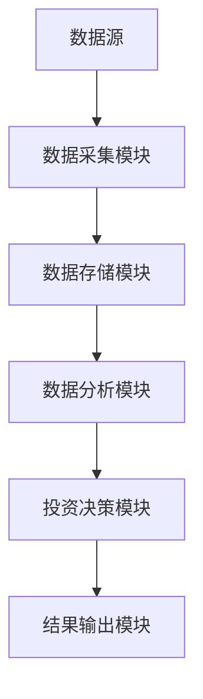

                 


# 彼得林奇如何看待科技股

> 关键词：彼得林奇，科技股，投资策略，量化分析，系统设计，Python代码

> 摘要：本文深入探讨了彼得林奇的投资理念，特别是他对科技股的独特见解。通过分析他的选股标准、成长股投资策略以及科技股的特殊考量，结合数学模型和算法原理，展示如何将这些理念应用于实际投资分析中。文章还介绍了科技股投资系统的构建过程，包括数据采集、分析模块的设计，以及使用Python进行实战分析的案例。

---

# 第一部分: 彼得林奇的投资理念与科技股分析基础

## 第1章: 彼得林奇的投资哲学

### 1.1 彼得林奇的投资理念概述

#### 1.1.1 投资的定义与核心要素
投资是一种通过配置资源（如资金、时间、精力）以获得未来收益的活动。彼得林奇认为，成功的投资需要对公司的基本面有深刻的理解，并长期关注企业的成长潜力。投资的核心要素包括：
- **价值评估**：确定企业的内在价值。
- **风险控制**：识别并规避高风险投资。
- **长期视角**：关注企业的长期盈利能力。

#### 1.1.2 彼得林奇的成长股投资策略
彼得林奇以投资成长股闻名，他倾向于选择那些具有强大竞争优势、稳定增长潜力和合理估值的企业。他的策略强调：
- **公司基本面**：关注收入、利润和现金流的增长。
- **竞争优势**：寻找具有独特商业模式或技术优势的企业。
- **管理层能力**：信任能够持续创造价值的管理层。

#### 1.1.3 科技股在投资组合中的地位
科技股是彼得林奇投资组合中的重要组成部分。科技行业的高增长潜力使其成为长期投资者的首选。然而，科技股的波动性较大，投资时需要特别注意行业趋势和技术创新。

---

### 1.2 科技股的基本定义与特点

#### 1.2.1 科技股的定义
科技股是指那些主要业务涉及科技研发、生产和销售的公司股票。这类公司通常处于高科技行业，如软件开发、人工智能、通信技术、半导体等。

#### 1.2.2 科技股的核心特征对比
与传统行业相比，科技股具有以下特点：
- **高增长潜力**：科技行业的创新能力强，市场扩展速度快。
- **高波动性**：科技股价格波动较大，受市场情绪和行业趋势影响显著。
- **高风险**：技术更新换代快，企业面临较大的竞争压力。
- **高回报**：成功的科技股投资往往能带来超额回报。

#### 1.2.3 科技股投资的潜在风险与回报
科技股的投资回报通常高于传统行业，但同时也伴随着更高的风险。投资者需要关注行业周期、技术创新和市场变化，以规避潜在风险。

---

## 第2章: 彼得林奇的选股标准

### 2.1 彼得林奇选股的核心要素

#### 2.1.1 公司基本面分析
彼得林奇非常注重公司基本面，包括：
- **收入与利润**：关注收入和利润的持续增长。
- **现金流**：健康的现金流是企业财务健康的重要指标。
- **资产负债表**：关注企业的债务水平和资产结构。

#### 2.1.2 行业地位与竞争优势
彼得林奇倾向于选择那些在行业内具有竞争优势的公司。他特别关注企业的市场占有率、技术创新能力和成本优势。

#### 2.1.3 财务健康状况评估
财务健康是投资的重要考量因素。彼得林奇关注企业的利润率、负债率和现金流状况。

---

### 2.2 科技股的特殊考量

#### 2.2.1 技术创新与产品生命周期
科技行业的特点是技术更新快，产品生命周期短。彼得林奇认为，投资者需要关注企业的创新能力以及其产品在市场上的竞争力。

#### 2.2.2 管理团队与企业治理
管理团队的能力和企业治理结构对科技股的投资价值至关重要。彼得林奇倾向于选择那些由优秀管理层领导的企业。

#### 2.2.3 市场需求与增长潜力
彼得林奇认为，市场需求是企业增长的核心驱动力。他特别关注科技行业的需求增长潜力，尤其是在人工智能、大数据和云计算等领域。

---

## 第3章: 科技股投资的数学模型与算法原理

### 3.1 科技股投资的量化分析方法

#### 3.1.1 市盈率与市净率的计算
市盈率（P/E）= 股价 / 每股净利润  
市净率（P/B）= 股价 / 每股净资产  

#### 3.1.2 股息率与股息增长模型
股息率 = 每股股息 / 股价  
股息增长模型：假设股息年增长率为 \( g \)，则股票的内在价值为：
$$ V = \frac{D_1}{r - g} $$

#### 3.1.3 内在价值的估算公式
内在价值的估算通常基于 discounted cash flow (DCF) 模型：
$$ V = \sum_{t=1}^{n} \frac{CF_t}{(1 + r)^t} + \frac{TV}{(1 + r)^n} $$

### 3.2 算法原理的数学模型

#### 3.2.1 市场预期回报率的计算
市场预期回报率 \( r \) 可以通过无风险利率和风险溢价来估算：
$$ r = r_f + \beta \times (r_m - r_f) $$
其中，\( \beta \) 是股票的贝塔系数，\( r_f \) 是无风险利率，\( r_m \) 是市场预期回报率。

#### 3.2.2 股票价值的多因子模型
多因子模型通过多个因子（如市值、价值、动量等）来解释股票的超额收益。常用模型包括 Fama-French 三因子模型：
$$ R_i = R_f + \beta_1 \times Size + \beta_2 \times Value + \beta_3 \times Momentum + \epsilon $$

#### 3.2.3 风险调整后的收益评估
风险调整后的收益可以通过夏普比率来衡量：
$$ 夏普比率 = \frac{E[R_i - R_f]}{\sigma_i} $$

---

## 第4章: 系统分析与架构设计

### 4.1 科技股投资系统的功能设计

#### 4.1.1 数据采集模块
数据采集模块负责从多个数据源（如 Bloomberg、Yahoo Finance）获取股票数据。

#### 4.1.2 数据分析模块
数据分析模块包括：
- **数据清洗**：处理缺失值和异常值。
- **特征提取**：提取关键指标（如市盈率、市净率、股息率等）。
- **模型训练**：基于机器学习算法（如随机森林、支持向量机）进行预测。

#### 4.1.3 投资决策模块
投资决策模块根据分析结果生成投资建议，如买入、卖出或持有。

---

### 4.2 系统架构的Mermaid图



---

## 第5章: 项目实战

### 5.1 环境安装
安装必要的Python库：
```bash
pip install pandas numpy scikit-learn matplotlib
```

### 5.2 核心实现源代码

```python
import pandas as pd
import numpy as np
from sklearn.ensemble import RandomForestRegressor
from sklearn.metrics import mean_squared_error

# 数据加载
data = pd.read_csv('tech_stocks.csv')

# 数据预处理
X = data[['市盈率', '市净率', '股息率']]
y = data['未来回报率']

# 模型训练
model = RandomForestRegressor(n_estimators=100)
model.fit(X, y)

# 模型预测
y_pred = model.predict(X)
print('均方误差:', mean_squared_error(y, y_pred))
```

### 5.3 代码应用解读与分析
上述代码展示了如何使用随机森林算法对科技股的未来回报率进行预测。模型基于市盈率、市净率和股息率等特征进行训练，并输出预测结果。

---

## 第6章: 最佳实践与小结

### 6.1 投资策略总结
- **长期视角**：关注企业的长期增长潜力。
- **风险管理**：分散投资以降低风险。
- **持续学习**：保持对科技行业的关注。

### 6.2 注意事项
- **数据质量**：确保数据的准确性和完整性。
- **模型优化**：根据市场变化调整模型参数。
- **市场监控**：定期监控市场变化，及时调整投资策略。

### 6.3 拓展阅读
- 《彼得林奇的成功投资》
- 《量化投资：数据科学在金融中的应用》

---

通过以上分析，我们可以看到彼得林奇对科技股的独特见解，以及如何将这些理念应用于实际投资分析中。希望这篇文章能为投资者提供有价值的参考。

