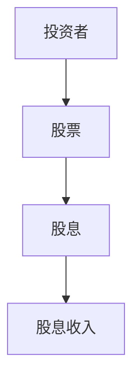
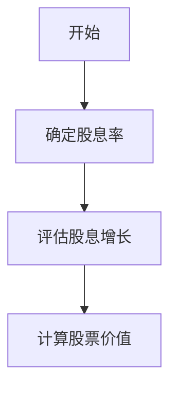
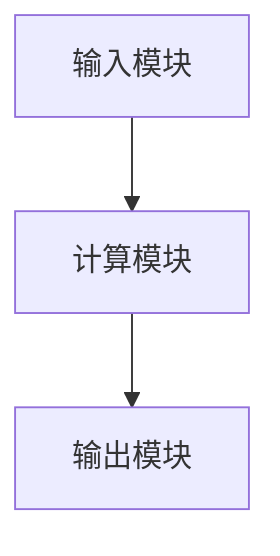

                 


# 彼得·林奇如何看待股息投资

> 关键词：股息投资、彼得·林奇、股息率、股息增长模型、投资策略、财务分析

> 摘要：本文从彼得·林奇的股息投资理念出发，详细分析股息投资的核心概念、算法原理、系统架构以及实际应用，帮助读者深入理解如何通过股息投资实现稳健收益。

---

## 第一部分：股息投资的背景与基础

### 第1章：股息投资的基本概念

#### 1.1 股息投资的定义与特点
- **股息的定义**：股息是公司分配给股东的利润部分，通常以现金或股票形式发放。
- **股息的类型**：
  1. 普通股股息
  2. 优先股股息
  3. 特殊股息（如资产出售收益分配）
- **股息投资的特点**：
  1. 稳定性：股息收入相对固定，风险较低。
  2. 长期性：股息投资注重长期价值积累。
  3. 防御性：在市场波动中，高股息股票往往更具防御性。

#### 1.2 股息投资的历史与发展
- 股息投资的起源可以追溯到古代股份公司制度的建立。
- 19世纪末至20世纪初，股息投资逐渐成为一种主流的投资方式。
- 当前，股息投资在全球范围内广泛应用于机构和个人投资者的资产配置中。

#### 1.3 彼得·林奇与股息投资
- 彼得·林奇是美国著名的基金经理，以其在股息投资领域的卓越表现闻名。
- 他的股息投资理念强调长期稳健的收益，而非短期暴利。
- 林奇的投资风格以价值投资为核心，注重公司基本面分析。

---

### 第2章：股息投资的核心概念与联系

#### 2.1 股息投资的核心概念
- **股息率的计算公式**：
  $$股息率 = \frac{每股股息}{股价} \times 100\%$$
  例如，某股票股息为1元，股价为20元，则股息率为5%。

- **股息增长模型**：
  股息增长模型是基于股息折现模型（DDM）的扩展。
  $$V = \frac{D_1}{r - g}$$
  其中，$D_1$ 是第一年的预期股息，$r$ 是折现率，$g$ 是股息增长率。

#### 2.2 股息投资与其它投资策略的对比
- **股息投资与成长型投资的区别**：
  | 方面   | 股息投资                | 成长型投资              |
  |--------|-------------------------|--------------------------|
  | 目标   | 稳定股息收入             | 高成长性                |
  | 风险   | 较低                     | 较高                     |
  | 估值   | 市盈率、股息率           | 市净率、未来增长率       |

- **股息投资与价值型投资的联系**：
  价值型投资关注低估值股票，而股息投资注重股息收益，两者在估值分析上有重叠。

- **股息投资与指数投资的对比**：
  股息投资注重个股筛选，而指数投资通过分散化降低风险。

#### 2.3 股息投资的ER实体关系图


---

### 第3章：彼得·林奇的股息投资策略

#### 3.1 彼得·林奇的选股标准
- **股息率的筛选标准**：林奇通常选择股息率在2%-5%之间的股票。
- **股息增长的稳定性**：偏好股息连续增长的公司。
- **公司财务状况的评估**：关注公司盈利能力、现金流和资产负债率。

#### 3.2 股息增长模型的数学公式
- **戈登模型（股息折现模型）**：
  $$P = \frac{D_0 (1+g)}{r - g}$$
  其中，$P$ 是股票价值，$D_0$ 是初始股息，$g$ 是股息增长率，$r$ 是折现率。

#### 3.3 股息增长模型的mermaid流程图


---

## 第二部分：股息投资的算法原理与系统架构

### 第4章：算法原理讲解

#### 4.1 股息率计算的Python实现
```python
def calculate_dividend_yield(dividend, price):
    return dividend / price * 100
```

#### 4.2 股息增长模型的实现
```python
def gordon_model(dividend, growth_rate, discount_rate):
    return dividend * (1 + growth_rate) / (discount_rate - growth_rate)
```

### 第5章：系统分析与架构设计

#### 5.1 系统功能设计
- **输入模块**：接收股票数据和参数输入。
- **计算模块**：股息率和股息价值的计算。
- **输出模块**：展示结果。

#### 5.2 系统架构图


---

## 第三部分：股息投资的项目实战

### 第6章：项目实战

#### 6.1 环境安装
- 安装Python和相关库（如pandas、numpy）。

#### 6.2 核心代码实现
```python
import pandas as pd

def calculate_dividend_yield(df):
    df['Dividend Yield'] = df['股息'] / df['股价']
    return df

# 示例数据
data = {
    '公司': ['A', 'B', 'C'],
    '股息': [2, 3, 1],
    '股价': [20, 15, 10]
}
df = pd.DataFrame(data)
result = calculate_dividend_yield(df)
print(result)
```

#### 6.3 案例分析
分析某公司股息率和股息增长情况，评估其投资价值。

---

## 第四部分：最佳实践与总结

### 第7章：最佳实践

#### 7.1 小结
- 股息投资注重长期稳健收益，适合风险偏好较低的投资者。
- 林奇的选股标准和股息增长模型是核心工具。

#### 7.2 注意事项
- 避免过度依赖股息率，需综合考虑公司基本面。
- 定期调整投资组合，应对市场变化。

#### 7.3 拓展阅读
- 《股息率分析实战》
- 《彼得·林奇的投资策略》

---

通过以上分析，我们深入探讨了彼得·林奇的股息投资理念，从理论到实践，帮助读者掌握股息投资的核心方法和实际应用。

