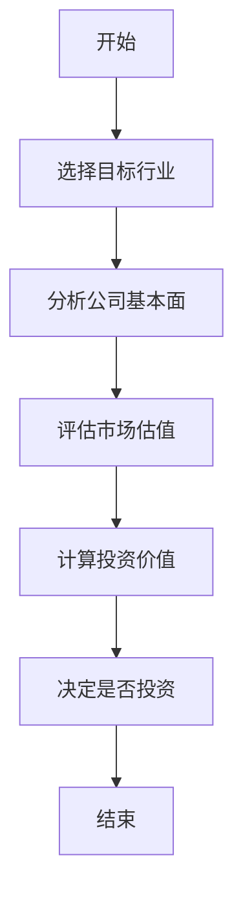
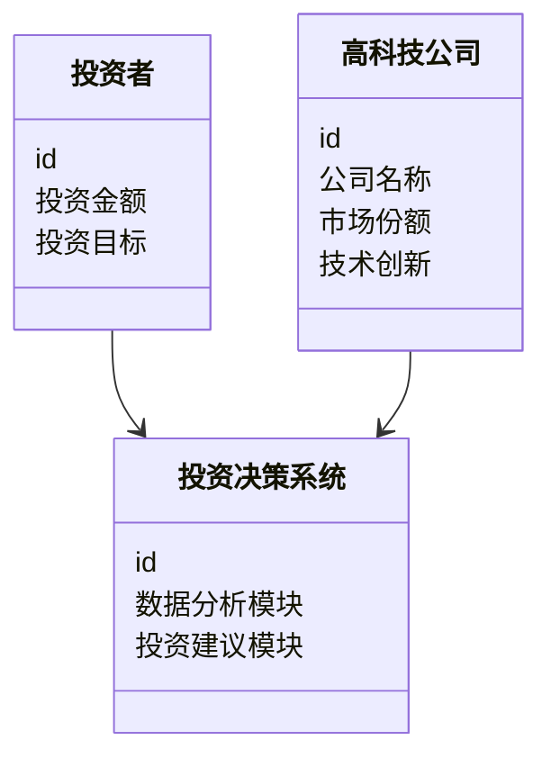
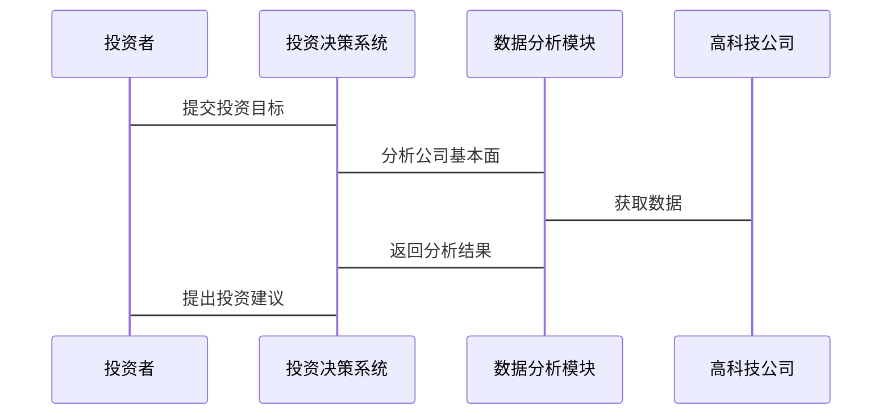

                 


# 彼得·林奇如何看待高科技股投资

> 关键词：彼得·林奇，高科技股，投资策略，风险管理，技术分析

> 摘要：本文从彼得·林奇的投资哲学出发，深入探讨他如何分析和投资高科技股。通过分析高科技股的特点、投资策略、风险管理以及实际案例，本文为投资者提供了全面的视角和实用的建议。

---

# 第一部分: 彼得·林奇与高科技股投资概述

## 第1章: 彼得·林奇与高科技股投资的背景

### 1.1 彼得·林奇的背景与投资理念

彼得·林奇是美国著名的职业棒球运动员和投资专家，以其独特的投资哲学和实践闻名。他的投资理念强调基本面分析、长期投资和风险管理。林奇认为，投资的核心在于理解公司基本面，而不是短期市场波动。

#### 1.1.1 彼得·林奇的生平简介
彼得·林奇出生于1960年，曾在美国职棒联盟（MLB）效力，后来转型为投资专家，专注于高科技股的投资。他的职业生涯跨越了多个行业，但始终坚持以基本面分析为基础的投资策略。

#### 1.1.2 林奇的投资哲学与方法
林奇的投资哲学强调以下几点：
1. **长期投资**：避免频繁交易，专注于长期价值。
2. **基本面分析**：通过财务报表和行业趋势评估公司的潜力。
3. **风险管理**：通过分散投资和止损策略降低风险。

#### 1.1.3 林奇对高科技股的独特见解
林奇认为，高科技股是未来经济的核心驱动力。他特别关注那些在技术创新、市场份额和盈利能力方面具有优势的公司。

### 1.2 高科技股的定义与特点

#### 1.2.1 高科技股的定义
高科技股是指那些属于高科技行业（如人工智能、云计算、生物技术等）的公司股票。这些公司通常具有较高的创新能力和增长潜力。

#### 1.2.2 高科技股的核心特点
- **高增长性**：高科技公司在技术进步的推动下，往往具有较高的增长率。
- **高波动性**：高科技股的市场价格波动较大，容易受到市场情绪和行业变化的影响。
- **高风险性**：由于依赖技术创新，高科技股的风险较高，但潜在回报也更大。

#### 1.2.3 高科技股与传统股票的区别
- **行业属性**：高科技股主要集中在技术密集型行业，而传统股票可能涉及制造业、服务业等。
- **估值方式**：高科技股的估值更依赖于未来的增长潜力，而传统股票更注重当前的盈利能力。
- **风险偏好**：高科技股投资者通常需要承担更高的风险，而传统股票的风险相对较低。

### 1.3 高科技股投资的背景与现状

#### 1.3.1 高科技产业的发展历程
高科技产业自20世纪末以来迅速崛起，成为全球经济的重要驱动力。互联网、人工智能和生物技术等领域的突破推动了高科技股的繁荣。

#### 1.3.2 高科技股在股票市场中的地位
高科技股在股票市场中占据重要地位，尤其在纳斯达克等科技股集中的交易所中，高科技股的表现往往引领市场趋势。

#### 1.3.3 当前高科技股投资的热点与趋势
当前，人工智能、云计算和电动汽车等领域成为高科技股投资的热点。投资者 increasingly focus on companies with strong R&D能力 and market leadership.

---

## 第2章: 高科技股投资的核心概念与背景

### 2.1 高科技股投资的基本问题

#### 2.1.1 高科技股投资的核心问题
高科技股投资的核心问题在于如何准确评估公司的成长潜力和市场前景。由于高科技行业的不确定性较高，投资者需要具备敏锐的洞察力和分析能力。

#### 2.1.2 高科技股投资的边界与外延
高科技股投资的边界包括技术可行性、市场需求和竞争环境。其外延则涉及相关政策、行业趋势和全球经济环境。

#### 2.1.3 高科技股投资的概念结构与核心要素
高科技股投资的概念结构包括：
- **公司基本面**：收入、利润、研发投入等。
- **行业趋势**：技术进步、市场需求、竞争格局。
- **市场估值**：市盈率、市净率、EV/EBITDA等。

### 2.2 高科技股投资的核心概念与联系

#### 2.2.1 核心概念原理
高科技股投资的核心在于通过分析公司基本面和技术趋势，判断其未来的增长潜力。林奇强调，投资者需要关注公司的技术创新能力、市场份额和盈利能力。

#### 2.2.2 核心概念属性特征对比表格
| 属性         | 高科技股特点                     | 传统股特点                     |
|--------------|----------------------------------|---------------------------------|
| 增长潜力     | 高                             | 中低                          |
| 市场波动性    | 高                             | 中低                          |
| 风险         | 高                             | 中低                          |
| 估值方式     | 未来增长潜力                   | 当前盈利能力                   |

#### 2.2.3 实体关系图（ER图）

```mermaid
erDiagram
    customer[投资者] {
        id
        投资金额
        投资目标
    }
    company[高科技公司] {
        id
        公司名称
        市场份额
        技术创新
    }
    investment[投资行为] {
        id
        投资金额
        投资时间
        投资回报
    }
    customer --> investment
    company --> investment
```

---

## 第3章: 高科技股投资的算法原理

### 3.1 算法原理概述

#### 3.1.1 算法原理的数学模型
高科技股投资的算法模型可以表示为：
$$
\text{投资价值} = \text{公司基本面} \times \text{行业趋势} \times \text{市场估值}
$$
其中，公司基本面包括收入、利润、研发投入等；行业趋势包括技术创新、市场需求；市场估值包括市盈率、市净率等。

#### 3.1.2 算法流程图



#### 3.1.3 算法实现代码
以下是一个简单的投资价值评估代码示例：

```python
def calculate_investment_value(company_data):
    revenue = company_data['revenue']
    profit_margin = company_data['profit_margin']
    r_d_expense = company_data['r_d_expense']
    market_share = company_data['market_share']
    industry_growth = company_data['industry_growth']
    
   基本面评分 = (revenue + profit_margin + r_d_expense) / 3
    市场估值 = (market_share + industry_growth) / 2
    投资价值 = 基面评分 * 市场估值
    
    return 投资价值
```

---

## 第4章: 高科技股投资的系统分析与架构设计

### 4.1 问题场景介绍

#### 4.1.1 投资场景描述
投资者需要通过分析多个高科技公司，选择具有高增长潜力的公司进行投资。

#### 4.1.2 投资目标与约束条件
- **目标**：寻找具有高增长潜力的高科技公司。
- **约束条件**：资金有限、风险承受能力、投资期限。

#### 4.1.3 投资决策的关键因素
- **公司基本面**：收入、利润、研发投入。
- **行业趋势**：技术创新、市场需求。
- **市场估值**：市盈率、市净率。

### 4.2 系统功能设计

#### 4.2.1 领域模型（Mermaid类图）



#### 4.2.2 系统架构设计（Mermaid架构图）

```mermaid
container 投资决策系统 {
    投资者
    高科技公司
    数据分析模块
    投资建议模块
}
```

#### 4.2.3 系统接口设计
- **输入接口**：投资者输入资金和投资目标。
- **输出接口**：系统输出投资建议和风险提示。

#### 4.2.4 系统交互流程（Mermaid序列图）



---

## 第5章: 高科技股投资的项目实战

### 5.1 环境安装与配置

#### 5.1.1 投资分析工具安装
安装并配置Python和相关库（如Pandas、NumPy、Matplotlib）。

#### 5.1.2 数据源获取与配置
从公开数据源（如Yahoo Finance）获取高科技股的历史数据。

#### 5.1.3 系统环境优化
优化Python环境，确保所有库和工具正常运行。

### 5.2 核心实现与代码解读

#### 5.2.1 投资分析算法实现
```python
import pandas as pd
import numpy as np

def calculate_investment_value(data):
    # 计算基本面评分
    基面评分 = (data['收入'] + data['利润'] + data['研发投入']) / 3
    # 计算市场估值
    市场估值 = (data['市场份额'] + data['行业增长']) / 2
    # 计算投资价值
    投资价值 = 基面评分 * 市场估值
    return 投资价值

# 示例数据
data = {
    '收入': 100000,
    '利润': 20000,
    '研发投入': 30000,
    '市场份额': 0.3,
    '行业增长': 0.15
}

value = calculate_investment_value(data)
print(value)
```

#### 5.2.2 数据处理与分析代码
```python
import pandas as pd
import matplotlib.pyplot as plt

# 加载数据
data = pd.read_csv('高科技股数据.csv')
# 数据清洗
data = data.dropna()
# 数据分析
data['收盘价'].plot(kind='line')
plt.title('高科技股价格走势')
plt.show()
```

#### 5.2.3 系统功能模块实现
- 数据采集模块：从数据源获取实时数据。
- 数据分析模块：计算投资价值。
- 投资建议模块：根据分析结果提供建议。

### 5.3 实际案例分析

#### 5.3.1 案例背景与目标
假设投资者希望投资人工智能领域，选择几家具有高增长潜力的公司进行分析。

#### 5.3.2 数据分析与处理
使用Python代码对目标公司的财务数据和市场数据进行分析。

#### 5.3.3 投资决策与结果解读
根据分析结果，建议投资者投资某家特定公司，并解释其优势和潜在风险。

### 5.4 项目总结与经验分享

#### 5.4.1 项目成果总结
通过该项目，投资者掌握了高科技股分析的基本方法和工具。

#### 5.4.2 投资经验与教训
林奇强调，投资决策需要结合基本面分析和市场趋势，避免盲目跟风。

#### 5.4.3 项目后续优化方向
优化数据分析算法，引入更多数据源，提高投资建议的准确性。

---

## 第6章: 高科技股投资的最佳实践与风险管理

### 6.1 风险管理与控制

#### 6.1.1 风险评估与管理策略
- **分散投资**：避免将所有资金投入单一行业。
- **止损策略**：设定止损点，避免重大损失。
- **定期复盘**：评估投资组合的表现，及时调整策略。

#### 6.1.2 风险控制工具与方法
- **止损订单**：在价格下跌到一定程度时自动卖出。
- **分散投资**：通过投资不同行业的股票降低风险。

### 6.2 投资策略与执行

#### 6.2.1 投资策略的制定
根据市场趋势和公司基本面，制定长期投资计划。

#### 6.2.2 投资执行的注意事项
- **避免情绪化决策**：不要因市场波动而盲目买卖。
- **关注公司新闻**：及时了解公司动态和行业趋势。

### 6.3 投资效果的评估与优化

#### 6.3.1 投资效果的评估指标
- **收益率**：投资回报率。
- **波动性**：投资组合的波动情况。
- **风险调整后收益**：考虑风险后的收益表现。

#### 6.3.2 投资组合的优化策略
- **定期 rebalancing**：根据市场变化调整投资比例。
- **引入新技术**：利用大数据和人工智能优化投资决策。

---

## 第7章: 总结与未来展望

### 7.1 本章总结
本文从彼得·林奇的投资哲学出发，系统地探讨了高科技股投资的背景、策略、算法和风险管理。通过实际案例和系统设计，为投资者提供了全面的视角和实用的建议。

### 7.2 未来展望
随着科技的不断进步，高科技股投资将更加依赖于数据分析和人工智能。未来，投资者需要不断提升自己的分析能力，以应对复杂多变的市场环境。

---

通过本文的分析，读者可以更好地理解彼得·林奇的投资理念，并将其应用于实际的高科技股投资中。无论是新手还是经验丰富的投资者，都可以从中获得 valuable insights and practical strategies.

