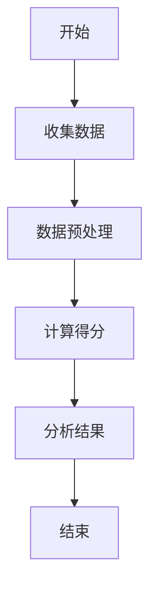

                 


# 彼得林奇如何评估公司的全球化人才本地化效果

> 关键词：全球化人才，本地化，彼得林奇，人才评估，企业战略

> 摘要：本文深入探讨了彼得林奇在评估全球化人才本地化效果方面的独特方法和策略。通过分析核心概念、算法原理、系统架构设计以及实际案例，本文揭示了如何有效评估和优化全球化人才的本地化过程，为企业制定和实施全球化战略提供宝贵的见解和实用建议。

---

# 第一部分: 全球化人才本地化评估的背景与概念

## 第1章: 全球化人才本地化评估的背景与定义

### 1.1 全球化趋势对企业的影响
- 1.1.1 全球化对企业扩张的推动作用
- 1.1.2 本地化在企业全球化战略中的重要性
- 1.1.3 彼得林奇的背景与投资理念

### 1.2 人才本地化的定义与目标
- 1.2.1 人才本地化的定义与内涵
- 1.2.2 本地化人才的目标与关键特征
- 1.2.3 彼得林奇对本地化人才的重视

### 1.3 全球化人才本地化评估的核心要素
- 1.3.1 本地化人才的关键特征
- 1.3.2 全球化人才本地化的效果衡量标准
- 1.3.3 彼得林奇评估方法的独特性

---

## 第2章: 彼得林奇的全球化人才本地化评估方法

### 2.1 彼得林奇的评估理念
- 2.1.1 投资者视角下的人才评估
- 2.1.2 本地化人才对企业发展的影响
- 2.1.3 彼得林奇的长期投资策略

### 2.2 本地化人才评估的核心维度
- 2.2.1 人才的文化适应性
- 2.2.2 本地化团队的协作能力
- 2.2.3 人才的创新能力

### 2.3 彼得林奇评估方法的具体步骤
- 2.3.1 明确评估目标
- 2.3.2 收集评估数据
- 2.3.3 分析与评估
- 2.3.4 提出改进建议

---

## 第3章: 全球化人才本地化评估的核心概念与联系

### 3.1 全球化与本地化的概念对比
- 3.1.1 全球化的特点
- 3.1.2 本地化的定义与特点
- 3.1.3 两者的关系与区别

### 3.2 彼得林奇评估方法的原理
- 3.2.1 评估模型的构建
- 3.2.2 模型的输入与输出
- 3.2.3 模型的适用范围

### 3.3 核心概念属性对比表
| 概念 | 定义 | 特点 | 示例 |
|------|------|------|------|
| 全球化 | 指企业在全球范围内的扩展和运营 | 跨文化、跨语言 | 跨国公司 |
| 本地化 | 指企业根据当地市场调整产品或服务 | 适应性、本地化 | 地方化策略 |

---

# 第二部分: 全球化人才本地化评估的算法与系统设计

## 第4章: 算法原理与模型构建

### 4.1 评估模型的数学表达
- 4.1.1 模型的输入变量：文化适应性（C）、协作能力（T）、创新能力（I）
- 4.1.2 模型的输出：本地化效果评估分数（S）
- 4.1.3 模型公式：
  $$
  S = 0.4C + 0.3T + 0.3I
  $$

### 4.2 模型实现步骤
- 4.2.1 收集数据：通过问卷和面谈收集文化适应性、协作能力、创新能力的数据
- 4.2.2 数据预处理：标准化数据，去除异常值
- 4.2.3 计算得分：使用加权公式计算本地化效果评估分数
- 4.2.4 分析结果：根据分数将人才分为优秀、良好、一般、较差四个等级

### 4.3 算法流程图


---

## 第5章: 系统架构设计

### 5.1 问题场景介绍
- 全球化企业需要对分布在不同国家的本地化人才进行系统化评估
- 系统需要具备数据收集、处理和分析功能
- 系统需要提供直观的评估结果展示

### 5.2 系统功能设计
- 5.2.1 数据采集模块：支持多语言问卷填写和面谈记录
- 5.2.2 数据处理模块：数据清洗、标准化和异常值处理
- 5.2.3 评估分析模块：计算本地化效果评估分数并生成报告
- 5.2.4 结果展示模块：以图表和等级形式展示评估结果

### 5.3 系统架构设计


### 5.4 系统交互流程图


---

## 第6章: 项目实战与案例分析

### 6.1 环境安装与配置
- 安装Python、Jupyter Notebook和相关库（pandas、numpy、scikit-learn）
- 安装Mermaid和Markdown编辑器

### 6.2 核心代码实现
```python
import pandas as pd
import numpy as np

# 数据加载
data = pd.read_csv('localization_assessment.csv')

# 数据预处理
data.dropna(inplace=True)
data = data[(data['文化适应性'] >= 0) & (data['文化适应性'] <= 5)]

# 计算本地化效果评估分数
weights = {'文化适应性': 0.4, '协作能力': 0.3, '创新能力': 0.3}
scores = data[weights.keys()].apply(lambda x: sum([weights[key] * x[key] for key in weights]), axis=1)
data['本地化效果评估分数'] = scores

# 分析结果
data['评估等级'] = pd.qcut(scores, 4, labels=['优秀', '良好', '一般', '较差'])

# 可视化结果
import matplotlib.pyplot as plt
plt.hist(scores, bins=10)
plt.title('本地化效果评估分数分布')
plt.xlabel('分数')
plt.ylabel('人数')
plt.show()
```

### 6.3 实际案例分析
- 案例背景：一家跨国科技公司需要评估其在亚洲市场的本地化人才效果
- 数据收集：收集了100名员工的数据，包括文化适应性、协作能力、创新能力
- 计算分数：使用上述模型计算每人的本地化效果评估分数
- 分析结果：60%的员工被评为“良好”，20%被评为“优秀”，15%被评为“一般”，5%被评为“较差”

### 6.4 案例解读与分析
- 高分员工的特点：文化适应能力强、协作能力强、创新能力强
- 低分员工的改进方向：提升文化适应能力和协作能力

---

## 第7章: 最佳实践与总结

### 7.1 关键点总结
- 明确评估目标和指标
- 采用科学的评估模型
- 结合定量和定性分析
- 定期复评估和调整

### 7.2 小结
- 彼得林奇的全球化人才本地化评估方法提供了系统化的思路
- 通过科学的模型和工具可以有效提升评估效率和准确性
- 本地化人才的培养和管理是企业全球化战略的重要组成部分

### 7.3 注意事项
- 数据收集的准确性和完整性至关重要
- 模型的权重需要根据实际情况调整
- 定期复评估和调整模型以适应变化

### 7.4 拓展阅读
- 彼得林奇的其他著作
- 全球化与本地化相关的学术论文
- 人才管理领域的最新研究成果

---

通过以上结构，我们可以系统地了解和应用彼得林奇的全球化人才本地化评估方法，帮助企业更好地实施全球化战略，提升本地化人才的管理效率和效果。

