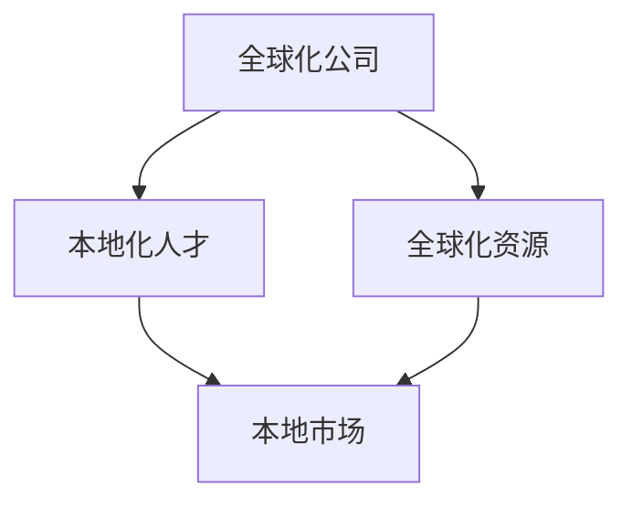
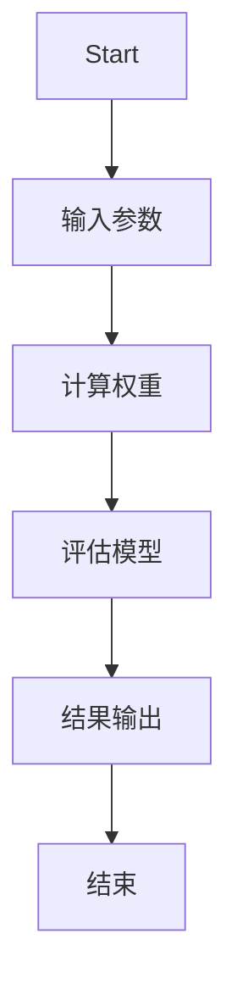
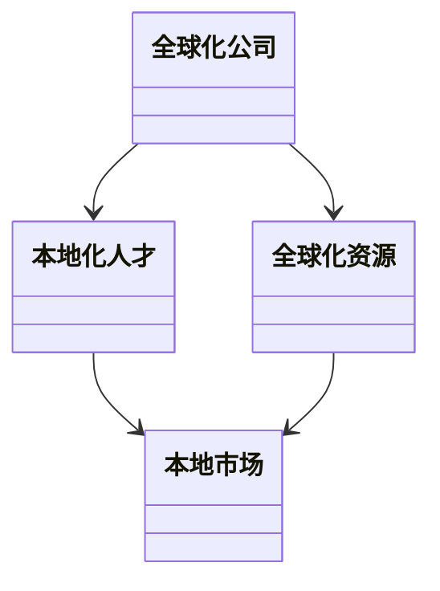

                 


# 彼得林奇如何评估公司的全球化人才本地化策略

> 关键词：全球化，人才本地化，彼得林奇，公司策略，评估模型

> 摘要：本文将深入探讨彼得·林奇的全球化人才本地化策略评估方法，从背景、概念、算法、系统设计到项目实战，逐步分析如何有效评估和实施本地化人才策略，确保公司在全球化市场中取得成功。

---

## 正文

### 第一部分：全球化人才本地化策略的背景与概述

#### 1.1 全球化人才本地化的概念与定义

- **全球化人才**：指在全球范围内具有广泛适用性和适应能力的人才，能够适应不同市场和文化环境。
- **本地化人才**：指在特定市场中具备本地文化、语言和市场知识的人才，能够有效推动本地业务发展。
- **全球化人才本地化**：指在全球化公司中，如何将全球化人才与本地人才相结合，制定适合当地市场的本地化策略。

#### 1.2 问题背景与问题描述

- **全球化公司的挑战**：跨国公司面临不同市场的文化差异、法律法规和竞争环境，需要本地化人才来应对。
- **本地化人才管理的必要性**：本地化人才能够更好地理解市场需求，提升公司竞争力。
- **全球化与本地化的矛盾**：如何在全球化战略下，保持本地化灵活性，是公司面临的重要问题。

#### 1.3 问题解决与边界

- **解决方案**：通过制定本地化人才策略，平衡全球化资源和本地化需求。
- **边界与外延**：本地化策略仅限于公司业务相关的领域，不涉及其他无关的本地事务。

---

### 第二部分：全球化人才本地化策略的核心概念与联系

#### 2.1 核心概念与原理

- **本地化策略的核心要素**：文化适应性、语言能力、市场知识、技术专长。
- **全球化与本地化的结合**：利用全球化资源，结合本地化知识，制定有效的市场策略。

#### 2.2 核心要素对比分析

| 属性          | 全球化人才                | 本地化人才                |
|---------------|--------------------------|--------------------------|
| 文化适应性     | 较低                     | 较高                     |
| 语言能力      | 多语言能力               | 本地语言流利             |
| 市场知识       | 全球视野                 | 本地市场深度理解         |
| 技术专长       | 技术全面                 | 本地技术需求             |

#### 2.3 实体关系图



---

### 第三部分：全球化人才本地化策略的算法与数学模型

#### 3.1 算法原理

- **层次分析法（AHP）**：用于评估本地化策略的优先级。
- **流程图**：



- **Python代码实现**：

```python
import numpy as np

def calculate_weights(matrix):
    # 计算权重
    total = np.sum(matrix, axis=0)
    weights = total / np.sum(total)
    return weights

# 示例输入
matrix = np.array([[0.2, 0.3, 0.5],
                   [0.4, 0.1, 0.5],
                   [0.3, 0.6, 0.1]])

weights = calculate_weights(matrix)
print(weights)
```

#### 3.2 数学模型与公式

- **层次分析法公式**：

$$ A = \frac{1}{n} \sum_{i=1}^{n} a_i $$

- **指数加权公式**：

$$ S = \sum_{i=1}^{n} w_i \cdot x_i $$

---

### 第四部分：系统分析与架构设计

#### 4.1 问题场景介绍

- **系统功能设计**：设计本地化人才评估系统，包括数据采集、分析和输出模块。
- **领域模型类图**：



#### 4.2 系统架构设计


---

### 第五部分：项目实战

#### 5.1 环境安装

- 安装Python和相关库（如numpy、pandas）。

#### 5.2 核心代码实现

```python
import numpy as np

def calculate_weights(matrix):
    total = np.sum(matrix, axis=0)
    weights = total / np.sum(total)
    return weights

matrix = np.array([[0.2, 0.3, 0.5],
                   [0.4, 0.1, 0.5],
                   [0.3, 0.6, 0.1]])

weights = calculate_weights(matrix)
print(weights)
```

#### 5.3 案例分析

- **案例**：某科技公司在亚洲市场的本地化策略。
- **分析**：通过评估模型，优化本地化人才的招聘和培养策略。

---

### 第六部分：最佳实践

- **小结**：彼得林奇的评估方法提供了有效的工具，帮助公司制定本地化策略。
- **注意事项**：模型需要根据实际情况调整，确保其适用性。
- **拓展阅读**：推荐相关书籍和文献，深入学习本地化策略的实施。

---

通过以上步骤，我们详细分析了彼得林奇的全球化人才本地化策略评估方法，并通过实际案例和系统设计展示了其应用。希望本文能为读者提供有价值的见解和指导。

