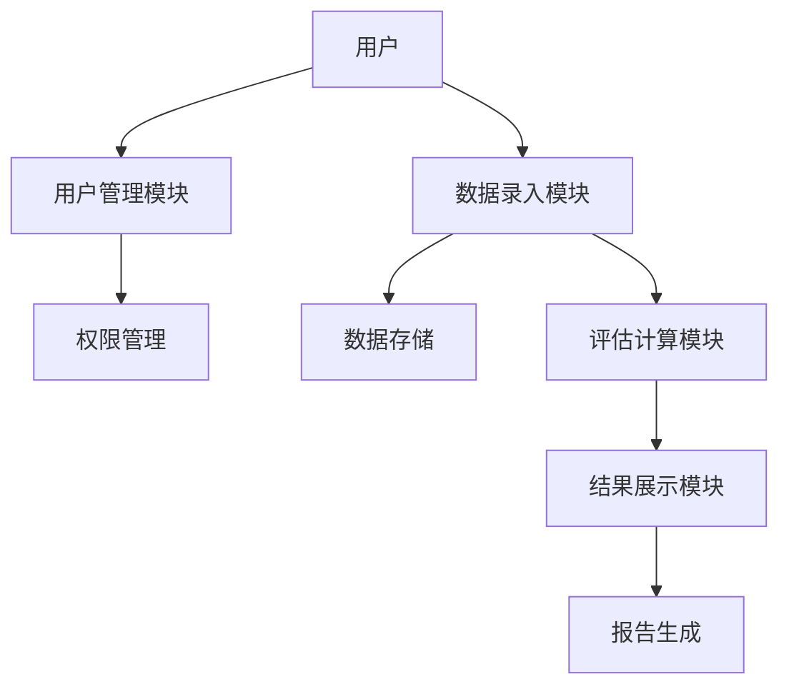

                 


# 彼得·林奇如何评估公司的全球化战略执行力

> 关键词：彼得·林奇，全球化战略，执行力评估，投资哲学，企业架构，系统优化

> 摘要：本文深入探讨了彼得·林奇如何评估公司的全球化战略执行力，从全球化战略的核心概念、评估模型、系统架构设计到项目实战，全面解析了林奇的投资哲学与全球化战略执行力的关联。通过详细的技术博客形式，结合实际案例分析，为读者提供了一套完整的全球化战略执行力评估框架和实践指南。

---

# 第一部分: 全球化战略与企业执行力概述

## 第1章: 全球化战略的定义与背景

### 1.1 全球化战略的定义与背景

全球化战略是企业在国际化市场中拓展业务、优化资源配置、提升竞争力的关键策略。彼得·林奇作为著名投资家，其投资哲学强调对企业全球化战略执行力的深入分析。全球化战略不仅仅是市场扩展，更是企业在全球范围内整合资源、优化流程、提升效率的过程。

#### 1.1.1 全球化战略的定义
全球化战略是指企业在全球范围内配置资源、布局市场、优化生产流程、提升品牌影响力的一系列战略行动。它不仅涉及跨国经营，还包括在全球市场中寻找竞争优势，实现可持续增长。

#### 1.1.2 全球化战略的历史发展
全球化战略的演变经历了多个阶段，从早期的跨国经营到现在的数字化全球化。随着信息技术的发展，企业在全球化过程中更加注重数字化转型和数据驱动的决策。

#### 1.1.3 全球化对企业执行力的影响
全球化战略的执行力直接影响企业的市场表现。高效的全球化战略能够帮助企业在国际市场中快速响应需求、降低运营成本、提升利润率。

### 1.2 彼得·林奇投资哲学与全球化战略

#### 1.2.1 彼得·林奇的投资者背景
彼得·林奇是美国著名投资家，曾管理富达麦哲伦基金，创造了卓越的投资业绩。他的投资哲学强调对企业基本面的深入分析和对管理层执行力的关注。

#### 1.2.2 林奇投资哲学的核心理念
林奇的投资哲学强调“价值投资”，即寻找那些具有强大竞争优势、良好管理团队和可持续增长潜力的企业。他认为，企业的全球化战略执行力是判断企业长期价值的重要因素。

#### 1.2.3 全球化战略在林奇投资中的重要性
林奇在其投资生涯中，多次强调全球化战略对企业竞争力的重要性。他认为，能够成功实施全球化战略的企业，往往具有更强的市场适应能力和更高的利润率。

### 1.3 全球化战略执行力的核心要素

#### 1.3.1 战略目标的全球化定位
企业需要明确全球化战略的目标，例如市场扩展、成本优化、技术创新等。

#### 1.3.2 组织结构的全球化布局
全球化战略需要匹配的组织架构，包括跨国团队的协作、全球化的管理流程等。

#### 1.3.3 资源配置的全球化优化
资源的全球化配置是实现战略目标的关键，包括人才、技术、资金等资源的优化配置。

## 1.4 本章小结

通过本章的介绍，我们了解了全球化战略的定义、发展背景以及其对企业执行力的影响。彼得·林奇的投资哲学为全球化战略的评估提供了独特的视角，强调了企业全球化战略的执行力对企业长期价值的重要性。

---

## 第2章: 全球化战略与企业执行力的关联

### 2.1 全球化战略对企业执行力的影响

#### 2.1.1 全球化战略对企业组织结构的重塑
全球化战略要求企业从传统的单一市场模式向跨国协作模式转变，组织结构需要更加扁平化和灵活化。

#### 2.1.2 全球化战略对企业资源分配的优化
全球化战略要求企业在全球范围内优化资源配置，例如在低成本地区建立生产基地，充分利用各地的比较优势。

#### 2.1.3 全球化战略对企业文化融合的挑战
全球化战略需要企业在不同文化背景下进行有效协作，文化冲突和管理风格的差异可能会影响执行力。

### 2.2 彼得·林奇视角下的全球化战略执行力

#### 2.2.1 林奇对全球化战略执行力的定义
林奇认为，全球化战略执行力是指企业在全球范围内高效配置资源、实现战略目标的能力。

#### 2.2.2 林奇评估全球化战略执行力的维度
- **战略规划能力**：企业是否制定了清晰的全球化战略。
- **组织协调能力**：企业能否在全球范围内有效协调资源。
- **风险管理能力**：企业能否应对全球化过程中的风险。
- **绩效表现**：全球化战略是否带来了预期的市场表现和利润增长。

#### 2.2.3 林奇全球化战略执行力评估模型
林奇的全球化战略执行力评估模型包括以下几个维度：
1. **战略目标的清晰性**：全球化战略是否明确。
2. **组织架构的合理性**：企业组织结构是否支持全球化战略。
3. **资源配置的效率**：资源是否在全球范围内得到有效配置。
4. **风险管理能力**：企业是否能够应对全球化过程中的风险。
5. **绩效表现**：全球化战略是否带来预期的绩效。

### 2.3 全球化战略执行力的评估框架

#### 2.3.1 评估框架的核心要素
- 战略规划
- 组织架构
- 资源配置
- 风险管理
- 绩效表现

#### 2.3.2 评估框架的实施步骤
1. 明确评估目标
2. 收集相关数据
3. 评估各维度表现
4. 综合评估结果
5. 提出改进建议

#### 2.3.3 评估框架的优缺点分析
- **优点**：框架清晰，能够全面评估企业全球化战略执行力。
- **缺点**：实施过程中需要大量数据支持，可能耗时较长。

## 2.4 本章小结

通过本章的分析，我们了解了全球化战略对企业执行力的多方面影响，以及彼得·林奇如何从投资哲学的角度评估全球化战略执行力。林奇的评估模型为我们提供了一套系统化的评估框架，帮助企业更好地实施全球化战略。

---

## 第三部分: 全球化战略执行力的评估模型与方法

## 第3章: 全球化战略执行力评估的核心模型

### 3.1 林奇全球化战略执行力评估模型

#### 3.1.1 模型的构成与功能
林奇全球化战略执行力评估模型由战略目标、组织架构、资源配置、风险管理、绩效表现五个核心要素构成，旨在全面评估企业的全球化战略执行力。

#### 3.1.2 模型的数学表达式
$$ E = \sum_{i=1}^{5} w_i x_i $$
其中，$E$ 表示执行力评估结果，$w_i$ 表示第 $i$ 个评估维度的权重，$x_i$ 表示第 $i$ 个评估维度的得分。

---

### 3.2 全球化战略执行力评估的系统分析

#### 3.2.1 系统分析的步骤
1. 明确评估目标
2. 确定评估维度
3. 收集相关数据
4. 综合评估结果
5. 提出改进建议

#### 3.2.2 系统分析的工具与方法
- **SWOT分析**：用于分析企业在全球化过程中的优势、劣势、机会和威胁。
- **KPI设定**：设定关键绩效指标，用于衡量全球化战略的执行效果。

#### 3.2.3 系统分析的案例
以一家跨国制造企业为例，分析其在全球化过程中的战略目标、组织架构、资源配置、风险管理、绩效表现。

---

### 3.3 林奇全球化战略执行力评估模型的实战应用

#### 3.3.1 项目背景与目标
某跨国企业希望优化其全球化战略执行力，希望通过林奇的评估模型进行自我评估。

#### 3.3.2 评估步骤
1. 确定评估维度
2. 收集相关数据
3. 计算各维度得分
4. 综合评估结果
5. 提出改进建议

#### 3.3.3 评估结果与分析
- **战略目标**：得分85分，表明企业的全球化战略目标较为明确。
- **组织架构**：得分75分，表明组织架构需要进一步优化。
- **资源配置**：得分90分，表明资源配置效率较高。
- **风险管理**：得分70分，表明风险管理能力有待提升。
- **绩效表现**：得分80分，表明全球化战略执行效果良好。

---

## 第4章: 全球化战略执行力评估的数学模型与算法

### 4.1 全球化战略执行力评估的数学模型

#### 4.1.1 模型的构建
$$ E = \sum_{i=1}^{5} w_i x_i $$
其中，权重 $w_i$ 和得分 $x_i$ 根据具体情况进行调整。

#### 4.1.2 模型的实现步骤
1. 确定评估维度和权重
2. 收集各维度的评估数据
3. 计算各维度得分
4. 综合计算总得分
5. 分析结果并提出改进建议

---

### 4.2 全球化战略执行力评估的算法实现

#### 4.2.1 算法的描述
- 输入：企业全球化战略执行相关的数据
- 输出：全球化战略执行力评估结果

#### 4.2.2 算法的实现代码
```python
def calculate_globalization_execution(enterprise_data):
    # 确定各维度权重
    weights = [0.2, 0.2, 0.3, 0.15, 0.15]
    # 计算各维度得分
    strategy_score = enterprise_data['strategy']
    organization_score = enterprise_data['organization']
    resource_score = enterprise_data['resource']
    risk_score = enterprise_data['risk']
    performance_score = enterprise_data['performance']
    
    # 计算总得分
    total_score = (weights[0] * strategy_score +
                   weights[1] * organization_score +
                   weights[2] * resource_score +
                   weights[3] * risk_score +
                   weights[4] * performance_score)
    return total_score

# 示例数据
enterprise_data = {
    'strategy': 85,
    'organization': 75,
    'resource': 90,
    'risk': 70,
    'performance': 80
}

# 调用函数计算总得分
total_score = calculate_globalization_execution(enterprise_data)
print(f"全球化战略执行力总得分为：{total_score}")
```

---

## 第5章: 全球化战略执行力评估的系统架构设计

### 5.1 系统分析与设计

#### 5.1.1 问题场景介绍
以某跨国企业为例，分析其在全球化战略执行过程中遇到的挑战。

#### 5.1.2 系统功能设计
- 用户管理模块
- 数据录入模块
- 评估计算模块
- 结果展示模块

#### 5.1.3 系统架构设计


---

### 5.2 系统接口设计

#### 5.2.1 系统接口描述
- 用户登录接口
- 数据录入接口
- 评估计算接口
- 结果展示接口

#### 5.2.2 系统接口实现
```python
# 用户登录接口
def user_login(username, password):
    # 验证用户名和密码
    if username == 'admin' and password == 'password':
        return True
    else:
        return False

# 数据录入接口
def input_data(strategy, organization, resource, risk, performance):
    # 存储数据
    return True

# 评估计算接口
def calculate_execution():
    # 调用评估模型计算得分
    return total_score

# 结果展示接口
def display_results(score):
    # 显示评估结果
    print(f"全球化战略执行力得分为：{score}")
    return True
```

---

## 第6章: 项目实战与案例分析

### 6.1 项目背景与目标

#### 6.1.1 项目背景
以某跨国制造企业为例，分析其在全球化战略执行过程中遇到的挑战。

#### 6.1.2 项目目标
优化企业的全球化战略执行力，提升市场表现。

### 6.2 项目实施步骤

#### 6.2.1 环境安装
安装所需的软件和工具，例如Python、数据存储工具等。

#### 6.2.2 系统核心实现
实现全球化战略执行力评估系统的核心功能模块。

#### 6.2.3 代码实现
```python
# 系统核心实现代码
def main():
    # 用户登录
    username = input("请输入用户名：")
    password = input("请输入密码：")
    if user_login(username, password):
        print("登录成功！")
        # 数据录入
        strategy = int(input("请输入战略目标得分："))
        organization = int(input("请输入组织架构得分："))
        resource = int(input("请输入资源配置得分："))
        risk = int(input("请输入风险管理得分："))
        performance = int(input("请输入绩效表现得分："))
        # 调用评估计算模块
        total_score = calculate_globalization_execution({'strategy': strategy, 'organization': organization, 'resource': resource, 'risk': risk, 'performance': performance})
        # 显示结果
        display_results(total_score)
    else:
        print("登录失败！")

if __name__ == "__main__":
    main()
```

---

## 第7章: 总结与展望

### 7.1 总结

通过本文的分析，我们了解了彼得·林奇如何评估公司的全球化战略执行力。林奇的投资哲学为我们提供了一套系统化的评估框架，帮助企业在全球化过程中优化资源配置、提升执行效率。

### 7.2 小结

全球化战略的执行是一个复杂的过程，需要企业从战略规划、组织架构、资源配置、风险管理等多个维度进行全面考虑。林奇的评估模型为我们提供了一套科学的评估方法，帮助企业更好地实施全球化战略。

### 7.3 注意事项

企业在实施全球化战略时，需要注意以下几点：
- 全球化战略的执行力需要与企业的实际情况相结合。
- 需要注重跨文化管理，避免文化冲突影响执行效果。
- 需要建立完善的风险管理体系，应对全球化过程中的各种风险。

### 7.4 拓展阅读

- 彼得·林奇的《投资之道》
- 全球化战略的经典案例分析
- 数字化转型与全球化战略的结合

---

通过本文的详细分析，我们希望读者能够更好地理解彼得·林奇的全球化战略执行力评估方法，并能够在实际工作中加以应用。

