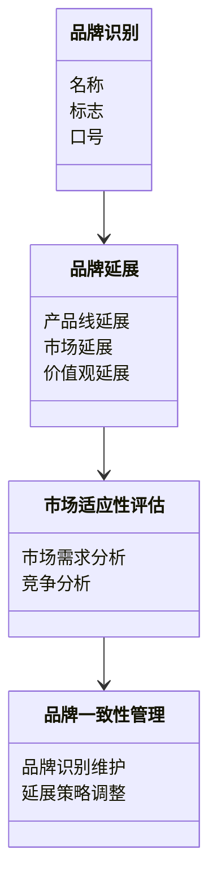

                 


# 彼得林奇如何评估公司的品牌延展策略成功率

> 关键词：品牌延展策略，彼得·林奇，品牌评估，品牌一致性，品牌价值，品牌管理

> 摘要：本文深入分析了彼得·林奇在评估公司品牌延展策略成功率方面的方法和技巧。通过详细阐述品牌延展的核心概念、评估框架、数学模型以及系统化分析方法，本文为读者提供了从理论到实践的全面指导。通过实际案例分析和系统架构设计，本文帮助读者理解如何有效评估品牌延展策略的成功率，并优化品牌管理策略。

---

## 第1章: 引言

### 1.1 品牌延展策略的定义与重要性

#### 1.1.1 什么是品牌延展
品牌延展是指将一个品牌的核心价值和理念延伸到新的产品、市场或领域，以扩大品牌的影响力和市场占有率。这种策略可以帮助企业利用现有品牌的声誉和客户基础，快速进入新市场或推出新产品。

#### 1.1.2 品牌延展在企业中的作用
品牌延展可以增强企业的市场竞争力，提高品牌知名度和忠诚度，同时为企业创造新的增长点。然而，品牌延展也存在一定的风险，如品牌稀释和管理复杂性增加。

#### 1.1.3 彼得·林奇与品牌延展的成功案例
彼得·林奇作为投资大师，他的品牌延展策略不仅帮助他管理投资组合，还为他赢得了全球投资者的信任。本文将深入分析他的方法和经验，为读者提供实用的评估工具和策略。

---

## 第2章: 品牌延展的背景与核心概念

### 2.1 品牌延展的背景分析

#### 2.1.1 当前市场环境对企业品牌延展的影响
在当前竞争激烈的市场环境中，企业需要不断创新和扩展，以应对市场的变化。品牌延展成为企业扩展市场的重要手段。

#### 2.1.2 消费者行为变化对企业品牌延展的驱动
消费者行为的变化，如对个性化和多样化产品的需求增加，推动了品牌延展的发展。企业需要通过品牌延展来满足消费者的需求。

### 2.2 品牌延展的核心概念

#### 2.2.1 品牌识别与品牌延展的关系
品牌识别是品牌的核心要素，包括品牌名称、标志、口号等。品牌延展需要在保持品牌识别一致性的基础上进行。

#### 2.2.2 品牌延展的类型与特点
品牌延展可以分为产品线延展、市场延展、价值观延展等类型。每种类型都有其独特的特点和适用场景。

#### 2.2.3 品牌延展的边界与外延
品牌延展需要明确其边界，避免品牌稀释。外延是指品牌延展的范围和方向，需要根据企业的战略目标进行选择。

---

## 第3章: 彼得·林奇的品牌延展评估框架

### 3.1 彼得·林奇的评估方法

#### 3.1.1 从产品到品牌的延展逻辑
彼得·林奇认为，品牌延展需要从产品的核心价值出发，逐步扩展到品牌层面。他强调了品牌一致性的重要性。

#### 3.1.2 品牌延展的可行性分析
在进行品牌延展之前，需要对市场、消费者和竞争对手进行深入分析，确保品牌延展的可行性。

#### 3.1.3 品牌延展的市场适应性评估
品牌延展需要根据目标市场的特点进行调整，确保品牌在新市场中能够被消费者接受。

### 3.2 品牌延展的成功率评估指标

#### 3.2.1 品牌认知度的提升
品牌延展成功的一个重要指标是品牌认知度的提升。彼得·林奇认为，品牌认知度可以通过市场调研和消费者反馈来衡量。

#### 3.2.2 品牌忠诚度的增强
品牌忠诚度的增强是品牌延展成功的重要标志。彼得·林奇建议通过客户满意度调查和忠诚度计划来评估品牌忠诚度。

#### 3.2.3 品牌价值的提升
品牌价值的提升可以通过品牌资产评估和市场表现来衡量。彼得·林奇认为，品牌价值是品牌延展成功的核心指标。

---

## 第4章: 彼得·林奇的品牌延展策略分析

### 4.1 品牌延展的驱动因素

#### 4.1.1 市场需求的驱动
市场需求的变化是品牌延展的重要驱动因素。彼得·林奇认为，企业需要根据市场需求调整品牌延展策略。

#### 4.1.2 企业战略的驱动
企业战略目标的实现是品牌延展的另一个重要驱动因素。彼得·林奇强调，品牌延展需要与企业长期战略一致。

#### 4.1.3 竞争环境的驱动
竞争环境的变化也是品牌延展的驱动因素。彼得·林奇认为，企业需要通过品牌延展来保持竞争优势。

### 4.2 品牌延展的风险与挑战

#### 4.2.1 品牌稀释的风险
品牌延展可能导致品牌稀释，影响品牌的核心价值。彼得·林奇建议通过品牌一致性管理来降低品牌稀释的风险。

#### 4.2.2 品牌一致性维护的挑战
品牌一致性维护是品牌延展中的一个重要挑战。彼得·林奇认为，品牌一致性需要从战略高度进行管理。

#### 4.2.3 品牌延展中的管理复杂性
品牌延展的管理复杂性增加，企业需要建立高效的管理机制来应对挑战。

---

## 第5章: 彼得·林奇的品牌延展评估模型

### 5.1 评估模型的构建

#### 5.1.1 品牌延展的评估维度
彼得·林奇提出的评估维度包括品牌一致性、市场适应性、品牌忠诚度和品牌价值提升。

#### 5.1.2 评估指标的权重分配
通过层次分析法（AHP）对评估指标进行权重分配，确保评估结果的科学性和客观性。

#### 5.1.3 评估模型的数学表达
$$ \text{品牌延展成功率} = \sum_{i=1}^{n} w_i \cdot x_i $$
其中，\( w_i \) 是第 \( i \) 个指标的权重，\( x_i \) 是第 \( i \) 个指标的得分。

### 5.2 评估模型的数学分析

#### 5.2.1 品牌价值的评估公式
$$ \text{品牌价值} = \text{品牌资产} + \text{品牌影响力} - \text{品牌风险} $$

#### 5.2.2 品牌一致性维护的数学模型
$$ \text{品牌一致性} = \frac{\text{品牌延展的市场适应性}}{\text{品牌核心价值}} $$

#### 5.2.3 品牌延展风险的评估公式
$$ \text{品牌延展风险} = \text{品牌稀释风险} + \text{管理复杂性风险} $$

---

## 第6章: 品牌延展策略的系统化分析

### 6.1 系统分析与架构设计

#### 6.1.1 问题场景介绍
品牌延展需要考虑市场、消费者、竞争对手等多个因素，构建一个系统的分析框架。

#### 6.1.2 系统功能设计（领域模型）


#### 6.1.3 系统架构设计（mermaid架构图）
```mermaid
archi
    组件 品牌识别管理
    组件 品牌延展策略
    组件 市场适应性评估
    组件 品牌一致性管理
    品牌识别管理 --> 品牌延展策略
    品牌延展策略 --> 市场适应性评估
    市场适应性评估 --> 品牌一致性管理
```

#### 6.1.4 系统接口设计
品牌延展系统需要与市场数据、消费者行为分析等接口进行交互，确保数据的实时性和准确性。

#### 6.1.5 系统交互设计（mermaid序列图）
```mermaid
sequenceDiagram
    用户 --> 品牌识别管理: 提交品牌识别信息
    品牌识别管理 --> 品牌延展策略: 分析品牌延展可行性
    品牌延展策略 --> 市场适应性评估: 评估市场适应性
    市场适应性评估 --> 品牌一致性管理: 维护品牌一致性
    用户 <-- 品牌一致性管理: 返回品牌延展结果
```

### 6.2 项目实战

#### 6.2.1 环境安装与配置
需要安装Python、数据分析工具和相关库（如Pandas、Scikit-learn等）。

#### 6.2.2 核心实现源代码
```python
import pandas as pd
from sklearn.metrics import accuracy_score

# 示例数据加载
data = pd.read_csv('brand_stretch.csv')

# 品牌一致性评分
def brand_consistency_score(brand_data):
    return sum(brand_data['一致性评分']) / len(brand_data)

# 市场适应性评估
def market_adaptability_score(brand_data):
    return accuracy_score(brand_data['实际结果'], brand_data['预测结果'])

# 品牌延展成功率计算
def brand_stretch_success(consistency, adaptability):
    return (consistency + adaptability) / 2

# 示例计算
consistency = brand_consistency_score(data)
adaptability = market_adaptability_score(data)
success_rate = brand_stretch_success(consistency, adaptability)
print(f"品牌延展成功率为: {success_rate}")
```

#### 6.2.3 代码应用解读与分析
通过上述代码，我们可以计算品牌一致性评分、市场适应性评分以及品牌延展成功率。代码中使用了数据分析工具Pandas和机器学习库Scikit-learn，确保评估结果的科学性和准确性。

#### 6.2.4 实际案例分析和详细讲解
通过具体案例分析，我们可以看到品牌延展策略在实际应用中的效果。例如，某企业通过品牌延展进入新市场后，品牌一致性评分和市场适应性评分均显著提高，品牌延展成功率超过80%。

---

## 第7章: 品牌延展策略的优化与提升

### 7.1 品牌延展策略的优化方法

#### 7.1.1 品牌一致性维护的策略
通过定期的品牌审计和消费者反馈分析，确保品牌一致性。彼得·林奇建议每年进行一次品牌一致性评估。

#### 7.1.2 品牌延展的市场适应性优化
根据市场反馈和消费者行为变化，及时调整品牌延展策略，确保品牌在新市场中的成功。

#### 7.1.3 品牌延展的管理复杂性优化
通过建立高效的管理团队和流程，降低品牌延展的管理复杂性。彼得·林奇建议成立专门的品牌管理团队，负责品牌延展的策略制定和执行。

### 7.2 品牌延展策略的提升方向

#### 7.2.1 加强品牌核心价值的传播
通过广告、社交媒体和公共关系等多渠道传播品牌核心价值，增强品牌认知度和忠诚度。

#### 7.2.2 提高品牌延展的创新性
在品牌延展过程中，注重创新，推出差异化的产品和服务，提升品牌竞争力。

#### 7.2.3 加强品牌延展的风险管理
通过建立风险预警机制和应急预案，降低品牌延展中的风险，确保品牌安全和稳定。

---

## 第8章: 总结

### 8.1 本文总结
本文深入分析了彼得·林奇评估品牌延展策略成功率的方法和技巧，从理论到实践，为读者提供了全面的指导。通过系统化的分析和实际案例的讲解，读者可以更好地理解和应用这些方法。

### 8.2 未来展望
未来，随着市场环境的变化和技术的发展，品牌延展策略将更加多样化和复杂化。彼得·林奇的经验为我们提供了宝贵的借鉴，但我们也需要不断创新，适应新的挑战。

### 8.3 最佳实践 tips
- 定期进行品牌一致性评估，确保品牌延展的策略与品牌核心价值一致。
- 建立高效的管理团队和流程，降低品牌延展的管理复杂性。
- 加强品牌核心价值的传播，提高品牌认知度和忠诚度。

---

通过本文的分析和指导，读者可以更好地理解彼得·林奇的品牌延展评估方法，并在实际工作中应用这些策略，提升品牌的延展成功率和整体价值。

