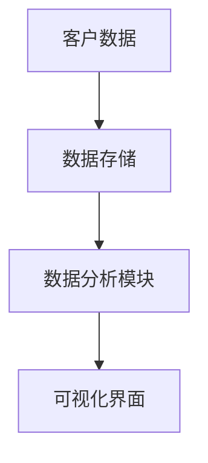

                 


# 彼得·林奇如何评估公司的品牌忠诚度

---

## 关键词  
彼得·林奇, 品牌忠诚度, 投资评估, 顾客满意度, 企业价值

---

## 摘要  
本文详细探讨了彼得·林奇如何评估公司的品牌忠诚度，从品牌忠诚度的定义、评估维度、数学模型到实际应用，系统地分析了这一过程。文章结合彼得·林奇的投资理念，通过NPS、CLV等量化指标，深入解析品牌忠诚度对企业发展和投资决策的影响。同时，文章还提供了基于Python的算法实现和系统架构设计，帮助读者更好地理解和应用品牌忠诚度评估方法。

---

## 第一部分: 品牌忠诚度与彼得·林奇的评估方法

---

## 第1章: 品牌忠诚度的核心概念与背景

### 1.1 品牌忠诚度的定义与特征

#### 1.1.1 品牌忠诚度的定义  
品牌忠诚度是指消费者对某个品牌长期偏好和持续购买的程度。一个品牌若能获得消费者的忠诚，意味着消费者不仅选择该品牌的产品或服务，还会主动推荐给他人，并在面对竞争品牌时仍然选择它。

#### 1.1.2 品牌忠诚度的核心特征  
- **稳定性**：消费者在面对市场竞争时，仍然选择该品牌。  
- **情感依恋**：消费者对品牌有强烈的情感认同，甚至将其视为生活方式的一部分。  
- **长期性**：消费者的行为不仅仅是为了满足当前需求，而是出于对品牌的长期信任和依赖。

#### 1.1.3 品牌忠诚度与企业价值的关系  
品牌忠诚度是企业长期盈利能力的重要保障。高忠诚度的消费者通常会为品牌支付溢价，且在产品或服务出现问题时更愿意给予企业第二次机会。从投资角度来看，品牌忠诚度高的企业往往具有更强的市场竞争力和防御能力。

---

### 1.2 彼得·林奇与品牌忠诚度的关联

#### 1.2.1 彼得·林奇的投资理念  
彼得·林奇是全球著名的职业基金经理，他的投资哲学以基本面分析为核心。他认为，成功的投资需要深入研究企业的商业模式、财务状况和市场地位。品牌忠诚度作为企业市场地位的重要组成部分，是林奇评估企业价值时的重要指标。

#### 1.2.2 品牌忠诚度在投资中的重要性  
林奇认为，品牌忠诚度高的企业通常具有更强的定价权和市场影响力。消费者对品牌的偏好可以直接转化为企业的竞争优势，尤其是在高度竞争的市场中。

#### 1.2.3 彼得·林奇的评估方法与实际案例  
林奇常用Net Promoter Score（NPS）和Customer Lifetime Value（CLV）等指标来衡量品牌忠诚度。例如，他分析星巴克时发现，其高品牌忠诚度源于优质的客户体验和独特的产品设计。

---

## 第2章: 品牌忠诚度的评估维度与指标

### 2.1 品牌忠诚度的评估维度

#### 2.1.1 客户满意度  
客户满意度是品牌忠诚度的基础。满意的客户更有可能成为忠诚客户。  

**公式：**  
$$ \text{客户满意度} = \frac{\text{满意客户数}}{\text{总客户数}} \times 100\% $$  

#### 2.1.2 重复购买率  
重复购买率反映了客户对品牌的依赖程度。  

**公式：**  
$$ \text{重复购买率} = \frac{\text{重复购买客户数}}{\text{总客户数}} \times 100\% $$  

#### 2.1.3 品牌推荐度  
品牌推荐度衡量了客户愿意向他人推荐品牌的能力。  

**公式：**  
$$ \text{品牌推荐度} = \frac{\text{推荐客户数}}{\text{总客户数}} \times 100\% $$  

---

### 2.2 品牌忠诚度的量化指标

#### 2.2.1 Net Promoter Score (NPS)  
NPS是衡量客户忠诚度的常用指标，计算公式如下：  

$$ \text{NPS} = \text{推荐者比例} - \text{批评者比例} $$  

- 推荐者（9-10分）：表示愿意推荐给他人。  
- 中立者（7-8分）：可能在未来选择其他品牌。  
- 批评者（0-6分）：表示不满意，可能会流失。  

#### 2.2.2 Customer Lifetime Value (CLV)  
CLV是客户在企业生命周期中为企业带来的总收入。  

**公式：**  
$$ \text{CLV} = \frac{\text{年收入}}{\text{年流失率}} $$  

---

## 第3章: 彼得·林奇的品牌忠诚度评估模型

### 3.1 模型的核心原理

#### 3.1.1 基于客户行为的分析  
林奇认为，客户行为数据能够反映品牌忠诚度的真实情况。例如，客户购买频率、购买金额和退货率等指标可以揭示客户对品牌的忠诚程度。

#### 3.1.2 基于财务数据的评估  
通过分析企业的财务报表，可以间接衡量品牌忠诚度。例如，高利润率和高客户保留率通常意味着品牌忠诚度较高。

#### 3.1.3 基于市场反馈的综合评价  
林奇常用第三方调查数据（如NPS）来评估品牌忠诚度，并结合市场趋势进行综合判断。

---

### 3.2 模型的数学公式与实现

#### 3.2.1 NPS计算公式  
$$ \text{NPS} = \text{推荐者比例} - \text{批评者比例} $$  

#### 3.2.2 CLV计算公式  
$$ \text{CLV} = \frac{\text{年收入}}{\text{年流失率}} $$  

#### 3.2.3 案例分析  
假设某公司有1000名客户，其中200名是推荐者，100名是批评者。那么NPS为：  
$$ \text{NPS} = 20\% - 10\% = 10 $$  

---

## 第4章: 品牌忠诚度的系统分析与架构设计

### 4.1 系统分析

#### 4.1.1 问题场景介绍  
本文将从企业视角出发，设计一个品牌忠诚度评估系统，帮助企业管理者和投资者量化品牌忠诚度。

#### 4.1.2 系统功能设计  
- 数据采集：收集客户满意度、重复购买率等数据。  
- 数据分析：计算NPS和CLV。  
- 可视化：生成图表，直观展示品牌忠诚度。

---

### 4.2 系统架构设计

#### 4.2.1 系统架构图  


#### 4.2.2 系统接口设计  
- 数据接口：与客户管理系统对接，获取客户行为数据。  
- API接口：提供NPS和CLV的查询接口。

---

## 第5章: 品牌忠诚度评估的算法实现与实战

### 5.1 环境安装与配置

#### 5.1.1 Python环境安装  
安装Python和必要的库（如Pandas、NumPy）。

#### 5.1.2 第三方库安装  
```bash
pip install pandas matplotlib
```

#### 5.1.3 数据集准备  
准备客户满意度数据，格式为CSV文件。

---

### 5.2 核心算法实现

#### 5.2.1 NPS计算的Python代码  
```python
import pandas as pd

# 读取数据
data = pd.read_csv('customer_surveys.csv')

# 计算NPS
promoters = data[data['score'] >= 9].shape[0]
detractors = data[data['score'] <= 6].shape[0]
total = data.shape[0]

nps = (promoters / total * 100) - (detractors / total * 100)
print(f"NPS: {nps:.2f}%")
```

#### 5.2.2 CLV计算的Python代码  
```python
def calculate_clv(revenue, churn_rate):
    return revenue / churn_rate

revenue = 1000000  # 假设年收入为100万美元
churn_rate = 0.05    # 假设年流失率为5%
clv = calculate_clv(revenue, churn_rate)
print(f"CLV: ${clv:.2f}")
```

---

## 第6章: 最佳实践与小结

### 6.1 小结  
品牌忠诚度是企业长期成功的关键因素之一。彼得·林奇通过NPS和CLV等指标，为企业提供了量化品牌忠诚度的有效方法。

### 6.2 注意事项  
- 数据质量：确保数据的准确性和完整性。  
- 指标选择：根据企业特点选择合适的评估指标。  
- 持续监测：定期评估品牌忠诚度，及时调整策略。

### 6.3 拓展阅读  
- 《彼得·林奇的投资哲学》  
- 《客户忠诚度管理》

---

通过本文的系统分析和实战案例，读者可以深入理解彼得·林奇的品牌忠诚度评估方法，并将其应用于实际投资和企业管理中。

