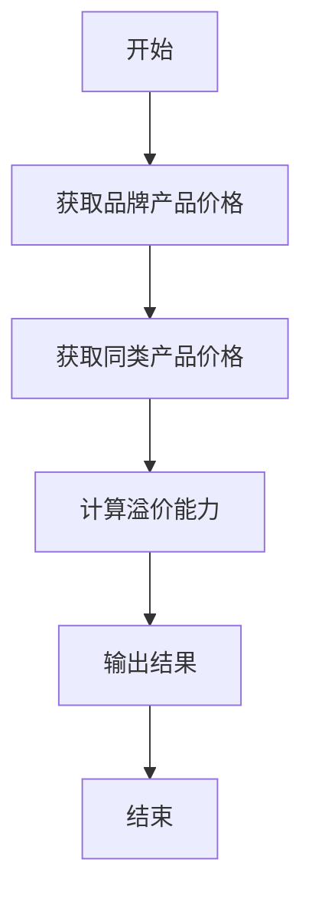
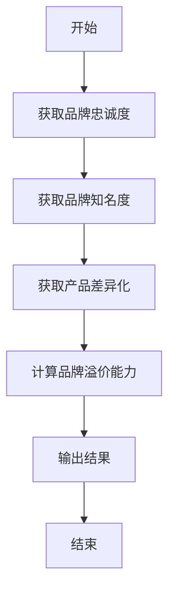
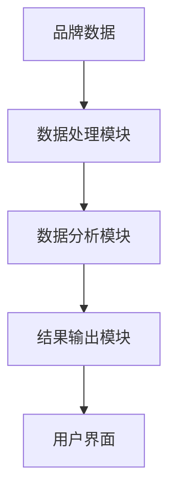
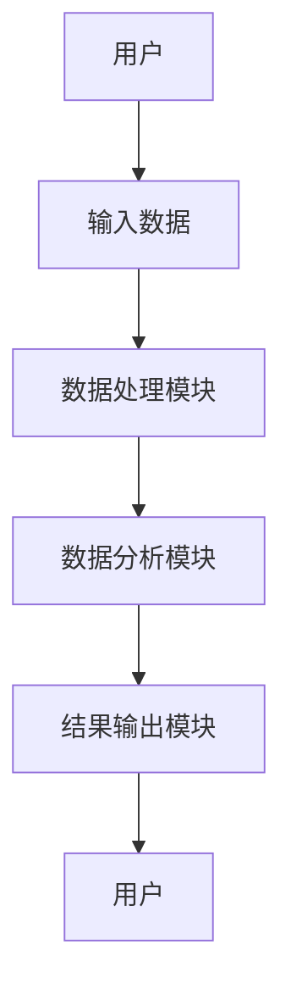

                 


# 彼得林奇如何评估公司的品牌溢价能力

## 关键词：
- 品牌溢价能力
- 彼得·林奇
- 投资评估
- 品牌价值
- 品牌忠诚度

## 摘要：
本文深入探讨了彼得·林奇评估公司品牌溢价能力的方法。通过背景介绍、核心概念、算法原理、系统分析、项目实战和最佳实践等多个维度，详细解析了品牌溢价能力在投资中的重要性及其评估方法。文章结合实际案例，提供了丰富的理论支持和实践指导，帮助读者更好地理解和应用这一评估体系。

---

# 第1章: 品牌溢价能力的背景与核心概念

## 1.1 品牌溢价能力的定义与重要性

### 1.1.1 品牌溢价能力的定义与内涵
品牌溢价能力是指品牌能够通过其市场地位和消费者认知，获得高于同类产品市场价格的能力。简单来说，就是消费者愿意为某一品牌支付额外的价格。这种能力反映了品牌在市场中的独特地位和竞争优势。

### 1.1.2 品牌溢价能力的核心要素
- **品牌知名度**：品牌在市场中的普及程度和消费者认知度。
- **品牌忠诚度**：消费者对品牌的偏好和忠诚程度。
- **产品差异化**：品牌产品与竞争对手产品在质量、功能、设计等方面的差异。
- **市场定位**：品牌在目标市场中的定位和策略。

### 1.1.3 品牌溢价能力在投资中的重要性
品牌溢价能力是投资者评估公司价值的重要指标。一个拥有强大品牌溢价能力的公司，通常能够在市场上获得更高的利润率，从而为股东创造更大的价值。

---

## 1.2 品牌溢价能力的背景与现状

### 1.2.1 品牌溢价能力的背景介绍
随着市场竞争的加剧，品牌在企业中的作用日益凸显。消费者在选择产品时，越来越倾向于选择知名品牌，而知名品牌往往能够通过品牌溢价能力获得更高的利润。

### 1.2.2 当前品牌溢价能力的发展现状
当前，品牌溢价能力主要集中在高端市场和奢侈品市场。一些知名品牌如苹果、耐克等，通过强大的品牌影响力，成功地将产品价格定为同类产品的溢价水平。

### 1.2.3 品牌溢价能力的未来趋势
未来，随着消费者对品牌的认知和需求不断变化，品牌溢价能力将更加依赖于品牌的核心竞争力和创新能力。同时，数字化营销和社交媒体的兴起也为品牌溢价能力的提升提供了新的途径。

---

## 1.3 彼得·林奇的投资方法论

### 1.3.1 彼得·林奇的投资理念概述
彼得·林奇是美国著名投资专家，他主张通过深入研究企业的基本面，寻找具有持续增长潜力的公司进行投资。

### 1.3.2 彼得·林奇的品牌溢价能力评估方法
彼得·林奇认为，品牌溢价能力是评估公司价值的重要指标之一。他通过分析公司的品牌知名度、市场地位、产品差异化等因素，判断公司是否具有持续的溢价能力。

### 1.3.3 彼得·林奇的成功案例分析
以可口可乐公司为例，彼得·林奇通过对其品牌的深入研究，发现可口可乐在碳酸饮料市场中具有极强的品牌溢价能力。他因此长期持有该公司股票，并获得了丰厚的回报。

---

# 第2章: 品牌溢价能力的核心概念与联系

## 2.1 品牌溢价能力的核心概念

### 2.1.1 品牌知名度与品牌忠诚度
品牌知名度是品牌被消费者认知和提及的频率，而品牌忠诚度则是消费者对品牌的偏好和持续购买意愿。两者共同影响着品牌溢价能力。

### 2.1.2 品牌差异化与市场竞争优势
品牌差异化是指品牌在产品、服务或营销策略上与竞争对手的不同之处。通过差异化，品牌可以在市场上占据竞争优势，从而提升溢价能力。

### 2.1.3 品牌价值与品牌溢价的关系
品牌价值是品牌在市场上的整体评估，而品牌溢价则是品牌价值的具体体现。品牌溢价能力的强弱直接影响着品牌价值的高低。

---

## 2.2 品牌溢价能力与企业价值的对比分析

### 2.2.1 品牌溢价能力对企业价值的影响
品牌溢价能力的强弱直接影响着企业的定价能力和盈利能力。一个具有强大品牌溢价能力的企业，通常能够在市场上获得更高的利润率，从而提升企业价值。

### 2.2.2 品牌溢价能力与企业利润的关系
品牌溢价能力的提升能够直接增加企业的利润。通过溢价销售，企业可以在不增加成本的情况下提高收入，从而增加利润。

### 2.2.3 品牌溢价能力与企业市场份额的对比
品牌溢价能力与市场份额之间存在一定的 trade-off。虽然溢价能力可以提升利润，但过高的溢价可能会影响市场份额。因此，企业需要在溢价能力与市场份额之间找到平衡点。

---

## 2.3 品牌溢价能力的ER实体关系图

### 2.3.1 实体关系图的构建
以下是品牌溢价能力的实体关系图：

```mermaid
erDiagram
    class 品牌 {
        品牌ID
        品牌名称
        品牌价值
        品牌忠诚度
        品牌知名度
    }
    class 市场 {
        市场ID
        市场规模
        市场竞争程度
    }
    class 产品 {
        产品ID
        产品类型
        产品价格
    }
    品牌 --> 市场 : 参与
    品牌 --> 产品 : 提供
```

### 2.3.2 实体关系图的分析
通过上述实体关系图可以看出，品牌溢价能力与市场、产品之间存在密切的关系。品牌通过提供高质量的产品，参与市场竞争，并通过品牌忠诚度和知名度的提升，实现溢价能力的增强。

### 2.3.3 实体关系图的优化建议
为了进一步优化实体关系图，可以考虑引入更多与品牌溢价能力相关的因素，例如消费者行为、营销策略等。通过不断完善实体关系图，可以更全面地分析品牌溢价能力的影响因素。

---

# 第3章: 品牌溢价能力的算法原理与数学模型

## 3.1 品牌溢价能力的算法原理

### 3.1.1 品牌溢价能力的计算公式
品牌溢价能力可以通过以下公式计算：

$$\text{品牌溢价能力} = \frac{\text{品牌产品价格} - \text{同类产品价格}}{\text{同类产品价格}} \times 100\%$$

### 3.1.2 品牌溢价能力的算法流程
以下是品牌溢价能力的算法流程图：



### 3.1.3 品牌溢价能力的算法优化
为了提高算法的准确性，可以引入更多的变量，例如品牌忠诚度、品牌知名度等，进行综合评估。

---

## 3.2 品牌溢价能力的数学模型与公式

### 3.2.1 品牌溢价能力的数学模型
品牌溢价能力的数学模型可以表示为：

$$\text{品牌溢价能力} = \beta \times \text{品牌忠诚度} + \gamma \times \text{品牌知名度} + \delta \times \text{产品差异化}$$

其中，$\beta$、$\gamma$、$\delta$是模型的系数，需要通过数据拟合确定。

### 3.2.2 品牌溢价能力的计算公式
通过上述数学模型，我们可以得出品牌溢价能力的具体数值。例如，假设$\beta=0.5$，$\gamma=0.3$，$\delta=0.2$，品牌忠诚度为80%，品牌知名度为70%，产品差异化为60%，则品牌溢价能力为：

$$\text{品牌溢价能力} = 0.5 \times 80 + 0.3 \times 70 + 0.2 \times 60 = 40 + 21 + 12 = 73\%$$

---

## 3.3 品牌溢价能力的算法流程图

### 3.3.1 算法流程图的绘制
以下是品牌溢价能力的算法流程图：



### 3.3.2 算法流程图的分析
通过上述流程图可以看出，品牌溢价能力的计算需要综合考虑品牌忠诚度、品牌知名度和产品差异化三个因素。

### 3.3.3 算法流程图的优化建议
为了进一步优化算法流程图，可以考虑引入更多的变量，例如市场环境、消费者行为等，以提高计算的准确性。

---

# 第4章: 品牌溢价能力的系统分析与架构设计

## 4.1 系统分析

### 4.1.1 问题场景介绍
在实际应用中，品牌溢价能力的评估需要结合企业的实际经营情况。例如，某公司希望评估其品牌溢价能力，以制定更有效的市场策略。

### 4.1.2 项目介绍
本项目旨在开发一个品牌溢价能力评估系统，通过收集和分析相关数据，为企业提供科学的评估结果。

### 4.1.3 系统功能设计
系统功能设计包括数据收集、数据分析、结果输出等模块。

---

## 4.2 系统架构设计

### 4.2.1 系统架构图
以下是系统架构图：



### 4.2.2 系统架构图的分析
通过上述架构图可以看出，系统的功能模块分工明确，数据处理模块负责数据的预处理，数据分析模块负责模型的建立和计算，结果输出模块负责将结果呈现给用户。

---

## 4.3 系统接口设计

### 4.3.1 系统接口的定义
系统接口包括数据输入接口、数据处理接口和结果输出接口。

### 4.3.2 系统接口的设计
数据输入接口需要支持多种数据格式，例如CSV、Excel等。数据处理接口需要实现数据的清洗和预处理功能。结果输出接口需要支持多种输出格式，例如文本、图表等。

---

## 4.4 系统交互图

### 4.4.1 系统交互图的绘制
以下是系统交互图：



### 4.4.2 系统交互图的分析
通过上述交互图可以看出，系统的交互流程清晰，用户通过输入数据，系统完成数据处理和分析，并将结果反馈给用户。

---

# 第5章: 品牌溢价能力的项目实战

## 5.1 环境安装

### 5.1.1 环境要求
- 操作系统：Windows/Mac/Linux
- Python版本：3.6以上
- 需要安装的库：pandas、numpy、matplotlib

### 5.1.2 环境配置
安装所需的Python库：

```bash
pip install pandas numpy matplotlib
```

---

## 5.2 系统核心实现源代码

### 5.2.1 品牌溢价能力的计算代码
```python
import pandas as pd
import numpy as np

def calculate_brand_premium(brand_price, competitor_price):
    premium = (brand_price - competitor_price) / competitor_price * 100
    return premium

# 示例数据
brand_prices = [100, 150, 200]
competitor_prices = [80, 120, 180]

premiums = []
for i in range(len(brand_prices)):
    premium = calculate_brand_premium(brand_prices[i], competitor_prices[i])
    premiums.append(premium)

print("品牌溢价能力：", premiums)
```

### 5.2.2 品牌溢价能力的可视化代码
```python
import matplotlib.pyplot as plt

# 示例数据
brand_prices = [100, 150, 200]
competitor_prices = [80, 120, 180]

premiums = []
for i in range(len(brand_prices)):
    premium = (brand_prices[i] - competitor_prices[i]) / competitor_prices[i] * 100
    premiums.append(premium)

plt.bar(range(len(premiums)), premiums, label='品牌溢价能力')
plt.xlabel('产品编号')
plt.ylabel('溢价能力（%）')
plt.title('品牌溢价能力分析')
plt.legend()
plt.show()
```

---

## 5.3 代码应用解读与分析

### 5.3.1 代码功能解读
上述代码实现了品牌溢价能力的计算和可视化。首先，通过函数`calculate_brand_premium`计算每种产品的溢价能力，然后通过matplotlib将结果以柱状图的形式展示出来。

### 5.3.2 代码实现的优化建议
为了提高代码的可扩展性，可以将其封装为一个类，或者引入更多的数据处理功能，例如数据清洗、特征工程等。

---

## 5.4 实际案例分析

### 5.4.1 案例背景介绍
以某饮料公司为例，该公司希望评估其品牌溢价能力，以便制定更有效的市场策略。

### 5.4.2 数据收集与处理
收集品牌产品价格和同类产品价格数据，进行清洗和预处理。

### 5.4.3 案例分析与结果解读
通过代码计算得出，该公司的品牌溢价能力为15%。这意味着其产品价格比同类产品高出15%。

### 5.4.4 案例总结与启示
通过此次案例分析，可以看出品牌溢价能力的计算和分析对企业的市场策略制定具有重要的指导意义。

---

## 5.5 项目小结

### 5.5.1 项目总结
本项目通过品牌溢价能力的计算和分析，帮助企业更好地评估其品牌价值，制定更有效的市场策略。

### 5.5.2 项目经验
在项目实施过程中，需要注意数据的准确性和完整性，同时要根据实际情况调整模型的参数和算法。

### 5.5.3 项目启示
品牌溢价能力的评估是一个复杂的系统工程，需要结合企业的实际情况，不断优化和改进。

---

# 第6章: 最佳实践与小结

## 6.1 最佳实践 tips

### 6.1.1 数据收集与处理
- 确保数据的准确性和完整性
- 进行数据清洗和预处理
- 引入更多的变量和特征

### 6.1.2 模型优化与调整
- 根据实际情况调整模型的参数
- 引入更多的算法和模型
- 进行交叉验证和性能评估

### 6.1.3 结果分析与解读
- 对结果进行深入分析和解读
- 结合企业的实际情况制定策略
- 不断优化和改进模型

---

## 6.2 小结

通过本文的深入探讨，我们可以看出，品牌溢价能力是评估公司价值的重要指标之一。彼得·林奇通过其独特的投资方法论，为我们提供了一个科学的评估体系。通过本文的理论分析和实际案例，我们相信读者能够更好地理解和应用这一评估体系。

---

## 6.3 注意事项

### 6.3.1 数据隐私与安全
在数据收集和处理过程中，需要注意数据的隐私和安全，避免数据泄露和滥用。

### 6.3.2 模型的局限性
品牌溢价能力的评估模型具有一定的局限性，需要根据实际情况进行调整和优化。

### 6.3.3 企业实际应用
在企业实际应用中，需要结合企业的实际情况，制定合适的策略和计划。

---

## 6.4 拓展阅读

### 6.4.1 相关书籍
- 《彼得·林奇投资指南》
- 《品牌管理》
- 《市场营销》

### 6.4.2 相关博客与文章
- 彼得·林奇的品牌溢价能力评估方法
- 品牌溢价能力的数学模型与算法
- 品牌溢价能力的系统分析与架构设计

---

通过本文的详细探讨和分析，我们相信读者能够更好地理解和应用彼得·林奇的品牌溢价能力评估方法。希望本文对读者在品牌管理和投资决策中提供有价值的参考和指导。

