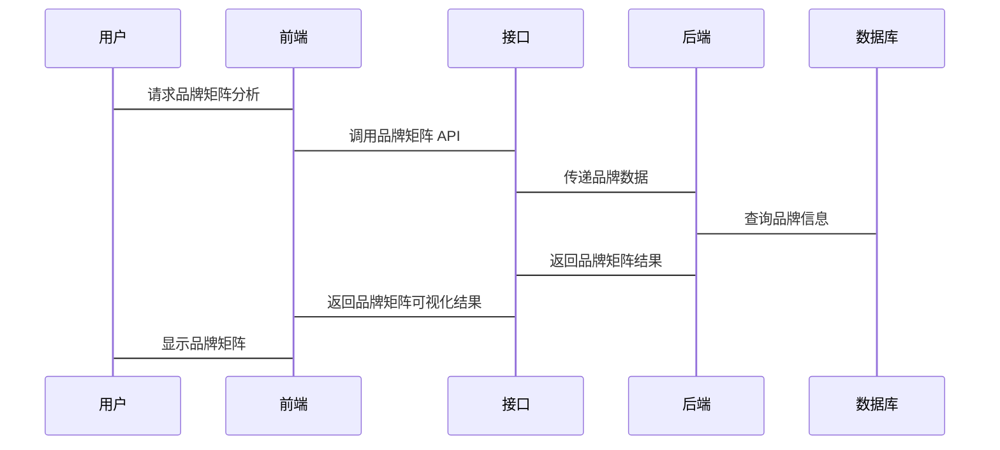

                 


# 彼得林奇如何评估公司的品牌矩阵管理效果

> 关键词：彼得·林奇，品牌矩阵，公司管理，评估方法，投资策略

> 摘要：本文深入探讨了彼得·林奇如何通过品牌矩阵管理模型来评估公司的品牌管理效果。文章从品牌矩阵的核心概念、评估维度、数学模型、系统架构、项目实战等方面进行了详细分析，结合实际案例，为读者提供了一套完整的品牌矩阵评估方法。

---

## 第一部分: 品牌矩阵管理的核心概念

### 第1章: 品牌矩阵管理的核心概念

#### 1.1 品牌矩阵的定义与背景

##### 1.1.1 品德矩阵的定义

品牌矩阵（Brand Matrix）是一种用于分析和评估公司品牌组合管理效果的工具。它通过将品牌按照其市场表现和战略重要性进行分类，帮助公司更好地优化品牌组合，提升整体品牌价值。

##### 1.1.2 品牌矩阵的背景与应用

彼得·林奇（Peter Lynch）作为全球知名的投资专家，他在评估公司时，常常通过品牌矩阵来分析公司的品牌组合管理效果。品牌矩阵的背景可以追溯到企业战略管理领域，其应用范围广泛，包括企业品牌管理、投资评估、市场竞争分析等。

##### 1.1.3 品牌矩阵与公司管理的关系

品牌矩阵是公司品牌管理的重要工具，它通过量化品牌的表现，帮助公司制定更科学的品牌战略。彼得·林奇将品牌矩阵作为评估公司管理效果的重要手段，通过分析品牌矩阵的维度，可以洞察公司的品牌管理能力。

#### 1.2 彼得·林奇的品牌矩阵分析方法

##### 1.2.1 彼得·林奇的分析框架

彼得·林奇的品牌矩阵分析方法基于以下框架：

1. **品牌强度**：包括市场份额、品牌认知度、品牌忠诚度等指标。
2. **市场潜力**：包括市场规模、增长率、竞争环境等指标。
3. **品牌组合**：分析公司旗下多个品牌之间的协同效应和互补性。

##### 1.2.2 品牌矩阵在投资决策中的作用

品牌矩阵在投资决策中起着关键作用。通过分析品牌矩阵，投资者可以评估公司的品牌组合是否合理，是否具备持续增长的潜力。

##### 1.2.3 品牌矩阵的评估维度

品牌矩阵的评估维度主要包括：

1. 品牌强度
2. 市场潜力
3. 竞争格局

---

### 第2章: 品牌矩阵的核心维度与指标

#### 2.1 品牌强度分析

##### 2.1.1 品牌强度的定义

品牌强度是指品牌在市场中的竞争力和影响力。它包括市场份额、品牌认知度、品牌忠诚度等指标。

##### 2.1.2 影响品牌强度的因素

- 市场份额
- 品牌认知度
- 品牌忠诚度
- 产品差异化
- 服务质量

##### 2.1.3 品牌强度的量化方法

品牌强度的量化方法可以通过以下公式进行计算：

$$
品牌强度 = \frac{市场份额 + 品牌认知度 + 品牌忠诚度}{3}
$$

#### 2.2 市场潜力分析

##### 2.2.1 市场潜力的定义

市场潜力是指某个市场未来的发展空间和增长潜力。

##### 2.2.2 影响市场潜力的因素

- 市场规模
- 市场增长率
- 行业竞争结构
- 政策环境
- 技术进步

##### 2.2.3 市场潜力的评估指标

- 市场规模
- 市场增长率
- 行业竞争指数
- 市场进入壁垒

#### 2.3 竞争格局分析

##### 2.3.1 竞争格局的定义

竞争格局是指行业内主要竞争对手的分布和竞争状况。

##### 2.3.2 竞争格局的评估方法

- 竞争对手市场份额分析
- 竞争对手产品分析
- 竞争对手策略分析

##### 2.3.3 竞争格局与品牌矩阵的关系

竞争格局直接影响品牌矩阵的布局。通过分析竞争格局，可以确定品牌在市场中的定位和竞争优势。

---

### 第3章: 品牌矩阵的评估方法与模型

#### 3.1 品牌矩阵的评估维度

##### 3.1.1 品牌强度指数

品牌强度指数是通过量化品牌在市场中的表现来评估品牌强度的指标。

$$
品牌强度指数 = \frac{市场份额 \times 品牌忠诚度}{品牌认知度}
$$

##### 3.1.2 市场潜力指数

市场潜力指数是通过量化市场的发展空间来评估市场潜力的指标。

$$
市场潜力指数 = \frac{市场规模 \times 市场增长率}{行业竞争指数}
$$

##### 3.1.3 竞争优势指数

竞争优势指数是通过量化品牌在市场中的竞争优势来评估品牌竞争力的指标。

$$
竞争优势指数 = \frac{品牌强度指数 \times 市场潜力指数}{行业平均指数}
$$

#### 3.2 品牌矩阵的数学模型

##### 3.2.1 品牌强度指数的计算公式

$$
品牌强度指数 = \frac{市场份额 + 品牌忠诚度 + 品牌认知度}{3}
$$

##### 3.2.2 市场潜力指数的计算公式

$$
市场潜力指数 = \frac{市场规模 \times 市场增长率}{行业平均增长率}
$$

##### 3.2.3 竞争优势指数的计算公式

$$
竞争优势指数 = \frac{品牌强度指数 \times 市场潜力指数}{行业平均指数}
$$

#### 3.3 品牌矩阵的可视化方法

##### 3.3.1 品牌矩阵的二维坐标系

品牌矩阵可以通过二维坐标系进行可视化，横轴代表市场潜力，纵轴代表品牌强度。

##### 3.3.2 品牌矩阵的分类区域

品牌矩阵可以分为四个区域：

- **高潜力、高强度**：核心品牌
- **高潜力、低强度**：潜力品牌
- **低潜力、高强度**：成熟品牌
- **低潜力、低强度**：衰退品牌

---

## 第四部分: 系统分析与架构设计方案

### 第4章: 系统分析与架构设计方案

#### 4.1 问题场景介绍

在本文中，我们将通过一个实际案例来介绍品牌矩阵的系统分析与架构设计方案。假设我们正在评估一家公司的品牌矩阵，以确定其品牌组合的管理效果。

#### 4.2 项目介绍

##### 4.2.1 项目目标

- 评估公司品牌组合的管理效果
- 分析品牌矩阵的各个维度
- 提供优化品牌组合的建议

##### 4.2.2 项目范围

- 品牌强度分析
- 市场潜力分析
- 竞争格局分析

#### 4.3 系统功能设计

##### 4.3.1 领域模型（Mermaid 类图）

```mermaid
classDiagram

    class 品牌矩阵 {
        品牌强度
        市场潜力
        竞争优势
    }

    class 品牌组合管理 {
        品牌强度指数
        市场潜力指数
        竞争优势指数
    }

    brandMatrix -> 品牌组合管理
```

##### 4.3.2 系统架构设计（Mermaid 架构图）


##### 4.3.3 系统接口设计（Mermaid 序列图）



---

## 第五部分: 项目实战

### 第5章: 项目实战

#### 5.1 环境安装

为了进行品牌矩阵分析，我们需要以下环境：

- 数据分析工具：Python、Pandas、Matplotlib
- 可视化工具：Mermaid、Excel
- 开发工具：Jupyter Notebook

#### 5.2 核心实现

##### 5.2.1 数据收集

收集公司品牌矩阵的相关数据，包括市场份额、品牌忠诚度、品牌认知度等。

##### 5.2.2 数据处理

对收集到的数据进行清洗和预处理，确保数据的准确性和完整性。

##### 5.2.3 品牌矩阵计算

根据数学模型，计算品牌强度指数、市场潜力指数和竞争优势指数。

##### 5.2.4 可视化

将计算结果可视化，生成品牌矩阵的二维坐标图。

#### 5.3 案例分析

##### 5.3.1 案例背景

以某公司为例，分析其品牌矩阵管理效果。

##### 5.3.2 数据分析

通过数据分析工具，计算该公司品牌矩阵的各个指数。

##### 5.3.3 结果解读

根据分析结果，解读该公司品牌矩阵的管理效果，并提出优化建议。

---

## 第六部分: 总结

### 第6章: 总结

#### 6.1 总结

本文通过详细介绍彼得·林奇如何评估公司品牌矩阵管理效果，深入分析了品牌矩阵的核心概念、评估维度、数学模型和系统架构。通过实际案例分析，展示了品牌矩阵在实际应用中的效果。

#### 6.2 最佳实践 tips

- 定期更新品牌矩阵
- 确保数据的准确性和完整性
- 结合实际业务需求进行品牌矩阵分析

#### 6.3 小结

品牌矩阵是评估公司品牌管理效果的重要工具。通过合理使用品牌矩阵，可以有效提升公司的品牌管理能力，实现可持续发展。

#### 6.4 注意事项

- 数据收集的准确性
- 模型应用的适用性
- 分析结果的客观性

#### 6.5 拓展阅读

- 品牌矩阵的其他应用
- 品牌矩阵与企业战略的结合
- 品牌矩阵的动态优化

---

通过以上详细分析，我们可以看到，品牌矩阵作为一种强大的工具，能够帮助企业更好地管理和优化品牌组合，实现长期的竞争优势。

