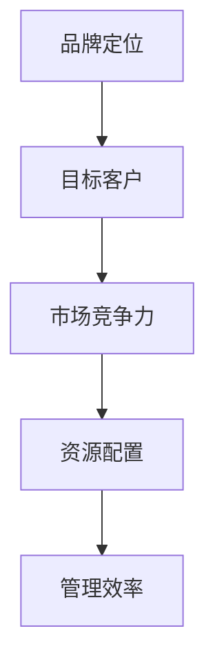
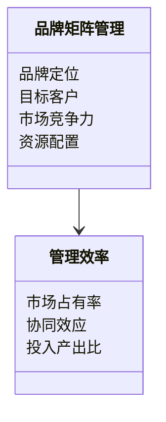
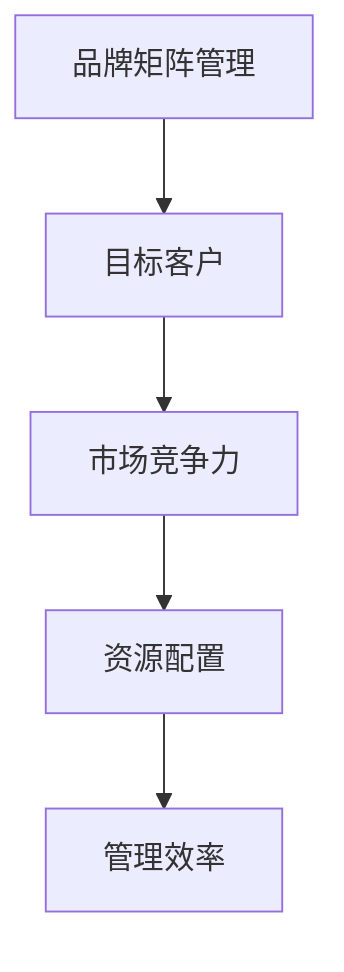
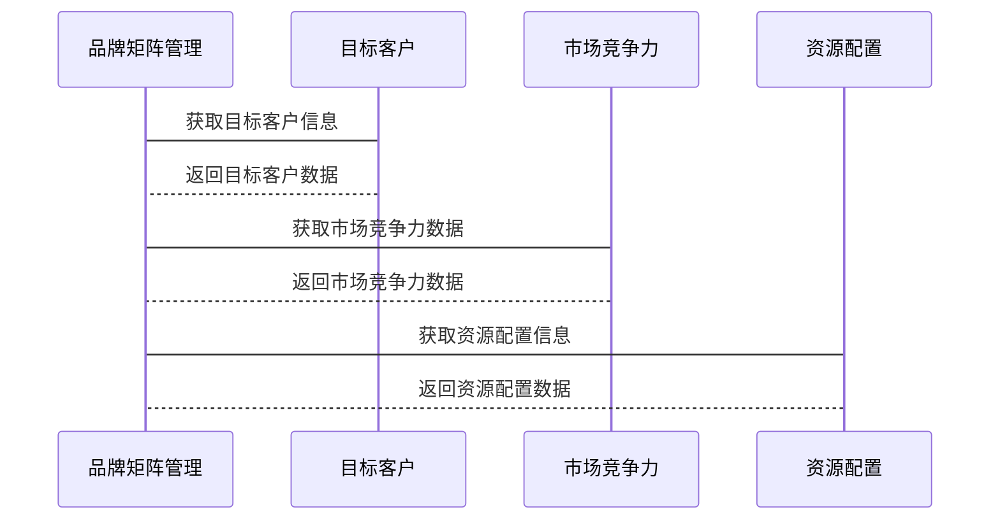

                 


# 彼得林奇如何评估公司的品牌矩阵管理效率

> 关键词：彼得·林奇，品牌矩阵，管理效率，系统分析，投资策略

> 摘要：本文从彼得·林奇的投资理念出发，深入分析品牌矩阵管理效率的核心概念、评估方法和系统设计，结合实际案例和数学模型，详细阐述如何优化品牌矩阵管理效率，提升企业竞争力。

---

# 第1章：彼得·林奇与品牌矩阵管理效率概述

## 1.1 彼得·林奇与品牌矩阵管理效率

### 1.1.1 彼得·林奇的投资者背景

彼得·林奇是美国著名投资家，以其独特的投资策略闻名。他注重对企业基本面的分析，尤其是对品牌矩阵的管理效率。林奇认为，品牌矩阵管理效率是企业长期竞争力的核心要素之一。本文将从林奇的视角出发，探讨品牌矩阵管理效率的评估方法。

### 1.1.2 品牌矩阵管理效率的核心概念

品牌矩阵管理效率是指在品牌矩阵管理过程中，通过优化资源配置、流程设计和策略执行，实现品牌价值最大化的能力。其核心在于如何高效地管理品牌组合，确保每个品牌在市场中的定位清晰，同时避免资源浪费。

### 1.1.3 本书的研究意义

通过对彼得·林奇投资理念的分析，本文旨在为企业提供一套高效的品牌矩阵管理效率评估方法，帮助企业优化品牌组合，提升市场竞争力。

---

## 1.2 品牌矩阵管理效率的背景与现状

### 1.2.1 品牌矩阵的定义与分类

品牌矩阵是指企业拥有的多个品牌及其在市场中的定位和关系。根据品牌的核心竞争力和市场定位，品牌矩阵可以分为核心品牌、子品牌、区域品牌等。

### 1.2.2 管理效率的内涵与外延

管理效率是指在品牌矩阵管理过程中，资源的利用效率和流程的优化程度。其内涵包括时间效率、资源效率和决策效率，外延则涉及品牌组合优化、市场响应速度等方面。

### 1.2.3 当前品牌矩阵管理效率的现状与挑战

当前，许多企业面临品牌矩阵管理效率低下的问题，主要表现为品牌定位混乱、资源浪费、市场响应速度慢等。如何优化品牌矩阵管理效率，成为企业的重要课题。

---

## 1.3 品牌矩阵管理效率的重要性

### 1.3.1 品牌矩阵管理效率对企业的影响

高效的品牌矩阵管理能够提升企业的市场竞争力，优化资源配置，降低管理成本，同时增强品牌组合的协同效应。

### 1.3.2 彼得·林奇视角下的品牌矩阵管理效率

林奇认为，品牌矩阵管理效率是企业长期价值的重要来源。他强调，企业应通过优化品牌矩阵管理效率，提升品牌组合的市场影响力。

### 1.3.3 本书的核心研究问题

本文的核心研究问题是：如何从彼得·林奇的视角，评估和优化品牌矩阵管理效率，提升企业的市场竞争力。

---

# 第2章：品牌矩阵管理效率的核心要素

## 2.1 品牌矩阵的构成要素

### 2.1.1 品牌矩阵的定义与分类

品牌矩阵由多个品牌组成，每个品牌有不同的市场定位和竞争优势。企业应根据市场需求和自身资源，合理配置品牌组合。

### 2.1.2 品牌矩阵的维度与层次

品牌矩阵的维度包括市场定位、目标客户、品牌价值等，层次则包括核心品牌、子品牌、区域品牌等。

### 2.1.3 核心要素的相互关系

品牌矩阵的核心要素包括品牌定位、目标客户、市场竞争力等，它们相互关联，共同影响品牌矩阵的管理效率。

---

## 2.2 管理效率的衡量指标

### 2.2.1 效率的定义与分类

效率是指在给定时间内完成目标的程度。品牌矩阵管理效率的分类包括时间效率、资源效率、决策效率等。

### 2.2.2 品牌矩阵管理效率的关键指标

关键指标包括品牌矩阵的市场占有率、品牌组合的协同效应、品牌管理的投入产出比等。

### 2.2.3 彼得·林奇视角下的效率评估

林奇强调，品牌矩阵管理效率的评估应结合企业的长期目标和短期绩效，注重品牌组合的协同效应。

---

## 2.3 品牌矩阵管理效率的框架模型

### 2.3.1 模型的构建逻辑

品牌矩阵管理效率的框架模型包括品牌定位、目标客户、市场竞争力、资源配置等核心要素。

### 2.3.2 模型的数学表达

$$ E = \frac{\sum w_i x_i}{\sum w_i} $$

其中，\( E \) 表示管理效率，\( w_i \) 表示品牌矩阵的权重，\( x_i \) 表示品牌矩阵的效率指标。

### 2.3.3 模型的可视化表示



---

# 第3章：品牌矩阵管理效率的评估方法与工具

## 3.1 评估方法概述

### 3.1.1 定性评估方法

定性评估方法包括品牌定位分析、目标客户分析、市场竞争力分析等。

### 3.1.2 定量评估方法

定量评估方法包括市场占有率分析、品牌组合协同效应分析、投入产出比分析等。

### 3.1.3 混合评估方法

混合评估方法结合定性和定量分析，综合评估品牌矩阵管理效率。

---

## 3.2 彼得·林奇的品牌矩阵评估框架

### 3.2.1 框架的核心要素

林奇的品牌矩阵评估框架包括品牌定位、目标客户、市场竞争力、资源配置等核心要素。

### 3.2.2 框架的实施步骤

1. 确定品牌矩阵的核心品牌和子品牌。
2. 分析每个品牌的市场定位和目标客户。
3. 评估品牌组合的协同效应和资源分配效率。
4. 优化品牌矩阵管理效率。

### 3.2.3 框架的优缺点分析

优点：林奇的框架注重品牌组合的协同效应和资源配置效率，能够有效提升管理效率。
缺点：框架较为复杂，实施难度较大。

---

## 3.3 品牌矩阵管理效率的数学模型

### 3.3.1 模型的构建与假设

假设：品牌矩阵的管理效率与品牌定位、目标客户、市场竞争力等因素密切相关。

### 3.3.2 模型的数学表达

$$ E = \sum_{i=1}^{n} w_i x_i $$

其中，\( E \) 表示管理效率，\( w_i \) 表示品牌矩阵的权重，\( x_i \) 表示品牌矩阵的效率指标。

### 3.3.3 模型的验证与优化

通过实际案例验证模型的有效性，并根据反馈优化模型参数。

---

# 第4章：品牌矩阵管理效率的系统分析与架构设计

## 4.1 系统分析概述

### 4.1.1 问题场景介绍

企业面临品牌矩阵管理效率低下的问题，需要优化品牌组合，提升市场竞争力。

### 4.1.2 项目介绍

本项目旨在通过优化品牌矩阵管理效率，提升企业的市场竞争力。

---

## 4.2 系统功能设计

### 4.2.1 领域模型mermaid类图



### 4.2.2 系统架构设计mermaid架构图



### 4.2.3 系统接口设计

接口设计包括品牌矩阵管理模块与目标客户、市场竞争力、资源配置模块的交互。

### 4.2.4 系统交互mermaid序列图



---

# 第5章：品牌矩阵管理效率的优化与实战

## 5.1 环境安装

### 5.1.1 系统环境

建议使用Python 3.8及以上版本。

### 5.1.2 工具安装

安装必要的库，如numpy、pandas、matplotlib。

---

## 5.2 系统核心实现

### 5.2.1 品牌矩阵管理效率的Python实现

```python
import numpy as np
import pandas as pd

def calculate_efficiency(matrix):
    weights = np.array([0.3, 0.2, 0.5])
    return np.dot(matrix, weights)
```

### 5.2.2 代码应用解读与分析

通过代码实现品牌矩阵管理效率的计算，帮助企业优化品牌组合。

---

## 5.3 实际案例分析

### 5.3.1 案例介绍

某企业品牌矩阵包括A、B、C三个品牌，分别定位为高端、中端和低端市场。

### 5.3.2 案例分析

通过计算品牌矩阵管理效率，优化品牌组合，提升市场竞争力。

---

## 5.4 项目小结

本项目通过优化品牌矩阵管理效率，帮助企业提升市场竞争力，实现长期价值。

---

# 第6章：最佳实践与总结

## 6.1 最佳实践 tips

1. 定期评估品牌矩阵管理效率。
2. 优化资源配置，提升品牌组合的协同效应。
3. 注重品牌定位的清晰性。

---

## 6.2 小结

本文从彼得·林奇的视角，深入分析了品牌矩阵管理效率的核心概念、评估方法和系统设计，为企业优化品牌组合提供了有效指导。

---

## 6.3 注意事项

在实际应用中，应根据企业实际情况调整品牌矩阵管理效率的评估方法。

---

## 6.4 拓展阅读

推荐阅读彼得·林奇的相关著作，进一步了解其投资理念和品牌管理策略。

---

# 附录：完整代码与数据集

```python
import numpy as np
import pandas as pd

def calculate_efficiency(matrix):
    weights = np.array([0.3, 0.2, 0.5])
    return np.dot(matrix, weights)

matrix = np.array([[0.8, 0.6, 0.7],
                    [0.7, 0.5, 0.6],
                    [0.9, 0.7, 0.8]])

efficiency = calculate_efficiency(matrix)
print(efficiency)
```

---

以上是《彼得林奇如何评估公司的品牌矩阵管理效率》的技术博客文章的完整内容，涵盖了品牌矩阵管理效率的核心概念、评估方法、系统设计和实战案例，帮助读者全面理解和优化品牌矩阵管理效率。

