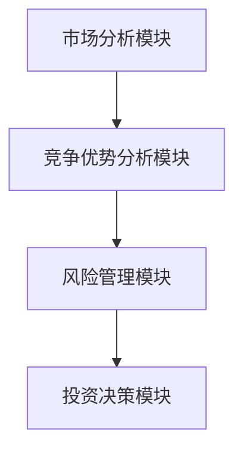

                 


# 彼得林奇如何评估公司的国际化战略

## 关键词：彼得林奇，国际化战略，风险管理，市场评估，投资评估，财务分析

## 摘要：本文深入分析了彼得林奇如何评估公司的国际化战略。通过定性和定量分析方法，结合市场潜力、竞争优势和风险管理等核心要素，详细阐述了彼得林奇的投资哲学和评估框架，并通过实例分析和系统架构设计，展示了如何将这些方法应用于实际投资决策中。

---

## 第一部分：彼得林奇与国际化战略的背景

### 第1章：彼得林奇的背景与投资理念

#### 1.1 彼得林奇的生平简介
彼得·林奇（Peter Lynch）是全球著名的职业基金经理，曾管理富达麦哲伦基金（Fidelity Magellan Fund）长达13年，取得了卓越的投资业绩。他以深入的行业研究、对公司基本面的深刻理解和对市场趋势的敏锐洞察而闻名。

#### 1.2 彼得林奇的投资哲学
彼得林奇的投资哲学可以总结为：
1. **深入研究**：通过对企业基本面的深入研究，寻找具有竞争优势的公司。
2. **长期视角**：关注企业的长期发展潜力，而非短期市场波动。
3. **分散投资**：通过分散投资降低风险，避免过度依赖单一行业或公司。
4. **风险管理**：通过合理的资产配置和风险定价，确保投资组合的稳定性。

#### 1.3 国际化战略的核心概念
国际化战略是指企业在全球范围内扩展业务，进入新的市场，利用全球资源和市场机会实现增长。彼得林奇在评估国际化战略时，重点关注以下几个方面：
1. 市场潜力：目标市场的规模、增长率和竞争格局。
2. 企业竞争优势：企业在目标市场的核心竞争力，包括成本优势、技术优势、品牌影响力等。
3. 风险管理：包括政治风险、经济风险和市场风险的评估与应对策略。

---

## 第二部分：国际化战略的评估框架

### 第2章：国际化战略的定性评估方法

#### 2.1 市场潜力分析
彼得林奇在评估国际化战略时，首先关注目标市场的潜力。他通过以下步骤进行市场潜力分析：
1. **市场规模与增长率**：分析目标市场的当前规模和未来增长率。
2. **人口结构与消费习惯**：研究目标市场的消费群体结构和消费习惯。
3. **行业竞争格局**：评估目标市场的主要竞争对手和市场集中度。

#### 2.2 竞争环境评估
彼得林奇认为，企业在国际化过程中必须具备竞争优势才能在目标市场中立足。他通过以下方法评估企业的竞争优势：
1. **成本优势**：分析企业在目标市场的生产成本和供应链管理能力。
2. **技术优势**：评估企业是否拥有核心技术或专利。
3. **品牌影响力**：研究企业在目标市场的品牌认知度和消费者忠诚度。

#### 2.3 宏观经济与政策风险
彼得林奇非常重视目标市场的宏观经济环境和政策风险。他通过以下方式评估这些因素：
1. **经济指标**：分析目标市场的GDP增长率、通货膨胀率、失业率等宏观经济指标。
2. **政策环境**：研究目标市场的贸易政策、税收政策、外汇管制等政策环境。

---

### 第3章：国际化战略的定量评估方法

#### 3.1 财务指标分析
彼得林奇通过以下财务指标评估企业的国际化战略：
1. **盈利能力**：分析企业的净利润率、ROE（净资产收益率）等指标，评估企业的盈利能力。
2. **资产负债表分析**：评估企业的资产结构、负债水平和财务健康状况。
3. **现金流分析**：研究企业的现金流情况，评估企业的财务可持续性。

#### 3.2 估值模型
彼得林奇常用以下估值模型评估企业的国际化战略：
1. **市盈率（P/E）**：通过比较目标市场的市盈率和企业的实际盈利情况，评估企业的估值是否合理。
2. **市净率（P/B）**：通过比较目标市场的市净率和企业的资产净值，评估企业的估值是否合理。
3. **折扣现金流模型（DCF）**：通过预测企业的未来现金流，计算其内在价值。

---

## 第三部分：国际化战略的风险管理

### 第4章：风险管理策略

#### 4.1 政治风险
彼得林奇在评估国际化战略时，非常重视政治风险。他通过以下方式管理政治风险：
1. **政策分析**：研究目标市场的政策变化，评估政策对企业的潜在影响。
2. **多元化投资**：通过多元化投资分散政治风险，避免过度依赖单一市场。

#### 4.2 经济风险
彼得林奇通过以下方式管理经济风险：
1. **宏观经济分析**：研究目标市场的宏观经济环境，评估经济波动对企业的影响。
2. **货币风险管理**：通过汇率 hedging（对冲）等方式，降低货币波动对投资收益的影响。

#### 4.3 市场风险
彼得林奇通过以下方式管理市场风险：
1. **分散投资**：通过分散投资降低市场风险。
2. **动态调整**：根据市场变化动态调整投资组合，及时规避市场风险。

---

## 第四部分：国际化战略的系统架构与实施

### 第5章：系统架构设计

#### 5.1 系统功能设计
彼得林奇的国际化战略评估系统主要包括以下功能模块：
1. **市场分析模块**：用于分析目标市场的市场规模、增长率、竞争格局等。
2. **竞争优势分析模块**：用于评估企业在目标市场的竞争优势。
3. **风险管理模块**：用于评估和管理国际化战略中的政治、经济和市场风险。

#### 5.2 系统架构设计
以下是彼得林奇国际化战略评估系统的架构设计图：



---

### 第6章：系统实现与案例分析

#### 6.1 系统实现
以下是彼得林奇国际化战略评估系统的部分代码实现：

```python
def market_analysis(data):
    # 数据处理
    return data

def competitive_analysis(data):
    # 竞争分析
    return data

def risk_management(data):
    # 风险管理
    return data
```

#### 6.2 案例分析
通过分析某家跨国公司的国际化战略，我们可以看到彼得林奇方法的实际应用。例如，假设某公司计划进入新兴市场，彼得林奇会通过以下步骤进行评估：
1. **市场潜力分析**：分析新兴市场的市场规模和增长率。
2. **竞争优势分析**：评估该公司在目标市场的竞争优势。
3. **风险管理**：评估政治、经济和市场风险，并制定应对策略。

---

## 第五部分：总结与展望

### 第7章：总结与展望

#### 7.1 总结
彼得林奇的国际化战略评估方法以其深入的市场分析、竞争优势评估和风险管理策略为核心，为投资者提供了系统化的评估框架。

#### 7.2 展望
未来，随着全球化的深入发展，彼得林奇的国际化战略评估方法将更加重要。投资者需要不断学习和适应新的市场环境，以应对日益复杂的全球市场挑战。

---

## 附录：最佳实践与注意事项

- **最佳实践**：
  - 在评估国际化战略时，应注重定性分析与定量分析的结合。
  - 定期更新市场分析和竞争对手信息，确保评估结果的准确性。
  - 通过多元化投资降低风险，避免过度依赖单一市场。

- **注意事项**：
  - 风险管理是国际化战略的核心，必须引起足够的重视。
  - 在实际操作中，应结合具体市场环境和企业实际情况，灵活调整评估策略。

通过本文的分析，读者可以全面了解彼得林奇如何评估公司的国际化战略，并将其应用于实际投资决策中。

