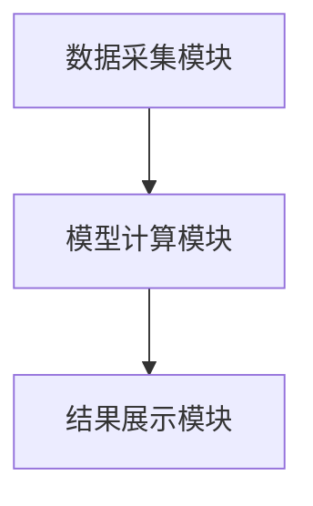

                 

# 彼得林奇如何评估公司的定价能力

---

## 关键词
定价能力，彼得·林奇，定价权，定价弹性，定价效率，定价模型，投资分析

---

## 摘要
定价能力是企业在市场上竞争的关键因素之一，直接影响公司的利润和市场地位。本文以彼得·林奇的投资理念为核心，详细探讨如何评估公司的定价能力。通过分析定价权、定价弹性和定价效率等核心要素，结合数学模型和实际案例，为投资者提供系统化的评估方法。文章内容涵盖定价能力的定义、评估模型的构建、系统设计以及实战应用，旨在帮助读者深入理解并掌握定价能力的评估技巧。

---

## 正文

### 第1章：定价能力的核心概念

#### 1.1 定价能力的定义与重要性

定价能力是指企业在市场上根据市场需求和竞争环境，合理设定产品或服务价格的能力。它不仅影响公司的利润，还决定了公司在市场中的竞争力和可持续发展能力。

**定价能力的重要性**  
- **利润最大化**：合理的定价策略能够确保公司在获得最大市场份额的同时，实现利润最大化。  
- **竞争优势**：定价能力强的企业能够在竞争中占据优势，甚至通过差异化定价策略制定行业标准。  
- **市场响应**：定价能力使企业能够快速适应市场变化，抓住市场机会或规避风险。

#### 1.2 彼得·林奇的背景与投资理念

彼得·林奇是美国著名的基金经理和投资专家，以其独特的投资哲学闻名。他强调基本面分析和对公司定价能力的关注。

**林奇的投资理念**  
- **价值投资**：寻找那些市场价格低于内在价值的公司。  
- **竞争优势**：关注那些具有定价能力、市场领导地位和强大财务表现的企业。  
- **长期视角**：投资于能够持续增长和适应市场变化的公司。

---

### 第2章：定价能力的核心要素

#### 2.1 定价权的定义与特征

**定价权**是指企业在市场中能够自主决定产品价格的能力。拥有定价权的企业通常具有强大的市场地位和品牌影响力。

**定价权的特征**  
- **价格领导地位**：企业能够影响市场价格，甚至制定行业标准。  
- **需求弹性低**：消费者对价格变化不敏感，需求量相对稳定。  
- **市场垄断性**：在某些特定市场或产品领域具有垄断地位。

**定价权与市场地位的关系**  
通过表格对比，可以看出定价权强的企业通常具有较高的市场占有率和品牌影响力：

| 定价权 | 市场地位       |
|--------|----------------|
| 强     | 领导地位       |
| 中     | 普通地位       |
| 弱     | 无明显地位     |

#### 2.2 定价弹性与成本结构

**定价弹性**是指价格变动对需求量的影响程度。定价弹性高的产品，价格变动会导致需求量大幅波动。

**成本结构对定价弹性的影响**  
- **固定成本高**：价格下降可能导致边际利润为负，企业难以灵活调整价格。  
- **可变成本低**：企业能够更灵活地调整价格，以适应市场需求。

**定价弹性与利润率的关系**  
通过数学公式可以量化定价弹性的变化对利润率的影响：

$$ 利润率 = \frac{总收入 - 总成本}{总收入} $$

---

### 第3章：定价能力评估模型的构建

#### 3.1 林奇定价能力评分模型

**模型构建思路**  
- 以定价权、定价弹性和定价效率为核心指标，结合企业财务数据进行综合评估。  
- 采用加权评分法，权重根据行业特点和企业实际情况调整。

**模型输入变量**  
- 定价权：市场占有率、品牌影响力  
- 定价弹性：需求弹性系数、价格敏感度  
- 定价效率：成本控制能力、利润转化率  

**模型输出结果**  
- 定价能力综合评分（满分100分）  
- 评分结果对应的投资建议（买入、持有、卖出）

**数学公式**  
定价能力评分公式为：

$$ 定价能力评分 = w_1 \cdot 定价权 + w_2 \cdot 定价弹性 + w_3 \cdot 定价效率 $$

其中，$$w_1 + w_2 + w_3 = 1$$

---

### 第4章：定价能力的系统分析

#### 4.1 系统功能设计

**数据采集模块**  
- 采集企业财务数据、市场数据和竞争数据。  
- 数据来源包括公司财报、行业报告和市场调研。

**模型计算模块**  
- 对输入数据进行清洗和预处理。  
- 使用林奇定价能力评分模型计算综合评分。

**结果展示模块**  
- 生成评分报告，包括评分结果、投资建议和改进建议。  
- 提供可视化图表，直观展示评分结果。

#### 4.2 系统架构设计

**模块关系**  
- 数据采集模块与模型计算模块通过API接口交互。  
- 模型计算模块处理数据后，将结果传递给结果展示模块。

**系统架构图**  

---

### 第5章：定价能力的实战应用

#### 5.1 案例背景介绍

**案例公司：某科技公司**  
- 主要业务：电子产品制造  
- 市场地位：市场份额约为20%  
- 财务数据：利润率15%，成本控制能力良好

#### 5.2 案例分析与解读

**数据处理与分析**  
- 市场占有率：20%（高）  
- 品牌影响力：中等偏上  
- 需求弹性系数：0.8（较高）  
- 成本控制能力：优秀

**模型应用与结果**  
- 定价权评分：85分  
- 定价弹性评分：70分  
- 定价效率评分：90分  
- 综合评分：80分（良好）

**结果分析与建议**  
- 综合评分良好，建议投资者买入或持有。  
- 需进一步提升定价弹性，降低价格敏感度。

---

### 第6章：定价能力的优化与提升

#### 6.1 定价策略的优化

**差异化定价**  
- 根据客户群体制定不同价格策略，如高端客户溢价定价。  
- 通过产品线延伸，满足不同需求层次。

**成本控制**  
- 优化生产流程，降低单位成本。  
- 与供应商建立长期合作关系，获得价格优惠。

---

## 第七部分：最佳实践与总结

### 7.1 小结

- 定价能力是企业核心竞争力的重要组成部分。  
- 彼得·林奇的定价能力评估模型为投资者提供了科学的分析工具。  
- 实战案例证明，模型能够有效指导投资决策。

### 7.2 注意事项

- 数据准确性：确保输入数据的准确性和完整性。  
- 模型适用性：根据不同行业特点调整模型参数。  
- 风险控制：结合宏观经济环境和市场变化进行动态调整。

### 7.3 未来展望

- 结合人工智能技术，优化定价模型。  
- 开发实时定价监控系统，提升企业应对市场变化的能力。

---

## 结语

通过本文的详细讲解，读者可以全面了解彼得·林奇的定价能力评估方法，并能够将其应用于实际投资分析中。定价能力的评估不仅帮助企业优化定价策略，也为投资者提供了重要的决策依据。

---

## 参考文献

1. 彼得·林奇《彼得·林奇的投资哲学》
2. 《定价策略与市场分析》
3. 相关学术论文和研究报告

