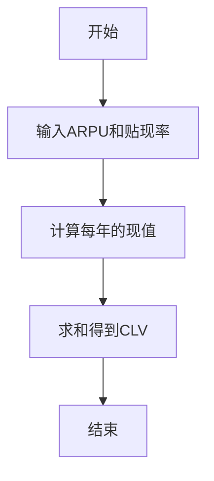
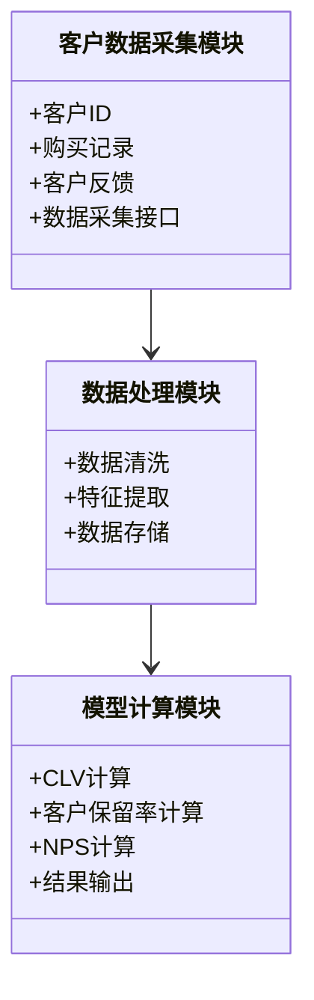

                 


# 彼得林奇如何评估公司的客户忠诚度对长期盈利的影响

## 关键词：客户忠诚度、长期盈利、彼得·林奇、CLV、客户保留率、NPS、投资策略

## 摘要：本文将深入探讨彼得·林奇如何通过客户忠诚度评估公司的长期盈利能力。我们将从客户忠诚度的基本概念入手，分析其与长期盈利的关系，并结合数学模型和实际案例，详细阐述如何通过客户生命周期价值（CLV）、客户保留率、客户净推荐值（NPS）等指标来评估客户忠诚度。同时，我们将展示如何通过系统架构设计和算法实现，将客户忠诚度评估转化为可操作的投资决策依据。

---

## 第1章: 背景介绍

### 1.1 客户忠诚度的基本概念与重要性

客户忠诚度是指客户对企业产品或服务的持续购买意愿和行为。它不仅仅是客户对品牌的满意程度，还包括客户在面对竞争时的选择倾向。客户忠诚度高的客户通常会重复购买、推荐他人使用，并在品牌出现问题时给予企业更多的宽容和信任。

客户忠诚度与长期盈利能力密切相关。忠诚的客户通常具有较高的生命周期价值（CLV），他们为企业带来的收入和利润远高于新客户。同时，获取新客户的成本通常高于维护现有客户的成本，因此，客户忠诚度高的企业往往能够在竞争中占据优势。

彼得·林奇作为全球著名投资家，他强调客户忠诚度是企业长期盈利能力的重要指标。他认为，一个公司如果能够保持较高的客户忠诚度，说明其产品或服务具有不可替代的价值，这通常是企业竞争优势的体现。

---

## 第2章: 客户忠诚度的评估指标与模型

### 2.1 客户生命周期价值（CLV）

客户生命周期价值（Customer Lifetime Value, CLV）是衡量客户对企业长期贡献的核心指标。CLV的计算公式如下：

$$ CLV = (ARPU \times (1 - DISCOUNT RATE)) \div (1 - (1 - CHURN RATE)) $$

其中：
- ARPU：客户年收入
- DISCOUNT RATE：贴现率
- CHURN RATE：客户流失率

**表格对比：CLV与其他客户忠诚度指标的对比**

| 指标       | 定义                               | 优势                         | 局限性                       |
|------------|------------------------------------|------------------------------|------------------------------|
| CLV        | 客户一生为企业带来的总收入         | 全面反映客户价值               | 计算复杂，需要假设参数       |
| 客户保留率 | 客户在一定时间内继续使用服务的比例 | 易于计算，反映客户粘性         | 无法直接反映客户贡献的经济价值 |
| NPS        | 客户净推荐值，衡量客户推荐意愿     | 反映客户满意度和忠诚度         | 无法直接反映客户经济价值     |

### 2.2 客户保留率

客户保留率是衡量客户忠诚度的重要指标。其计算公式为：

$$ 客户保留率 = (总客户数 - 流失客户数) / 总客户数 $$

**mermaid流程图：客户保留率计算流程**

```mermaid
graph TD
    A[总客户数] --> B[流失客户数]
    B --> C[客户保留数]
    C --> D[客户保留率]
    D --> E(客户保留率 = (总客户数 - 流失客户数)/总客户数)
```

---

## 第3章: 算法原理与系统架构设计

### 3.1 客户忠诚度评估算法原理

客户忠诚度评估可以通过机器学习算法实现，例如使用逻辑回归或决策树模型。以下是CLV的数学模型：

$$ CLV = \sum_{t=1}^{n} \frac{ARPU_t}{(1 + r)^{t-1}} $$

其中：
- \( ARPU_t \)：第 \( t \) 年的客户收入
- \( r \)：贴现率
- \( n \)：客户生命周期长度

**mermaid流程图：CLV计算流程**



### 3.2 系统架构设计

**mermaid类图：系统功能模块**



---

## 第4章: 项目实战与案例分析

### 4.1 环境安装与数据准备

**Python代码示例：安装依赖库**

```python
import numpy as np
import pandas as pd
from sklearn.linear_model import LogisticRegression
```

### 4.2 核心代码实现

**计算客户忠诚度的代码示例：**

```python
def calculate_clv(arpu, discount_rate, churn_rate, period):
    clv = (arpu * (1 - discount_rate)) / (1 - (1 - churn_rate))
    return clv

# 示例数据
arpu = 100
discount_rate = 0.05
churn_rate = 0.1
period = 5

clv = calculate_clv(arpu, discount_rate, churn_rate, period)
print(f"客户生命周期价值：{clv:.2f}")
```

### 4.3 案例分析

以亚马逊为例，假设其客户年收入（ARPU）为100美元，贴现率为5%，客户流失率为10%。则其客户生命周期价值为：

$$ CLV = \frac{100 \times (1 - 0.05)}{1 - (1 - 0.1)} = \frac{95}{0.1} = 950 \text{美元} $$

---

## 第5章: 最佳实践与总结

### 5.1 最佳实践

- 定期收集客户反馈，及时优化产品和服务。
- 使用客户忠诚度指标（如CLV、NPS）作为投资决策的重要依据。
- 结合客户行为分析，预测客户流失风险，提前采取措施。

### 5.2 小结

客户忠诚度是企业长期盈利能力的核心驱动力。通过彼得·林奇的投资理念，我们可以将客户忠诚度量化为具体的经济指标，从而更好地指导投资决策。

---

## 总结

通过本文的分析，我们可以看到，客户忠诚度不仅是企业竞争优势的核心，更是长期盈利的关键。彼得·林奇通过CLV、客户保留率等指标，为企业提供了科学的客户忠诚度评估方法。未来，随着技术的发展，客户忠诚度评估将更加精准和动态，为企业创造更大的价值。

