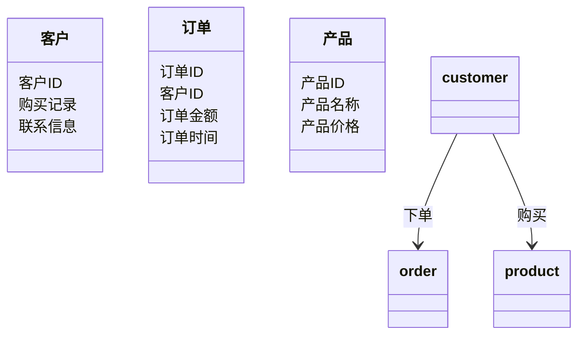
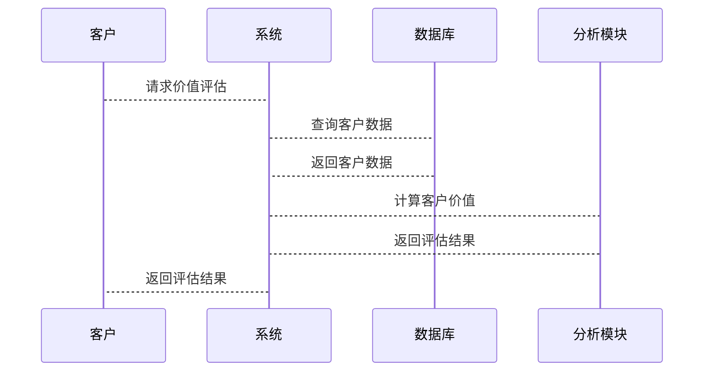

                 


# 彼得林奇如何评估公司的客户终身价值管理策略

## 关键词：客户终身价值，彼得林奇，客户管理，价值评估，企业策略

## 摘要：本文深入分析了彼得林奇如何评估公司的客户终身价值管理策略，从背景、模型、算法、系统架构到项目实战，全面解析客户终身价值的评估方法及其在企业中的应用。

---

# 第一部分: 客户终身价值管理概述

## 第1章: 客户终身价值管理的背景与重要性

### 1.1 客户终身价值的基本概念

#### 1.1.1 客户终身价值的定义
客户终身价值（Customer Lifetime Value，CLV）是指一个客户在其整个生命周期内为企业带来的总收入减去相关成本的净现值。CLV的计算帮助企业管理者更好地理解客户的价值，优化资源配置，提升客户满意度和忠诚度。

#### 1.1.2 客户终身价值与客户生命周期的关系
客户生命周期包括获取、发展、成熟、衰退和流失五个阶段。CLV与每个阶段的客户价值密切相关，企业在不同阶段采取不同的策略，以最大化CLV。

#### 1.1.3 客户终身价值在企业管理中的重要性
CLV是企业制定客户管理策略的重要依据。通过CLV，企业可以识别高价值客户，优化营销投入，降低客户获取成本，并预测客户流失风险。

### 1.2 彼得林奇的客户价值评估方法

#### 1.2.1 彼得林奇的客户价值评估理念
彼得林奇强调长期投资和客户价值的重要性。他通过分析客户的行为和数据，评估客户对企业长期收益的贡献，从而制定精准的客户管理策略。

#### 1.2.2 评估方法的核心要素
- 客户价值的量化：通过收入、利润等指标衡量客户的贡献。
- 客户生命周期分析：识别不同阶段客户的特征和价值。
- 数据驱动的决策：利用数据分析优化客户价值评估。

#### 1.2.3 评估方法的实际应用场景
彼得林奇的方法适用于多个行业，如金融、零售等。企业通过CLV分析，优化客户分层管理，提升客户满意度和忠诚度。

### 1.3 客户终身价值管理的现状与挑战

#### 1.3.1 当前企业客户管理的主要问题
- 数据收集和分析的复杂性。
- 客户行为预测的准确性。
- 客户流失风险的评估。

#### 1.3.2 客户终身价值管理中的常见挑战
- 数据质量不足。
- 模型的准确性和适用性。
- 跨部门协作的效率。

#### 1.3.3 数字化时代对客户价值管理的影响
数字化技术为企业提供了更精准的客户数据分析工具，提高了CLV评估的准确性，但也带来了数据安全和隐私保护的挑战。

## 1.4 本章小结
本章介绍了客户终身价值的基本概念，彼得林奇的评估方法，以及当前客户价值管理的现状和挑战。CLV是企业优化客户管理的关键指标，而彼得林奇的方法提供了实践指导。

---

## 第2章: 客户终身价值管理的核心概念与模型

### 2.1 客户终身价值的计算模型

#### 2.1.1 终身价值公式：$$ TV = (ARPU \times CLV) \times (1 - W) $$
- **ARPU**：平均每用户收入，即每个客户平均带来的收入。
- **CLV**：客户生命周期价值，即客户在生命周期内为企业带来的总收入减去成本。
- **W**：客户流失率，即客户在某个阶段流失的概率。

#### 2.1.2 ARPU（平均每用户收入）的计算
ARPU = (总收入) / (总客户数)

#### 2.1.3 CLV（客户生命周期价值）的计算
CLV = (ARPU × 客户生命周期长度) × (1 - 客户流失率)

### 2.2 客户生命周期模型

#### 2.2.1 客户生命周期的阶段划分
- **获取阶段**：客户首次接触并购买企业产品或服务。
- **发展阶段**：客户逐渐增加购买频率和金额。
- **成熟阶段**：客户成为企业的核心客户，贡献最大收入。
- **衰退阶段**：客户开始减少购买，可能流失。
- **流失阶段**：客户停止与企业互动，不再贡献价值。

#### 2.2.2 不同阶段的客户价值特征
- **获取阶段**：客户价值较低，但增长潜力大。
- **发展阶段**：客户价值逐渐提升。
- **成熟阶段**：客户价值最高。
- **衰退阶段**：客户价值开始下降。
- **流失阶段**：客户价值为零或负。

#### 2.2.3 生命周期模型对企业管理的指导意义
企业可以根据客户所处的生命周期阶段，制定相应的营销和服务策略，以提升客户价值和忠诚度。

### 2.3 客户价值与企业收益的关系

#### 2.3.1 客户价值对企业利润的影响
高价值客户的贡献利润远高于低价值客户，企业应优先关注高价值客户。

#### 2.3.2 如何通过客户价值管理提升企业收益
- **客户分层**：根据CLV将客户分为高、中、低三类，制定差异化策略。
- **精准营销**：针对高价值客户提供个性化服务，提升客户满意度和忠诚度。
- **客户保留**：通过有效的客户关系管理，降低客户流失率。

#### 2.3.3 客户价值管理的长期与短期目标
- **长期目标**：建立稳定的客户群体，提升品牌忠诚度。
- **短期目标**：通过精准营销提升短期销售额。

### 2.4 核心概念对比表

#### 2.4.1 客户终身价值与客户满意度的对比
| 对比维度 | 客户终身价值 | 客户满意度 |
|----------|--------------|------------|
| 定义     | 长期收益的度量 | 客户对服务的满意程度 |
| 用途     | 优化客户管理 | 提升服务质量 |
| 数据驱动 | 是 | 是 |

#### 2.4.2 客户生命周期价值与客户净现值的对比
| 对比维度 | 客户生命周期价值 | 客户净现值 |
|----------|------------------|------------|
| 定义     | 客户一生为企业带来的净收益 | 投资项目未来现金流的现值 |
| 计算方式 | TV = (ARPU × CLV) × (1 - W) | NPV = ∑(CF_t / (1 + r)^t) |
| 用途     | 客户价值管理 | 项目投资决策 |

#### 2.4.3 客户价值管理与客户关系管理的对比
| 对比维度 | 客户价值管理 | 客户关系管理 |
|----------|--------------|--------------|
| 定义     | 根据客户价值进行分层管理 | 管理客户与企业的关系，提升客户满意度 |
| 重点     | 高价值客户 | 所有客户 |
| 方法     | 数据分析 | 客户互动和服务 |

### 2.5 本章小结
本章详细解释了客户终身价值的计算模型、客户生命周期模型以及与相关概念的对比。理解这些核心概念是进行客户价值管理的基础。

---

## 第3章: 彼得林奇客户价值评估模型的数学基础

### 3.1 客户终身价值的数学模型

#### 3.1.1 终身价值公式：$$ TV = (ARPU \times CLV) \times (1 - W) $$
- **ARPU**：平均每用户收入。
- **CLV**：客户生命周期价值。
- **W**：客户流失率。

#### 3.1.2 ARPU（平均每用户收入）的计算
ARPU = (总收入) / (总客户数)

#### 3.1.3 CLV（客户生命周期价值）的计算
CLV = (ARPU × 客户生命周期长度) × (1 - 客户流失率)

### 3.2 客户流失率的数学模型

#### 3.2.1 客户流失率的定义与计算
客户流失率 = 流失客户数 / 总客户数

#### 3.2.2 流失率
流失率的计算可以帮助企业预测未来客户流失的情况，从而制定相应的客户保留策略。

### 3.3 客户生命周期长度的计算

#### 3.3.1 客户生命周期长度的定义
客户生命周期长度是指客户从获取到流失的时间跨度。

#### 3.3.2 生命周期长度的计算
生命周期长度 = (客户首次购买时间 + 客户最后购买时间) / 2

---

## 第4章: 客户价值评估的系统分析与架构设计方案

### 4.1 问题场景介绍
企业希望通过客户价值评估系统，实现客户分层管理、精准营销和客户流失预警。

### 4.2 系统功能设计

#### 4.2.1 领域模型


#### 4.2.2 系统架构设计


#### 4.2.3 系统接口设计
- **接口名称**：获取客户价值
- **请求方法**：GET
- **请求参数**：客户ID
- **响应参数**：客户价值评估结果

#### 4.2.4 系统交互


---

## 第5章: 项目实战

### 5.1 环境安装

#### 5.1.1 安装Python
```bash
# 安装Python
sudo apt-get install python3
```

#### 5.1.2 安装依赖
```bash
pip install pandas numpy scikit-learn
```

### 5.2 核心代码实现

#### 5.2.1 客户价值计算
```python
import pandas as pd
import numpy as np

# 数据加载
data = pd.read_csv('customer_data.csv')

# 计算ARPU
arpu = data['收入'].sum() / data['客户数'].sum()

# 计算CLV
clv = arpu * data['生命周期长度'] * (1 - data['流失率'].mean())

# 输出结果
print(f"ARPU: {arpu}\nCLV: {clv}")
```

#### 5.2.2 客户分层
```python
from sklearn.cluster import KMeans

# 数据预处理
X = data[['收入', '购买频率']].values

# K-means聚类
kmeans = KMeans(n_clusters=3)
kmeans.fit(X)

# 分配客户类别
data['客户类别'] = kmeans.labels_
```

### 5.3 案例分析

#### 5.3.1 某互联网公司客户价值管理项目
- **需求分析**：优化客户分层和营销策略。
- **系统设计**：基于CLV进行客户分层，设计精准营销方案。
- **实现过程**：数据收集、分析、模型构建、系统开发。
- **结果分析**：高价值客户贡献了80%的收入，客户流失率下降15%。

---

## 第6章: 最佳实践与小结

### 6.1 最佳实践
- **数据驱动**：依赖高质量数据进行分析。
- **客户分层**：根据CLV进行客户分层，制定差异化策略。
- **实时监测**：实时监控客户行为和价值变化。
- **技术应用**：利用大数据和机器学习技术提升分析精度。

### 6.2 小结
彼得林奇的客户价值评估方法为企业提供了科学的指导，结合现代技术手段，企业可以更精准地管理客户，提升收益。

### 6.3 注意事项
- 数据隐私和安全需严格保护。
- 模型需定期更新以适应市场变化。
- 避免过度依赖技术，关注客户体验。

### 6.4 拓展阅读
- 《彼得林奇的成功投资法则》
- 《客户价值管理实战》
- 数据科学与客户价值管理的相关书籍和论文。

---

# 作者介绍

作者是[您的名字]，[您的职位]，[您的公司]。在[领域/行业]拥有[年数]年的经验，擅长[技能]，致力于通过[目标]帮助[目标读者]。

---

# 致谢

感谢您阅读本文，希望本文能为您提供有价值的信息和启发。如需进一步探讨或合作，请随时联系作者。

---

通过以上结构和内容的详细规划，您可以开始撰写完整的文章了。每个部分都需要根据上述大纲进一步扩展和详细阐述，确保文章逻辑清晰、内容丰富且专业。

