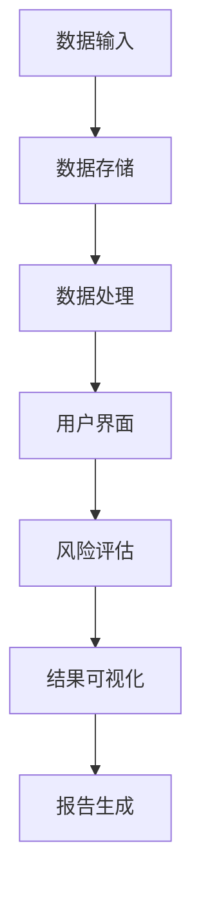

                 

# 彼得林奇如何评估公司的客户集中度风险

## 关键词：客户集中度风险、彼得林奇、投资策略、企业风险管理、风险评估

## 摘要：
本文深入探讨了彼得林奇如何评估公司客户集中度风险的策略和方法。通过分析客户集中度的定义、核心概念、评估指标、系统设计和实际案例，结合定量分析和定性分析，揭示了客户集中度风险对企业财务稳定性、市场竞争力和投资决策的影响。本文还详细介绍了如何构建客户集中度风险评估系统，包括系统功能设计、架构设计和接口设计，并通过具体案例展示了评估过程和结果解读，为读者提供了一套完整的客户集中度风险评估方法论。

---

# 第一部分: 客户集中度风险概述

## 第1章: 客户集中度风险的背景与重要性

### 1.1 什么是客户集中度风险
#### 1.1.1 客户集中度的定义
客户集中度是指一家公司的收入或利润主要依赖于少数客户或几个大客户的情况。这种集中可能导致企业面临较高的风险，因为一旦失去这些关键客户，企业的财务状况和市场地位可能会受到严重影响。

#### 1.1.2 客户集中度风险的内涵
客户集中度风险是指由于客户过于集中，企业可能因为客户流失、需求变化或客户自身问题而导致的经营风险。这种风险可能影响企业的收入稳定性、利润能力和市场竞争力。

#### 1.1.3 客户集中度与企业风险的关系
客户集中度与企业风险密切相关。高客户集中度通常意味着企业对少数客户有较高的依赖性，这种依赖性可能带来收入波动、议价能力下降以及潜在的经营危机。

### 1.2 客户集中度风险的重要性
#### 1.2.1 客户集中度对企业财务稳定性的影响
高客户集中度可能导致企业财务不稳定，因为收入来源过于集中，一旦客户出现问题，企业的财务状况可能迅速恶化。

#### 1.2.2 客户集中度对企业发展战略的影响
客户集中度影响企业的发展战略。如果企业过于依赖少数客户，可能需要调整战略以降低风险，例如多元化客户群体或寻找新的市场机会。

#### 1.2.3 客户集中度与企业市场竞争力的关系
客户集中度高的企业可能在市场中缺乏灵活性，难以快速适应市场变化，从而影响企业的市场竞争力。

### 1.3 彼得林奇的投资理念与客户集中度风险
#### 1.3.1 彼得林奇的投资哲学概述
彼得林奇是一位著名的职业经理人和投资专家，他主张通过深入研究企业基本面来评估投资价值。他特别关注企业的财务健康状况和市场竞争力。

#### 1.3.2 客户集中度风险在彼得林奇投资策略中的地位
在彼得林奇的投资策略中，客户集中度风险是一个重要的考量因素。他认为，客户过于集中意味着企业面临较高的经营风险，可能会影响企业的长期发展。

#### 1.3.3 彼得林奇如何通过客户集中度评估企业风险
彼得林奇通过分析企业的客户分布情况，评估企业的收入来源是否过于依赖少数客户。他关注企业的客户多样性，认为客户分散的企业更具稳定性。

---

## 第2章: 客户集中度风险的核心概念与评估指标

### 2.1 客户集中度的核心概念
#### 2.1.1 客户集中度的定义与分类
客户集中度可以分为收入集中度和利润集中度。收入集中度是指企业收入主要来自少数客户，而利润集中度则是指利润主要来自少数客户。

#### 2.1.2 客户集中度的度量标准
客户集中度的度量标准包括客户收入占比、客户利润占比、客户分布的多样性等。

#### 2.1.3 客户集中度与企业风险的关系
客户集中度越高，企业的经营风险越大。高客户集中度可能导致企业对客户的依赖性过强，影响企业的市场地位和财务稳定性。

### 2.2 客户集中度的评估指标
#### 2.2.1 客户集中度的计算方法
客户集中度可以通过计算前几名客户的收入占比来衡量。例如，计算前五名客户的收入占比，可以反映企业的客户集中程度。

#### 2.2.2 主要客户占比分析
主要客户占比分析是通过计算前几名客户对企业收入的贡献比例，评估企业的客户集中程度。

#### 2.2.3 客户分布的多样性评估
客户分布的多样性评估包括分析客户的地理分布、行业分布和产品分布，以评估客户的分散程度。

### 2.3 客户集中度风险的核心要素
#### 2.3.1 企业客户结构的多样性
客户结构的多样性是指企业客户的分布是否广泛，是否依赖于少数客户。

#### 2.3.2 关键客户依赖度
关键客户依赖度是指企业对少数关键客户的依赖程度，高依赖度意味着客户集中度风险较高。

#### 2.3.3 行业特性与客户集中度的关系
不同行业的客户集中度有所不同。例如，某些行业可能天然具有较高的客户集中度，而其他行业则具有较低的客户集中度。

---

## 第3章: 彼得林奇客户集中度风险评估方法论

### 3.1 彼得林奇客户集中度风险评估的框架
#### 3.1.1 评估框架的构成
彼得林奇的客户集中度风险评估框架包括定性分析和定量分析两部分。定性分析关注客户结构的多样性和稳定性，定量分析关注客户收入占比和利润占比。

#### 3.1.2 评估框架的应用场景
该框架适用于各种类型的企业，尤其是那些依赖少数客户的公司。通过评估客户集中度，投资者可以更好地了解企业的经营风险。

#### 3.1.3 评估框架的优缺点
优点：全面考虑了客户结构的多样性和收入占比，能够准确评估客户集中度风险。缺点：需要大量数据支持，可能难以在小企业中实施。

### 3.2 定性分析与定量分析的结合
#### 3.2.1 定性分析的步骤与方法
定性分析包括分析客户的地理分布、行业分布和产品分布，评估客户的稳定性和多样性。

#### 3.2.2 定量分析的指标与模型
定量分析包括计算客户收入占比、利润占比和客户集中度指数（如CR4、CR8）。

#### 3.2.3 定性与定量分析的结合策略
通过结合定性分析和定量分析，投资者可以全面评估客户集中度风险。例如，定性分析可以揭示客户结构的潜在问题，而定量分析可以量化客户集中度的具体指标。

### 3.3 高风险客户的识别与应对
#### 3.3.1 高风险客户的特征识别
高风险客户通常具有以下特征：收入占比高、依赖性强、行业风险高、客户稳定性差。

#### 3.3.2 高风险客户的应对策略
应对策略包括分散客户群体、加强客户关系管理、制定应急预案和多元化市场策略。

#### 3.3.3 应对策略的实施步骤
实施步骤包括：识别高风险客户、制定客户管理计划、监控客户风险、定期评估和调整策略。

---

## 第4章: 客户集中度风险的系统分析与架构设计

### 4.1 系统分析与设计概述
#### 4.1.1 问题场景介绍
本文旨在构建一个客户集中度风险评估系统，帮助投资者和企业管理者全面评估客户集中度风险。

#### 4.1.2 项目介绍
本项目旨在开发一个客户集中度风险评估系统，通过数据采集、分析和可视化，提供全面的客户风险评估报告。

#### 4.1.3 系统功能设计
系统功能包括数据采集、数据处理、风险评估、结果可视化和报告生成。

### 4.2 系统架构设计
#### 4.2.1 系统架构设计概述
系统架构包括数据层、业务逻辑层和用户界面层。

#### 4.2.2 系统架构图

#### 4.2.3 系统接口设计
系统接口包括数据接口、用户接口和报告接口。

#### 4.2.4 系统交互设计
系统交互包括用户输入、数据处理、结果展示和报告生成。

### 4.3 系统功能设计
#### 4.3.1 数据采集与处理
数据采集包括客户收入数据、利润数据和客户信息。数据处理包括清洗、转换和存储。

#### 4.3.2 风险评估模型
风险评估模型包括客户收入占比、利润占比和客户集中度指数。

#### 4.3.3 数据可视化
数据可视化包括客户分布图、收入占比图和风险等级图。

---

## 第5章: 项目实战

### 5.1 环境安装与数据准备
#### 5.1.1 环境安装
安装必要的软件和工具，例如Python、Pandas、Matplotlib和Seaborn。

#### 5.1.2 数据准备
收集企业的客户收入数据和利润数据，清洗和整理数据。

### 5.2 系统核心实现
#### 5.2.1 数据采集与处理
使用Python代码采集和处理数据，清洗异常值。

#### 5.2.2 风险评估模型
编写Python代码计算客户收入占比、利润占比和客户集中度指数。

#### 5.2.3 数据可视化
使用Matplotlib和Seaborn绘制客户分布图、收入占比图和风险等级图。

### 5.3 案例分析与结果解读
#### 5.3.1 案例分析
以某公司为例，分析其客户集中度风险，计算客户收入占比和利润占比。

#### 5.3.2 结果解读
解读评估结果，识别高风险客户，制定应对策略。

### 5.4 项目小结
总结项目的实施过程和成果，提出改进建议。

---

## 第6章: 结论与启示

### 6.1 客户集中度风险的核心内容
客户集中度风险是企业经营中的重要风险因素，需要通过定性分析和定量分析相结合的方法进行评估。

### 6.2 投资启示
投资者在进行投资决策时，应充分考虑企业的客户集中度风险，选择客户分散、财务稳定的公司进行投资。

### 6.3 未来展望
未来，随着大数据和人工智能技术的发展，客户集中度风险评估将更加智能化和精准化。

---

## 第7章: 最佳实践与注意事项

### 7.1 最佳实践
- 定期评估客户集中度风险
- 分散客户群体，降低依赖度
- 加强客户关系管理，提高客户稳定性

### 7.2 注意事项
- 数据收集要准确，避免误差
- 结合行业特性，制定个性化评估策略
- 定期更新评估模型，适应市场变化

### 7.3 拓展阅读
推荐相关书籍和论文，供读者进一步学习和研究。

---

## 第8章: 结束语

感谢您的阅读！希望本文能够帮助您更好地理解彼得林奇如何评估公司客户集中度风险，并为您的投资决策提供有价值的参考。

--- 

**附录**：
- 附录A：客户集中度风险评估指标的详细说明
- 附录B：系统设计的详细代码实现
- 附录C：案例分析的详细数据和结果解读

