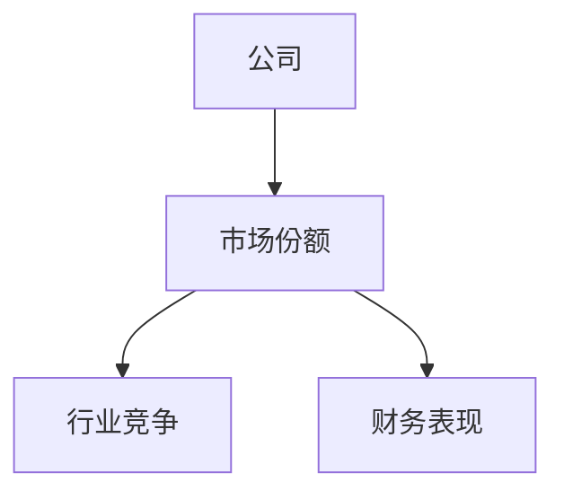
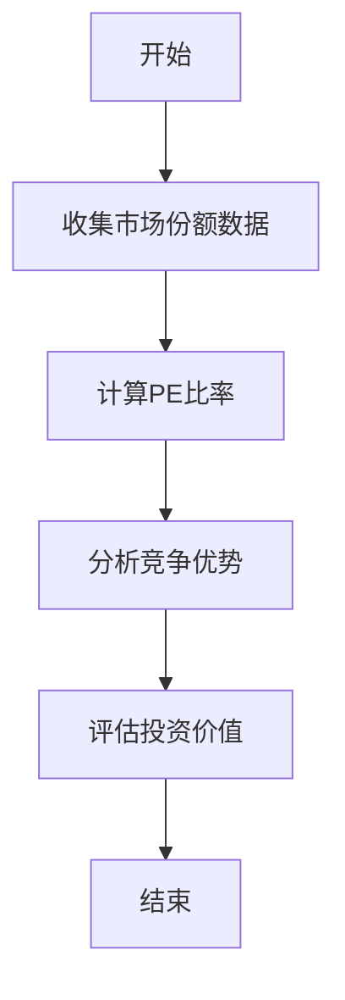

                 


# 彼得林奇如何评估公司的市场份额

## 关键词
- 彼得林奇
- 市场份额
- 投资评估
- 财务分析
- 竞争优势

## 摘要
本文详细探讨了彼得·林奇如何评估公司的市场份额，从市场份额的定义、核心概念、算法原理、系统分析到项目实战，全面解析了彼得·林奇的评估方法。通过实际案例分析和代码实现，帮助读者掌握如何利用市场份额评估进行投资决策。

---

## 第一部分：市场份额评估的背景与重要性

### 第1章：市场份额评估的背景与重要性

#### 1.1 什么是市场份额
- **市场份额的定义**：市场份额是指一家公司在特定市场中销售产品的比例，衡量公司在市场中的地位。
- **市场份额的核心要素**：
  - 销售额：公司产品在市场中的销售额占比。
  - 市场容量：整个市场的总销售额。
- **市场份额的边界与外延**：
  - 市场范围：特定地区、行业或产品类型。
  - 时间维度：市场份额可能随时间变化。

#### 1.2 彼得林奇的市场份额评估方法
- **为什么市场份额评估重要**：
  - 市场份额反映了公司的市场地位和竞争力。
  - 高市场份额意味着更强的定价权和市场影响力。
- **彼得林奇的市场份额评估原则**：
  - 着重于长期增长和竞争优势。
  - 避免短期波动，关注行业趋势。
- **市场份额评估的误区与注意事项**：
  - 避免只看表面数据，忽略行业结构。
  - 注意市场集中度和竞争格局。

---

## 第二部分：市场份额的核心概念与联系

### 第2章：市场份额的核心概念与联系

#### 2.1 核心概念原理
- **市场份额与公司价值的关系**：
  - 市场份额高意味着更大的收入来源和更强的市场影响力。
  - 通过市场份额变化预测公司未来增长潜力。
- **市场份额与行业竞争的关系**：
  - 市场份额反映了公司在行业中的竞争力。
  - 领先的市场份额可能带来规模效应和成本优势。
- **市场份额与财务表现的关联**：
  - 高市场份额通常伴随着较高的收入和利润。
  - 通过市场份额变化分析公司的财务健康状况。

#### 2.2 核心概念对比表格
| 概念 | 定义 | 关键指标 | 影响因素 |
|------|------|----------|----------|
| 市场份额 | 公司在某一市场中的销售占比 | 销售额、市场容量 | 产品价格、竞争对手、市场趋势 |
| 竞争优势 | 公司在市场中相对于竞争对手的优势 | 核心竞争力、品牌影响力 | 技术创新、成本优势、客户服务 |
| 财务表现 | 公司的财务状况和经营成果 | 营业收入、利润、现金流 | 收入增长、成本控制、投资回报 |

#### 2.3 ER实体关系图


---

## 第三部分：市场份额评估的算法原理

### 第3章：市场份额评估的算法原理

#### 3.1 市场份额评估的数学模型
- **PE比率公式**：
  $$ PE = \frac{股价}{每股收益} $$
  - PE比率是衡量公司估值的重要指标，反映了市场对公司未来盈利的预期。
- **竞争优势分析模型**：
  $$ 竞争优势 = \frac{市场份额}{行业增长率} $$
  - 通过市场份额与行业增长率的对比，评估公司的竞争优势。

#### 3.2 市场份额评估的算法流程


#### 3.3 代码实现
```python
def calculate_pe_ratio(stock_price, earnings_per_share):
    return stock_price / earnings_per_share

def assess_competitive_advantage(market_share, industry_growth):
    return market_share / industry_growth

# 示例数据
stock_price = 100
earnings_per_share = 10
market_share = 0.3
industry_growth = 0.1

pe_ratio = calculate_pe_ratio(stock_price, earnings_per_share)
competitive_advantage = assess_competitive_advantage(market_share, industry_growth)

print(f"PE比率：{pe_ratio}")
print(f"竞争优势：{competitive_advantage}")
```

---

## 第四部分：系统分析与架构设计

### 第4章：系统分析与架构设计

#### 4.1 系统功能设计
- **领域模型类图**：
  ```mermaid
  classDiagram
      class 公司 {
          名称
          股票价格
          每股收益
          市场份额
      }
      class 行业 {
          行业增长率
      }
      公司 --> 行业
  ```

- **系统架构设计**：
  ```mermaid
  architecture
      前端 --> 后端
      后端 --> 数据库
      数据库 --> 第三方API
  ```

#### 4.2 系统接口设计
- **API接口**：
  - 数据接口：获取公司股票价格、每股收益、市场份额。
  - 分析接口：计算PE比率、竞争优势分析。

#### 4.3 系统交互流程
```mermaid
sequenceDiagram
    用户 -> 前端：输入公司名称
    前端 -> 后端：请求数据
    后端 -> 数据库：查询公司数据
    数据库 -> 第三方API：获取行业增长率
    后端 -> 用户：返回PE比率和竞争优势分析
```

---

## 第五部分：项目实战

### 第5章：项目实战

#### 5.1 数据收集与环境安装
- **工具安装**：
  - 安装Python和必要的库（pandas、numpy、matplotlib）。
  - 使用Yahoo Finance获取股票数据。

#### 5.2 代码实现
```python
import pandas as pd
import numpy as np
import matplotlib.pyplot as plt

# 示例数据
companies = ['微软', '苹果']
market_share = [0.25, 0.3]
industry_growth = 0.1

# 计算PE比率和竞争优势
pe_ratios = []
competitive_advantages = []

for i in range(len(companies)):
    stock_price = 100  # 示例股价
    earnings_per_share = market_share[i] * stock_price
    pe = stock_price / earnings_per_share
    pe_ratios.append(pe)
    
    competitive_advantage = market_share[i] / industry_growth
    competitive_advantages.append(competitive_advantage)

# 可视化
plt.figure(figsize=(10, 6))
plt.bar(companies, pe_ratios, label='PE比率')
plt.bar(companies, competitive_advantages, label='竞争优势')
plt.legend()
plt.title('市场份额与PE比率分析')
plt.show()
```

#### 5.3 案例分析
- **案例分析：微软和苹果的市场份额评估**：
  - 微软在操作系统市场的份额约为90%，行业增长率为3%。
  - 苹果在智能手机市场的份额约为20%，行业增长率为5%。
  - 通过计算PE比率和竞争优势，评估两家公司的投资价值。

---

## 第六部分：总结与展望

### 第6章：总结与展望

#### 6.1 总结
- 彼得·林奇的市场份额评估方法提供了系统化的分析框架。
- 通过数学模型和代码实现，帮助投资者量化分析公司价值。

#### 6.2 投资建议
- 确保数据准确性和分析模型的合理性。
- 结合行业趋势和市场环境，制定投资策略。

#### 6.3 未来展望
- 结合人工智能技术，提升市场份额评估的准确性。
- 开发自动化分析工具，帮助投资者快速评估公司价值。

---

通过本文的详细讲解，读者可以掌握彼得·林奇的市场份额评估方法，并在实际投资中灵活应用。

