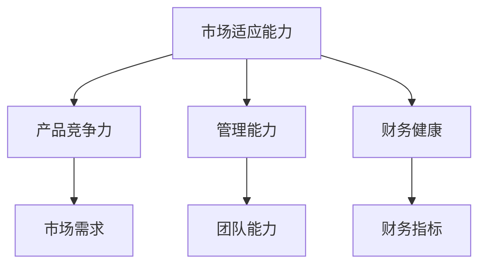
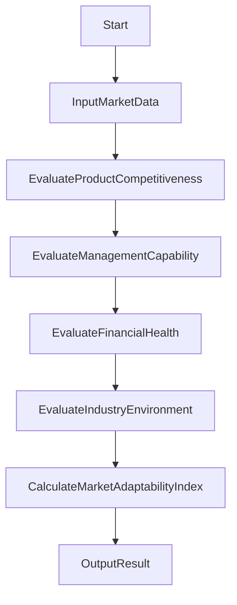

                 


# 彼得林奇如何评估公司的市场适应能力

> 关键词：彼得林奇，市场适应能力，投资评估，公司分析，基本面分析

> 摘要：本文详细介绍了彼得林奇如何评估公司的市场适应能力，从核心概念到算法原理，再到系统分析和项目实战，全面解析了彼得林奇的评估方法，并通过实例和代码实现，帮助读者掌握这一重要投资策略。

---

## 第一部分: 背景介绍

### 第1章: 市场适应能力的核心概念

#### 1.1 什么是市场适应能力
市场适应能力是指公司在不断变化的市场环境中，能够灵活调整战略、产品和服务，以满足市场需求并保持竞争力的能力。彼得林奇认为，市场适应能力是决定一家公司能否长期成功的关键因素。

#### 1.2 彼得林奇的投资理念
彼得林奇是全球著名投资专家，以其长期投资和基本面分析著称。他强调深入研究公司基本面，包括财务状况、管理层质量、产品竞争力和行业环境。他的投资理念是寻找那些能够在市场中持续增长的公司。

#### 1.3 市场适应能力的评估维度
市场适应能力的评估维度包括：
- 产品竞争力：公司产品是否能满足市场需求，是否有竞争优势。
- 管理能力：管理层是否具备战略眼光和执行力。
- 财务健康状况：公司财务是否稳健，能否支持市场扩展。
- 行业环境：行业的发展趋势和竞争状况。

---

## 第二部分: 核心概念与联系

### 第2章: 市场适应能力的评估模型

#### 2.1 彼得林奇的市场适应能力模型
彼得林奇的市场适应能力模型是一个多维度的评估系统，包括产品竞争力、管理能力、财务健康和行业环境四个核心要素。这些要素相互关联，共同决定了公司的市场适应能力。

#### 2.2 模型的优缺点分析
优点：
- 全面性：模型涵盖了公司发展的各个方面。
- 实用性：可以帮助投资者全面评估公司的市场适应能力。

缺点：
- 主观性：某些评估维度（如管理能力）难以量化。
- 依赖数据：需要大量准确的市场和财务数据支持。

#### 2.3 模型的ER实体关系图


---

## 第三部分: 算法原理讲解

### 第3章: 市场适应能力的评估算法

#### 3.1 算法概述
彼得林奇的市场适应能力评估算法基于多维度的加权评分系统，通过量化各维度的得分，计算出综合市场适应指数。该算法的核心思想是将各维度的评估结果综合起来，得出公司的市场适应能力。

#### 3.2 算法流程图


#### 3.3 算法实现
以下是一个简化的Python实现，用于计算市场适应指数：
```python
def calculate_market_adaptability_index(product_score, management_score, financial_score, industry_score):
    # 定义各维度的权重，可根据实际情况调整
    weights = {
        'product': 0.4,
        'management': 0.2,
        'financial': 0.2,
        'industry': 0.2
    }
    # 计算加权平均
    index = (product_score * weights['product'] +
             management_score * weights['management'] +
             financial_score * weights['financial'] +
             industry_score * weights['industry'])
    return index

# 示例数据
product_score = 80
management_score = 75
financial_score = 85
industry_score = 70

index = calculate_market_adaptability_index(product_score, management_score, financial_score, industry_score)
print(f"市场适应指数: {index}")
```

#### 3.4 数学模型
市场适应指数的计算公式为：
$$ \text{Market Adaptability Index} = w_p \times P + w_m \times M + w_f \times F + w_i \times I $$
其中：
- $w_p$、$w_m$、$w_f$、$w_i$ 为各维度的权重系数
- $P$、$M$、$F$、$I$ 为各维度的评分

---

## 第四部分: 系统分析与架构设计

### 第4章: 系统分析与架构设计方案

#### 4.1 问题场景介绍
假设我们需要评估一家科技公司的市场适应能力。我们需要收集该公司的产品信息、财务数据、管理层信息和行业趋势。

#### 4.2 系统功能设计
- 数据采集模块：收集公司产品、管理、财务和行业数据。
- 评估算法模块：根据各维度数据计算市场适应指数。
- 报告生成模块：生成评估报告，展示结果。

#### 4.3 系统架构设计


#### 4.4 系统接口设计
- 数据接口：从数据库或API获取数据。
- 计算接口：调用评估算法模块进行计算。
- 报告接口：生成并输出评估报告。

---

## 第五部分: 项目实战

### 第5章: 项目实战

#### 5.1 环境安装
安装Python和相关库：
```bash
pip install pandas numpy matplotlib
```

#### 5.2 核心代码实现
```python
import pandas as pd

# 示例数据
data = {
    '公司': ['A', 'B', 'C'],
    '产品竞争力': [80, 75, 90],
    '管理能力': [75, 80, 85],
    '财务健康': [85, 70, 90],
    '行业环境': [70, 85, 65]
}

df = pd.DataFrame(data)

# 计算市场适应指数
def calculate_index(row):
    product = row['产品竞争力']
    management = row['管理能力']
    financial = row['财务健康']
    industry = row['行业环境']
    weights = {'product': 0.4, 'management': 0.2, 'financial': 0.2, 'industry': 0.2}
    index = (product * weights['product'] +
             management * weights['management'] +
             financial * weights['financial'] +
             industry * weights['industry'])
    return index

df['市场适应指数'] = df.apply(calculate_index, axis=1)
print(df)
```

#### 5.3 实际案例分析
以公司A为例，计算其市场适应指数：
- 产品竞争力：80
- 管理能力：75
- 财务健康：85
- 行业环境：70
计算结果：
$$ \text{Market Adaptability Index} = 0.4 \times 80 + 0.2 \times 75 + 0.2 \times 85 + 0.2 \times 70 = 79.8 $$

---

## 第六部分: 最佳实践

### 第6章: 最佳实践

#### 6.1 小结
彼得林奇的市场适应能力评估方法是一个全面的系统，能够帮助投资者识别出那些能够在市场中持续发展的公司。

#### 6.2 注意事项
- 数据的准确性和及时性至关重要。
- 模型的权重需要根据实际情况调整。
- 需要结合定性分析，如管理层访谈和行业趋势分析。

#### 6.3 未来趋势
- 结合人工智能技术，实现更智能化的市场适应能力评估。
- 开发动态评估模型，实时跟踪市场变化。

#### 6.4 拓展阅读
推荐阅读彼得林奇的书籍《彼得林奇的选股标准》和《投资的奥秘》，深入理解他的投资理念。

---

通过以上步骤，我们全面解析了彼得林奇如何评估公司的市场适应能力，并通过实际案例和代码实现，帮助读者掌握这一重要的投资分析方法。

