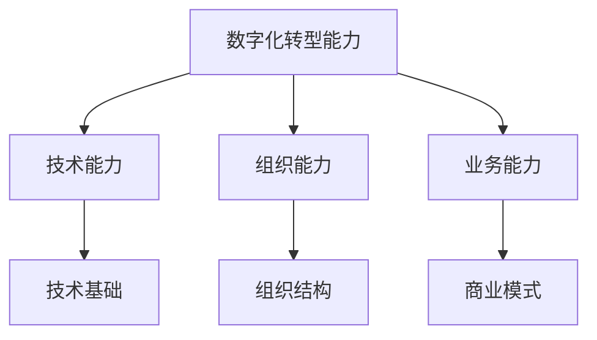
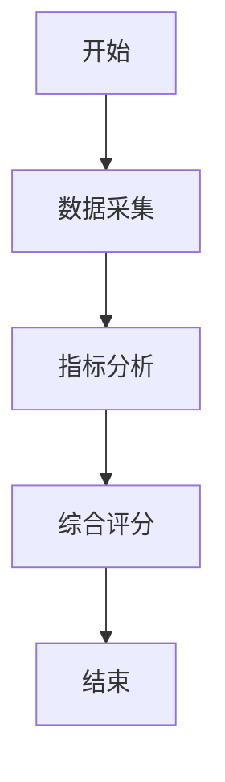
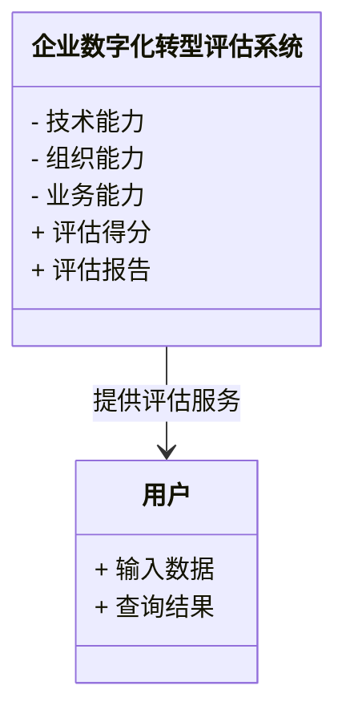

                 


# 彼得林奇如何评估公司的数字化转型能力

> 关键词：彼得林奇, 数字化转型, 公司评估, 数字化能力, 评估模型, 投资分析

> 摘要：本文详细探讨了彼得林奇如何评估公司的数字化转型能力。从核心概念到算法原理，从系统架构到项目实战，结合实际案例和最佳实践，全面解析如何有效评估和提升企业的数字化转型能力。

---

## 第一部分：背景介绍

### 第1章：数字化转型的背景与概念

#### 1.1 数字化转型的定义与背景

- **1.1.1 数字化转型的定义**  
  数字化转型是指企业利用数字技术（如人工智能、大数据、云计算等）改变其商业模式、业务流程、文化以及员工体验的过程。数字化转型不仅仅是技术的更新，更是对企业整体能力的重构。

- **1.1.2 数字化转型的背景与趋势**  
  随着信息技术的飞速发展，数字化转型已成为企业生存和发展的关键。企业需要通过数字化转型提升竞争力、优化运营效率，并更好地适应市场变化。

- **1.1.3 数字化转型对企业的影响**  
  数字化转型可以带来以下好处：  
  - 提高业务效率和生产力  
  - 优化客户体验  
  - 创新商业模式  
  - 增强数据驱动的决策能力  

#### 1.2 彼得林奇的评估方法

- **1.2.1 彼得林奇的投资者背景**  
  彼得林奇是著名的投资专家，以其对公司的基本面分析和长期价值投资闻名。他的评估方法注重企业的管理能力、战略规划和执行能力。

- **1.2.2 彼得林奇的公司评估理念**  
  彼得林奇认为，公司的价值不仅仅体现在财务数据上，还体现在其管理和战略能力上。他特别关注公司是否能够适应变化，抓住市场机会。

- **1.2.3 数字化转型能力评估的核心思想**  
  彼得林奇的评估方法可以应用于数字化转型能力的评估。他关注的核心是：公司是否具备数字化转型所需的技术能力、组织能力和业务能力。

---

## 第二部分：核心概念与联系

### 第2章：数字化转型能力评估的核心要素

#### 2.1 数字化转型能力的构成

- **2.1.1 技术能力**  
  包括企业的技术基础（如IT基础设施）、技术团队的能力以及技术创新能力。

- **2.1.2 组织能力**  
  包括企业的组织结构、管理能力、员工的数字化意识和能力。

- **2.1.3 业务能力**  
  包括企业的商业模式、市场竞争力、客户体验以及数字化业务的创新能力。

#### 2.2 彼得林奇评估模型的核心要素

- **2.2.1 技术基础**  
  彼得林奇认为，数字化转型的核心是技术，企业需要具备扎实的技术基础。

- **2.2.2 业务价值**  
  数字化转型的目的是为了创造业务价值，彼得林奇关注的是数字化转型是否能够为企业带来实际的收益。

- **2.2.3 组织文化**  
  彼得林奇强调组织文化的重要性，良好的组织文化能够推动数字化转型的顺利实施。

---

### 第3章：数字化转型能力评估的概念结构

#### 3.1 概念结构图



#### 3.2 核心要素的详细描述

- **技术能力**：企业的技术基础、技术团队的能力以及技术创新能力。
- **组织能力**：企业的组织结构、管理能力、员工的数字化意识和能力。
- **业务能力**：企业的商业模式、市场竞争力、客户体验以及数字化业务的创新能力。

---

## 第三部分：算法原理

### 第4章：数字化转型能力评估的数学模型与公式

#### 4.1 数学模型的构建

- **模型输入变量**：技术能力（权重0.4）、组织能力（权重0.3）、业务能力（权重0.3）。
- **模型输出变量**：数字化转型能力评估得分。
- **模型函数关系**：评估得分 = ∑（权重_i × 评估指标_i）

#### 4.2 数学公式的详细推导

- **评估得分计算公式**：  
  $$评估得分 = 0.4 \times 技术能力 + 0.3 \times 组织能力 + 0.3 \times 业务能力$$

- **评估权重分配公式**：  
  $$权重_i = \frac{\text{指标的重要性}}{\sum \text{指标的重要性}}$$

---

### 第5章：数字化转型能力评估的算法原理

#### 5.1 算法原理



#### 5.2 Python代码示例

```python
def digital_transformation_assessment(tech_score, org_score, bus_score):
    # 权重分配
    weight_tech = 0.4
    weight_org = 0.3
    weight_bus = 0.3

    # 评估得分
    assessment_score = weight_tech * tech_score + weight_org * org_score + weight_bus * bus_score
    return assessment_score

# 示例数据
tech_score = 80
org_score = 70
bus_score = 85

# 计算评估得分
result = digital_transformation_assessment(tech_score, org_score, bus_score)
print("数字化转型能力评估得分：", result)
```

---

## 第四部分：系统分析与架构设计

### 第6章：系统功能设计

#### 6.1 问题场景介绍

- 企业希望通过数字化转型提升竞争力，需要评估自身的数字化转型能力。

#### 6.2 系统功能设计



---

## 第五部分：项目实战

### 第7章：项目实战

#### 7.1 环境安装

- 安装Python和相关库（如pandas、numpy）。

#### 7.2 核心代码实现

```python
import pandas as pd
import numpy as np

def compute_assessment_score(tech_scores, org_scores, bus_scores):
    # 计算平均得分
    avg_tech = np.mean(tech_scores)
    avg_org = np.mean(org_scores)
    avg_bus = np.mean(bus_scores)
    
    # 计算评估得分
    assessment_score = 0.4 * avg_tech + 0.3 * avg_org + 0.3 * avg_bus
    return assessment_score

# 示例数据
tech_scores = [80, 85, 75]
org_scores = [70, 75, 80]
bus_scores = [85, 80, 90]

# 计算评估得分
result = compute_assessment_score(tech_scores, org_scores, bus_scores)
print("数字化转型能力评估得分：", result)
```

---

## 第六部分：最佳实践

### 第8章：最佳实践

#### 8.1 小结

- 彼得林奇的评估方法为企业数字化转型能力的评估提供了新的视角。企业需要从技术、组织和业务三个维度进行综合评估，并根据评估结果制定相应的改进措施。

#### 8.2 注意事项

- 数字化转型能力评估需要结合企业的实际情况，不能生搬硬套。
- 评估结果只是一个参考，企业需要根据自身特点制定具体的转型策略。

#### 8.3 扩展阅读

- 《彼得林奇的投资哲学》
- 《数字化转型：企业重构与创新》

---

## 第七部分：总结

通过本文的详细讲解，我们了解了彼得林奇如何评估公司的数字化转型能力，并从核心概念、算法原理、系统架构到项目实战进行了全面的分析。希望这些内容能够帮助企业更好地进行数字化转型能力的评估和提升。

