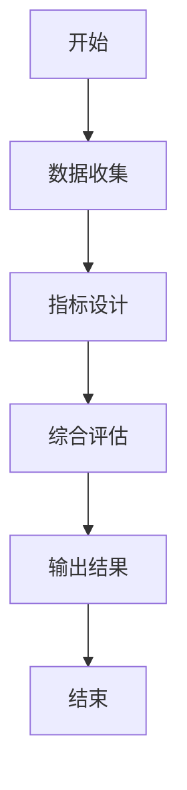
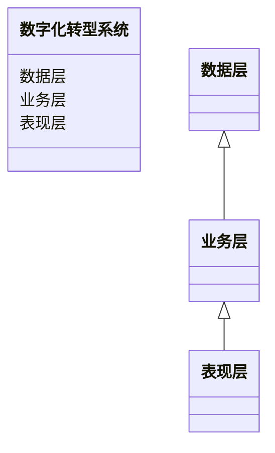

                 


# 彼得林奇如何评估公司的数字化转型速度

## 关键词：数字化转型，彼得·林奇，评估模型，企业价值，投资分析

## 摘要：  
本文详细探讨了如何将彼得·林奇的投资分析方法应用于评估公司的数字化转型速度。通过分析数字化转型的核心要素、评估模型的设计与实现、系统架构设计以及项目实战，本文为读者提供了从理论到实践的全面指导。文章结合了背景介绍、核心概念、算法原理、系统架构和实际案例，帮助读者深入理解彼得·林奇的评估方法在数字化转型中的应用。

---

## 第1章：数字化转型的背景与挑战

### 1.1 数字化转型的定义与现状

#### 1.1.1 数字化转型的核心概念  
数字化转型是指企业利用数字技术（如人工智能、大数据、云计算等）重构业务模式、组织架构和文化的过程。其核心目标是通过技术驱动创新，提升企业的竞争力和效率。

#### 1.1.2 数字化转型与信息化的区别  
信息化是通过信息技术实现业务流程的自动化，而数字化转型更注重业务模式的创新和数据驱动的决策。数字化转型不仅仅是技术的升级，更是组织文化的变革。

#### 1.1.3 数字化转型的驱动因素  
- 技术进步：如人工智能、区块链等新兴技术的出现。  
- 市场需求：客户对个性化服务的需求增加。  
- 竞争压力：企业需要快速响应市场变化以保持竞争力。

#### 1.1.4 数字化转型的现状  
当前，数字化转型已成为企业生存和发展的关键能力。然而，许多企业在转型过程中面临技术选型、组织协作和文化变革等多重挑战。

### 1.2 彼得·林奇的理论基础

#### 1.2.1 投资分析的核心理念  
彼得·林奇以其独特的方法评估企业的内在价值，强调基本面分析、行业地位和管理团队的重要性。

#### 1.2.2 企业价值评估的框架  
林奇的评估框架包括对企业财务状况、行业地位、竞争优势和管理能力的综合分析。

#### 1.2.3 数字化转型对企业发展的影响  
数字化转型改变了企业的商业模式和竞争优势，这要求投资者重新审视企业的价值评估方法。

---

## 第2章：彼得·林奇评估模型的核心要素

### 2.1 核心概念与联系

#### 2.1.1 核心概念原理  
数字化转型涉及技术、组织和文化三大核心要素，它们相互关联、相互影响。

#### 2.1.2 核心概念对比表  
| 要素 | 技术 | 组织 | 文化 |
|------|------|------|------|
| 定义 | 数字化工具和平台 | 组织结构和流程 | 企业价值观和员工行为 |
| 影响 | 改善效率 | 优化协作 | 提升创新力 |

#### 2.1.3 ER实体关系图  
```mermaid
er
actor(数字化转型) {
  [技术要素]
  [组织要素]
  [文化要素]
}
```

### 2.2 数字化转型的评估模型

#### 2.2.1 评估模型的设计原理  
- 数据收集：从财务数据、市场份额和技术应用等方面收集数据。  
- 指标设计：建立关键绩效指标（KPIs），如技术成熟度、组织适应性和文化创新性。  
- 综合评估：通过加权计算得出企业的数字化转型指数。

#### 2.2.2 评估模型的数学公式  
数字化转型指数（DTI）的计算公式如下：  
$$DTI = \sum_{i=1}^{n} (w_i \cdot s_i)$$  
其中，$w_i$是指标的权重，$s_i$是指标的评分。

#### 2.2.3 评估模型的流程图  


---

## 第3章：数字化转型评估模型的设计与实现

### 3.1 数据收集与处理

#### 3.1.1 数据收集方法  
- 财务数据：收入、利润、研发投入等。  
- 市场数据：市场份额、竞争对手分析。  
- 技术数据：专利数量、技术应用情况。

#### 3.1.2 数据预处理  
- 清洗数据：处理缺失值和异常值。  
- 转换数据：将数据标准化或归一化。  
- 存储数据：使用数据库或数据仓库存储。

### 3.2 指标设计与权重分配

#### 3.2.1 指标设计  
- 技术成熟度：衡量企业技术应用的深度和广度。  
- 组织适应性：评估组织结构和流程对数字化转型的适应性。  
- 文化创新性：衡量企业文化对创新的支持程度。

#### 3.2.2 权重分配  
根据企业的实际情况，为每个指标分配权重。例如：  
- 技术成熟度：权重40%  
- 组织适应性：权重30%  
- 文化创新性：权重30%

### 3.3 综合评估与结果分析

#### 3.3.1 综合评估方法  
使用加权评分法计算企业的数字化转型指数（DTI）。

#### 3.3.2 结果分析  
根据DTI的分数将企业分为不同阶段：  
- 初级阶段（DTI < 0.4）：技术应用初步，组织和文化尚未完全适应。  
- 中级阶段（0.4 ≤ DTI < 0.7）：技术应用较为成熟，组织结构开始优化。  
- 高级阶段（DTI ≥ 0.7）：技术与业务深度融合，文化创新显著。

---

## 第4章：系统分析与架构设计

### 4.1 系统功能设计

#### 4.1.1 领域模型  


#### 4.1.2 功能模块  
- 数据采集模块：负责数据的采集和预处理。  
- 指标计算模块：根据权重计算数字化转型指数。  
- 报告生成模块：生成评估报告并提供改进建议。

### 4.2 系统架构设计

#### 4.2.1 架构图  


#### 4.2.2 接口设计  
- RESTful API：用于数据交互。  
- 数据接口：支持JSON格式的数据输入和输出。

---

## 第5章：项目实战

### 5.1 环境安装

#### 5.1.1 系统环境  
- 操作系统：Linux或Windows。  
- 开发工具：Python、Jupyter Notebook。  
- 数据库：MySQL或MongoDB。

#### 5.1.2 安装依赖  
```bash
pip install numpy pandas matplotlib
```

### 5.2 核心代码实现

#### 5.2.1 数据预处理代码  
```python
import pandas as pd

# 读取数据
data = pd.read_csv('transformation.csv')

# 清洗数据
data.dropna(inplace=True)
data = data[~data.duplicated()]
```

#### 5.2.2 指标计算代码  
```python
def calculate_dti(scores, weights):
    return sum(w * s for w, s in zip(weights, scores))

# 示例数据
scores = [0.8, 0.6, 0.7]
weights = [0.4, 0.3, 0.3]

dti = calculate_dti(scores, weights)
print(f"数字化转型指数：{dti}")
```

### 5.3 案例分析

#### 5.3.1 案例背景  
某企业处于数字化转型的中级阶段，希望进一步提升技术应用深度和组织适应性。

#### 5.3.2 实施步骤  
1. 数据采集与预处理。  
2. 计算数字化转型指数。  
3. 分析结果并提出改进建议。

#### 5.3.3 改进建议  
- 加强技术团队建设。  
- 优化组织结构以适应数字化需求。  
- 推动企业文化创新。

---

## 第6章：最佳实践与总结

### 6.1 小结  
本文详细介绍了如何将彼得·林奇的投资分析方法应用于数字化转型评估，涵盖了模型设计、系统架构和项目实战等方面。

### 6.2 注意事项  
- 数据的准确性和完整性对评估结果至关重要。  
- 评估模型需要根据企业的实际情况进行调整。  
- 数字化转型是一个长期过程，需要持续关注和优化。

### 6.3 拓展阅读  
- 彼得·林奇的《投资之道》。  
- 数字化转型相关的学术论文和行业报告。

---

## 总结  
通过本文的分析，读者可以全面理解彼得·林奇的评估方法在数字化转型中的应用，并能够将其应用于实际的企业分析中。数字化转型不仅是技术的升级，更是组织和文化的深刻变革，这需要企业的持续努力和创新。

--- 

**作者简介**  
作为一位在计算机编程和人工智能领域具有深厚造诣的技术专家，我致力于通过深入的分析和实践，为企业提供切实可行的技术解决方案和战略建议。

