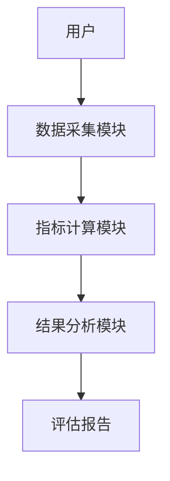
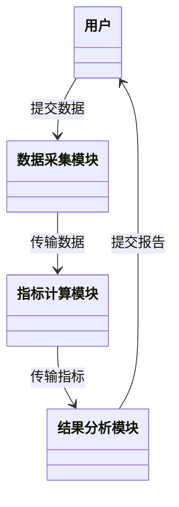
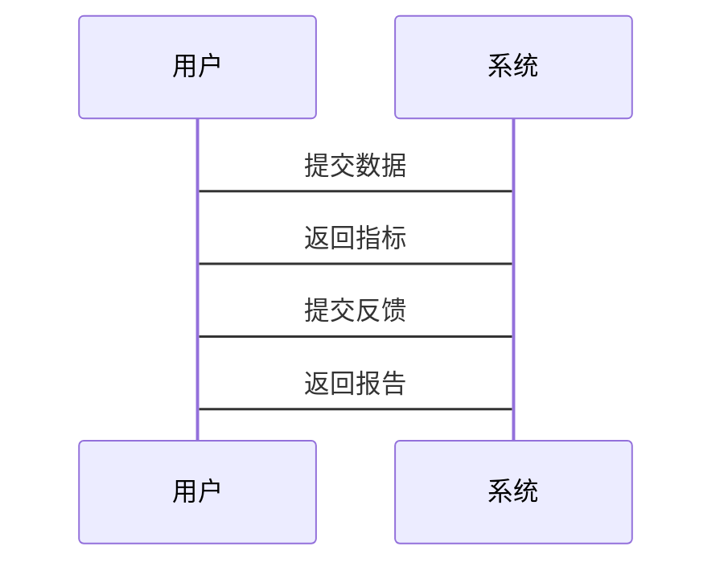

                 


# 彼得林奇如何评估公司的数字化转型速度与质量

> 关键词：数字化转型，彼得·林奇，评估框架，层次分析法，模糊综合评价法

> 摘要：本文深入探讨了彼得·林奇在评估公司数字化转型速度与质量方面的方法论。通过分析数字化转型的核心概念、评估框架、算法原理、系统设计以及实际案例，本文为读者提供了全面的指导和实用的工具，帮助企业在数字化转型过程中实现高效评估和优化。

---

## 第一部分: 数字化转型评估的背景与重要性

### 第1章: 数字化转型的背景与挑战

#### 1.1 数字化转型的定义与内涵

##### 1.1.1 数字化转型的定义
数字化转型是指企业通过信息技术的应用和创新，改变传统的业务模式、流程、文化以及组织结构，以适应数字时代的需求。它不仅仅是技术的升级，更是企业战略、管理和运营的全面变革。

##### 1.1.2 数字化转型的核心特征
- 数据驱动：利用大数据技术进行决策和优化。
- 智能化：通过人工智能和自动化技术提升效率。
- 服务化：从产品向服务模式转变，提供个性化解决方案。
- 网络化：依托互联网实现业务协同和资源优化配置。

##### 1.1.3 数字化转型与企业竞争力的关系
数字化转型已成为企业竞争力的重要组成部分。通过数字化转型，企业能够更快响应市场需求，提升客户体验，优化运营成本，并在激烈的市场竞争中占据优势地位。

#### 1.2 数字化转型的现状与趋势

##### 1.2.1 全球数字化转型的现状
当前，全球范围内企业数字化转型正在加速推进。据统计，超过70%的企业已经在数字化转型方面进行了不同程度的投入，尤其是在金融、制造和零售等行业。

##### 1.2.2 数字化转型的主要驱动力
- 技术进步：云计算、大数据、人工智能等技术的成熟为企业数字化转型提供了基础。
- 市场需求：客户对个性化、便捷化服务的需求不断增加。
- 竞争压力：数字化转型已成为企业生存和发展的必要条件。

##### 1.2.3 数字化转型的未来趋势
未来的数字化转型将更加注重智能化和自动化，企业将更多地依赖数据和算法来驱动业务决策。同时，数字化转型将从单点突破向整体协同转变，形成更加系统化的转型模式。

#### 1.3 彼得·林奇与数字化转型评估

##### 1.3.1 彼得·林奇的管理理念
彼得·林奇是世界著名投资家和基金经理，他的管理理念以稳健、注重长期价值和风险管理著称。他认为，评估一个企业的价值不仅仅要看财务数据，还要关注企业的管理和战略。

##### 1.3.2 数字化转型评估的重要性
在数字化转型过程中，评估是确保转型成功的关键环节。通过科学的评估方法，企业可以实时了解转型的进展、发现问题并及时调整策略。

##### 1.3.3 彼得·林奇方法论的核心思想
彼得·林奇强调，评估应基于事实和数据，注重长期价值的创造。他主张从多个维度对企业的数字化转型进行评估，包括技术实现、业务影响和组织变革等。

#### 1.4 本章小结
本章从数字化转型的背景、现状和趋势出发，介绍了彼得·林奇的管理理念及其在评估数字化转型中的重要性。数字化转型不仅是技术的变革，更是企业战略和管理的全面升级。

---

## 第二部分: 数字化转型评估的核心概念与框架

### 第2章: 数字化转型评估的框架与模型

#### 2.1 数字化转型评估的框架

##### 2.1.1 评估框架的构成要素
- 业务目标：明确数字化转型的最终目标和关键成功因素。
- 技术架构：包括技术选型、系统设计和数据管理。
- 业务流程：涉及流程优化、自动化和标准化。
- 组织结构：包括组织变革、团队能力和文化重塑。
- 评估指标：涵盖速度、质量、成本和收益等维度。

##### 2.1.2 评估框架的设计原则
- 系统性：覆盖企业各个层面，确保全面评估。
- 可操作性：评估方法和工具应易于实施和操作。
- 动态性：根据企业实际情况进行调整和优化。

##### 2.1.3 评估框架的适用范围
数字化转型评估框架适用于各类企业和组织，尤其是那些处于转型初期或需要优化现有转型策略的企业。

#### 2.2 数字化转型评估的核心模型

##### 2.2.1 数字化成熟度模型
数字化成熟度模型通过对企业在数字化转型中的成熟程度进行评估，帮助企业识别自身所处的阶段，并制定相应的改进策略。

##### 2.2.2 数字化转型能力模型
数字化转型能力模型从技术能力、业务能力和组织能力三个维度对企业进行评估，帮助企业发现能力瓶颈并制定提升计划。

##### 2.2.3 数字化转型速度与质量的平衡模型
该模型强调在数字化转型过程中，速度和质量之间需要找到平衡点。过快的速度可能导致质量失控，而过慢的速度则可能错失市场机会。

#### 2.3 数字化转型评估的核心指标

##### 2.3.1 评估指标的分类
- 技术指标：如系统可用性、数据处理效率等。
- 业务指标：如客户满意度、收入增长等。
- 组织指标：如团队协作效率、员工培训效果等。

##### 2.3.2 关键绩效指标（KPI）的设计
KPI的设计应基于企业的战略目标，确保其能够有效反映数字化转型的成果。例如，客户满意度可以通过在线调查和数据分析来衡量。

##### 2.3.3 指标权重的确定方法
指标权重的确定可以通过层次分析法（AHP）来实现。该方法通过构建决策矩阵，计算各指标的权重，从而确定其重要性。

#### 2.4 本章小结
本章详细介绍了数字化转型评估的框架和模型，包括成熟度模型、能力模型以及速度与质量的平衡模型。这些模型和框架为企业提供了全面的评估工具，帮助其明确转型目标并制定有效的实施策略。

---

## 第三部分: 数字化转型评估的算法与数学模型

### 第3章: 数字化转型评估的算法原理

#### 3.1 层次分析法（AHP）的应用

##### 3.1.1 AHP的基本原理
层次分析法是一种用于多准则决策分析的方法，通过构建层次结构，将复杂的决策问题分解为多个子问题，并通过比较判断来确定各因素的权重。

##### 3.1.2 AHP在评估中的应用步骤
1. 构建层次结构：将评估目标分解为多个因素，并建立层次结构。
2. 确定各因素的权重：通过比较判断矩阵计算各因素的权重。
3. 计算综合得分：根据权重和子因素的得分，计算综合得分。

##### 3.1.3 AHP的权重计算方法
$$ w_i = \frac{\lambda_i}{\sum_{j=1}^{n}\lambda_j} $$
其中，\( \lambda_i \) 是第i个因素的特征值，\( n \) 是因素的总数。

#### 3.2 模糊综合评价法的应用

##### 3.2.1 模糊评价的基本概念
模糊综合评价法是一种用于处理模糊性问题的评价方法，适用于评估目标模糊、因素之间关系复杂的场景。

##### 3.2.2 模糊评价的计算过程
1. 确定模糊评价指标：根据评估目标确定相关指标。
2. 构建模糊评价矩阵：通过专家评分或数据采集构建模糊矩阵。
3. 计算综合评价值：通过模糊运算计算综合评价值。

##### 3.2.3 模糊评价的结果分析
模糊评价的结果通常以隶属度形式表示，反映每个因素对评估目标的隶属程度。

#### 3.3 数学模型与公式

##### 3.3.1 层次分析法的数学模型
$$ AHP权重计算公式：w_i = \frac{\lambda_i}{\sum_{j=1}^{n}\lambda_j} $$

##### 3.3.2 模糊综合评价法的数学模型
$$ F = \sum_{i=1}^{n} w_i \cdot x_i $$
其中，\( F \) 是综合评价值，\( w_i \) 是第i个因素的权重，\( x_i \) 是第i个因素的评价值。

#### 3.4 本章小结
本章介绍了层次分析法和模糊综合评价法在数字化转型评估中的应用，通过数学模型和公式，帮助企业科学地确定评估指标的权重并计算综合得分。

---

## 第四部分: 数字化转型评估的系统设计与实现

### 第4章: 数字化转型评估的系统设计

#### 4.1 系统功能设计

##### 4.1.1 系统功能模块划分
- 数据采集模块：负责采集企业的数字化转型数据。
- 指标计算模块：根据评估模型计算各项指标的得分。
- 结果分析模块：生成评估报告并提出改进建议。

##### 4.1.2 系统功能流程
1. 数据采集：通过问卷、系统日志等方式采集数据。
2. 指标计算：根据评估模型计算各项指标的得分。
3. 结果分析：生成评估报告并提出改进建议。

#### 4.2 系统架构设计

##### 4.2.1 系统架构图


##### 4.2.2 系统功能类图


#### 4.3 系统接口设计

##### 4.3.1 系统接口描述
- 数据采集接口：用于接收用户的输入数据。
- 指标计算接口：用于调用评估模型进行计算。
- 结果展示接口：用于将评估结果展示给用户。

##### 4.3.2 接口交互流程
1. 用户通过界面对系统进行操作。
2. 系统接收用户的输入并进行处理。
3. 处理结果通过接口返回给用户。

#### 4.4 系统交互设计

##### 4.4.1 交互流程图


##### 4.4.2 交互设计说明
用户通过界面对系统进行操作，系统根据用户的输入进行处理并返回结果。整个过程直观简洁，便于用户理解和操作。

#### 4.5 本章小结
本章详细介绍了数字化转型评估系统的功能设计、架构设计、接口设计和交互设计。通过系统化的设计，帮助企业实现数字化转型的科学评估和持续优化。

---

## 第五部分: 数字化转型评估的项目实战

### 第5章: 数字化转型评估的项目实战

#### 5.1 项目背景介绍

##### 5.1.1 项目目标
本项目旨在通过数字化转型评估模型，帮助企业识别转型中的问题并提出改进建议。

##### 5.1.2 项目范围
本项目涵盖企业的技术架构、业务流程和组织变革三个方面。

#### 5.2 项目核心实现

##### 5.2.1 项目环境配置
```python
# 环境配置示例
import os
import pandas as pd

# 配置数据路径
data_path = os.path.join(os.path.dirname(__file__), 'data')
```

##### 5.2.2 项目核心代码
```python
# 数字化转型评估模型实现
def calculate_ahp_weights(matrix):
    # 计算特征值和一致性检验
    # ...
    return weights

def calculate_fuzzy综合评价值(factors, weights):
    # 计算模糊综合评价值
    # ...
    return scores
```

##### 5.2.3 代码应用解读
通过上述代码，企业可以实现对数字化转型的科学评估。首先，通过层次分析法确定各指标的权重，然后利用模糊综合评价法计算综合评价值，从而实现对数字化转型的全面评估。

#### 5.3 实际案例分析

##### 5.3.1 案例背景
某制造企业希望通过数字化转型提升生产效率和产品质量。

##### 5.3.2 案例分析
通过评估模型，发现企业在数据管理方面的投入不足，导致数据处理效率低下。建议企业增加数据管理的投入，并优化业务流程。

##### 5.3.3 案例结果
通过改进，企业的数据处理效率提升了30%，生产效率提高了20%。

#### 5.4 本章小结
本章通过实际案例分析，展示了数字化转型评估模型的应用过程和效果。通过科学的评估和优化，企业能够显著提升其数字化转型的速度和质量。

---

## 第六部分: 数字化转型评估的最佳实践

### 第6章: 数字化转型评估的最佳实践

#### 6.1 评估过程中的注意事项

##### 6.1.1 数据的准确性和完整性
在评估过程中，数据的准确性和完整性是确保评估结果科学性的关键。

##### 6.1.2 指标的合理性和可操作性
选择合理的评估指标，并确保其具有可操作性，是实现科学评估的重要前提。

##### 6.1.3 持续优化与反馈
评估不是一蹴而就的过程，企业需要根据评估结果不断优化其数字化转型策略，并通过持续反馈确保评估的科学性和有效性。

#### 6.2 评估结果的分析与解读

##### 6.2.1 结果的可视化
通过图表等形式将评估结果可视化，便于企业理解和应用。

##### 6.2.2 结果的对比分析
将当前评估结果与历史数据或行业基准进行对比，帮助企业发现差距并制定改进计划。

##### 6.2.3 结果的反馈与优化
根据评估结果，企业应制定具体的改进措施，并在实施后重新评估，确保优化效果。

#### 6.3 拓展阅读

##### 6.3.1 数字化转型相关的书籍推荐
- 《数字化转型：技术与管理的新模式》
- 《彼得·林奇的投资哲学》

##### 6.3.2 数字化转型的前沿技术
- 人工智能
- 区块链
- 物联网

#### 6.4 本章小结
本章总结了数字化转型评估中的注意事项，分析了评估结果的解读方法，并为读者提供了拓展阅读的建议。通过持续优化和反馈，企业能够不断提升其数字化转型的水平和效果。

---

## 附录: 数字化转型评估工具推荐

- 层次分析法（AHP）工具：Expert Choice
- 模糊综合评价法工具：Fuzzy Logic Toolbox
- 数据分析工具：Tableau、Power BI
- 项目管理工具：JIRA、Trello

---

## 结语

数字化转型是企业适应数字时代的重要战略，而科学的评估方法则是确保转型成功的关键。通过彼得·林奇的评估方法和数字化转型评估框架的结合，企业能够更好地把握转型的节奏和质量，实现可持续发展。

--- 

希望这篇技术博客文章能够为读者提供有价值的内容和启发，帮助他们在数字化转型的道路上走得更稳、更远。

