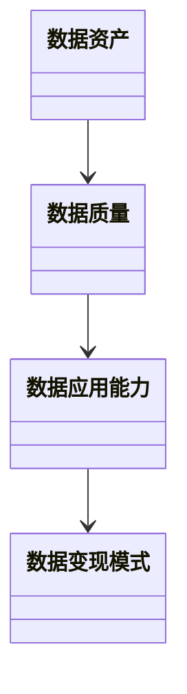
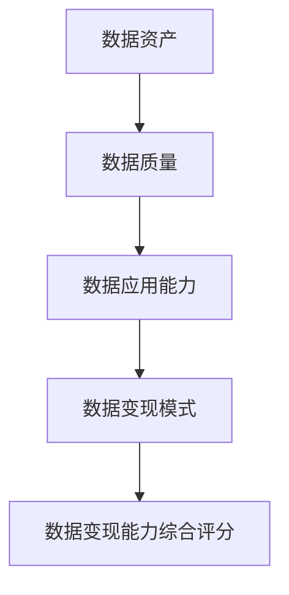
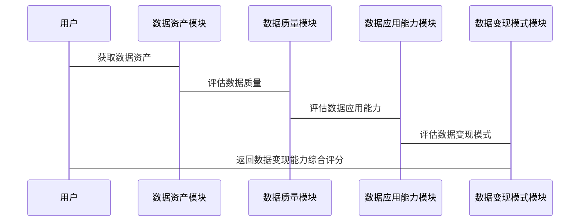

                 


# 彼得林奇如何评估公司的数据变现能力

## 关键词：彼得·林奇，数据变现能力，数据资产，数据质量，数据应用能力，数据变现模式，多因子分析模型

## 摘要：本文深入分析了彼得·林奇评估公司数据变现能力的方法，从数据资产、数据质量、数据应用能力、数据变现模式等核心要素出发，结合多因子分析模型和系统架构设计，详细阐述了如何量化评估公司数据变现能力，并通过实际案例展示了评估过程和结果解读，为读者提供了从理论到实践的全面指导。

---

## 第1章：数据变现能力评估的背景与意义

### 1.1 数据变现能力的定义与重要性

数据变现能力是指公司通过数据资产的采集、处理、分析和应用，将其转化为经济价值的能力。在数字经济时代，数据已成为企业最重要的资产之一，数据变现能力直接关系到企业的核心竞争力和长期价值创造能力。

数据变现能力的重要性体现在以下几个方面：

1. **企业价值的核心驱动**：数据资产的价值直接决定了企业的市场价值。
2. **竞争优势的关键因素**：通过数据变现，企业可以实现差异化竞争。
3. **长期增长的引擎**：数据驱动的决策和创新是企业持续增长的重要动力。

### 1.2 彼得·林奇的投资理念与方法

彼得·林奇是美国著名的投资家和基金经理，他在投资生涯中积累了丰富的经验，尤其擅长通过分析企业的基本面来评估其投资价值。彼得·林奇的数据变现能力评估方法注重以下几个方面：

1. **数据资产的稀缺性**：评估数据资产的独特性和不可替代性。
2. **数据质量的稳定性**：数据的准确性和完整性是数据变现的基础。
3. **数据应用的创新性**：数据的应用场景和创新能力决定了数据的变现潜力。
4. **数据变现模式的可行性**：数据变现的具体方式和商业模式是否可行。

### 1.3 数据变现能力评估的边界与外延

数据变现能力的评估需要明确其边界和外延，以确保评估的准确性和全面性。

1. **边界**：数据变现能力的评估仅关注数据资产本身的价值，不包括企业的其他资产和业务。
2. **外延**：数据变现能力的评估需要考虑数据的全生命周期，包括数据的采集、存储、分析和应用。

### 1.4 数据变现能力的核心要素组成

数据变现能力的核心要素包括：

1. **数据资产**：数据的来源、类型和规模。
2. **数据质量**：数据的准确性、完整性和一致性。
3. **数据应用能力**：数据的应用场景和创新能力。
4. **数据变现模式**：数据变现的具体方式和商业模式。

---

## 第2章：数据变现能力的核心概念与联系

### 2.1 数据资产与数据质量的对比分析

#### 数据资产的定义与特征

- **定义**：数据资产是指企业拥有的、能够为企业创造价值的数据资源。
- **特征**：数据资产具有可衡量性、可存储性和可应用性。

#### 数据质量的定义与特征

- **定义**：数据质量是指数据的准确性、完整性和一致性。
- **特征**：数据质量具有可量化的、可优化的和可维护的特征。

#### 数据资产与数据质量的对比分析

| 属性       | 数据资产                | 数据质量                |
|------------|-------------------------|-------------------------|
| 定义       | 数据资源的可衡量性      | 数据的准确性、完整性      |
| 特征       | 可存储性、可应用性      | 可优化性、可维护性      |
| 评估方法   | 数据资产价值评估        | 数据清洗、数据标准化      |

通过对比分析可以看出，数据资产和数据质量是数据变现能力的两个核心要素，它们相互关联、相互影响。

### 2.2 数据变现能力的ER实体关系图

以下是数据变现能力的ER实体关系图：

```mermaid
erd
    customer
    supplier
    product
    order
    stock
    linkType
    -- 表之间的关系
    customer -- o: 订单 -- order
    supplier -- o: 供应商 -- stock
    product -- o: 产品 -- stock
    order -- o: 订单详细信息 -- product
```

### 2.3 数据变现能力的核心算法原理

#### 数据资产的评估方法

数据资产的评估方法包括以下几个步骤：

1. **数据来源分析**：分析数据的来源和获取方式。
2. **数据类型分析**：分析数据的类型和规模。
3. **数据价值评估**：评估数据的经济价值。

#### 数据质量的评估方法

数据质量的评估方法包括以下几个步骤：

1. **数据清洗**：去除无效数据和重复数据。
2. **数据标准化**：统一数据格式和标准。
3. **数据完整性检查**：检查数据的完整性和一致性。

### 2.4 数据变现能力的数学模型与公式

#### 数据资产价值计算公式

$$
\text{数据资产价值} = \sum_{i=1}^{n} (d_i \times v_i)
$$

其中，$d_i$ 表示第 $i$ 个数据资产的权重，$v_i$ 表示第 $i$ 个数据资产的价值。

#### 数据质量评分公式

$$
\text{数据质量评分} = \frac{\sum_{i=1}^{m} q_i}{m}
$$

其中，$q_i$ 表示第 $i$ 个数据质量指标的评分，$m$ 表示数据质量指标的数量。

---

## 第3章：数据变现能力评估的算法原理与数学模型

### 3.1 数据资产的评估算法

#### 数据资产的评估步骤

1. **数据来源分析**：分析数据的来源和获取方式。
2. **数据类型分析**：分析数据的类型和规模。
3. **数据价值评估**：评估数据的经济价值。

#### 数据资产的评估模型

以下是数据资产的评估模型：

$$
\text{数据资产价值} = \sum_{i=1}^{n} (d_i \times v_i)
$$

其中，$d_i$ 表示第 $i$ 个数据资产的权重，$v_i$ 表示第 $i$ 个数据资产的价值。

### 3.2 数据质量的评估算法

#### 数据质量的评估步骤

1. **数据清洗**：去除无效数据和重复数据。
2. **数据标准化**：统一数据格式和标准。
3. **数据完整性检查**：检查数据的完整性和一致性。

#### 数据质量的评估模型

以下是数据质量的评估模型：

$$
\text{数据质量评分} = \frac{\sum_{i=1}^{m} q_i}{m}
$$

其中，$q_i$ 表示第 $i$ 个数据质量指标的评分，$m$ 表示数据质量指标的数量。

---

## 第4章：数据变现能力评估的系统架构设计

### 4.1 系统功能设计

以下是数据变现能力评估系统的功能设计：



### 4.2 系统架构设计

以下是数据变现能力评估系统的架构设计：



### 4.3 系统接口设计

以下是数据变现能力评估系统的接口设计：

1. **数据资产接口**：提供数据资产的获取和存储功能。
2. **数据质量接口**：提供数据质量的评估和优化功能。
3. **数据应用能力接口**：提供数据应用能力的评估和优化功能。
4. **数据变现模式接口**：提供数据变现模式的评估和优化功能。

### 4.4 系统交互设计

以下是数据变现能力评估系统的交互设计：



---

## 第5章：数据变现能力评估的项目实战

### 5.1 项目背景与目标

#### 项目背景

某互联网公司希望通过数据变现能力评估来提升其数据驱动的决策能力。

#### 项目目标

1. **数据资产评估**：评估公司拥有的数据资产。
2. **数据质量评估**：评估数据的质量。
3. **数据应用能力评估**：评估数据的应用能力。
4. **数据变现模式评估**：评估数据的变现模式。

### 5.2 项目实施步骤

1. **数据资产评估**：收集和分析公司拥有的数据资产。
2. **数据质量评估**：清洗和标准化数据。
3. **数据应用能力评估**：评估数据的应用场景和创新能力。
4. **数据变现模式评估**：设计和优化数据的变现模式。

### 5.3 项目实施结果

#### 数据资产评估结果

- 数据资产价值：$100,000
- 数据资产类型：结构化数据、非结构化数据
- 数据资产规模：100GB

#### 数据质量评估结果

- 数据质量评分：90分
- 数据清洗结果：去除了10%的无效数据
- 数据标准化结果：统一了数据格式和标准

#### 数据应用能力评估结果

- 数据应用能力评分：85分
- 数据应用场景：客户画像、精准营销
- 数据创新能力：中等

#### 数据变现模式评估结果

- 数据变现模式评分：80分
- 数据变现方式：数据销售、数据服务
- 数据变现潜力：较高

### 5.4 项目小结

通过本次项目实施，我们成功评估了某互联网公司的数据变现能力，并提出了改进建议，为公司未来的数据驱动决策提供了有力支持。

---

## 第6章：数据变现能力评估的最佳实践与注意事项

### 6.1 最佳实践

1. **数据资产的管理**：定期进行数据资产的清查和评估。
2. **数据质量的优化**：持续进行数据清洗和标准化。
3. **数据应用能力的提升**：加强数据应用能力的培养和创新。
4. **数据变现模式的优化**：根据市场变化不断优化数据的变现模式。

### 6.2 注意事项

1. **数据隐私保护**：确保数据的隐私和安全。
2. **数据质量的监控**：持续监控数据质量，及时发现和解决问题。
3. **数据应用能力的提升**：加强数据应用能力的培养和创新。
4. **数据变现模式的优化**：根据市场变化不断优化数据的变现模式。

### 6.3 小结

数据变现能力评估是一项复杂而重要的任务，需要企业从数据资产、数据质量、数据应用能力和数据变现模式等多个方面进行全面评估，并根据评估结果不断优化和提升。

---

## 第7章：总结与展望

### 7.1 总结

本文深入分析了彼得·林奇评估公司数据变现能力的方法，从数据资产、数据质量、数据应用能力和数据变现模式等核心要素出发，结合多因子分析模型和系统架构设计，详细阐述了如何量化评估公司数据变现能力，并通过实际案例展示了评估过程和结果解读，为读者提供了从理论到实践的全面指导。

### 7.2 展望

未来，随着数据技术的不断发展，数据变现能力评估将变得更加重要和复杂。企业需要不断优化数据资产的管理、提升数据质量、加强数据应用能力和创新数据变现模式，以应对日益激烈的市场竞争。

---

## 结语

通过本文的分析和实践，我们相信读者能够全面掌握彼得·林奇评估公司数据变现能力的方法，并能够在实际工作中灵活运用这些方法，为企业创造更大的价值。

