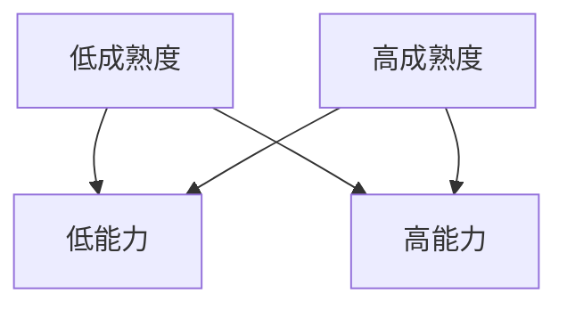
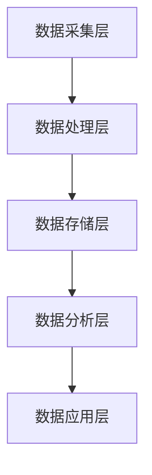
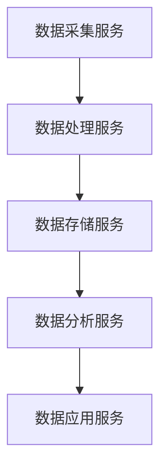
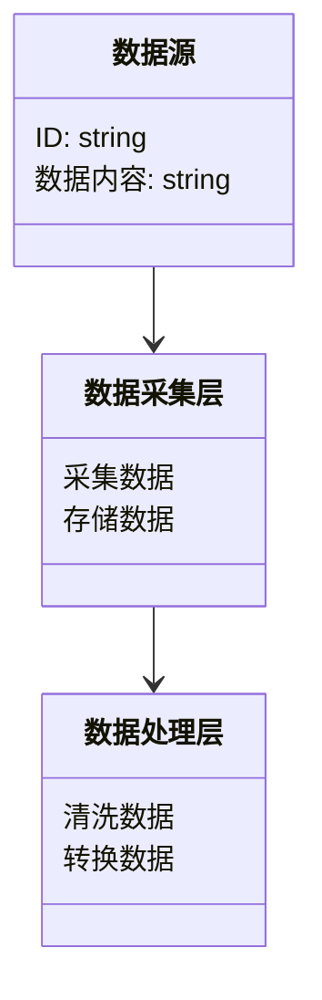
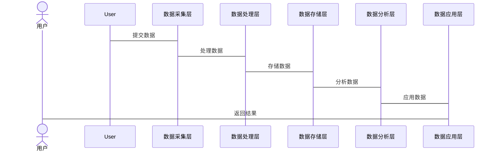

                 

# 彼得林奇如何评估公司的数据治理能力

## 关键词：数据治理，彼得林奇，企业数据管理，数据安全，合规性

## 摘要：  
数据治理是企业数字化转型中的核心能力，直接关系到企业的决策效率、风险管理和核心竞争力。本文从彼得林奇的投资哲学出发，深入分析其评估公司数据治理能力的方法和策略。通过系统的理论阐述、实际案例分析和最佳实践分享，帮助读者全面理解如何从投资者视角评估数据治理能力，从而为企业制定有效的数据治理策略提供参考。

---

# 第一部分: 数据治理概述

## 第1章: 数据治理的基本概念

### 1.1 数据治理的定义与背景

数据治理是企业对数据的全生命周期进行规划、控制、监控和优化的过程，旨在确保数据的完整性、一致性、可用性和安全性。随着数字化转型的深入，数据已成为企业的核心资产，数据治理能力直接关系到企业的决策效率和竞争优势。  
**问题背景**：在企业运营中，数据孤岛、数据冗余、数据不一致等问题普遍存在，导致企业难以充分利用数据价值。数据治理的目标是通过制度、流程和技术手段解决这些问题，提升数据质量，降低数据风险。

### 1.2 数据治理的关键要素

数据治理的核心要素包括：

| 要素 | 描述 | 关键点 |
|------|------|--------|
| 数据质量 | 数据的准确性、完整性、一致性 | 数据清洗、数据校验 |
| 数据安全 | 数据的机密性、完整性和可用性 | 访问控制、加密技术 |
| 数据合规性 | 符合相关法律法规 | GDPR、ISO 27001 |
| 数据生命周期管理 | 数据的创建、存储、使用、归档和销毁 | 数据分类、数据保留策略 |

### 1.3 数据治理与企业运营的关系

数据治理不仅是技术问题，更是企业战略问题。通过数据治理，企业可以优化数据流程，提升数据资产的价值，从而支持更高效的决策和业务创新。

---

# 第二部分: 数据治理能力评估的核心概念

## 第2章: 数据治理能力评估的理论基础

### 2.1 数据治理能力评估的框架

数据治理能力评估通常包括以下维度：

| 维度 | 描述 | 关键指标 |
|------|------|----------|
| 数据质量 | 数据的准确性 | 数据错误率 |
| 数据安全 | 数据的保护能力 | 数据泄露事件数量 |
| 数据合规性 | 符合法律法规 | 合规性审查通过率 |
| 数据生命周期管理 | 数据管理的规范性 | 数据生命周期覆盖率 |

### 2.2 数据治理能力评估的模型

#### 数据治理成熟度模型

数据治理成熟度分为以下几个阶段：

1. **无治理阶段**：数据管理混乱，缺乏统一的规范。
2. **初步治理阶段**：建立基本的数据管理制度。
3. **规范治理阶段**：数据管理流程规范化，部分自动化。
4. **优化治理阶段**：数据治理全面优化，与业务深度结合。

#### 数据治理能力评估矩阵

使用矩阵分析法，将数据治理能力分为四个象限：

---

# 第三部分: 彼得林奇的数据治理评估方法

## 第3章: 彼得林奇数据治理评估方法概述

### 3.1 彼得林奇数据治理评估的核心理念

彼得林奇作为投资大师，注重从投资者的角度评估企业的数据治理能力。他认为，数据治理能力是企业长期价值的重要组成部分。

#### 投资者视角下的数据治理

彼得林奇认为，数据治理能力影响企业的以下几个方面：

- **决策效率**：数据质量越高，决策越高效。
- **风险控制**：数据安全越强，企业越稳健。
- **核心竞争力**：数据资产是企业的核心竞争力。

### 3.2 彼得林奇数据治理评估的步骤

#### 3.2.1 确定评估目标

- 明确数据治理的关键目标，如数据完整性、数据安全等。

#### 3.2.2 收集评估数据

- 通过访谈、文档审查等方式收集数据。

#### 3.2.3 分析评估结果

- 对收集到的数据进行分析，识别问题并提出改进建议。

### 3.3 彼得林奇数据治理评估的关键指标

#### 3.3.1 数据治理的合规性指标

- 数据是否符合相关法律法规。
- 数据安全措施是否完善。

#### 3.3.2 数据治理的效率指标

- 数据处理的响应时间。
- 数据流程的优化程度。

#### 3.3.3 数据治理的效果指标

- 数据驱动的业务增长。
- 数据支持的决策准确性。

---

# 第四部分: 数据治理能力的系统分析与架构设计

## 第4章: 数据治理能力的系统分析

### 4.1 数据治理系统的功能需求

#### 4.1.1 数据采集与处理

- 数据采集：从多种数据源采集数据。
- 数据处理：清洗、转换、归档。

#### 4.1.2 数据存储与管理

- 数据存储：结构化数据存储、非结构化数据存储。
- 数据管理：数据分类、数据标签、数据版本控制。

#### 4.1.3 数据分析与应用

- 数据分析：数据分析模型、数据挖掘。
- 数据应用：数据可视化、数据驱动的决策支持。

### 4.2 数据治理系统的非功能需求

#### 4.2.1 系统性能要求

- 响应时间：数据查询的响应时间。
- 并发能力：支持高并发访问。

#### 4.2.2 系统安全性要求

- 数据加密：数据传输和存储加密。
- 访问控制：基于角色的访问控制。

#### 4.2.3 系统可扩展性要求

- 弹性扩展：支持业务增长。
- 技术兼容性：支持多种数据源和数据格式。

### 4.3 数据治理系统的架构设计

#### 4.3.1 分层架构设计

#### 4.3.2 微服务架构设计

---

# 第五部分: 项目实战与总结

## 第5章: 项目实战

### 5.1 项目背景介绍

假设某企业需要评估其数据治理能力，希望通过彼得林奇的方法论进行优化。

### 5.2 系统功能设计

#### 5.2.1 领域模型设计

### 5.3 系统架构设计

### 5.4 系统交互设计

### 5.5 案例分析与总结

通过实际案例分析，验证彼得林奇评估方法的有效性，并总结经验教训。

---

# 结语

数据治理是企业数字化转型的核心能力，彼得林奇的评估方法为企业提供了从投资者视角优化数据治理的思路。通过系统的理论分析、实际案例和最佳实践分享，本文为企业提供了全面的数据治理能力评估框架和实施路径。未来，随着数据技术的不断发展，数据治理能力的优化将为企业创造更大的价值。

