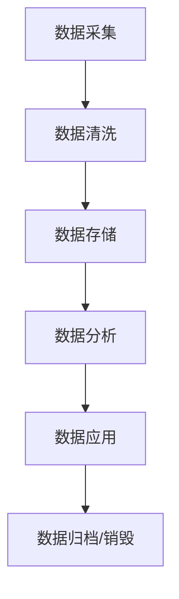
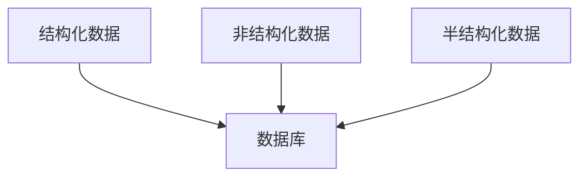
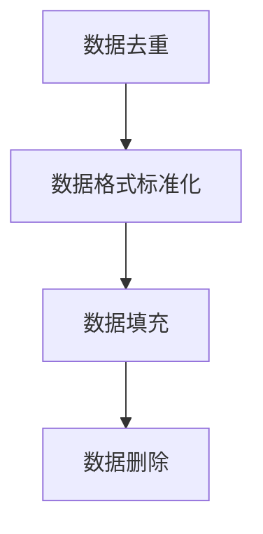
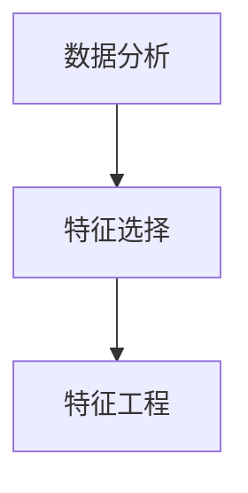
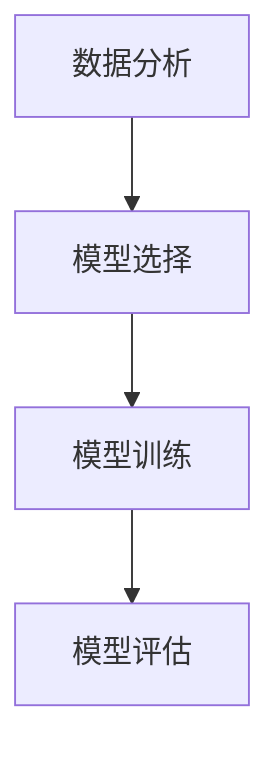
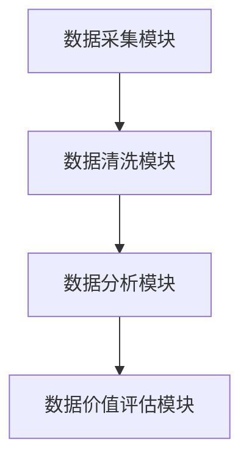
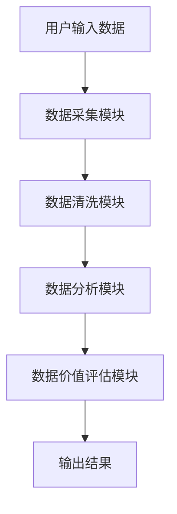

                 


# 彼得林奇如何评估公司的数据资产价值

> 关键词：数据资产，价值评估，彼得林奇，数据分析，投资策略，数据驱动决策，数据资产评估

> 摘要：本文探讨了如何将彼得林奇的投资理念应用于数据资产的评估，分析了数据资产的重要性、分类，详细讲解了数据资产价值评估的核心概念与方法，包括算法原理、数学模型、系统设计以及项目实战。文章结构清晰，逻辑严密，旨在为读者提供一个全面的数据资产价值评估框架。

---

## 第一部分: 数据资产价值评估的背景与基础

## 第1章: 数据资产的定义与重要性

### 1.1 数据资产的定义

#### 1.1.1 数据资产的定义
数据资产是指企业拥有或控制的，能够为企业创造经济价值的数据资源。它不仅包括企业的核心业务数据，还包括从外部获取的数据，通过数据清洗、处理和分析，能够为企业创造价值。

**数据资产的定义对比表：**

| 资产类型 | 定义 | 核心特征 | 价值来源 |
|----------|------|----------|-----------|
| 数据资产 | 企业拥有或控制的数据资源 | 数值性、相关性、可扩展性 | 数据的利用和分析结果 |

#### 1.1.2 数据资产的核心特征
数据资产具有以下核心特征：
- **数值性**：数据以数值形式存在，可以量化。
- **相关性**：数据之间的关联性，能够为企业决策提供支持。
- **可扩展性**：数据可以通过技术手段无限扩展，产生更大的价值。

#### 1.1.3 数据资产与传统资产的对比
| 资产类型 | 资产形式 | 价值来源 | 管理方式 |
|----------|----------|----------|----------|
| 数据资产 | 数值型 | 数据分析结果 | 技术驱动 | 
| 传统资产 | 实物型 | 实物资产的价值 | 财务驱动 |

#### 1.1.4 数据资产的生命周期
数据资产的生命周期包括以下几个阶段：
1. 数据采集
2. 数据清洗
3. 数据存储
4. 数据分析
5. 数据应用
6. 数据归档或销毁

**数据资产的生命周期图（Mermaid）：**


### 1.2 数据资产的重要性

#### 1.2.1 数据资产在现代企业中的地位
数据资产是企业的重要资源，被视为企业的核心竞争力之一。通过数据分析，企业可以优化决策、提升效率、降低成本，并在市场竞争中占据优势。

#### 1.2.2 数据资产对企业价值的影响
数据资产的价值体现在以下几个方面：
- **提升决策效率**：通过数据分析，企业能够更快地做出决策。
- **降低成本**：通过数据分析，企业可以发现浪费并优化资源分配。
- **创造新的收入来源**：通过数据分析，企业可以发现新的市场机会。

#### 1.2.3 数据资产在数字化转型中的作用
数字化转型的核心是数据的利用。数据资产是数字化转型的基石，企业通过数据资产的应用，可以实现业务流程的优化、产品创新和服务提升。

### 1.3 数据资产的分类与层次

#### 1.3.1 数据资产的分类
数据资产可以分为以下几类：
- **结构化数据**：以表格形式存储的数据，如数据库中的数据。
- **非结构化数据**：以文本、图像等形式存在的数据，如文档、图片。
- **半结构化数据**：介于结构化和非结构化之间的数据，如JSON、XML格式的数据。

**数据资产分类图（Mermaid）：**


#### 1.3.2 数据资产的层次结构
数据资产的层次结构包括以下几个层次：
- **数据源**：原始数据的来源。
- **数据存储**：数据的存储位置。
- **数据处理**：数据的清洗和转换。
- **数据分析**：对数据进行分析，提取有价值的信息。
- **数据应用**：将数据分析结果应用于实际业务。

#### 1.3.3 数据资产的生命周期
数据资产的生命周期包括以下几个阶段：
1. 数据采集
2. 数据清洗
3. 数据存储
4. 数据分析
5. 数据应用
6. 数据归档或销毁

### 1.4 数据资产价值评估的背景与趋势

#### 1.4.1 数据驱动决策的兴起
随着大数据技术的发展，数据驱动决策逐渐成为企业的重要决策方式。通过数据分析，企业可以更准确地预测市场趋势、优化资源配置。

#### 1.4.2 数字化转型中的数据资产价值
数字化转型的核心是数据的利用。数据资产是数字化转型的基石，企业通过数据资产的应用，可以实现业务流程的优化、产品创新和服务提升。

#### 1.4.3 数据资产价值评估的现状与挑战
数据资产价值评估的现状包括：
- 数据量大：数据量的增长使得数据资产评估更加复杂。
- 数据类型多样：数据类型多样，评估方法需要多样化。
- 数据安全风险：数据安全风险增加，数据资产评估需要考虑安全因素。

---

## 第2章: 数据资产价值评估的核心概念与方法

### 2.1 数据资产价值的构成要素

#### 2.1.1 数据的准确性
数据的准确性是指数据的正确性和可靠性。准确的数据是数据资产评估的基础。

#### 2.1.2 数据的完整性
数据的完整性是指数据的全面性。完整的数据能够更好地反映企业的实际情况。

#### 2.1.3 数据的及时性
数据的及时性是指数据的更新速度。及时的数据能够更好地支持企业的决策。

#### 2.1.4 数据的可用性
数据的可用性是指数据的可访问性和可利用性。可用的数据是数据资产评估的前提。

#### 2.1.5 数据的关联性
数据的关联性是指数据之间的相关性。关联性强的数据能够更好地支持数据分析和决策。

### 2.2 数据资产价值评估的关键维度

#### 2.2.1 数据的业务价值
数据的业务价值是指数据对企业业务的贡献。业务价值高的数据能够更好地支持企业的决策。

#### 2.2.2 数据的技术价值
数据的技术价值是指数据在技术上的应用价值。技术价值高的数据能够更好地支持技术创新。

#### 2.2.3 数据的市场价值
数据的市场价值是指数据在市场上的价值。市场价值高的数据能够更好地支持企业的市场策略。

---

## 第3章: 数据资产价值评估的算法原理

### 3.1 数据清洗算法

#### 3.1.1 数据清洗的流程
数据清洗的流程包括以下几个步骤：
1. 数据去重
2. 数据格式标准化
3. 数据填充
4. 数据删除

**数据清洗流程图（Mermaid）：**


#### 3.1.2 数据清洗的实现
以下是数据清洗的Python代码示例：

```python
import pandas as pd

# 读取数据
data = pd.read_csv('data.csv')

# 数据去重
data.drop_duplicates(inplace=True)

# 数据格式标准化
data['date'] = pd.to_datetime(data['date'])

# 数据填充
data['age'].fillna(data['age'].mean(), inplace=True)

# 数据删除
data.dropna(inplace=True)
```

### 3.2 数据特征提取算法

#### 3.2.1 特征提取的流程
特征提取的流程包括以下几个步骤：
1. 数据分析
2. 特征选择
3. 特征工程

**特征提取流程图（Mermaid）：**


#### 3.2.2 特征提取的实现
以下是特征提取的Python代码示例：

```python
import pandas as pd
from sklearn.feature_selection import SelectKBest

# 读取数据
data = pd.read_csv('data.csv')

# 特征选择
selector = SelectKBest(k=5)
selector.fit(data.drop('target', axis=1), data['target'])

# 特征工程
selected_features = selector.transform(data.drop('target', axis=1))
```

### 3.3 数据价值评估模型

#### 3.3.1 价值评估模型的流程
价值评估模型的流程包括以下几个步骤：
1. 数据分析
2. 模型选择
3. 模型训练
4. 模型评估

**价值评估模型流程图（Mermaid）：**


#### 3.3.2 价值评估模型的实现
以下是价值评估模型的Python代码示例：

```python
import pandas as pd
from sklearn.linear_model import LinearRegression

# 读取数据
data = pd.read_csv('data.csv')

# 数据分析
print(data.describe())

# 模型选择
model = LinearRegression()

# 模型训练
model.fit(data.drop('value', axis=1), data['value'])

# 模型评估
print('R^2:', model.score(data.drop('value', axis=1), data['value']))
```

### 3.4 数学模型

#### 3.4.1 线性回归模型
线性回归模型的数学公式如下：
$$ y = \beta_0 + \beta_1x_1 + \beta_2x_2 + ... + \beta_nx_n $$

#### 3.4.2 决策树模型
决策树模型的数学公式如下：
$$ y = \text{sign}( \sum_{i=1}^{n} \alpha_i h_i(x) ) $$

---

## 第4章: 数据资产价值评估的系统设计

### 4.1 系统功能设计

#### 4.1.1 系统功能模块
系统功能模块包括以下几个部分：
- 数据采集模块
- 数据清洗模块
- 数据分析模块
- 数据价值评估模块

**系统功能模块图（Mermaid）：**


### 4.2 系统架构设计

#### 4.2.1 系统架构图
系统架构图如下：


### 4.3 系统接口设计

#### 4.3.1 系统接口
系统接口包括以下几个部分：
- 数据输入接口
- 数据输出接口
- 数据分析接口

### 4.4 系统交互流程

#### 4.4.1 系统交互流程图
系统交互流程图如下：


---

## 第5章: 数据资产价值评估的项目实战

### 5.1 项目背景

#### 5.1.1 项目介绍
本项目旨在通过数据分析和数据资产评估，帮助企业优化数据管理策略。

### 5.2 项目实施

#### 5.2.1 环境安装
- 安装Python
- 安装Pandas
- 安装Scikit-learn

#### 5.2.2 数据收集
- 从数据库中提取数据
- 从CSV文件中读取数据

#### 5.2.3 数据清洗
- 数据去重
- 数据格式标准化
- 数据填充
- 数据删除

#### 5.2.4 数据分析
- 数据描述性分析
- 数据可视化

#### 5.2.5 数据特征提取
- 特征选择
- 特征工程

#### 5.2.6 数据价值评估
- 模型选择
- 模型训练
- 模型评估

### 5.3 项目总结

#### 5.3.1 项目成果
通过本项目，企业能够更好地理解数据资产的价值，并制定更有效的数据管理策略。

---

## 第6章: 数据资产价值评估的总结与最佳实践

### 6.1 总结

#### 6.1.1 核心内容回顾
数据资产价值评估是企业数字化转型的重要部分，通过数据分析和数据资产评估，企业可以更好地利用数据资源。

### 6.2 最佳实践

#### 6.2.1 数据资产评估的步骤
1. 数据采集
2. 数据清洗
3. 数据分析
4. 数据价值评估

#### 6.2.2 数据安全的注意事项
- 数据加密
- 访问控制
- 数据备份

### 6.3 拓展阅读

#### 6.3.1 推荐书籍
- 《数据分析的艺术》
- 《数据驱动的决策》
- 《数据安全与隐私保护》

---

通过本文的详细讲解，读者可以全面理解彼得林奇如何评估公司的数据资产价值，并能够将其应用于实际业务中。

