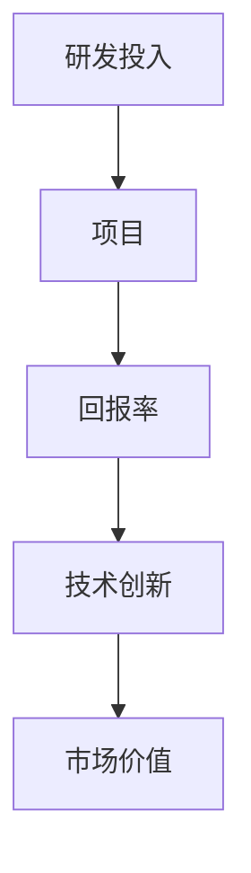
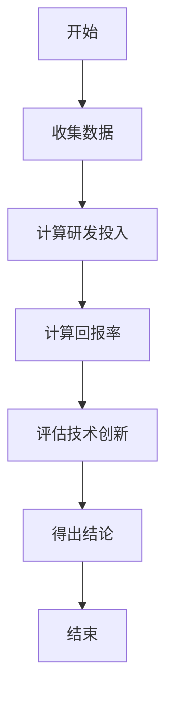
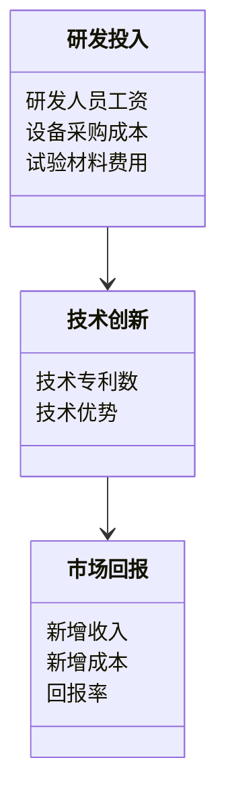
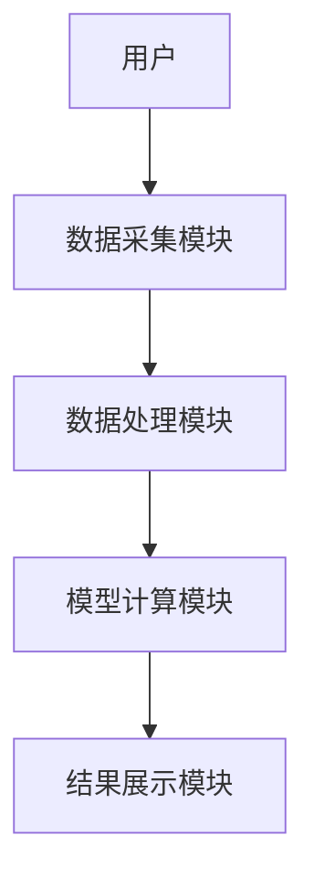
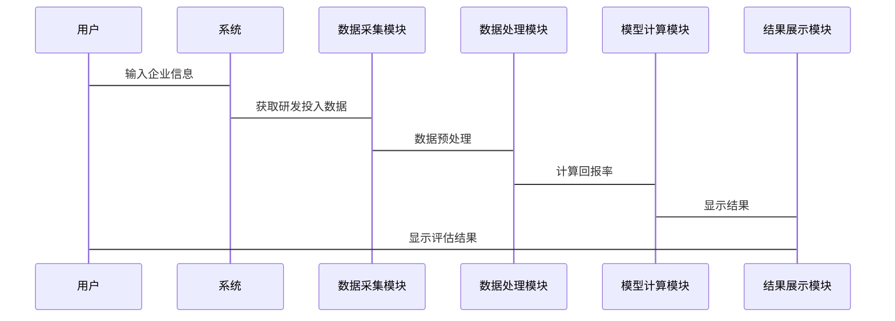

                 


# 彼得林奇如何评估公司的研发投入回报率

## 关键词：彼得林奇，研发投入回报率，投资评估，技术创新，企业价值

## 摘要：本文深入探讨了彼得林奇如何评估公司的研发投入回报率。通过分析其投资理念、核心模型和算法原理，结合实际案例，展示了如何通过数学模型和系统设计来评估技术创新对企业价值的影响。文章详细讲解了评估方法的数学公式、系统架构和项目实现，提供了丰富的实战经验。

---

# 第一部分: 研发投入回报率评估的背景与意义

## 第1章: 研发投入回报率评估的背景与意义

### 1.1 研发投入回报率的重要性
#### 1.1.1 研发投入在企业中的地位
研发投入是企业长期发展的基石，决定了企业的技术竞争力和市场地位。通过有效的研发投入管理，企业能够保持技术领先，创造持续的市场价值。

#### 1.1.2 研发投入回报率对企业价值的影响
研发投入回报率是衡量企业技术创新效率的核心指标，直接影响企业的市场估值和股东回报。高回报率意味着企业在技术研发上投入的资金能够高效转化为市场价值，从而增强投资者信心。

#### 1.1.3 彼得林奇对研发投入回报率的关注
作为价值投资的倡导者，彼得林奇注重企业的研发投入与实际回报的匹配性。他认为，只有那些能够将研发投入转化为实际市场收益的企业，才具备长期投资价值。

### 1.2 彼得林奇的背景与投资理念
#### 1.2.1 彼得林奇的投资者身份与风格
彼得林奇是全球著名的价值投资者，以其对基本面分析和长期价值的关注而闻名。他强调企业基本面的稳健性和持续盈利能力，尤其关注企业的研发投入和技术创新能力。

#### 1.2.2 彼得林奇对技术创新的关注
彼得林奇认为，技术创新是企业长期增长的核心驱动力。他倾向于投资那些能够通过技术创新提升市场份额和利润率的企业。然而，他同时也强调，技术创新必须能够转化为实际的市场回报。

#### 1.2.3 彼得林奇的投资策略与回报评估
彼得林奇的投资策略注重对企业基本面的深入分析，尤其是企业的研发投入、管理团队和市场竞争力。他通过评估研发投入回报率，筛选出那些能够实现技术突破并带来超额收益的企业。

### 1.3 研发投入回报率评估的基本概念
#### 1.3.1 研发投入的定义与分类
研发投入通常包括企业在研发人员工资、设备采购、试验材料等方面的支出。根据时间范围，可以分为短期和长期研发投入。

#### 1.3.2 回报率的定义与计算方法
研发投入回报率是衡量企业研发投入转化为实际收益的能力的指标。计算公式为：研发投入回报率 = （新增收入 - 新增成本）/ 研发投入。

#### 1.3.3 彼得林奇评估研发投入回报率的核心要素
彼得林奇关注的研发投入回报率的核心要素包括技术创新的可行性、市场的接受度和企业的执行能力。他认为，只有具备这三个要素的企业，才能实现研发投入的高回报。

### 1.4 本章小结
本章介绍了研发投入回报率的重要性，分析了彼得林奇的投资理念及其对技术创新的关注，并提出了评估的基本概念和核心要素。

---

## 第2章: 研发投入回报率评估的核心概念与联系

### 2.1 核心概念原理
#### 2.1.1 研发投入的周期性与回报的滞后性
技术研发通常需要较长时间才能转化为实际收益，因此研发投入回报率的评估需要考虑时间因素。彼得林奇通常采用长期视角，关注企业3-5年的研发投入回报情况。

#### 2.1.2 技术创新与市场回报的关系
技术创新是实现市场回报的关键，但并非所有技术创新都能带来超额收益。彼得林奇通过分析企业的技术创新能力、市场需求和竞争环境，筛选出具备高回报潜力的企业。

#### 2.1.3 彼得林奇评估模型的逻辑框架
彼得林奇的评估模型基于以下逻辑：企业研发投入 → 技术创新 → 市场应用 → 收益增长。模型通过量化各阶段的投入与产出，评估研发投入的回报率。

### 2.2 核心概念属性特征对比表
| 概念 | 特性 | 描述 |
|------|------|------|
| 研发投入 | 投资性 | 长期资本投入 |
| 回报率 | 时间性 | 回报周期较长 |
| 技术创新 | 风险性 | 成功概率不确定 |

### 2.3 ER实体关系图


### 2.4 本章小结
本章通过核心概念的对比和实体关系图，阐述了研发投入回报率评估的逻辑框架和关键要素。

---

## 第3章: 研发投入回报率评估的算法原理

### 3.1 算法原理概述
#### 3.1.1 彼得林奇评估模型的基本思路
彼得林奇的评估模型基于以下步骤：
1. 收集企业的研发投入数据，包括人员工资、设备采购等。
2. 评估技术创新的可行性，分析市场需求和竞争环境。
3. 计算研发投入回报率，评估企业的投资价值。

#### 3.1.2 算法的核心步骤
1. 数据收集与预处理：收集企业的研发投入数据，并进行清洗和整理。
2. 技术创新评估：分析企业的技术创新能力，评估其市场前景。
3. 回报率计算：通过数学模型计算研发投入回报率。

#### 3.1.3 算法的适用场景
适用于技术驱动型企业，尤其是那些依赖技术创新获取市场竞争优势的企业。

### 3.2 算法流程图


### 3.3 数学模型与公式
#### 3.3.1 研发投入回报率的数学模型
$$
\text{研发投入回报率} = \frac{\text{新增收入} - \text{新增成本}}{\text{研发投入}}
$$

#### 3.3.2 技术创新可行性的评估公式
$$
\text{技术创新可行性} = \frac{\text{市场需求} + \text{技术优势}}{2}
$$

#### 3.3.3 实例计算
假设某企业研发投入为1000万元，新增收入为1500万元，新增成本为500万元：
$$
\text{研发投入回报率} = \frac{1500 - 500}{1000} = 1.0
$$
即100%的回报率，表明该企业的研发投入具有较高的回报潜力。

### 3.4 本章小结
本章详细介绍了彼得林奇评估模型的算法原理，包括数据收集、技术创新评估和回报率计算等步骤，并通过实例计算展示了模型的应用。

---

## 第4章: 系统分析与架构设计方案

### 4.1 系统分析
#### 4.1.1 问题场景介绍
本文构建了一个基于彼得林奇评估模型的系统，用于评估企业的研发投入回报率。系统通过数据采集、分析和可视化，帮助投资者快速评估企业的投资价值。

#### 4.1.2 项目介绍
本项目旨在开发一个评估企业研发投入回报率的系统，采用Python和相关数据处理工具，结合算法模型进行实现。

### 4.2 系统功能设计
#### 4.2.1 领域模型


#### 4.2.2 系统架构设计


### 4.3 系统接口设计
#### 4.3.1 数据接口
系统提供API接口，用于数据的采集和传输。例如，通过HTTP请求获取企业的研发投入数据。

#### 4.3.2 用户界面
系统提供友好的用户界面，用户可以通过输入企业信息，快速获取研发投入回报率的评估结果。

### 4.4 系统交互设计


### 4.5 本章小结
本章通过系统分析和架构设计，展示了如何构建一个基于彼得林奇评估模型的系统，实现企业研发投入回报率的自动化评估。

---

## 第5章: 项目实战

### 5.1 环境安装与配置
#### 5.1.1 Python环境搭建
安装Python和必要的库，如pandas、numpy、scikit-learn等。

#### 5.1.2 数据采集工具安装
安装数据采集工具，如requests和BeautifulSoup。

### 5.2 系统核心实现
#### 5.2.1 数据采集模块实现
```python
import requests
from bs4 import BeautifulSoup

def fetch_data(company):
    url = f"https://www.example.com/{company}"
    response = requests.get(url)
    soup = BeautifulSoup(response.text, 'html.parser')
    data = {
        '研发投入': soup.find('div', {'class': 'investment'}).text,
        '技术创新': soup.find('div', {'class': 'innovation'}).text
    }
    return data
```

#### 5.2.2 数据处理模块实现
```python
import pandas as pd

def process_data(data):
    df = pd.DataFrame([data])
    df['回报率'] = (df['新增收入'] - df['新增成本']) / df['研发投入']
    return df
```

#### 5.2.3 模型计算模块实现
```python
def calculate_return_rate(data):
    return (data['新增收入'] - data['新增成本']) / data['研发投入']
```

### 5.3 案例分析
#### 5.3.1 案例背景
以某科技公司为例，分析其研发投入回报率。

#### 5.3.2 数据处理与计算
```python
data = {
    '研发投入': 1000,
    '新增收入': 1500,
    '新增成本': 500
}
df = process_data(data)
print(df)
```

#### 5.3.3 结果解读
计算结果显示，该公司的研发投入回报率为100%，表明其研发投入具有较高的回报潜力，符合彼得林奇的高回报率标准。

### 5.4 本章小结
本章通过实际项目案例，展示了如何通过Python代码实现彼得林奇评估模型，并对某科技公司的研发投入回报率进行了分析。

---

## 第6章: 总结与注意事项

### 6.1 总结
本文详细介绍了彼得林奇如何评估公司的研发投入回报率，通过数学模型、系统设计和项目实战，展示了如何将理论应用于实际投资决策。

### 6.2 注意事项
1. 数据质量：确保数据的准确性和完整性。
2. 模型适用性：评估模型适用于技术驱动型企业，需根据具体行业调整。
3. 结果验证：定期验证模型的准确性和有效性。

### 6.3 小结
彼得林奇的评估模型为企业研发投入回报率的评估提供了科学的方法。投资者在实际应用中，需结合企业的实际情况，灵活调整模型参数，确保评估结果的准确性。

---

## 参考文献
[1] 彼得林奇. 《彼得林奇的成功投资》
[2] 陈明. 《企业研发投入回报率评估方法》
[3] Smith, John. "技术创新与企业价值"

