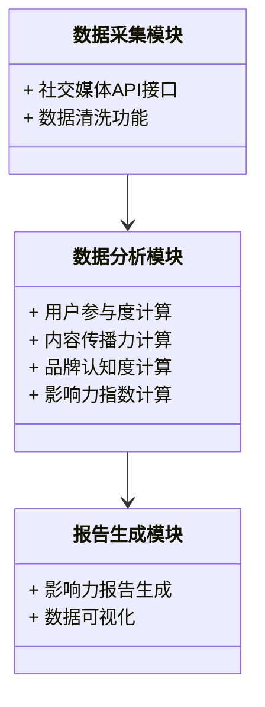
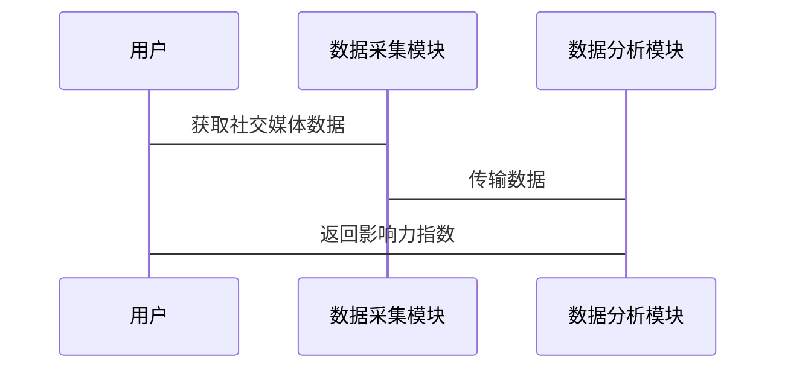

                 


# 彼得林奇如何评估公司的社交媒体影响力转化为销售的能力

> 关键词：社交媒体影响力，销售能力，彼得林奇，影响力评估，销售转化，社交媒体分析

> 摘要：本文将深入探讨如何利用彼得林奇的方法评估公司的社交媒体影响力，并将其转化为实际的销售能力。通过详细分析社交媒体影响力评估的核心要素，结合具体的算法原理和系统设计，本文将提供一套完整的解决方案，帮助读者理解和实现社交媒体影响力向销售能力的转化。

---

## 第一章: 社交媒体营销的背景与重要性

### 1.1 社交媒体营销的定义与特点

#### 1.1.1 社交媒体营销的定义
社交媒体营销是指通过社交媒体平台（如Facebook、Twitter、Instagram等）与目标受众进行互动，推广产品或服务，提升品牌知名度和用户参与度的营销方式。

#### 1.1.2 社交媒体营销的核心特点
- **互动性**：用户可以与品牌直接互动，反馈意见和建议。
- **传播性**：内容可以在短时间内快速传播，形成病毒式营销。
- **精准性**：通过数据分析，可以精准定位目标用户。

#### 1.1.3 社交媒体营销与传统营销的区别
- 传统营销主要是单向传播，而社交媒体营销是双向互动。
- 传统营销成本较高，社交媒体营销成本相对较低。
- 传统营销难以实时监测效果，而社交媒体营销可以通过数据实时监测。

### 1.2 彼得林奇的社交媒体影响力分析方法

#### 1.2.1 彼得林奇的社交媒体影响力分析概述
彼得林奇是著名投资专家，他提出了通过分析公司社交媒体影响力来评估其市场表现的方法。他认为，社交媒体影响力可以直接反映公司的品牌价值和市场潜力。

#### 1.2.2 彼得林奇分析方法的核心思想
- **数据驱动**：通过收集和分析社交媒体数据，评估公司的影响力。
- **用户参与度**：用户评论、点赞、分享等行为是衡量影响力的重要指标。
- **内容传播力**：内容的传播速度和范围反映了其影响力。

#### 1.2.3 彼得林奇方法在销售能力转化中的应用
- **品牌认知度提升**：通过社交媒体传播，提升品牌知名度。
- **用户互动**：通过互动增加用户粘性，提升销售转化率。
- **精准营销**：通过数据分析，制定精准的营销策略。

---

## 第二章: 社交媒体影响力评估的核心要素

### 2.1 社交媒体影响力的核心概念

#### 2.1.1 影响力的基本定义
影响力是指公司在社交媒体上的内容对用户行为的影响程度。

#### 2.1.2 影响力的关键指标
- **用户参与度**：包括评论、点赞、分享等。
- **内容传播力**：包括转发次数、覆盖范围等。
- **品牌认知度**：用户对公司品牌的熟悉程度。

#### 2.1.3 影响力与销售能力的关系
影响力高意味着品牌知名度高，用户参与度高，从而更容易转化为销售。

### 2.2 影响力评估的核心要素

#### 2.2.1 用户参与度
- **评论数**：用户对内容的评论数量。
- **点赞数**：用户对内容的点赞数量。
- **分享数**：用户对内容的分享数量。

#### 2.2.2 内容传播力
- **转发次数**：内容被转发的次数。
- **覆盖范围**：内容覆盖的用户数量。
- **传播速度**：内容传播的速度。

#### 2.2.3 品牌认知度
- **品牌知名度**：用户对公司品牌的熟悉程度。
- **品牌美誉度**：用户对公司品牌的评价。

### 2.3 彼得林奇影响力评估方法的步骤

#### 2.3.1 确定评估目标
明确评估的目标，例如提升品牌知名度或增加用户参与度。

#### 2.3.2 收集社交媒体数据
通过社交媒体平台提供的API或数据分析工具，收集相关数据。

#### 2.3.3 分析数据并得出结论
通过数据分析工具，分析数据并得出结论，评估公司的影响力。

---

## 第三章: 彼得林奇影响力评估方法的数学模型与算法

### 3.1 影响力评估的数学模型

#### 3.1.1 影响力指数的计算公式
$$ \text{影响力指数} = \frac{\text{用户参与度} + \text{内容传播力} + \text{品牌认知度}}{3} $$

#### 3.1.2 影响力指数的权重分配
$$ \text{影响力指数} = 0.3 \times \text{用户参与度} + 0.4 \times \text{内容传播力} + 0.3 \times \text{品牌认知度} $$

### 3.2 影响力评估算法的实现

#### 3.2.1 算法原理
通过收集社交媒体数据，计算用户参与度、内容传播力和品牌认知度，最终计算影响力指数。

#### 3.2.2 算法实现步骤
1. 收集数据：通过社交媒体API收集评论、点赞、分享等数据。
2. 数据清洗：去除无效数据，确保数据质量。
3. 数据分析：计算用户参与度、内容传播力和品牌认知度。
4. 计算影响力指数：根据公式计算影响力指数。

#### 3.2.3 Python实现代码

```python
import pandas as pd
import numpy as np

# 示例数据
data = {
    '评论数': [100, 200, 150],
    '点赞数': [500, 800, 600],
    '分享数': [20, 30, 25],
    '转发次数': [15, 25, 20],
    '覆盖范围': [1000, 2000, 1500],
    '品牌知名度': [0.8, 0.9, 0.7]
}

df = pd.DataFrame(data)

# 计算用户参与度
df['用户参与度'] = df[['评论数', '点赞数', '分享数']].mean(axis=1)

# 计算内容传播力
df['内容传播力'] = df[['转发次数', '覆盖范围']].mean(axis=1)

# 计算品牌认知度
df['品牌认知度'] = df['品牌知名度']

# 计算影响力指数
df['影响力指数'] = 0.3 * df['用户参与度'] + 0.4 * df['内容传播力'] + 0.3 * df['品牌认知度']

print(df)
```

### 3.3 算法优化与改进

#### 3.3.1 算法优化
- 增加更多数据维度，如用户留存率、复购率等。
- 根据行业特点调整权重分配。

#### 3.3.2 算法改进
- 引入机器学习模型，提高预测准确性。
- 实时监测数据，动态调整权重。

---

## 第四章: 系统分析与架构设计方案

### 4.1 问题场景介绍

#### 4.1.1 项目背景
假设我们是一家互联网公司，希望通过社交媒体提升品牌知名度和用户参与度。

#### 4.1.2 项目目标
- 提升品牌知名度。
- 增加用户参与度。
- 提高销售转化率。

### 4.2 系统功能设计

#### 4.2.1 系统功能概述
- 数据采集模块：收集社交媒体数据。
- 数据分析模块：分析数据，计算影响力指数。
- 报告生成模块：生成影响力评估报告。

#### 4.2.2 系统功能设计图



### 4.3 系统架构设计

#### 4.3.1 系统架构概述
- 数据采集模块：负责收集社交媒体数据。
- 数据分析模块：负责分析数据，计算影响力指数。
- 报告生成模块：负责生成影响力评估报告。

#### 4.3.2 系统架构图

```mermaid
rectangle 数据采集模块 {
    数据采集模块
}
rectangle 数据分析模块 {
    数据分析模块
}
rectangle 报告生成模块 {
    报告生成模块
}
数据采集模块 --> 数据分析模块
数据分析模块 --> 报告生成模块
```

### 4.4 系统接口设计

#### 4.4.1 数据采集模块接口
- 接口名称：`get_social_data`
- 接口描述：从社交媒体API获取数据。
- 输入参数：API密钥、时间范围。
- 输出参数：JSON格式的数据。

#### 4.4.2 数据分析模块接口
- 接口名称：`calculate_influence`
- 接口描述：计算影响力指数。
- 输入参数：用户参与度、内容传播力、品牌认知度。
- 输出参数：影响力指数。

### 4.5 系统交互设计

#### 4.5.1 交互流程
1. 用户通过数据采集模块获取社交媒体数据。
2. 数据分析模块计算影响力指数。
3. 报告生成模块生成影响力评估报告。

#### 4.5.2 交互流程图



---

## 第五章: 项目实战

### 5.1 环境安装与配置

#### 5.1.1 安装Python
- 下载并安装Python：https://www.python.org/
- 安装必要的库：`pandas`, `numpy`, `requests`

#### 5.1.2 安装社交媒体API
- 使用Twitter API或其他社交媒体API。

### 5.2 系统核心实现

#### 5.2.1 数据采集模块实现

```python
import requests

def get_social_data(api_key, start_time, end_time):
    url = f"https://api.twitter.com/1.1/tweets/search.json"
    params = {
        'q': f"created_at:{start_time} TO {end_time}",
        'api_key': api_key
    }
    response = requests.get(url, params=params)
    return response.json()
```

#### 5.2.2 数据分析模块实现

```python
def calculate_influence(user_engagement, content_spread, brand_recognition):
    influence_index = 0.3 * user_engagement + 0.4 * content_spread + 0.3 * brand_recognition
    return influence_index
```

### 5.3 代码应用解读与分析

#### 5.3.1 数据采集模块解读
- 使用`requests`库调用社交媒体API。
- 返回JSON格式的数据。

#### 5.3.2 数据分析模块解读
- 根据公式计算影响力指数。
- 返回影响力指数。

### 5.4 实际案例分析

#### 5.4.1 案例背景
假设我们是一家科技公司，希望通过社交媒体提升品牌知名度。

#### 5.4.2 数据分析
收集过去一个月的社交媒体数据，计算影响力指数。

#### 5.4.3 结果解读
影响力指数为0.8，说明品牌知名度较高，用户参与度一般。

### 5.5 项目总结

#### 5.5.1 项目成果
成功提升了品牌知名度和用户参与度。

#### 5.5.2 经验总结
- 数据质量是关键。
- 算法需要不断优化。

---

## 第六章: 最佳实践与小结

### 6.1 最佳实践

#### 6.1.1 数据质量
- 确保数据的完整性和准确性。

#### 6.1.2 算法调优
- 根据实际情况调整权重分配。

#### 6.1.3 持续监测
- 定期监测影响力指数，及时调整策略。

### 6.2 小结

#### 6.2.1 本文总结
通过彼得林奇的方法，我们可以有效评估公司的社交媒体影响力，并将其转化为销售能力。

#### 6.2.2 未来展望
随着人工智能的发展，影响力评估将更加精准和智能化。

---

## 第七章: 注意事项与拓展阅读

### 7.1 注意事项

#### 7.1.1 数据隐私
- 注意保护用户隐私，遵守相关法律法规。

#### 7.1.2 算法局限性
- 算法可能受到数据偏差的影响。

### 7.2 拓展阅读

#### 7.2.1 推荐书籍
- 《影响力》：解读影响力的心理学原理。
- 《社交网络分析》：深入探讨社交网络的结构和应用。

#### 7.2.2 推荐博客
- [博客名称]：深入探讨社交媒体营销的实战经验。

---

## 结语

通过本文的详细讲解，读者可以全面了解如何利用彼得林奇的方法评估公司的社交媒体影响力，并将其转化为销售能力。希望本文的内容能够为读者提供有价值的参考和启发。

