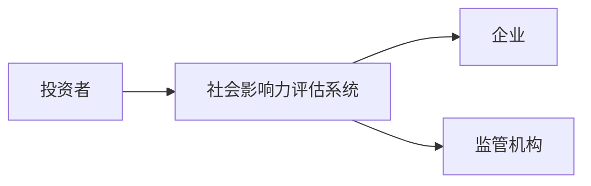

                 


# 彼得林奇如何评估公司的社会影响力

## 关键词：彼得·林奇，社会影响力，企业评估，投资决策，影响力指数，影响力模型，影响力分析

## 摘要：
本文详细探讨了彼得·林奇如何评估公司的社会影响力。通过分析社会影响力的核心概念、评估方法、系统架构及项目实战，本文为投资者和企业管理者提供了实用的评估工具和策略，帮助他们在投资决策中充分考虑企业的社会影响力。

---

# 目录

## 目录

### 第一部分: 社会影响力评估的背景与意义

#### 第1章: 社会影响力评估的定义与重要性

##### 1.1 社会影响力的概念

###### 1.1.1 社会影响力的基本定义

社会影响力是指企业在经营过程中对社会、环境和治理等方面产生的正面或负面影响的综合体现。它是企业在社会中的价值和责任的量化表现。

###### 1.1.2 社会影响力的核心要素

- 环境因素：企业的环保措施、资源利用效率等。
- 社会因素：企业对员工、社区和社会公益的贡献。
- 公司治理：企业内部管理、透明度和合规性。

###### 1.1.3 社会影响力与企业价值的关系

社会影响力不仅影响企业的声誉，还直接关系到企业的长期发展和投资价值。具备良好的社会影响力的企业通常能获得更高的市场信任和投资回报。

##### 1.2 彼得·林奇的评估方法

###### 1.2.1 彼得·林奇的基本面分析

彼得·林奇以基本面分析著称，他通过对企业财务状况、管理层能力和市场地位的分析来评估投资价值。社会影响力作为基本面分析的一部分，被用来评估企业的社会责任和长期发展潜力。

###### 1.2.2 社会影响力在投资决策中的作用

社会影响力评估帮助企业识别潜在风险和机会，从而影响投资决策。例如，一家在环保方面表现不佳的企业可能面临更高的监管风险和声誉损失。

###### 1.2.3 林奇方法的核心理念

林奇强调长期投资和价值发现，他认为具备良好社会影响力的企业更有可能实现可持续增长，从而为投资者带来稳定回报。

#### 第2章: 社会影响力评估的意义

##### 2.1 企业社会责任的重要性

###### 2.1.1 企业社会责任的定义

企业社会责任（CSR）是指企业在追求经济效益的同时，对社会、环境和利益相关者承担的责任。

###### 2.1.2 社会责任对企业形象的影响

良好的社会责任表现能提升企业形象，增强品牌忠诚度，为企业带来竞争优势。

###### 2.1.3 社会责任与企业可持续发展的关系

社会责任是企业可持续发展的基石，直接影响企业的长期生存和成功。

##### 2.2 投资者视角的社会影响力评估

###### 2.2.1 投资者关注的社会影响力因素

投资者关注企业的环保表现、员工待遇、社区贡献和社会治理等方面。

###### 2.2.2 社会影响力对投资决策的影响

社会影响力评估帮助投资者识别高风险企业，避免投资于社会责任表现不佳的企业。

###### 2.2.3 社会影响力评估的现状与趋势

随着ESG投资的兴起，社会影响力评估越来越受到投资者的重视。

---

## 第二部分: 社会影响力评估的核心概念

### 第3章: 社会影响力评估的核心要素

#### 3.1 企业社会影响力的主要维度

##### 3.1.1 环境影响

- 企业对环境保护的投入和成效，包括减少碳排放、资源节约等。

##### 3.1.2 社会影响

- 企业对员工、社区和社会公益的贡献，包括员工福利、教育支持等。

##### 3.1.3 公司治理

- 企业的管理透明度、董事会结构和内部控制机制。

#### 3.2 社会影响力评估的关键指标

##### 3.2.1 环境指标

- 碳排放量、能源消耗、废物处理效率等。

##### 3.2.2 社会指标

- 员工满意度、社区参与度、公益支出等。

##### 3.2.3 治理指标

- 董事会多样性、高管薪酬差距、内部控制有效性等。

#### 3.3 社会影响力评估的核心概念联系

##### 3.3.1 实体关系图（ER图）

```mermaid
erDiagram
    actor 投资者 {
        <<Investor>>
    }
    actor 社会 {
        <<Society>>
    }
    actor 企业 {
        <<Company>>
    }
    actor 监管机构 {
        <<Regulator>>
    }
    investor --> 社会 : 评估社会影响力
    企业 --> 社会 : 履行社会责任
    监管机构 --> 企业 : 监督和评估
```

---

## 第三部分: 社会影响力评估的方法论

### 第4章: 社会影响力评估的方法与流程

#### 4.1 数据收集与处理

##### 4.1.1 数据来源

- 公司年报、社会责任报告、第三方评级机构数据。

##### 4.1.2 数据清洗与预处理

- 去除异常值、填补缺失值、标准化处理。

#### 4.2 数据分析与建模

##### 4.2.1 确定评估指标

- 根据企业特点选择关键指标，如环境、社会和治理指标。

##### 4.2.2 构建评估模型


##### 4.2.3 计算影响力指数

- 影响力指数公式：

$$
\text{影响力指数} = \sum (\text{指标权重} \times \text{指标得分})
$$

---

## 第四部分: 社会影响力评估的系统架构与技术实现

### 第5章: 系统架构设计

#### 5.1 系统功能设计

##### 5.1.1 系统功能模块

- 数据输入模块：接收企业社会责任数据。
- 评估计算模块：计算影响力指数。
- 结果展示模块：生成可视化报告。

##### 5.1.2 系统功能流程图


#### 5.2 系统架构设计

##### 5.2.1 系统架构图



##### 5.2.2 核心组件

- 数据存储层：存储企业社会责任数据。
- 业务逻辑层：处理数据并计算影响力指数。
- 用户界面层：展示评估结果。

---

## 第五部分: 项目实战

### 第6章: 项目实战与案例分析

#### 6.1 项目背景与需求分析

- 选择一家企业作为案例，分析其社会影响力。

#### 6.2 数据采集与处理

##### 6.2.1 数据采集

- 获取企业的社会责任报告和相关数据。

##### 6.2.2 数据清洗

- 处理缺失值和异常值，确保数据质量。

#### 6.3 模型构建与评估

##### 6.3.1 选择评估指标

- 根据企业特点选择关键指标。

##### 6.3.2 计算影响力指数

- 使用公式计算影响力指数，生成可视化报告。

#### 6.4 案例分析与结果解读

- 解释评估结果，分析企业的社会影响力表现。

#### 6.5 代码实现

##### 6.5.1 数据预处理代码

```python
import pandas as pd

# 读取数据
data = pd.read_csv('social_influence.csv')

# 去除缺失值
data.dropna(inplace=True)

# 填充缺失值
data['员工满意度'].fillna(data['员工满意度'].mean(), inplace=True)
```

##### 6.5.2 评估模型实现

```python
def calculate_influence_index(data):
    # 定义指标权重
    weights = {
        '环境影响': 0.3,
        '社会影响': 0.4,
        '治理指标': 0.3
    }
    
    # 计算影响力指数
    influence_index = 0
    for metric, weight in weights.items():
        influence_index += data[metric] * weight
    return influence_index

# 计算影响力指数
influence_index = calculate_influence_index(data)
```

---

## 第六部分: 总结与展望

### 第7章: 总结与展望

#### 7.1 总结

- 彼得·林奇的社会影响力评估方法为投资者提供了新的视角，帮助他们做出更全面的投资决策。

#### 7.2 未来展望

- 随着技术的发展，社会影响力评估将更加精准和智能化，为企业的可持续发展提供更强有力的支持。

#### 7.3 最佳实践 tips

- 投资者应将社会影响力作为投资决策的重要因素，关注企业的社会责任表现。
- 企业应积极履行社会责任，提升社会影响力，从而增强市场竞争力。

---

通过以上内容，本文详细探讨了彼得·林奇如何评估公司的社会影响力，从理论到实践，为投资者和企业管理者提供了实用的工具和策略。希望本文能为您提供有价值的见解和启发，帮助您在投资决策中充分考虑企业的社会影响力。

