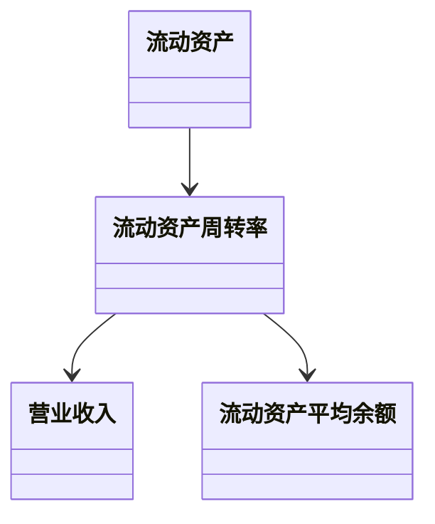

                 


# 彼得林奇对公司流动资产效率的评估

> 关键词：彼得·林奇，流动资产效率，投资评估，财务指标，企业价值

> 摘要：本文深入探讨了彼得·林奇对公司流动资产效率的评估方法，分析了流动资产在企业运营中的重要性，详细讲解了流动资产效率的计算公式和评估模型，并通过实例分析展示了如何应用这些方法进行投资决策。文章结构清晰，内容详实，适合投资专业人士和企业管理者阅读。

---

# 第一部分: 背景介绍

## 第1章: 流动资产效率评估的背景与意义

### 1.1 流动资产的概念与重要性

#### 1.1.1 流动资产的定义
流动资产是指企业能够在一年内或一个正常营业周期内变现或耗用的资产，主要包括现金及现金等价物、应收账款、存货、短期投资等。这些资产具有较强的流动性，能够快速转化为现金，支持企业的日常运营。

#### 1.1.2 流动资产在企业运营中的作用
流动资产是企业维持日常运营和应对突发事件的关键。充足的流动资产可以确保企业按时支付账单、购买原材料、偿还短期债务等。同时，流动资产的高效管理能够提高企业的运营效率，降低成本，从而增强企业的竞争力。

#### 1.1.3 流动资产效率对企业价值的影响
流动资产的效率直接关系到企业的盈利能力。高效率的流动资产能够更快地转化为收入，从而提高企业的资金周转率和利润率。反之，低效率的流动资产可能导致资金闲置或周转缓慢，影响企业的整体表现。

### 1.2 彼得·林奇的投资理念与方法

#### 1.2.1 彼得·林奇的投资者背景与成就
彼得·林奇是美国著名的投资专家，曾任富达投资集团的董事长。他以其独特的投资哲学和卓越的投资业绩闻名，尤其擅长通过分析企业的财务指标来评估其投资价值。

#### 1.2.2 彼得·林奇的投资哲学
彼得·林奇主张“价值投资”，即通过深入分析企业的基本面，寻找那些具有竞争优势且被市场低估的企业进行投资。他认为，企业的财务健康状况是决定其投资价值的关键因素之一。

#### 1.2.3 彼得·林奇对企业财务指标的关注
彼得·林奇特别关注企业的流动资产效率，认为这是衡量企业运营能力和财务健康的重要指标。他通过分析流动资产周转率、存货周转率等指标，来评估企业的流动资产管理能力。

### 1.3 本文的核心目标与内容框架

#### 1.3.1 本文的核心目标
本文旨在介绍彼得·林奇的流动资产效率评估方法，帮助投资者和企业管理者更好地理解流动资产在企业运营中的重要性，并掌握如何通过流动资产效率评估来优化企业的财务表现。

#### 1.3.2 本文的内容框架
本文分为几个主要部分：
1. 背景介绍：包括流动资产的概念、彼得·林奇的投资理念等。
2. 核心概念与联系：详细讲解流动资产的构成、流动资产效率的计算方法等。
3. 算法原理：介绍流动资产效率评估的数学模型和计算方法。
4. 系统分析：构建流动资产效率评估的系统架构图和交互图。
5. 实战案例：通过具体案例分析，展示如何应用彼得·林奇的方法进行流动资产效率评估。
6. 总结与展望：总结全文，展望未来的研究方向。

---

# 第二部分: 核心概念与联系

## 第2章: 流动资产效率评估的核心概念

### 2.1 流动资产的构成与分类

#### 2.1.1 现金及现金等价物
现金及现金等价物是流动资产中流动性最强的部分，包括企业的库存现金、银行存款、短期投资等。这些资产可以随时用于支付账单或购买原材料。

#### 2.1.2 应收账款
应收账款是指企业因赊销商品或提供服务而应收取的款项。应收账款的回收速度直接影响企业的流动资产效率。

#### 2.1.3 存货
存货是指企业在生产过程中持有的原材料、在制品和成品。存货的周转速度是衡量企业运营效率的重要指标。

#### 2.1.4 其他流动资产
其他流动资产包括预付账款、短期投资等。这些资产在短期内可以变现或消耗，因此也属于流动资产的范畴。

### 2.2 流动资产周转率与效率

#### 2.2.1 流动资产周转率的定义
流动资产周转率是指企业在一定时期内流动资产的总周转次数。它是衡量企业流动资产使用效率的重要指标。

#### 2.2.2 流动资产周转率的计算公式
流动资产周转率的计算公式如下：
$$ \text{流动资产周转率} = \frac{\text{营业收入}}{\text{流动资产平均余额}} $$
其中，流动资产平均余额为流动资产在会计期间的平均值。

#### 2.2.3 彼得·林奇对流动资产周转率的关注
彼得·林奇认为，流动资产周转率是衡量企业流动资产效率的重要指标。他建议投资者关注企业的流动资产周转率是否稳定且高于行业平均水平。

### 2.3 流动资产与企业绩效的关系

#### 2.3.1 流动资产效率对企业盈利能力的影响
流动资产效率高意味着企业能够更快地将流动资产转化为收入，从而提高企业的盈利能力。

#### 2.3.2 流动资产效率对企业偿债能力的影响
流动资产效率高能够增强企业的偿债能力，因为充足的流动资产可以确保企业能够按时偿还短期债务。

#### 2.3.3 流动资产效率对企业运营能力的影响
流动资产效率高能够提高企业的运营能力，使其能够更高效地利用资源，降低成本，提高整体竞争力。

---

# 第三部分: 算法原理讲解

## 第3章: 流动资产效率评估的算法原理

### 3.1 流动资产周转率的计算公式

#### 3.1.1 流动资产周转率的公式
流动资产周转率的计算公式如下：
$$ \text{流动资产周转率} = \frac{\text{营业收入}}{\text{流动资产平均余额}} $$

#### 3.1.2 例子分析：如何计算流动资产周转率
假设某企业在会计期间内营业收入为1000万元，流动资产平均余额为500万元。则流动资产周转率为：
$$ \text{流动资产周转率} = \frac{1000}{500} = 2 $$

---

# 第四部分: 数学模型与公式

## 第4章: 流动资产效率评估的数学模型

### 4.1 流动资产周转率的数学公式
流动资产周转率的数学公式如下：
$$ \text{流动资产周转率} = \frac{\text{营业收入}}{\text{流动资产平均余额}} $$

---

# 第五部分: 系统分析与架构设计

## 第5章: 流动资产效率评估的系统架构设计

### 5.1 系统功能设计
#### 5.1.1 领域模型类图


#### 5.1.2 系统架构图
```mermaid
client
  .- API --> 服务层
  .- 数据库 --> 数据层
服务层
  .- 逻辑处理 --> 流动资产计算模块
  .- 调度管理
数据层
  .- 数据存储 --> 流动资产表
  .- 数据存储 --> 营业收入表
```

---

# 第六部分: 项目实战

## 第6章: 流动资产效率评估的实战案例

### 6.1 环境安装
在开始之前，请确保安装以下工具：
- Python 3.8+
- Jupyter Notebook
- Mermaid工具（用于绘制图表）

### 6.2 系统核心实现源代码

#### 6.2.1 流动资产周转率的计算代码
```python
def calculate_working_capital_turnover(revenue, avg_working_capital):
    return revenue / avg_working_capital

# 示例数据
revenue = 1000  # 营业收入（万元）
avg_working_capital = 500  # 流动资产平均余额（万元）

turnover = calculate_working_capital_turnover(revenue, avg_working_capital)
print(f"流动资产周转率 = {turnover:.2f}")
```

#### 6.2.2 代码实现
```python
# 输入数据
revenue = float(input("请输入营业收入（万元）："))
avg_working_capital = float(input("请输入流动资产平均余额（万元）："))

# 计算流动资产周转率
turnover = revenue / avg_working_capital

# 输出结果
print(f"流动资产周转率 = {turnover:.2f}")
```

### 6.3 案例分析
假设某制造企业2022年的营业收入为1500万元，流动资产平均余额为600万元。则其流动资产周转率为：
$$ \text{流动资产周转率} = \frac{1500}{600} = 2.5 $$

---

# 第七部分: 总结与展望

## 第7章: 总结与展望

### 7.1 本文总结
本文详细介绍了彼得·林奇对公司流动资产效率的评估方法，包括流动资产的构成、流动资产周转率的计算公式、系统的架构设计以及实战案例的分析。通过本文的学习，读者可以掌握如何通过流动资产效率评估来优化企业的财务表现。

### 7.2 未来展望
未来的研究可以进一步探讨流动资产效率与企业绩效之间的关系，开发更复杂的模型来预测企业的财务表现。此外，还可以结合大数据技术，利用机器学习算法来优化流动资产的管理策略。

---

# 结语
彼得·林奇的流动资产效率评估方法为我们提供了一个全新的视角来审视企业的财务健康状况。通过本文的学习，读者可以更好地理解流动资产在企业运营中的重要性，并掌握如何通过流动资产效率评估来优化企业的财务表现。希望本文能够为投资者和企业管理者提供有价值的参考。

