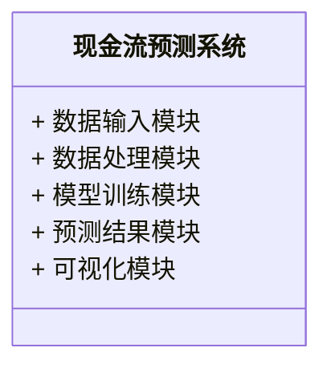
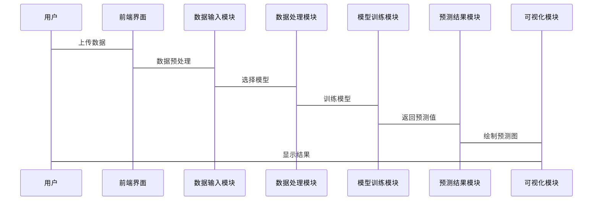

                 


# 彼得林奇对公司产品生命周期管理与现金流预测准确性的关系研究

**关键词**：彼得林奇，产品生命周期管理，现金流预测，现金流预测算法，时间序列分析，机器学习，LSTM，ARIMA

**摘要**：  
本文深入探讨了彼得林奇在公司产品生命周期管理与现金流预测准确性之间的关系研究。通过分析产品生命周期各阶段对现金流的影响，结合现金流预测的算法与数学模型，提出了如何通过时间序列分析和机器学习算法（如ARIMA和LSTM）来提高现金流预测的准确性。文章从背景介绍、核心概念与联系、算法原理、系统架构设计、项目实战等方面展开，结合实际案例分析，为读者提供了理论与实践相结合的深度解析。

---

## 第三部分: 现金流预测的算法与数学模型

### 第3章: 现金流预测的算法原理

#### 3.1 时间序列分析

##### 3.1.1 时间序列的基本概念
时间序列分析是一种通过观察历史数据的变化模式来预测未来值的方法。现金流预测的核心就是基于时间序列的数据，分析其趋势、周期性、季节性等特征，从而进行预测。

##### 3.1.2 自回归积分滑动平均模型（ARIMA）
ARIMA（Autoregressive Integrated Moving Average）模型是一种广泛应用于时间序列预测的统计模型。它由自回归（AR）部分和移动平均（MA）部分组成，并通过差分运算将非平稳序列转化为平稳序列。

**数学模型**：
$$ ARIMA(p, d, q) $$
其中：
- \( p \)：自回归阶数
- \( d \)：差分阶数
- \( q \)：移动平均阶数

**实现步骤**：
1. 数据预处理：检查数据的平稳性，必要时进行差分。
2. 模型参数选择：通过网格搜索或信息准则（如AIC、BIC）选择最佳参数。
3. 模型训练：基于训练数据拟合ARIMA模型。
4. 模型预测：使用训练好的模型进行未来现金流预测。

**代码示例**：
```python
import pandas as pd
from statsmodels.tsa.arima_model import ARIMA
import matplotlib.pyplot as plt

# 加载数据
data = pd.read_csv('cash_flow.csv', index_col='date')

# 差分处理
diff_data = data['cash_flow'].diff().dropna()

# 拟合ARIMA模型
model = ARIMA(data['cash_flow'], order=(5, 1, 2))
model_fit = model.fit()

# 预测未来值
forecast = model_fit.forecast(steps=10)

# 绘制预测结果
plt.figure(figsize=(10, 6))
plt.plot(data['cash_flow'], label='实际值')
plt.plot(forecast[0], label='预测值')
plt.xlabel('时间')
plt.ylabel('现金流')
plt.legend()
plt.show()
```

#### 3.2 机器学习算法在现金流预测中的应用

##### 3.2.1 长期记忆网络（LSTM）
LSTM（Long Short-Term Memory）是一种特殊的循环神经网络（RNN），能够有效处理时间序列数据中的长期依赖关系。与传统的时间序列模型相比，LSTM在处理复杂模式和非线性关系时表现更优。

**数学模型**：
$$
f_t = \sigma(W_f \cdot [h_{t-1}, x_t] + b_f)
$$
$$
i_t = \sigma(W_i \cdot [h_{t-1}, x_t] + b_i)
$$
$$
o_t = \sigma(W_o \cdot [h_{t-1}, x_t] + b_o)
$$
$$
g_t = \tanh(W_g \cdot [h_{t-1}, x_t] + b_g)
$$
$$
h_t = f_t \cdot c_{t-1} + i_t \cdot g_t
$$
$$
c_t = h_t
$$
其中：
- \( f_t \)：遗忘门
- \( i_t \)：输入门
- \( o_t \)：输出门
- \( g_t \)：候选细胞状态
- \( h_t \)：隐藏状态
- \( c_t \)：细胞状态

**实现步骤**：
1. 数据预处理：将时间序列数据划分为训练集和测试集。
2. 模型构建：定义LSTM模型的网络结构，包括输入层、LSTM层和 Dense 层。
3. 模型训练：使用训练数据训练模型，并调整学习率和批量大小。
4. 模型预测：基于训练好的模型进行现金流预测，并计算预测误差。

**代码示例**：
```python
import numpy as np
from keras.models import Sequential
from keras.layers import LSTM, Dense
from sklearn.preprocessing import MinMaxScaler

# 数据预处理
data = pd.read_csv('cash_flow.csv', index_col='date')
scaler = MinMaxScaler(feature_range=(0, 1))
scaled_data = scaler.fit_transform(data['cash_flow'].values.reshape(-1, 1))

# 划分训练集和测试集
train_size = int(len(scaled_data) * 0.7)
train_data = scaled_data[:train_size]
test_data = scaled_data[train_size:]

# 构建数据集
def create_dataset(data, look_back=1):
    X, Y = [], []
    for i in range(len(data) - look_back):
        X.append(data[i:i + look_back])
        Y.append(data[i + look_back])
    return np.array(X), np.array(Y)

look_back = 5
X_train, Y_train = create_dataset(train_data, look_back)
X_test, Y_test = create_dataset(test_data, look_back)

# 模型构建
model = Sequential()
model.add(LSTM(50, input_shape=(look_back, 1)))
model.add(Dense(1))
model.compile(loss='mean_squared_error', optimizer='adam')

# 模型训练
model.fit(X_train, Y_train, epochs=50, batch_size=32, verbose=1)

# 模型预测
train_predict = model.predict(X_train)
test_predict = model.predict(X_test)

# 反归一化
train_predict = scaler.inverse_transform(train_predict)
Y_train = scaler.inverse_transform(Y_train.reshape(-1, 1))
test_predict = scaler.inverse_transform(test_predict)
Y_test = scaler.inverse_transform(Y_test.reshape(-1, 1))

# 绘制预测结果
plt.figure(figsize=(12, 6))
plt.plot(data.index[:train_size], train_predict, label='训练集预测')
plt.plot(data.index[train_size:], test_predict, label='测试集预测')
plt.plot(data.index, data['cash_flow'], label='实际值')
plt.xlabel('时间')
plt.ylabel('现金流')
plt.legend()
plt.show()
```

#### 3.3 算法对比与选择

##### 3.3.1 ARIMA与LSTM的对比
| 对比维度 | ARIMA | LSTM |
|----------|-------|------|
| 模型复杂度 | 线性 | 非线性 |
| 数据要求 | 需要平稳性假设 | 无需平稳性假设 |
| 预测精度 | 适合线性趋势 | 适合非线性趋势 |
| 实现难度 | 较低 | 较高 |

##### 3.3.2 算法选择建议
- 如果现金流数据呈现线性趋势，ARIMA模型可能足够。
- 如果数据具有复杂的非线性模式，尤其是长期依赖关系，建议选择LSTM模型。
- 在实际应用中，可以结合两种模型的优势，进行集成预测。

---

### 第4章: 现金流预测的系统架构设计

#### 4.1 项目介绍
现金流预测系统是一个基于时间序列分析的预测平台，旨在帮助企业根据产品生命周期的不同阶段，准确预测现金流，优化财务管理。

#### 4.2 系统功能设计
##### 4.2.1 领域模型


##### 4.2.2 系统架构设计


##### 4.2.3 接口设计
- 数据输入接口：支持CSV格式数据导入。
- 模型训练接口：提供参数配置功能。
- 预测结果接口：返回预测值和误差分析。

##### 4.2.4 系统交互设计


---

### 第5章: 项目实战

#### 5.1 环境安装
- Python 3.8+
- Anaconda（包含Pandas、NumPy、Scikit-learn、Keras、TensorFlow、Mermaid）
- 数据集（如股票价格、销售收入等）

#### 5.2 核心实现
##### 5.2.1 数据预处理
```python
import pandas as pd
import numpy as np
from sklearn.preprocessing import MinMaxScaler

# 加载数据
data = pd.read_csv('cash_flow.csv', index_col='date')

# 数据清洗
data = data.dropna()

# 归一化处理
scaler = MinMaxScaler(feature_range=(0, 1))
scaled_data = scaler.fit_transform(data['cash_flow'].values.reshape(-1, 1))
```

##### 5.2.2 模型实现
```python
from keras.models import Sequential
from keras.layers import LSTM, Dense
import matplotlib.pyplot as plt

# 模型构建
model = Sequential()
model.add(LSTM(50, input_shape=(look_back, 1)))
model.add(Dense(1))
model.compile(loss='mean_squared_error', optimizer='adam')

# 模型训练
model.fit(X_train, Y_train, epochs=50, batch_size=32, verbose=1)

# 预测结果
train_predict = model.predict(X_train)
test_predict = model.predict(X_test)
```

#### 5.3 案例分析
以某公司产品生命周期数据为例，展示如何通过现金流预测算法优化财务决策。具体步骤包括数据收集、模型选择、参数调整、预测结果分析等。

#### 5.4 总结与优化
- 总结：现金流预测在产品生命周期管理中的重要性。
- 优化：结合ARIMA和LSTM模型进行集成预测，提高预测精度。

---

### 第6章: 最佳实践与注意事项

#### 6.1 最佳实践
1. 数据预处理：确保数据质量，处理缺失值和异常值。
2. 模型选择：根据数据特征选择合适的预测模型。
3. 模型调优：通过网格搜索优化模型参数。
4. 结果可视化：用图表展示预测结果，便于分析和决策。

#### 6.2 注意事项
1. 数据的时序性：确保数据按时间顺序排列。
2. 模型的适用性：不同模型适用于不同场景，需结合实际选择。
3. 模型的解释性：尽量选择可解释的模型，避免“黑箱”预测。

#### 6.3 拓展阅读
推荐阅读彼得林奇的相关书籍，深入了解现金流预测在投资决策中的应用。

---

## 第六部分: 总结与展望

### 第7章: 总结与展望

#### 7.1 总结
本文从产品生命周期管理的角度，探讨了现金流预测的准确性问题。通过分析时间序列模型（ARIMA）和深度学习模型（LSTM）的特点与应用，提出了在不同产品生命周期阶段选择合适预测模型的方法。

#### 7.2 展望
未来的研究可以进一步结合产品生命周期管理与现金流预测，探索多模型集成预测的方法，同时研究实时数据流处理技术，以提高预测的实时性和准确性。

---

### 第8章: 致谢

感谢所有参与本研究的人员，以及提供数据支持的公司和机构。

---

### 参考文献

[1] 彼得林奇. 《彼得林奇的投资哲学》
[2] Hyndman, R. J., & Athanasopoulos, G. (2018). Forecasting: principles and practice.
[3] Hochreiter, S., & Schmidhuber, J. (1997). Long short-term memory.

---

通过以上结构和内容，本文详细探讨了彼得林奇对公司产品生命周期管理与现金流预测准确性的关系，并结合实际案例和代码实现，为读者提供了理论与实践相结合的深度解析。

