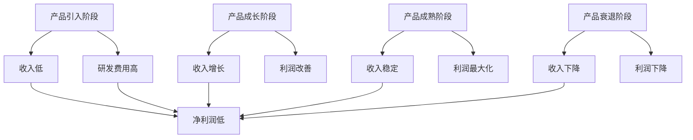
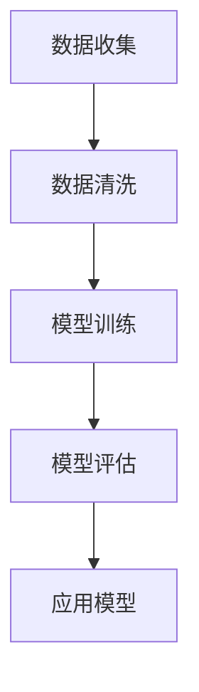
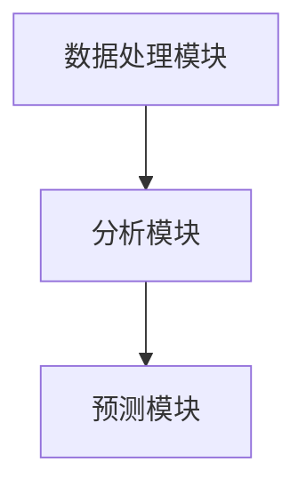

                 


# 彼得林奇对公司产品生命周期管理与财务表现关系的研究

> 关键词：彼得·林奇，产品生命周期管理，财务表现，生命周期价值模型，产品生命周期预测算法

> 摘要：本文探讨彼得·林奇如何通过产品生命周期管理影响公司财务表现，分析产品生命周期各阶段对收入、利润和现金流的影响，并结合实际案例进行深入分析，提出优化策略以提升公司财务表现。

---

## 第1章：背景介绍

### 1.1 问题背景

#### 1.1.1 产品生命周期管理的重要性
产品生命周期管理（Product Lifecycle Management，PLM）是企业从产品概念形成到退出市场的全过程管理，涉及研发、生产、销售和售后等多个环节。有效的PLM能够优化资源配置，提升效率，降低成本，为企业创造更大的价值。

#### 1.1.2 财务表现的核心指标
公司财务表现主要通过收入、利润、资产和现金流等指标衡量。这些指标反映了公司的盈利能力、资产使用效率和现金流动状况，是评估公司健康状况的重要依据。

#### 1.1.3 彼得·林奇研究的背景与动机
彼得·林奇作为投资大师，关注公司产品生命周期与财务表现的关系，旨在通过分析产品生命周期各阶段对财务指标的影响，找出优化财务表现的关键点，为投资决策提供支持。

---

### 1.2 问题描述

#### 1.2.1 产品生命周期与财务表现的关系
产品生命周期的不同阶段对公司的收入、利润和现金流有不同的影响。例如，产品引入期可能投入大、利润低，而成熟期收入稳定、利润较高。

#### 1.2.2 彼得·林奇研究的具体问题
研究如何通过优化产品生命周期管理提升财务表现，分析各阶段对财务指标的影响，并提出相应的管理策略。

#### 1.2.3 研究的目标与意义
目标是通过分析和建模，找到产品生命周期管理对财务表现的关键影响因素，为企业提供优化建议，提升整体财务表现。

---

## 第2章：核心概念与联系

### 2.1 产品生命周期管理的核心要素

#### 2.1.1 产品引入阶段
- **特点**：新产品推出，市场接受度低，销售量小，成本高。
- **财务影响**：收入低，研发和营销费用高，可能导致短期亏损。

#### 2.1.2 产品成长阶段
- **特点**：市场认可度提高，销售量增长，成本下降。
- **财务影响**：收入增长，利润逐步改善，现金流开始增加。

#### 2.1.3 产品成熟阶段
- **特点**：市场饱和，竞争激烈，销售量稳定，成本降低。
- **财务影响**：收入稳定，利润最大化，现金流持续增长。

#### 2.1.4 产品衰退阶段
- **特点**：市场被替代产品冲击，销售量下降，成本上升。
- **财务影响**：收入和利润下降，现金流减少，可能需要计提资产减值损失。

### 2.2 财务表现的关键指标

#### 2.2.1 收入与利润分析
- 收入：公司销售收入，包括主营业务收入和其他收入。
- 利润：净利润 = 收入 - 成本 - 费用。

#### 2.2.2 资产负债表分析
- 资产：流动资产和非流动资产，包括现金、应收账款、存货等。
- 负债：流动负债和非流动负债，包括应付账款、短期借款等。
- 所有者权益：资产 - 负债。

#### 2.2.3 现金流量分析
- 经营活动现金流：公司日常运营产生的现金流。
- 投资活动现金流：资本支出和投资收益。
- 筹资活动现金流：融资活动带来的现金流。

### 2.3 产品生命周期与财务表现的关系图



---

## 第3章：算法原理讲解

### 3.1 生命周期价值模型

#### 3.1.1 模型的数学表达式
生命周期价值模型用于评估产品在整个生命周期中的总价值，公式如下：

$$
\text{生命周期价值} = \sum_{t=1}^{n} \text{现金流}_t \times (1 + r)^{-t}
$$

其中，$r$ 是贴现率，$n$ 是产品生命周期的阶段数。

#### 3.1.2 模型的输入参数
- 各阶段的现金流
- 贴现率
- 预测期限

#### 3.1.3 模型的输出结果
- 产品生命周期的总价值
- 各阶段对总价值的贡献

#### 3.1.4 示例
假设某产品生命周期分为3个阶段，现金流分别为100、200、150，贴现率为10%。

$$
\text{生命周期价值} = 100 \times 0.9091 + 200 \times 0.8264 + 150 \times 0.7513 \approx 190.36
$$

---

### 3.2 产品生命周期预测算法

#### 3.2.1 算法的步骤分解

1. 数据收集：收集各产品的销售、成本、利润等数据。
2. 数据清洗：处理缺失值和异常值。
3. 模型训练：使用机器学习算法（如决策树、随机森林）预测产品生命周期阶段。
4. 模型评估：使用准确率、召回率等指标评估模型性能。
5. 应用模型：将模型应用于新产品的生命周期预测。

#### 3.2.2 使用 Mermaid 绘制的流程图



#### 3.2.3 算法的实现代码

```python
from sklearn.ensemble import RandomForestClassifier
from sklearn.model_selection import train_test_split
from sklearn.metrics import accuracy_score

# 数据准备
X = df[['收入', '成本', '利润']]
y = df['生命周期阶段']

# 数据分割
X_train, X_test, y_train, y_test = train_test_split(X, y, test_size=0.2)

# 模型训练
model = RandomForestClassifier()
model.fit(X_train, y_train)

# 模型预测
y_pred = model.predict(X_test)

# 模型评估
print("准确率:", accuracy_score(y_test, y_pred))
```

---

## 第4章：系统分析与架构设计方案

### 4.1 问题场景介绍

#### 4.1.1 研究的公司类型
主要针对制造、科技和消费品行业。

#### 4.1.2 数据来源与收集方法
数据来源包括公司财务报表、销售记录、市场调研报告等。

#### 4.1.3 系统的目标与功能
目标是通过系统分析和架构设计，优化产品生命周期管理，提升财务表现。

---

### 4.2 系统架构设计

#### 4.2.1 数据处理模块
负责数据清洗、转换和预处理。

#### 4.2.2 分析模块
包括生命周期价值模型和预测算法。

#### 4.2.3 预测模块
基于机器学习算法预测产品生命周期阶段。

#### 4.2.4 使用 Mermaid 绘制的架构图



---

## 第5章：项目实战

### 5.1 环境安装

#### 5.1.1 安装 Python
使用Anaconda或Miniconda安装Python 3.8及以上版本。

#### 5.1.2 安装必要的库
安装numpy、pandas、scikit-learn、mermaid等库。

#### 5.1.3 配置开发环境
推荐使用Jupyter Notebook或VS Code进行开发。

---

### 5.2 核心实现源代码

#### 5.2.1 生命周期价值模型的实现

```python
import numpy as np

def lifecycle_value(cash_flows, discount_rate):
    return np.npv(discount_rate, cash_flows)
```

#### 5.2.2 产品生命周期预测算法的实现

```python
from sklearn.ensemble import RandomForestClassifier
from sklearn.model_selection import train_test_split
from sklearn.metrics import accuracy_score

def train_model(df):
    X = df[['收入', '成本', '利润']]
    y = df['生命周期阶段']
    X_train, X_test, y_train, y_test = train_test_split(X, y, test_size=0.2)
    model = RandomForestClassifier()
    model.fit(X_train, y_train)
    return model

def evaluate_model(model, X_test, y_test):
    y_pred = model.predict(X_test)
    print("准确率:", accuracy_score(y_test, y_pred))

# 示例
df = pd.DataFrame({
    '收入': [100, 200, 150],
    '成本': [50, 100, 75],
    '利润': [30, 50, 25],
    '生命周期阶段': [1, 2, 3]
})
model = train_model(df)
evaluate_model(model, X_test, y_test)
```

---

### 5.3 案例分析

#### 5.3.1 某公司产品生命周期管理的案例
以苹果公司为例，分析iPhone的产品生命周期管理对财务表现的影响。

#### 5.3.2 财务表现的分析与预测
通过生命周期价值模型预测iPhone的生命周期价值。

#### 5.3.3 案例的总结与启示
优化产品生命周期管理可以有效提升财务表现，尤其是在产品引入和成长阶段。

---

## 第6章：最佳实践与小结

### 6.1 最佳实践 tips

#### 6.1.1 数据收集与处理
确保数据准确性和完整性，及时更新和维护。

#### 6.1.2 模型选择与优化
根据具体情况选择合适的模型，并进行参数调优。

#### 6.1.3 系统设计与实现
模块化设计，便于维护和扩展。

---

### 6.2 小结

#### 6.2.1 本书的核心内容总结
通过分析产品生命周期管理对财务表现的影响，结合数学模型和算法，提出优化策略。

#### 6.2.2 未来研究的方向
进一步研究多产品生命周期管理的协同效应，探索人工智能在PLM中的应用。

---

以上是《彼得林奇对公司产品生命周期管理与财务表现关系的研究》的技术博客文章的完整结构和内容。

