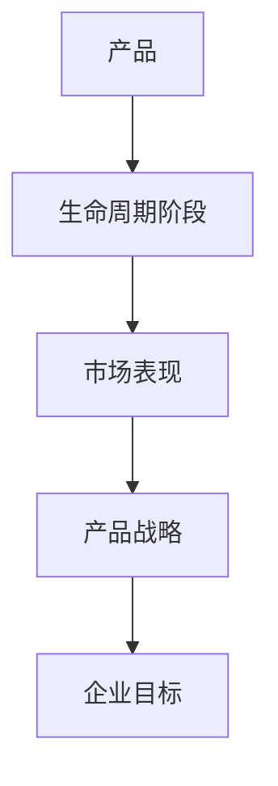
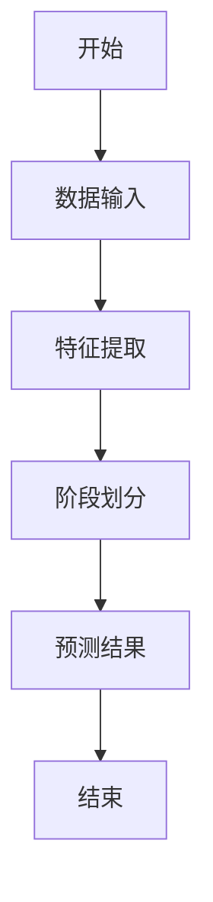
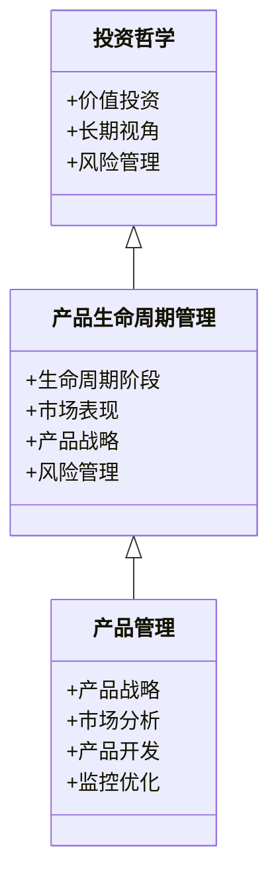
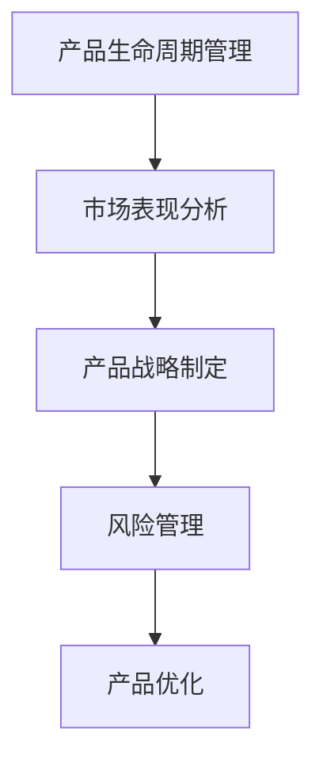

                 


# 彼得林奇对公司产品生命周期管理的看法

## 关键词：彼得林奇、产品生命周期、投资哲学、风险管理、企业战略

## 摘要：本文探讨了彼得林奇的投资哲学及其对公司产品生命周期管理的启示。通过分析产品生命周期的各个阶段，结合彼得林奇的价值投资和风险管理策略，提出了优化产品管理的具体方法和实战案例。

---

## 第一部分：产品生命周期管理的背景与概念

### 第1章：产品生命周期管理概述

#### 1.1 产品生命周期管理的基本概念

- **产品生命周期的定义**：产品从引入市场到退市的全过程，分为引入期、成长期、成熟期和衰退期。
- **产品生命周期管理的重要性**：确保产品在各阶段最大化其价值，提升企业竞争力。

#### 1.2 彼得林奇的背景与投资哲学

- **彼得林奇的个人简介**：著名投资专家，强调长期价值投资和风险管理。
- **彼得林奇的投资哲学**：注重基本面分析，避免短期波动，追求长期稳定的回报。
- **彼得林奇与产品生命周期管理的联系**：将投资理念应用于产品管理，注重产品在市场中的长期表现。

#### 1.3 产品生命周期管理的核心要素

- **产品战略**：制定产品发展方向和目标。
- **产品开发**：从设计到市场的过程。
- **产品市场表现**：监测产品在市场中的表现。
- **产品退市与优化**：及时退市或优化产品以延长生命周期。

### 第2章：产品生命周期管理的核心概念与联系

#### 2.1 核心概念原理

- **产品生命周期模型的原理**：产品在不同阶段面临不同的挑战和机会。
- **产品生命周期与企业战略的关系**：产品生命周期管理是企业战略的重要组成部分。
- **彼得林奇视角下的产品生命周期管理**：强调长期价值和风险管理。

#### 2.2 核心概念属性对比表

| 概念 | 属性 | 描述 |
|------|------|------|
| 产品生命周期 | 阶段 | 引入期、成长期、成熟期、衰退期 |
| 产品生命周期管理 | 方法 | 战略规划、市场分析、产品开发、监控优化 |
| 彼得林奇视角 | 投资哲学 | 价值投资、长期视角、风险管理 |

#### 2.3 实体关系图（ER图）



### 第3章：产品生命周期管理的算法原理

#### 3.1 算法原理概述

- **产品生命周期预测模型**：基于历史数据预测产品在市场中的表现。
- **市场表现预测方法**：结合市场趋势和产品特征进行预测。
- **生命周期阶段划分算法**：通过销售数据和市场反馈划分产品阶段。

#### 3.2 算法流程图



---

## 第二部分：彼得林奇投资哲学与产品生命周期管理

### 第4章：彼得林奇的投资哲学与产品管理

#### 4.1 投资哲学的核心要素

- **价值投资**：寻找具有长期价值的产品或公司。
- **风险管理**：评估产品在不同阶段的风险并制定应对策略。
- **长期视角**：关注产品的长期市场表现而非短期波动。

#### 4.2 产品生命周期的阶段管理

- **引入期**：高风险，需谨慎投资。
- **成长期**：加大投入，快速扩展市场份额。
- **成熟期**：优化成本，提升效率。
- **衰退期**：及时退出或转型。

### 第5章：彼得林奇的管理方法与产品生命周期

#### 5.1 投资策略与产品开发

- **产品开发阶段的风险管理**：彼得林奇强调对产品团队和市场的深入了解。
- **产品市场匹配**：确保产品符合市场需求，避免盲目开发。

#### 5.2 投资组合管理与产品组合优化

- **多元化投资**：企业应保持产品组合的多样性，降低风险。
- **定期评估与调整**：根据市场反馈和产品表现进行调整。

### 第6章：彼得林奇视角下的产品优化策略

#### 6.1 产品优化的长期视角

- **持续改进**：彼得林奇建议企业不断优化产品，适应市场变化。
- **客户反馈机制**：建立有效的客户反馈系统，及时调整产品策略。

#### 6.2 产品退市的决策

- **及时退出**：当产品进入衰退期时，及时退市以避免损失。
- **转型策略**：通过产品升级或重新定位延长生命周期。

---

## 第三部分：彼得林奇投资哲学在产品生命周期管理中的应用

### 第7章：产品生命周期管理的系统架构设计

#### 7.1 系统功能设计（领域模型）



#### 7.2 系统架构设计



### 第8章：项目实战与案例分析

#### 8.1 项目背景与目标

- **项目背景**：某科技公司希望通过优化产品生命周期管理，提升产品市场表现。
- **项目目标**：引入彼得林奇的投资哲学，优化产品管理流程。

#### 8.2 环境搭建与数据准备

- **工具选择**：使用数据分析工具进行市场表现预测。
- **数据收集**：收集历史销售数据、市场反馈等。

#### 8.3 核心代码实现

```python
def productLifecycleAnalysis(data):
    # 数据预处理
    processed_data = preprocess(data)
    # 生命周期阶段划分
    stages = classify(processed_data)
    # 市场表现预测
    prediction = predict(stages)
    return stages, prediction
```

#### 8.4 实际案例分析

- **案例分析**：某产品的市场表现预测与优化策略。
- **结果解读**：通过数据分析，制定针对性的产品管理策略。

---

## 第四部分：总结与展望

### 第9章：最佳实践与小结

#### 9.1 最佳实践

- **长期视角**：关注产品的长期价值。
- **风险管理**：在各阶段进行风险评估和管理。
- **客户反馈**：建立有效的客户反馈机制，及时调整产品策略。

#### 9.2 小结

- 彼得林奇的投资哲学为产品生命周期管理提供了宝贵的见解。
- 通过系统的管理策略和数据分析，企业可以有效优化产品生命周期。

### 第10章：注意事项与拓展阅读

#### 10.1 注意事项

- **数据质量**：确保数据准确可靠。
- **团队协作**：跨部门协作是成功的关键。
- **持续学习**：关注市场变化，不断优化管理策略。

#### 10.2 拓展阅读

- 推荐阅读彼得林奇的著作，深入了解他的投资哲学。
- 参考其他投资专家的观点，丰富产品管理的策略。

---

通过以上结构，文章详细探讨了彼得林奇的投资哲学及其在产品生命周期管理中的应用，为企业提供了实用的管理策略和优化方法。

