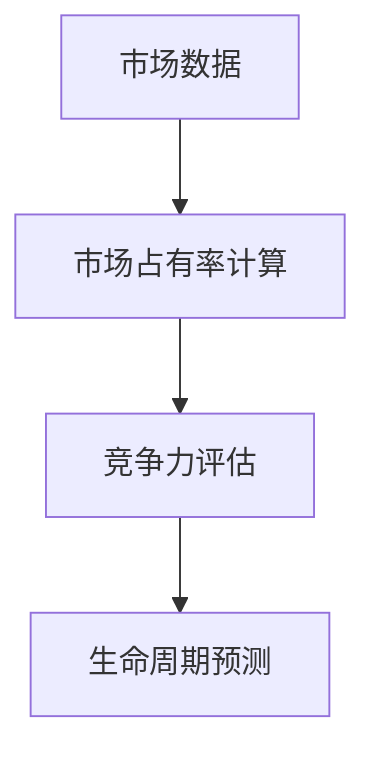
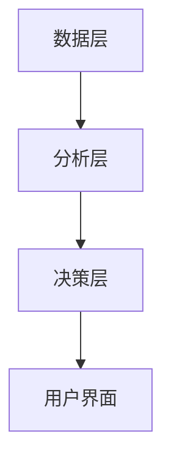

                 


# 彼得林奇对公司产品线的分析

---

## 关键词：产品线分析，彼得林奇，投资决策，竞争优势，市场定位，企业价值

---

## 摘要：  
本文深入分析了彼得·林奇对公司产品线的分析方法，探讨了其在投资决策中的应用。通过系统的方法和工具，结合实际案例，详细阐述了如何通过产品线分析识别企业的竞争优势和劣势，评估其市场定位和盈利能力，进而为投资者提供科学的决策依据。本文旨在为投资者和企业管理者提供一套完整的分析框架和实战指南，帮助他们在复杂多变的市场环境中做出明智的选择。

---

# 目录

## 第一章：产品线分析的背景与重要性

### 1.1 产品线分析的定义与核心概念  
- 产品线的定义与特征  
- 产品线分析的核心要素（市场定位、竞争优势、生命周期）  
- 产品线分析的边界与外延  

### 1.2 彼得林奇分析方法的背景介绍  
- 彼得林奇的投资者身份与风格  
- 产品线分析在彼得林奇投资策略中的地位  
- 产品线分析与企业价值评估的关系  

### 1.3 产品线分析的现实意义  
- 产品线分析对企业战略决策的影响  
- 产品线分析对投资者决策的价值  
- 产品线分析的行业适用性  

## 第二章：产品线分析的核心概念与框架

### 2.1 产品线分析的核心概念  
- 产品线的生命周期模型（引入期、成长期、成熟期、衰退期）  
- 产品线的市场定位与竞争定位  
- 产品线的竞争优势与劣势  

### 2.2 产品线分析的框架  
- 分析维度：市场、产品、财务、竞争  
- 分析步骤：目标设定、数据收集、分析评估、结论形成  
- 分析工具与方法：SWOT分析、PEST分析、竞争对手分析  

## 第三章：产品线分析的数学模型与公式

### 3.1 产品线分析的数学模型  
- 市场占有率计算公式  
- 产品线盈利能力分析模型  
- 产品线生命周期预测模型  

### 3.2 相关公式与应用  
- 市场占有率公式  
$$ \text{市场占有率} = \frac{\text{产品销量}}{\text{市场总销量}} \times 100\% $$  
- 净利润率公式  
$$ \text{净利润率} = \frac{\text{净利润}}{\text{营业收入}} \times 100\% $$  

### 3.3 产品线分析的数学模型图  


## 第四章：产品线分析的系统架构与设计

### 4.1 系统分析与架构设计  
- 问题场景介绍：如何通过系统方法分析产品线  
- 领域模型设计：使用Mermaid类图展示产品线、市场、竞争等实体关系  
- 系统架构设计：分层架构（数据层、分析层、决策层）  

### 4.2 系统接口与交互设计  
- 系统接口设计：数据输入、分析执行、结果输出  
- 系统交互流程：用户输入查询、系统执行分析、返回结果  

### 4.3 系统架构图  


## 第五章：产品线分析的项目实战

### 5.1 环境安装与数据准备  
- 安装必要的工具与库（如Python、Pandas、Matplotlib）  
- 数据收集与清洗（市场数据、产品数据、财务数据）  

### 5.2 核心实现源代码  
```python
import pandas as pd
import matplotlib.pyplot as plt

# 示例：计算产品线市场占有率
data = {
    '产品线': ['A', 'B', 'C'],
    '销量': [100, 200, 150],
    '市场总销量': [500, 500, 500]
}
df = pd.DataFrame(data)

market_share = df['销量'] / df['市场总销量'] * 100
plt.bar(df['产品线'], market_share)
plt.title('产品线市场占有率')
plt.show()
```

### 5.3 案例分析与解读  
- 某公司产品线的市场定位分析  
- 竞争优势与劣势的识别  
- 生命周期预测与投资建议  

## 第六章：结论与展望

### 6.1 研究总结  
- 产品线分析的核心方法与工具  
- 彼得林奇分析方法的实践价值  

### 6.2 展望与建议  
- 结合大数据技术提升分析效率  
- 进一步完善分析框架与工具  

### 6.3 注意事项与最佳实践  
- 数据质量的重要性  
- 分析结果的可解释性  
- 结合行业特点灵活应用分析方法  

## 参考文献  
- 彼得·林奇的著作与投资策略  
- 相关学术文献与研究论文  

---

# 结语  
通过系统化的分析与实践，我们能够更好地理解彼得林奇对公司产品线的分析方法，并将其应用到实际的投资与企业管理中。希望本文能为读者提供有价值的参考与启发。

