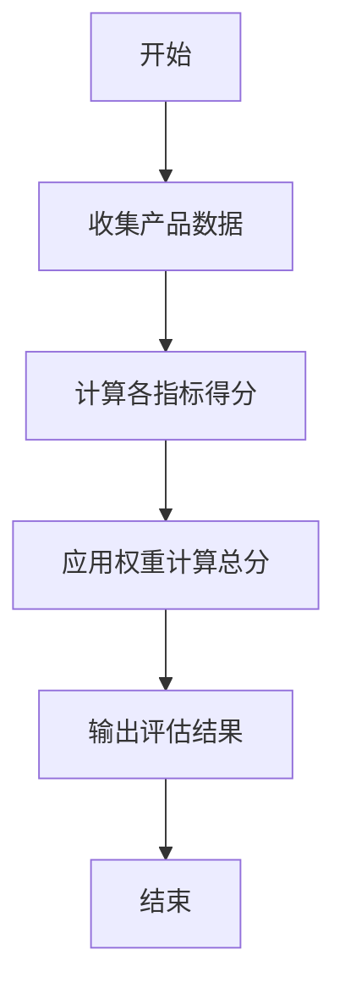
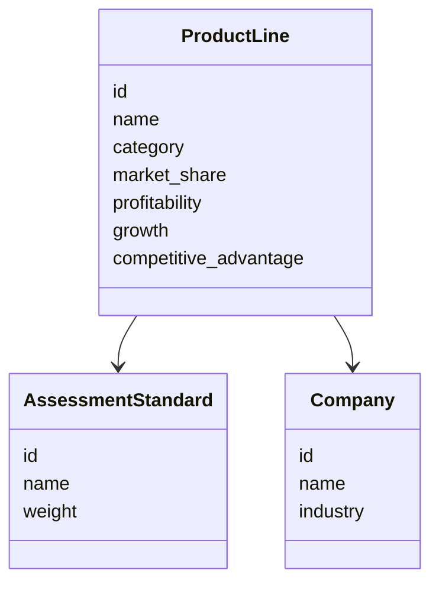
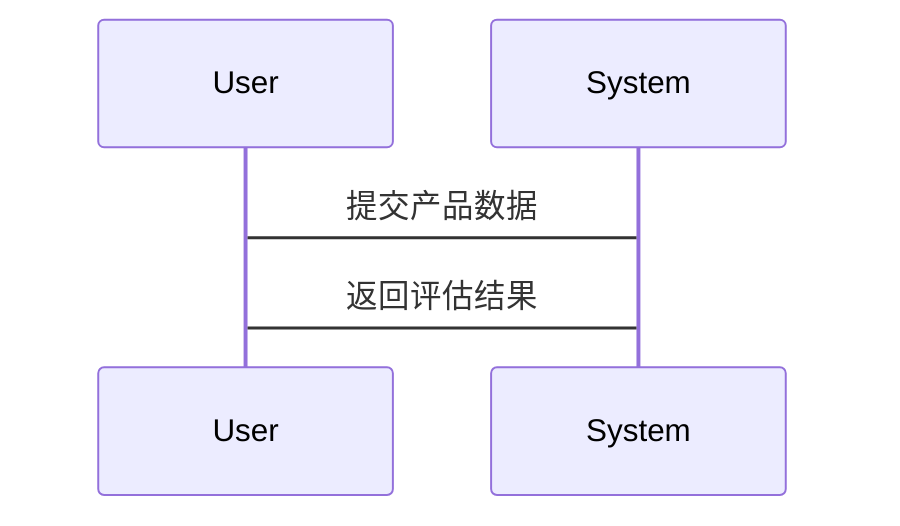

                 


# 彼得林奇对公司产品线评估标准

## 关键词：彼得林奇，产品线评估，盈利能力，成长性，竞争优势，市场占有率

## 摘要：本文深入探讨了彼得林奇对公司产品线的评估标准，从背景、核心概念到算法原理、系统架构，再到项目实战和最佳实践，全面解析如何通过这些标准评估公司产品线的健康状况和市场表现，为企业投资决策提供科学依据。

---

# 第一部分：背景介绍

## 第1章：评估公司产品线的重要性

### 1.1 问题背景

#### 1.1.1 企业产品线管理的挑战
在现代商业环境中，公司产品线的管理至关重要。产品线的成功直接影响企业的市场份额和盈利能力。然而，许多企业在评估产品线时面临以下挑战：
- **市场变化快**：市场需求和技术更新迅速，产品线需要不断调整以适应变化。
- **数据复杂性**：产品线评估涉及多个指标，数据量大且复杂，难以全面分析。
- **决策风险高**：错误的评估可能导致资源浪费或战略失误。

#### 1.1.2 投资者视角下的产品线评估
投资者在选择投资标的时，通常关注公司的产品线情况。产品线的健康状况直接影响公司的财务表现和市场竞争力。然而，许多投资者在评估产品线时缺乏系统的标准，导致评估结果不准确。

### 1.2 问题描述

#### 1.2.1 产品线评估的核心问题
产品线评估的核心问题在于如何量化产品的市场表现和潜在价值。具体包括：
- **盈利能力**：产品线的盈利能力是否可持续。
- **成长性**：产品线的市场增长潜力。
- **竞争优势**：产品线是否具有独特的竞争优势。

#### 1.2.2 彼得·林奇的评估方法
彼得·林奇是著名投资专家，他提出了独特的评估方法，强调通过基本面分析来判断公司的投资价值。他的方法适用于产品线评估，帮助企业识别具有成长性和竞争优势的产品线。

### 1.3 问题解决

#### 1.3.1 评估标准的制定
为了系统地评估公司产品线，需要制定一套全面的评估标准，包括盈利能力、成长性和竞争优势等指标。

#### 1.3.2 标准化评估的重要性
标准化评估可以确保评估过程的客观性和一致性，避免主观因素干扰，提高评估结果的准确性。

### 1.4 边界与外延

#### 1.4.1 评估范围的界定
评估范围通常包括公司当前的所有产品线，但不包括子公司或关联公司的产品线。

#### 1.4.2 评估标准的适用性
评估标准适用于所有行业，但在具体应用时需根据行业特点进行调整。

### 1.5 核心要素组成

#### 1.5.1 产品线的核心要素
产品线的核心要素包括：
- **市场占有率**：产品线在市场中的份额。
- **收入增长率**：产品线收入的年增长率。
- **利润率**：产品线的净利润率。

#### 1.5.2 评估标准的构成
评估标准由多个指标组成，每个指标都有具体的权重和评分标准，确保评估的全面性。

---

# 第二部分：核心概念与联系

## 第2章：核心概念解析

### 2.1 核心概念的原理

#### 2.1.1 盈利能力
盈利能力是衡量产品线财务健康的重要指标，包括净利润率和毛利率等。

#### 2.1.2 成长性
成长性反映产品线的市场扩展能力，主要通过收入增长率和市场份额增长率来衡量。

#### 2.1.3 竞争优势
竞争优势是产品线在市场中的独特优势，通常体现在技术创新、成本优势或品牌影响力等方面。

### 2.2 概念属性特征对比表

| 概念       | 特征         | 描述                       |
|------------|--------------|----------------------------|
| 盈利能力   | 净利润率      | 净利润与收入的比例         |
| 成长性     | 收入增长率    | 年收入增长的百分比         |
| 竞争优势   | 市场占有率    | 市场中的份额比例           |

### 2.3 ER实体关系图

```mermaid
er
  product_line {
    id
    name
    category
  }
  company {
    id
    name
    industry
  }
  assessment_standard {
    id
    name
    weight
  }
  market_share {
    id
    product_line_id
    value
  }
```

---

# 第三部分：算法原理

## 第3章：评估算法的数学模型

### 3.1 算法原理

彼得·林奇的评估方法结合了多个指标，通过加权评分的方式得出最终评分。公式如下：

$$
\text{总评分} = \sum (\text{指标得分} \times \text{权重})
$$

其中，权重通常根据指标的重要性分配，例如盈利能力占40%，成长性占30%，竞争优势占30%。

### 3.2 代码实现

```python
def calculate_score(product_data, weights):
    score = 0
    for metric, weight in weights.items():
        score += product_data[metric] * weight
    return score

# 示例数据
product_data = {
    'profitability': 0.25,
    'growth': 0.15,
    'competitive_advantage': 0.10
}

# 权重分配
weights = {
    'profitability': 0.4,
    'growth': 0.3,
    'competitive_advantage': 0.3
}

print(calculate_score(product_data, weights))
```

### 3.3 算法流程图



---

# 第四部分：系统分析与架构设计

## 第4章：系统架构设计方案

### 4.1 项目介绍

本系统旨在帮助公司评估产品线的健康状况，提供数据支持和决策依据。

### 4.2 系统功能设计

#### 4.2.1 领域模型



#### 4.2.2 系统架构设计


#### 4.2.3 接口设计

| 接口名称       | 输入       | 输出       |
|----------------|------------|------------|
| 评估请求       | 产品数据   | 评估结果   |

#### 4.2.4 交互流程图



---

# 第五部分：项目实战

## 第5章：项目实战与案例分析

### 5.1 环境安装

安装必要的软件和库，如Python、Pandas、Matplotlib等。

### 5.2 核心代码实现

```python
import pandas as pd
import matplotlib.pyplot as plt

# 示例数据
data = {
    'product_line': ['A', 'B', 'C'],
    'market_share': [0.2, 0.3, 0.1],
    'profitability': [0.25, 0.15, 0.3],
    'growth': [0.15, 0.2, 0.05]
}

df = pd.DataFrame(data)

# 可视化
df.plot(kind='bar', x='product_line', y='market_share')
plt.show()
```

### 5.3 案例分析

分析某公司产品线的市场占有率和盈利能力，应用评估标准计算总评分，得出结论。

### 5.4 实际案例分析

通过具体案例展示评估标准的应用过程，解释结果的意义。

---

# 第六部分：最佳实践

## 第6章：最佳实践与小结

### 6.1 小结

总结彼得·林奇评估标准的核心要点和实际应用中的注意事项。

### 6.2 注意事项

- 数据准确性：确保输入数据的准确性和完整性。
- 权重调整：根据行业特点调整各指标的权重。
- 结果解读：正确解读评估结果，避免误判。

### 6.3 拓展阅读

推荐相关书籍和资源，帮助读者深入理解产品线评估和投资分析。

---

# 结语

通过本文的详细分析，读者可以系统地了解彼得·林奇的产品线评估标准，并将其应用于实际工作中，提升公司的市场竞争力和投资决策的准确性。

