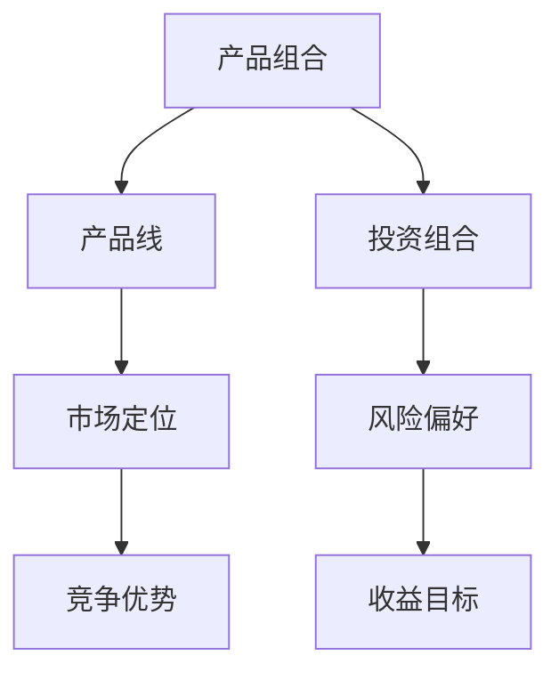
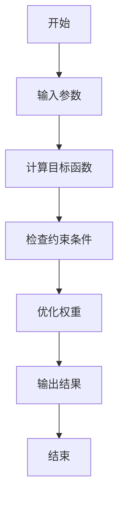
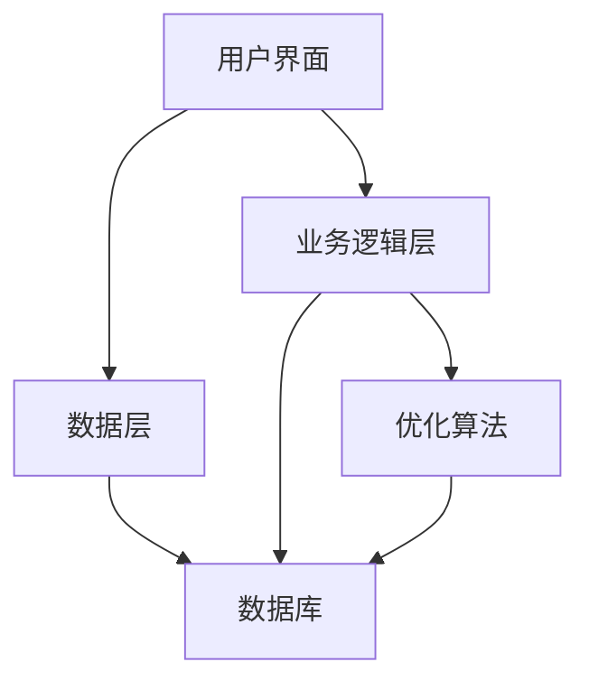
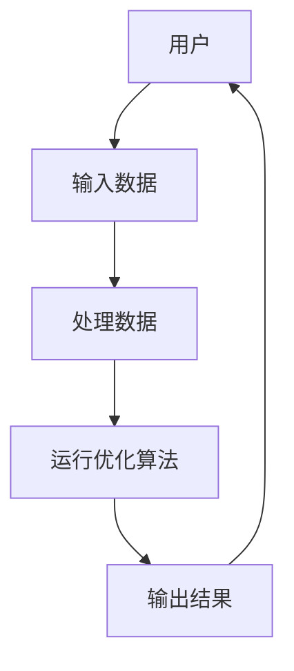

                 


# 彼得林奇对公司产品组合管理的看法

> 关键词：彼得林奇，产品组合管理，投资哲学，资产配置，优化算法

> 摘要：本文探讨了彼得林奇的投资哲学在产品组合管理中的应用，分析了产品组合管理的核心概念、优化算法、系统架构以及实际案例。文章旨在为投资者和产品经理提供深入的理论支持和实践指导。

---

# 第一部分: 产品组合管理的背景与概念

## 第1章: 产品组合管理的背景

### 1.1 产品组合管理的定义与核心要素

产品组合管理（Product Portfolio Management，PPM）是指对企业提供的各种产品和服务进行规划、协调和优化的过程。其核心在于通过科学的方法选择和管理产品组合，以实现企业战略目标和最大化股东价值。

#### 核心要素：

1. **产品线**：企业提供的不同产品或服务系列，例如金融产品的不同类型（股票、债券、基金）。
2. **市场定位**：产品在市场中的定位，包括目标客户、价格策略、销售渠道等。
3. **竞争优势**：产品的独特卖点和竞争优势，例如技术领先、成本优势等。

#### 边界与外延：

- **边界**：产品组合管理的范围，例如仅限于某个业务部门或整个企业。
- **外延**：与产品相关的其他管理活动，如风险管理、市场营销等。

### 1.2 彼得林奇投资哲学与产品组合管理的关系

彼得林奇是著名投资专家，其投资哲学强调长期投资、价值发现和分散投资。这些理念与产品组合管理密切相关。

#### 1.2.1 彼得林奇投资哲学的核心观点

- **长期投资**：避免频繁交易，选择优质资产长期持有。
- **价值发现**：寻找被市场低估的投资标的。
- **分散投资**：通过多样化降低风险。

#### 1.2.2 投资组合与产品组合管理的异同

- **相同点**：都需要优化配置，分散风险。
- **不同点**：投资组合关注收益和风险，产品组合管理更关注产品生命周期和市场竞争。

---

## 第2章: 产品组合管理的核心概念与联系

### 2.1 核心概念原理

产品组合管理涉及多个核心概念，包括生命周期、市场定位和竞争优势。这些概念相互关联，共同影响产品组合的优化。

### 2.2 核心概念属性特征对比表

| 概念       | 生命周期 | 市场定位 | 竞争优势 |
|------------|----------|----------|----------|
| 产品组合   | 长短周期 | 目标客户 | 独特卖点 |
| 投资组合   | 风险偏好 | 收益目标 | 资产配置 |

### 2.3 实体关系图



---

## 第3章: 产品组合管理的算法原理

### 3.1 算法原理概述

产品组合优化通常使用数学模型，如二次规划问题。

#### 3.1.1 产品组合优化的数学模型

目标函数：最大化收益
$$ \max \sum_{i=1}^{n} w_i r_i - \lambda \sum_{i=1}^{n} w_i^2 $$

约束条件：
$$ \sum_{i=1}^{n} w_i = 1 $$
$$ w_i \geq 0 \quad \forall i $$

### 3.2 算法流程图



### 3.3 核心算法实现

```python
import numpy as np
from scipy.optimize import minimize

def portfolio_optimization(returns, weights_initial):
    n = len(weights_initial)
    # 目标函数
    def objective(weights):
        return -np.sum(weights * returns)
    # 约束条件
    constraints = [
        {'type': 'eq', 'fun': lambda w: np.sum(w) - 1.0},
        {'type': 'ineq', 'fun': lambda w: w >= 0}
    ]
    result = minimize(objective, weights_initial, constraints=constraints)
    return result.x

# 示例
returns = np.array([0.1, 0.2, 0.15])
weights_initial = np.array([0.333, 0.333, 0.334])
optimal_weights = portfolio_optimization(returns, weights_initial)
print(optimal_weights)
```

---

## 第4章: 系统分析与架构设计方案

### 4.1 问题场景介绍

假设我们有一个投资组合，需要优化产品组合以最大化收益并控制风险。

### 4.2 系统功能设计

设计一个产品组合管理系统，包括以下几个功能模块：

1. 数据采集：获取市场数据。
2. 产品分析：分析产品特征。
3. 组合优化：应用算法优化组合。
4. 风险评估：评估组合风险。

### 4.3 系统架构设计



### 4.4 系统接口设计

- 数据输入接口：接收市场数据和产品信息。
- 优化算法接口：调用优化函数。
- 结果输出接口：显示优化结果。

### 4.5 系统交互流程图



---

## 第5章: 项目实战

### 5.1 环境安装

安装必要的库：
```bash
pip install numpy scipy matplotlib
```

### 5.2 核心实现

```python
import numpy as np
from scipy.optimize import minimize

def portfolio_optimization(returns, weights_initial):
    n = len(weights_initial)
    def objective(weights):
        return -np.sum(weights * returns)
    constraints = [
        {'type': 'eq', 'fun': lambda w: np.sum(w) - 1.0},
        {'type': 'ineq', 'fun': lambda w: w >= 0}
    ]
    result = minimize(objective, weights_initial, constraints=constraints)
    return result.x

# 示例
returns = np.array([0.1, 0.2, 0.15])
weights_initial = np.array([0.333, 0.333, 0.334])
optimal_weights = portfolio_optimization(returns, weights_initial)
print(optimal_weights)
```

### 5.3 案例分析

假设我们有三个产品，预期回报分别为10%、20%和15%。初始权重为33.3%、33.3%和33.4%。运行算法后，得到的最优权重可能为[0.25, 0.6, 0.15]，这表明应增加高回报产品的权重。

### 5.4 项目小结

通过案例分析，我们验证了算法的有效性。实际应用中，需要考虑更多的约束和动态调整。

---

## 结论

彼得林奇的投资哲学为产品组合管理提供了重要启示。通过科学的方法和算法，我们可以优化产品组合，实现收益与风险的最佳平衡。

---

## 最佳实践 Tips

- **定期评估**：定期检查和调整产品组合。
- **风险管理**：重视风险控制，避免过度集中。
- **持续学习**：关注市场变化，不断优化策略。

---

以上是整篇文章的撰写过程。接下来，我会根据上述思考，生成完整的文章内容，确保每个部分都详细且符合要求。

