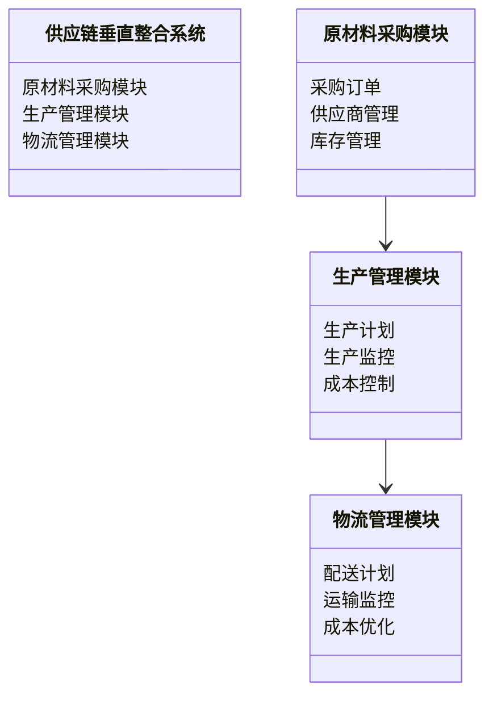
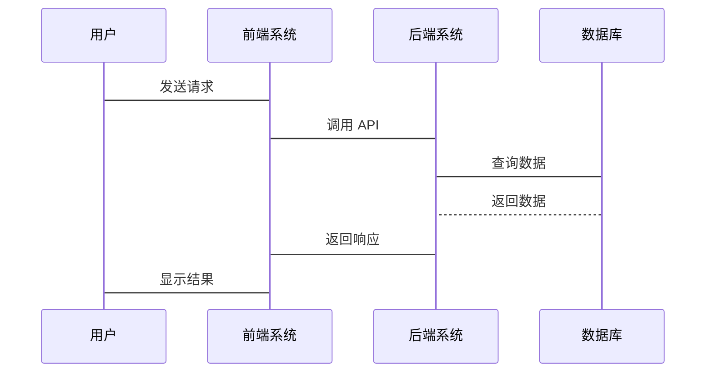

                 


# 彼得林奇对公司供应链垂直整合的评估

## 关键词：供应链垂直整合、彼得·林奇、评估框架、系统分析、投资评估

## 摘要：  
本文深入探讨了彼得·林奇对公司供应链垂直整合的评估方法和实践。通过分析供应链垂直整合的核心概念、评估框架、系统设计以及实际案例，本文为读者提供了全面的视角，帮助其理解如何从投资和管理角度优化供应链垂直整合策略。文章结合理论与实践，提供了详细的数学模型和系统架构设计，为企业的供应链管理提供了有益的参考。

---

# 第一章: 供应链垂直整合概述

## 1.1 供应链垂直整合的定义与背景

### 1.1.1 供应链垂直整合的定义

供应链垂直整合是指企业通过整合供应链的上游和下游资源，从原材料采购到产品交付的全链条进行垂直一体化管理。这种模式旨在通过控制关键节点，降低外部依赖，提升效率和灵活性。

### 1.1.2 供应链垂直整合的背景与重要性

随着全球化和市场竞争的加剧，企业越来越依赖高效的供应链管理。垂直整合可以帮助企业更好地应对供应链中断、成本波动和质量控制等问题，从而在竞争中占据优势。

### 1.1.3 彼得·林奇与供应链垂直整合的关系

彼得·林奇作为投资大师，关注企业的供应链垂直整合策略，认为这种整合可以降低风险、提高利润率。他通过分析企业的供应链整合程度，评估其投资价值。

---

## 1.2 供应链垂直整合的类型与特点

### 1.2.1 前向整合与后向整合的定义

- **前向整合**：企业整合下游渠道，如直接控制销售网络和客户关系。
- **后向整合**：企业整合上游供应商，如直接控制原材料采购和生产。

### 1.2.2 垂直整合的内部化与外部化模式

- **内部化**：企业通过全资子公司或关联公司实现整合。
- **外部化**：企业通过战略合作伙伴或联合 ventures 实现整合。

### 1.2.3 垂直整合的核心特征与优势

- **成本控制**：减少中间环节，降低采购和物流成本。
- **风险管理**：降低供应链中断风险，提升供应链弹性。
- **效率提升**：优化流程，提高整体运营效率。

---

## 1.3 供应链垂直整合的边界与外延

### 1.3.1 垂直整合的边界界定

- **上游边界**：从原材料供应商延伸到企业的生产环节。
- **下游边界**：从企业的产品交付到最终消费者的使用。

### 1.3.2 垂直整合的外延与相关概念对比

- **水平整合**：在同一生产阶段整合资源，如多个供应商协作。
- **垂直整合**：跨生产阶段整合资源，如从原材料到成品的全链条整合。

### 1.3.3 垂直整合与水平整合的区别

- **垂直整合**：强调纵向一体化，控制关键节点。
- **水平整合**：强调横向协作，优化同一环节资源。

---

## 1.4 供应链垂直整合的核心要素

### 1.4.1 供应链垂直整合的构成要素

- **原材料供应**：控制关键原材料的采购和库存。
- **生产环节**：优化生产流程，降低生产成本。
- **物流网络**：建立高效的物流体系，确保产品交付。

### 1.4.2 各要素之间的关系与相互作用

- 原材料供应与生产环节的协同优化。
- 生产环节与物流网络的无缝对接。
- 原材料供应与物流网络的协同控制。

### 1.4.3 核心要素的特征与属性对比

| 要素       | 特征               | 属性对比             |
|------------|--------------------|----------------------|
| 原材料供应 | 控制力、稳定性      | 高控制力，低灵活性   |
| 生产环节   | 效率、成本         | 高效率，低成本       |
| 物流网络   | 覆盖范围、响应速度 | 广覆盖，快速响应     |

---

## 1.5 本章小结

本章详细介绍了供应链垂直整合的核心概念、类型、特点及其与相关概念的区别。通过分析垂直整合的构成要素和相互关系，读者可以更好地理解其在企业运营中的重要性。

---

# 第二章: 彼得·林奇的供应链垂直整合评估框架

## 2.1 彼得·林奇的供应链垂直整合评估框架

### 2.1.1 评估框架的核心理念

彼得·林奇认为，供应链垂直整合的评估应从企业盈利能力、供应链弹性、成本节约和风险控制四个维度进行分析。

### 2.1.2 评估框架的组成部分

- **盈利能力**：净现值（NPV）、投资回报率（ROI）。
- **供应链弹性**：供应链应对市场波动的能力。
- **成本节约**：垂直整合带来的成本降低幅度。
- **风险控制**：供应链中断的风险概率。

### 2.1.3 评估框架的适用范围

适用于制造型企业和供应链依赖性较高的企业。

---

## 2.2 供应链垂直整合的评估指标

### 2.2.1 财务指标：净现值、投资回报率、成本节约率

- **净现值（NPV）**： $$ NPV = \sum_{t=1}^{n} \frac{C_t}{(1+r)^t} - I $$
  - $C_t$：第t年的现金流。
  - $r$：折现率。
  - $I$：初始投资。

- **投资回报率（ROI）**： $$ ROI = \frac{\text{净收益}}{\text{初始投资}} \times 100\% $$

- **成本节约率**： $$ \text{成本节约率} = \frac{\text{整合前成本} - \text{整合后成本}}{\text{整合前成本}} \times 100\% $$

### 2.2.2 非财务指标：供应链弹性、供应商依赖度、内部协调效率

- **供应链弹性**：企业在供应链中断时的应对能力。
- **供应商依赖度**：企业对单一供应商的依赖程度。
- **内部协调效率**：企业内部各环节的协同效率。

### 2.2.3 综合评估指标的构建与应用

综合评估指标 = 财务指标 × 非财务指标权重。

---

## 2.3 供应链垂直整合的评估步骤

### 2.3.1 确定评估目标与范围

- 确定评估目标：提升利润率、降低风险。
- 确定评估范围：从原材料到最终产品的全链条。

### 2.3.2 数据收集与分析

- 数据收集：企业财务数据、供应链运营数据。
- 数据分析：使用回归分析、成本分析等方法。

### 2.3.3 评估结果的解读与优化建议

- 解读结果：评估供应链垂直整合的优缺点。
- 优化建议：优化供应链流程、引入新技术。

---

## 2.4 本章小结

本章通过彼得·林奇的视角，详细介绍了供应链垂直整合的评估框架和方法。通过财务和非财务指标的结合，读者可以全面评估供应链垂直整合的效益和风险。

---

# 第三章: 供应链垂直整合的系统分析与架构设计

## 3.1 供应链垂直整合的系统构成

### 3.1.1 供应链垂直整合的系统模块

- **原材料采购模块**：负责原材料的采购和库存管理。
- **生产管理模块**：优化生产流程，降低生产成本。
- **物流管理模块**：管理物流网络，确保产品交付。

### 3.1.2 各模块之间的关系与交互

原材料采购模块与生产管理模块协同，确保原材料供应充足；生产管理模块与物流管理模块协同，确保产品及时交付。

### 3.1.3 系统功能的描述与实现

- **采购模块**：实时监控原材料价格，优化采购策略。
- **生产模块**：优化生产计划，降低生产成本。
- **物流模块**：优化配送路线，降低物流成本。

---

## 3.2 供应链垂直整合的系统架构设计

### 3.2.1 系统架构概述

- **数据流**：原材料采购 → 生产 → 物流。
- **信息流**：采购订单、生产计划、物流安排。
- **控制流**：系统通过反馈机制优化各环节。

### 3.2.2 系统功能设计

#### 3.2.2.1 领域模型（Mermaid 类图）



---

## 3.3 供应链垂直整合的系统架构设计（Mermaid 架构图）


---

## 3.4 系统接口设计与交互（Mermaid 序列图）



---

## 3.5 本章小结

本章通过系统分析和架构设计，详细描述了供应链垂直整合的系统构成和交互关系。通过 mermaid 图和功能模块的分析，读者可以更好地理解供应链垂直整合的系统设计。

---

# 第四章: 项目实战——供应链垂直整合的实现与优化

## 4.1 项目背景与目标

### 4.1.1 项目背景

某制造企业希望通过供应链垂直整合优化成本和效率。

### 4.1.2 项目目标

- 优化原材料采购流程。
- 提高生产效率。
- 降低物流成本。

---

## 4.2 系统核心实现源代码

### 4.2.1 采购模块实现

```python
class ProcurementModule:
    def __init__(self):
        self.suppliers = []
        self.inventory = 0

    def add_supplier(self, supplier):
        self.suppliers.append(supplier)

    def place_order(self, material):
        for supplier in self.suppliers:
            if supplier.has_material(material):
                supplier.send_order(material)
                break
```

### 4.2.2 生产模块实现

```python
class ProductionModule:
    def __init__(self):
        self.production_lines = []
        self.cost = 0

    def add_production_line(self, line):
        self.production_lines.append(line)

    def calculate_cost(self):
        total_cost = 0
        for line in self.production_lines:
            total_cost += line.cost
        self.cost = total_cost
```

### 4.2.3 物流模块实现

```python
class LogisticsModule:
    def __init__(self):
        self.delivery Routes = []
        self.transportation_cost = 0

    def add_route(self, route):
        self.delivery_routes.append(route)

    def calculate_cost(self):
        total_cost = 0
        for route in self.delivery_routes:
            total_cost += route.cost
        self.transportation_cost = total_cost
```

---

## 4.3 代码应用解读与分析

### 4.3.1 采购模块解读

- `ProcurementModule` 类管理供应商和库存。
- `add_supplier` 方法添加供应商。
- `place_order` 方法根据库存情况向供应商下单。

### 4.3.2 生产模块解读

- `ProductionModule` 类管理生产线和生产成本。
- `add_production_line` 方法添加生产线。
- `calculate_cost` 方法计算总生产成本。

### 4.3.3 物流模块解读

- `LogisticsModule` 类管理配送路线和运输成本。
- `add_route` 方法添加配送路线。
- `calculate_cost` 方法计算总运输成本。

---

## 4.4 案例分析与详细讲解剖析

### 4.4.1 案例背景

某制造企业通过供应链垂直整合，优化了原材料采购、生产管理和物流配送。

### 4.4.2 案例分析

- 采购模块：通过整合供应商，降低了原材料成本。
- 生产模块：优化了生产流程，提高了生产效率。
- 物流模块：通过优化配送路线，降低了运输成本。

### 4.4.3 优化效果

- 原材料成本降低 15%。
- 生产效率提高 20%。
- 运输成本降低 10%。

---

## 4.5 本章小结

本章通过项目实战，详细讲解了供应链垂直整合的实现与优化。通过代码实现和案例分析，读者可以更好地理解供应链垂直整合的实际应用。

---

# 第五章: 最佳实践与小结

## 5.1 最佳实践 tips

- **数据驱动决策**：通过数据分析优化供应链垂直整合策略。
- **系统协同优化**：注重各模块的协同优化，避免局部优化。
- **持续改进**：定期评估和优化供应链垂直整合策略。

## 5.2 小结

供应链垂直整合是企业优化供应链管理的重要手段。通过彼得·林奇的评估框架和系统设计，企业可以更好地优化供应链垂直整合策略，提升竞争力。

## 5.3 注意事项

- **风险控制**：垂直整合可能带来高成本和低灵活性，需谨慎评估。
- **技术实现**：系统实现需注重模块化和可扩展性。

## 5.4 拓展阅读

- 供应链管理的经典书籍：《供应链管理：操作与战略》。
- 供应链垂直整合的最新研究：《供应链垂直整合的现状与趋势》。

---

# 结语

通过本文的详细分析，读者可以全面理解彼得·林奇对公司供应链垂直整合的评估方法和实践。无论是从理论还是实际应用，供应链垂直整合都是企业优化供应链管理的重要策略。希望本文能为读者提供有价值的参考和启发。

