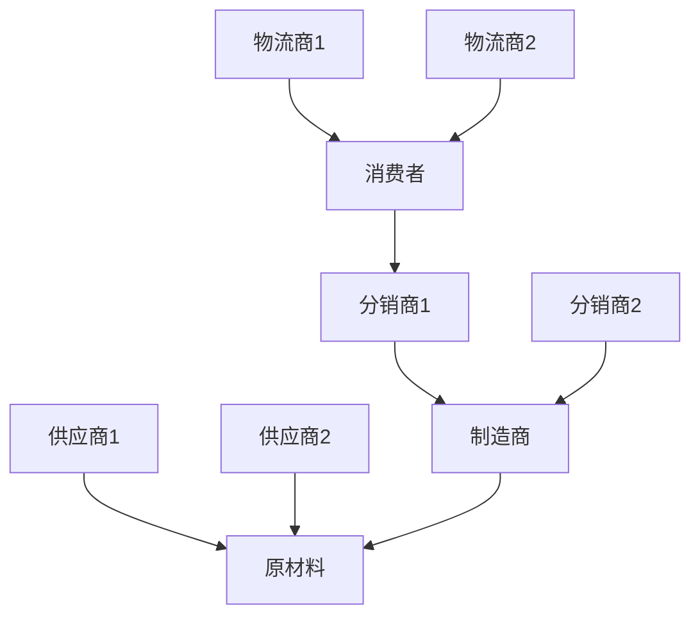
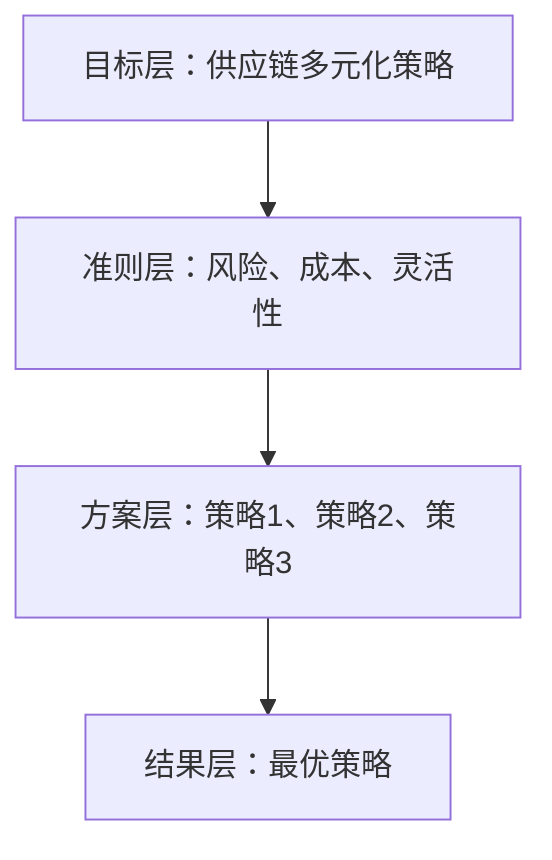

                 


# 彼得林奇对公司供应链多元化策略的评估

## 关键词
- 供应链多元化
- 彼得林奇
- 供应链管理
- 风险管理
- 企业战略

## 摘要
彼得林奇是著名的企业家和投资家，他在供应链管理方面有着独到的见解。供应链多元化策略是企业在供应链管理中降低风险、提高灵活性的重要手段。本文将从供应链多元化策略的背景、核心概念、算法原理、系统架构、项目实战和最佳实践等方面进行详细探讨，分析彼得林奇的观点，并结合实际案例，为企业提供可操作的建议。

---

## 第一部分: 供应链多元化策略的背景与概念

### 第1章: 供应链多元化策略概述

#### 1.1 供应链多元化策略的定义与内涵
供应链多元化策略是指企业在供应链管理中，通过多元化供应商、原材料来源、物流渠道等手段，降低供应链中的风险，提高企业运营的稳定性和灵活性。

#### 1.2 供应链多元化策略的背景与问题背景
随着全球化进程的加速，企业面临的供应链风险不断增加，例如自然灾害、政治动荡、疫情等都可能影响供应链的稳定性。彼得林奇认为，企业必须采取多元化策略，以应对这些不可预测的风险。

#### 1.3 供应链多元化策略的边界与外延
供应链多元化策略的边界包括供应商选择、原材料采购、物流渠道等，而其外延则包括企业战略、风险管理、成本控制等多个方面。

---

## 第2章: 供应链多元化策略的核心概念与联系

### 2.1 多元化策略的核心概念原理
彼得林奇强调，供应链多元化策略的核心在于分散风险。通过选择多个供应商、多种原材料来源和多种物流渠道，企业可以降低因单一来源导致的风险。

### 2.2 多元化策略的属性特征对比
以下是多元化策略与集中化策略的对比表格：

| 对比维度 | 多元化策略 | 集中化策略 |
|----------|------------|------------|
| 风险控制 | 高 | 低 |
| 灵活性 | 高 | 低 |
| 成本 | 较高 | 较低 |
| 供应链稳定性 | 高 | 低 |

### 2.3 供应链多元化策略的ER实体关系图


---

## 第3章: 供应链多元化策略的算法原理

### 3.1 多元化策略评估的算法选择
彼得林奇主张使用层次分析法（AHP）来评估供应链多元化策略的效果。AHP是一种基于数学模型的决策分析方法，适用于多目标决策问题。

### 3.2 层次分析法（AHP）的流程图


### 3.3 层次分析法的数学模型
层次分析法的核心在于计算各准则的权重。假设准则层有三个指标：风险（R）、成本（C）、灵活性（F）。权重计算公式为：
$$
w_R = \frac{R}{R + C + F}, \quad w_C = \frac{C}{R + C + F}, \quad w_F = \frac{F}{R + C + F}
$$
其中，权重最高的准则即为最优策略的核心考量因素。

---

## 第4章: 供应链多元化策略的系统分析与架构设计

### 4.1 系统功能设计
供应链多元化策略的系统功能包括：
- 多元化供应商选择模块
- 风险评估模块
- 成本控制模块
- 灵活性优化模块

### 4.2 系统架构设计


### 4.3 接口设计与交互
供应链系统的接口设计包括：
- 供应商接口：接收原材料采购订单
- 制造商接口：处理生产计划
- 分销商接口：管理订单分发
- 物流商接口：处理货物运输

---

## 第5章: 供应链多元化策略的项目实战

### 5.1 项目背景与目标
以某汽车制造企业为例，其供应链面临原材料价格上涨和供应商不稳定的风险。目标是通过多元化策略降低供应链风险。

### 5.2 核心代码实现
以下是Python实现的多元化策略评估代码：
```python
import numpy as np

def calculate_weights(risk, cost, flexibility):
    total = risk + cost + flexibility
    weights = {
        'risk': risk / total,
        'cost': cost / total,
        'flexibility': flexibility / total
    }
    return weights

# 示例数据
risk = 0.4
cost = 0.3
flexibility = 0.3

weights = calculate_weights(risk, cost, flexibility)
print(weights)
```

### 5.3 代码解读与分析
上述代码计算了风险、成本和灵活性的权重。输出结果为：
```
{'risk': 0.4, 'cost': 0.3, 'flexibility': 0.3}
```
风险权重最高，因此企业在选择供应商时应优先考虑风险控制。

---

## 第6章: 供应链多元化策略的最佳实践

### 6.1 总结与启示
彼得林奇的供应链多元化策略强调分散风险和提高灵活性，企业在实施该策略时应注重供应商选择的多样性、物流渠道的多样性以及成本控制的平衡。

### 6.2 注意事项
- 多元化策略可能会增加初期成本
- 需要定期评估和调整策略
- 需要建立高效的供应链管理团队

### 6.3 拓展阅读
推荐阅读彼得林奇的《投资到底-simple富人必读的书》和供应链管理的经典书籍，如《供应链管理：策略与实践》。

---

## 结语
供应链多元化策略是企业在复杂多变的市场环境中降低风险、提高竞争力的重要手段。通过彼得林奇的理论指导和实际案例分析，企业可以更好地实施供应链多元化策略，实现可持续发展。

