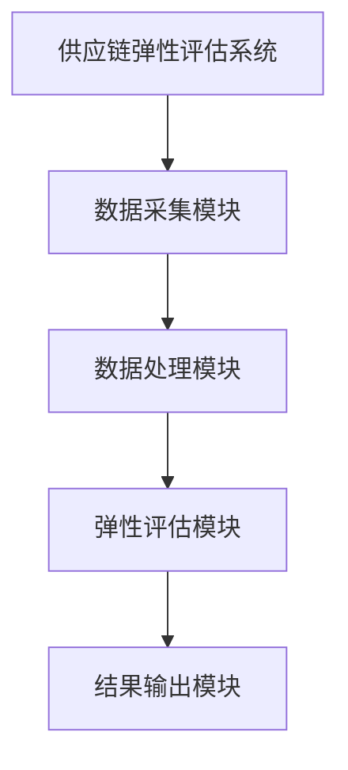
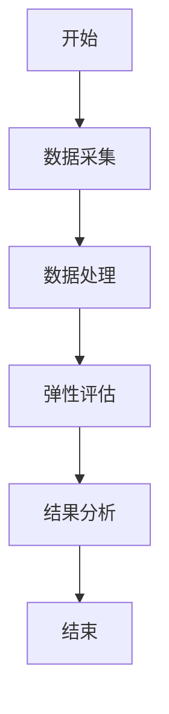

                 


# 彼得林奇对公司供应链弹性的评估

**关键词**：供应链弹性，彼得·林奇，投资评估，风险管理，弹性指数，投资策略，供应链优化

**摘要**：本文从投资专家彼得·林奇的视角，系统地分析了供应链弹性的评估方法和策略。文章详细介绍了供应链弹性的核心概念，探讨了其在投资决策中的重要性，并结合实际案例，展示了如何通过数学模型和系统架构设计来评估和优化供应链弹性。通过本文的分析，读者将能够理解彼得·林奇的投资理念，并掌握如何将供应链弹性评估应用于实际投资决策中。

---

# 第1章: 供应链弹性的概念与重要性

## 1.1 供应链弹性的定义与内涵

### 1.1.1 供应链弹性的基本概念

供应链弹性是指企业在面对外部环境变化时，能够灵活调整供应链策略，以保持业务连续性和竞争力的能力。它强调供应链在面对不确定性时的适应性和恢复能力。

### 1.1.2 供应链弹性的核心特征

供应链弹性具有以下几个核心特征：
- **冗余性**：通过冗余的供应商、库存或生产能力，确保在某一环节出现问题时，能够迅速切换到备用方案。
- **灵活性**：供应链能够快速响应市场变化，调整生产和交付计划。
- **可扩展性**：供应链在需求激增时能够快速扩展生产能力。
- **抗风险能力**：供应链在面对自然灾害、供应链中断等风险时能够保持稳定。

### 1.1.3 供应链弹性的重要性与价值

供应链弹性是企业在复杂多变的市场环境中保持竞争力的关键因素。它能够帮助企业：
- 减少因供应链中断带来的损失。
- 快速响应市场需求变化，抓住市场机会。
- 提高供应链的整体效率和抗风险能力。

---

## 1.2 彼得·林奇的供应链弹性评估视角

### 1.2.1 彼得·林奇的投资理念与方法

彼得·林奇是全球著名投资专家，他强调通过深入研究企业的基本面，尤其是企业的供应链和运营能力，来评估企业的投资价值。他认为，供应链弹性是企业长期成功的关键因素之一。

### 1.2.2 供应链弹性在投资中的意义

在投资决策中，供应链弹性是评估企业竞争力的重要指标。具有强大供应链弹性的企业能够更好地应对市场波动和风险，从而为投资者带来更高的回报。

### 1.2.3 供应链弹性评估的边界与外延

供应链弹性评估不仅关注企业的内部供应链管理，还包括对外部市场环境、供应商稳定性、客户需求变化等多方面因素的综合考量。

---

## 1.3 供应链弹性评估的核心要素

### 1.3.1 供应链弹性评估的关键指标

以下是供应链弹性评估的关键指标：
- **供应商多样性**：供应商的数量和地理分布。
- **库存周转率**：库存的流动效率。
- **交付周期**：从订单到交付的平均时间。
- **应急响应能力**：企业在面对突发事件时的反应速度和能力。

### 1.3.2 供应链弹性评估的维度与层次

供应链弹性评估可以从以下几个维度进行：
- **战略层**：评估企业供应链战略的灵活性和适应性。
- **操作层**：评估供应链操作的效率和稳定性。
- **风险层**：评估供应链在面对风险时的抗压能力。

### 1.3.3 供应链弹性评估的核心要素组成

供应链弹性评估的核心要素包括：
- **供应商管理**：供应商的多样性和稳定性。
- **库存管理**：库存的合理配置和管理。
- **生产管理**：生产过程的灵活性和效率。
- **物流管理**：物流网络的优化和稳定性。

---

## 1.4 本章小结

本章从供应链弹性的基本概念出发，详细介绍了供应链弹性的核心特征和重要性。同时，结合彼得·林奇的投资理念，探讨了供应链弹性在投资决策中的意义，并总结了供应链弹性评估的关键要素和核心组成。

---

# 第2章: 供应链弹性评估的核心概念

## 2.1 供应链弹性评估的核心原理

### 2.1.1 供应链弹性评估的基本原理

供应链弹性评估的核心原理是通过分析供应链的各个组成部分，评估其在面对外部环境变化时的适应能力和恢复能力。这需要从战略、操作和风险等多个维度进行综合考量。

### 2.1.2 供应链弹性评估的关键要素

供应链弹性评估的关键要素包括：
- **冗余性**：供应链的冗余能力。
- **灵活性**：供应链的快速响应能力。
- **可扩展性**：供应链的扩展能力。
- **抗风险能力**：供应链在面对风险时的稳定性。

### 2.1.3 供应链弹性评估的数学模型

供应链弹性评估的数学模型可以通过以下几个步骤进行：
1. 确定供应链的各个组成部分。
2. 分析各部分的弹性特征。
3. 综合各部分的弹性特征，评估整个供应链的弹性能力。

---

## 2.2 核心概念的对比分析

### 2.2.1 供应链弹性与其他相关概念的对比

以下是供应链弹性与其他相关概念的对比：

| 概念        | 定义                                                                 | 特点                                                                 |
|-------------|----------------------------------------------------------------------|----------------------------------------------------------------------|
| 供应链效率   | 供应链在单位时间内完成的业务量。                                  | 强调效率和成本控制。                                                |
| 供应链成本   | 供应链的总成本，包括采购、生产、物流等环节的成本。              | 强调成本最小化。                                                   |
| 供应链弹性   | 供应链在面对外部环境变化时的适应能力和恢复能力。                | 强调抗风险能力和灵活性。                                            |

### 2.2.2 供应链弹性评估的属性特征对比表格

以下是供应链弹性评估的属性特征对比表格：

| 属性        | 弹性供应链                     | 非弹性供应链                   |
|-------------|-------------------------------|---------------------------------|
| 红undancy    | 高                           | 低                             |
| Flexibility  | 高                           | 低                             |
| Scalability  | 高                           | 低                             |
| Risk resistance | 高                           | 低                             |

---

## 2.3 供应链弹性评估的系统架构设计

### 2.3.1 供应链弹性评估的系统架构

以下是供应链弹性评估的系统架构设计：



---

## 2.4 本章小结

本章详细介绍了供应链弹性评估的核心原理和关键要素，并通过对比分析，展示了供应链弹性与其他相关概念的区别和联系。同时，结合系统架构设计，探讨了供应链弹性评估的实现方法。

---

# 第3章: 供应链弹性评估的算法原理

## 3.1 供应链弹性评估的算法原理

### 3.1.1 算法原理概述

供应链弹性评估的算法原理主要包括以下几个步骤：
1. 数据采集：收集供应链的各个部分的数据。
2. 数据处理：对数据进行清洗和预处理。
3. 弹性评估：通过数学模型评估供应链的弹性能力。
4. 结果分析：分析评估结果，提出改进建议。

### 3.1.2 弹性评估算法的数学模型

以下是弹性评估算法的数学模型：

$$
E = \sum_{i=1}^{n} w_i \cdot e_i
$$

其中，\( E \) 表示弹性指数，\( w_i \) 表示各部分的权重，\( e_i \) 表示各部分的弹性值。

### 3.1.3 弹性评估算法的流程图

以下是弹性评估算法的流程图：



---

## 3.2 供应链弹性评估算法的实现

### 3.2.1 算法实现步骤

供应链弹性评估算法的实现步骤如下：
1. 确定供应链的各个组成部分。
2. 收集各部分的数据。
3. 对数据进行清洗和预处理。
4. 计算各部分的弹性值。
5. 综合各部分的弹性值，计算总的弹性指数。
6. 分析弹性指数，提出改进建议。

### 3.2.2 算法实现的代码示例

以下是弹性评估算法的代码示例：

```python
def calculate_elasticity(supply_chain_data):
    # 数据处理
    processed_data = preprocess(supply_chain_data)
    # 计算各部分的弹性值
    elasticity_scores = []
    for component in processed_data:
        elasticity = compute_elasticity(component)
        elasticity_scores.append(elasticity)
    # 计算总的弹性指数
    total_elasticity = sum(elasticity_scores)
    return total_elasticity

def preprocess(data):
    # 数据清洗和预处理
    return processed_data

def compute_elasticity(component):
    # 计算各部分的弹性值
    return elasticity_score
```

---

## 3.3 本章小结

本章详细介绍了供应链弹性评估的算法原理，包括算法的数学模型和实现步骤。通过代码示例和流程图，展示了算法的实现过程。

---

# 第4章: 供应链弹性评估的数学模型与公式

## 4.1 供应链弹性评估的数学模型

### 4.1.1 弹性指数的计算公式

弹性指数的计算公式如下：

$$
E = \sum_{i=1}^{n} w_i \cdot e_i
$$

其中，\( E \) 表示弹性指数，\( w_i \) 表示各部分的权重，\( e_i \) 表示各部分的弹性值。

### 4.1.2 弹性指数的权重分配

弹性指数的权重分配需要根据供应链的实际情况进行调整。通常，供应商多样性、库存周转率和交付周期是权重较高的部分。

---

## 4.2 供应链弹性评估的公式推导

### 4.2.1 弹性评估公式推导

弹性评估公式的推导过程如下：
1. 确定供应链的各个组成部分。
2. 确定各部分的权重。
3. 计算各部分的弹性值。
4. 综合各部分的弹性值，计算总的弹性指数。

---

## 4.3 本章小结

本章详细介绍了供应链弹性评估的数学模型和公式，包括弹性指数的计算公式和权重分配方法。通过公式推导，展示了供应链弹性评估的实现过程。

---

# 第5章: 供应链弹性评估的系统分析与架构设计

## 5.1 供应链弹性评估的系统架构设计

### 5.1.1 系统功能设计

供应链弹性评估系统的功能设计包括以下几个模块：
1. 数据采集模块：收集供应链的各个部分的数据。
2. 数据处理模块：对数据进行清洗和预处理。
3. 弹性评估模块：计算各部分的弹性值和总的弹性指数。
4. 结果输出模块：输出弹性评估结果和改进建议。

### 5.1.2 系统架构设计

以下是供应链弹性评估系统的架构设计：


---

## 5.2 供应链弹性评估系统的实现

### 5.2.1 系统实现步骤

供应链弹性评估系统的实现步骤如下：
1. 确定系统的功能需求。
2. 设计系统的架构。
3. 实现系统的各个模块。
4. 测试系统功能，进行优化和改进。

---

## 5.3 本章小结

本章详细介绍了供应链弹性评估系统的架构设计和实现步骤。通过系统架构图，展示了系统的各个模块及其相互关系。

---

# 第6章: 供应链弹性评估的项目实战

## 6.1 项目背景与目标

### 6.1.1 项目背景

本项目旨在通过供应链弹性评估，帮助企业优化供应链管理，提高供应链的抗风险能力和灵活性。

### 6.1.2 项目目标

项目目标包括：
1. 建立供应链弹性评估模型。
2. 实现供应链弹性评估系统。
3. 提供弹性评估结果和改进建议。

---

## 6.2 项目实现

### 6.2.1 环境安装

项目实现需要以下环境：
- Python 3.8+
- 数据处理工具（如Pandas、NumPy）
- 可视化工具（如Matplotlib）

---

### 6.2.2 核心代码实现

以下是供应链弹性评估系统的核心代码实现：

```python
import pandas as pd
import numpy as np

def preprocess(data):
    # 数据清洗和预处理
    processed_data = data.dropna()
    return processed_data

def compute_elasticity(component):
    # 计算各部分的弹性值
    elasticity = np.mean(component)
    return elasticity

def calculate_total_elasticity(processed_data):
    # 计算总的弹性指数
    elasticity_scores = []
    for component in processed_data:
        elasticity = compute_elasticity(component)
        elasticity_scores.append(elasticity)
    total_elasticity = np.sum(elasticity_scores)
    return total_elasticity

def main():
    # 读取数据
    data = pd.read_csv('supply_chain.csv')
    # 数据预处理
    processed_data = preprocess(data)
    # 计算总的弹性指数
    total_elasticity = calculate_total_elasticity(processed_data)
    print(f"总弹性指数：{total_elasticity}")

if __name__ == "__main__":
    main()
```

---

## 6.3 项目结果分析

### 6.3.1 结果分析

通过上述代码实现，可以计算出供应链的总弹性指数，并根据弹性指数评估供应链的弹性能力。

---

## 6.4 本章小结

本章通过一个实际项目，详细介绍了供应链弹性评估的实现过程。通过代码实现和结果分析，展示了供应链弹性评估的实际应用。

---

# 第7章: 总结与展望

## 7.1 本章总结

### 7.1.1 核心内容回顾

本章回顾了供应链弹性评估的核心内容，包括供应链弹性的定义、评估方法和实现步骤。

### 7.1.2 投资评估中的应用

供应链弹性评估在投资评估中的应用，能够帮助企业优化供应链管理，提高供应链的抗风险能力和灵活性。

---

## 7.2 展望

### 7.2.1 未来研究方向

未来的研究方向包括：
1. 供应链弹性评估的智能化和自动化。
2. 供应链弹性评估的实时性和动态性。
3. 供应链弹性评估的全球化和国际化。

### 7.2.2 注意事项与最佳实践

在进行供应链弹性评估时，需要注意以下几点：
- 数据的准确性和完整性。
- 模型的合理性和适用性。
- 结果的可解释性和可操作性。

---

## 7.3 本章小结

本章总结了供应链弹性评估的核心内容和实现步骤，并展望了未来的研究方向和注意事项。

---

# 结语

通过本文的详细分析，读者可以全面了解供应链弹性的评估方法和实现步骤。结合彼得·林奇的投资理念，供应链弹性评估在投资决策中的重要性更加凸显。未来，随着技术的不断发展，供应链弹性评估将更加智能化和自动化，为企业提供更强大的支持。

---

**最佳实践 Tips**：
- 在进行供应链弹性评估时，建议结合企业的实际情况，选择合适的评估方法和模型。
- 定期更新和优化供应链弹性评估模型，以应对不断变化的市场环境。

**注意事项**：
- 数据的准确性和完整性是供应链弹性评估的基础。
- 模型的合理性和适用性是评估结果的关键。

**拓展阅读**：
- 《彼得·林奇的投资哲学》
- 《供应链管理：战略与实践》
- 《企业风险管理：方法与应用》

---

以上是《彼得林奇对公司供应链弹性的评估》的完整目录大纲结构，希望对您有所帮助！

