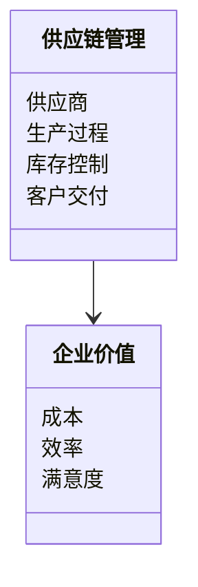

                 


# 彼得林奇对公司供应链管理的分析

## 关键词：供应链管理，彼得·林奇，投资分析，系统设计，优化策略

## 摘要：本文深入分析了彼得·林奇的投资理念在供应链管理中的应用，结合系统设计和优化策略，提供了详细的理论分析和实际案例，帮助读者理解如何通过供应链管理提升企业价值。

---

## 第一部分: 供应链管理基础

### 第1章: 供应链管理概述

#### 1.1 供应链管理的基本概念

供应链管理（Supply Chain Management，SCM）是指在企业内外部，协调采购、生产、物流、分销等过程，以最小成本提供最大价值的一系列活动。核心在于优化资源利用，提高效率，降低成本，同时满足客户需求。

- **供应链的组成**：供应商、制造商、分销商、零售商、客户。
- **供应链的目标**：提高效率、降低成本、增强灵活性、提升客户满意度。

#### 1.2 彼得·林奇的分析方法

彼得·林奇（Peter Lynch）是著名投资专家，他的投资理念强调深入分析企业基本面，寻找被市场低估的投资机会。将这种理念应用于供应链管理，关注供应链的效率和价值。

- **林奇的投资理念**：长期投资、深入分析、关注企业基本面。
- **供应链分析中的应用**：通过分析供应链各环节的成本、效率和灵活性，评估其对企业价值的影响。

#### 1.3 供应链管理的核心要素

- **供应商管理**：选择可靠的供应商，确保原材料供应稳定。
- **生产过程优化**：提高生产效率，降低成本。
- **库存控制**：优化库存水平，减少资金占用。
- **交付与客户满意度**：确保按时交付，提升客户满意度。

### 第2章: 彼得·林奇的供应链分析框架

#### 2.1 供应链管理的五要素分析

- **供应商稳定性与成本控制**：供应商的可靠性和成本直接影响供应链的成本。
- **生产能力与效率**：生产能力的利用效率决定生产成本。
- **库存周转率与资金占用**：库存周转率高意味着资金占用少。
- **交付周期与客户满意度**：交付周期短能提升客户满意度。
- **供应链弹性与风险管理**：供应链弹性决定应对市场变化的能力。

#### 2.2 供应链价值评估模型

供应链价值 = (总成本 / 交付周期) × 客户满意度

公式解释：总成本低且交付周期短的企业，客户满意度高，供应链价值大。

#### 2.3 供应链弹性与风险管理

- **弹性的重要性**：应对市场波动和突发事件的能力。
- **风险管理策略**：识别潜在风险，制定应对措施。
- **应急计划**：制定应急预案，确保供应链在突发事件中仍能运转。

### 第3章: 供应链管理的系统分析与架构设计

#### 3.1 系统分析

- **问题场景介绍**：假设某制造企业面临供应链效率低下、库存积压和交付延迟的问题。
- **领域模型（Mermaid类图）**



#### 3.2 系统架构设计

- **系统架构图（Mermaid架构图）**


---

## 第二部分: 供应链管理的系统分析与架构设计

### 第4章: 供应链管理的系统分析

#### 4.1 系统分析

- **问题场景**：某制造企业供应链效率低下，库存积压，交付延迟。
- **领域模型**：通过Mermaid类图展示供应链各组件及其关系。


#### 4.2 系统架构设计

- **架构图**


---

## 第三部分: 项目实战

### 第5章: 供应链优化项目实战

#### 5.1 环境安装

- **工具安装**：安装ERP系统，配置数据库。
- **数据准备**：收集供应商、生产、库存、交付数据。

#### 5.2 核心代码实现

- **Python代码实现**

```python
import pandas as pd
import numpy as np

# 示例数据：供应商交货时间优化
data = pd.DataFrame({
    '供应商': ['A', 'B', 'C'],
    '平均交货时间': [5, 7, 6],
    '成本': [100, 80, 90]
})

# 计算供应链价值
def calculate_supply_chain_value(cost, delivery_time, satisfaction):
    return (cost / delivery_time) * satisfaction

# 应用计算
data['供应链价值'] = data.apply(lambda row: calculate_supply_chain_value(row['成本'], row['平均交货时间'], 0.8), axis=1)
print(data)
```

#### 5.3 案例分析

- **优化前后的对比**：通过数据分析，展示优化后的供应链效率提升和成本降低。

---

## 第四部分: 总结与展望

### 第6章: 总结与展望

#### 6.1 总结

- **核心观点回顾**：供应链管理是企业价值的重要组成部分，彼得·林奇的投资理念为企业优化供应链提供了新的视角。
- **成功经验总结**：通过优化供应链各环节，企业能显著提升效率和客户满意度。

#### 6.2 未来展望

- **技术趋势**：人工智能和大数据将在供应链管理中发挥更大作用，优化预测和决策。
- **持续改进**：企业应持续监控和优化供应链，适应市场变化。

---

## 小结

通过彼得·林奇的分析框架，企业可以更系统地优化供应链管理，提升效率和客户满意度。本文从理论到实践，详细讲解了供应链管理的各个方面，帮助读者更好地理解和应用这些概念。

---

**最佳实践 tips：**

1. **定期审查供应链**：定期审查和优化供应链，确保其高效运行。
2. **采用先进技术**：利用AI和大数据优化预测和决策。
3. **加强供应商管理**：选择可靠的供应商，建立长期合作关系。
4. **监控关键指标**：关注成本、效率、库存周转率和交付周期等关键指标。

通过以上方法，企业可以显著提升供应链管理效率，增强市场竞争力。

